# 在创建基于人工智能的手语翻译系统方面又进了一步

> 原文：<https://towardsdatascience.com/a-step-further-in-the-creation-of-a-sign-language-translation-system-based-on-artificial-9805c2ae0562?source=collection_archive---------31----------------------->

## 大规模实现可访问性的策略

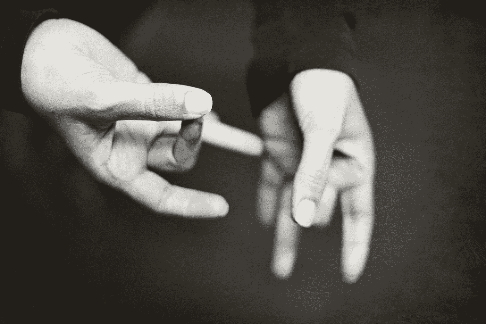

乔·希尔顿在 [Unsplash](https://unsplash.com?utm_source=medium&utm_medium=referral) 拍摄的照片

通信是我们社会的基础，人们每天用它来表达自己，并获得最基本的服务，如公共交通、学校和医疗保健。所有国家的重度听力损失者都使用手语，全世界有数百万人患有这种疾病。问题是，大多数听力正常的人不知道如何通过手势说话，这就造成了一种障碍，使聋人很难进行社会互动。

为了转移这个障碍，我们可以使用人工智能技术，如卷积神经网络，来创建一个符号翻译系统，并为执行的符号生成图例。

另一个有趣的点是，虽然每个国家都有自己的手语，但深度学习架构可以很好地概括相同领域的问题，只需一些训练和超参数优化。

> 然而，对于世界上所有的手语来说，这个过程中有一个部分是昂贵、耗时和重复的:**数据集创建**。

想象一下，有人用美国手语(ASL)创建了一个最先进的架构来识别标志并以非常高的准确度生成传说。为了在实践中实现这种解决方案，并使其在现实世界中具有可访问性，每个不使用美国手语的国家的科学家都需要创建一个巨大的数据集(例如，使用日常使用的最常用的单词)来重新训练网络。因此，很明显，主要瓶颈之一是数据集创建！

在此基础上，我将探索如何更有效地为手语创建数据集以训练高精度模型的一些发现，作为未来工作的指南。

> 本文基于我的一篇名为: [*基于深度学习和图像处理的高效手语识别系统和数据集创建方法*](https://arxiv.org/abs/2103.12233) *的论文。*

# 实验数据集

这项工作的主要想法是基于**廉价数据集**创建一个手语识别系统，帮助未来需要这样做的工作。

> 但是什么是廉价数据集呢？

在我看来，这是一个数据集，它使用一个简单的传感器，如 RGB 相机，几个解释器，以及记录中相同的背景。

这就是为什么我们创建了一个数据集，记录来自两个不同智能手机的视频，在相同的标准背景下，有两个解释器，配置一个简单而容易的设置。

另一个疑问是捕捉记录或二次采样图像的每秒帧数(FPS ),一旦它可以在最终性能中产生不同的结果，因此我们使用相同的程序创建了两个数据集，其中第一个以 60 FPS 记录，第二个以 30 FPS 记录。

此外，我们还对第一个数据集进行了 30 和 20 FPS 的二次采样，对第二个数据集进行了 20 FPS 的二次采样，以测试我们是否可以在记录完成后减少图像数量，而不会影响结果。

最后，我们记录了聋人每天使用的 14 个手势，每个手势重复三次，每次重复之间有一些变化。数据集可以在 [Kaggle](https://www.kaggle.com/alvarole/brazilian-sign-language-words-recognition) 上找到。

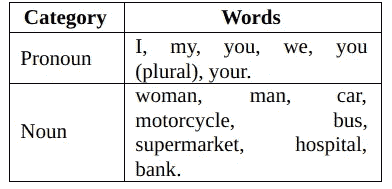

我们数据集中考虑的单词列表。

为了证明模型的效率，我们创建了一个最终的验证数据集，考虑了相同的 14 个标志，但在不同的背景和光照条件下进行记录，试图再现真实世界的场景。

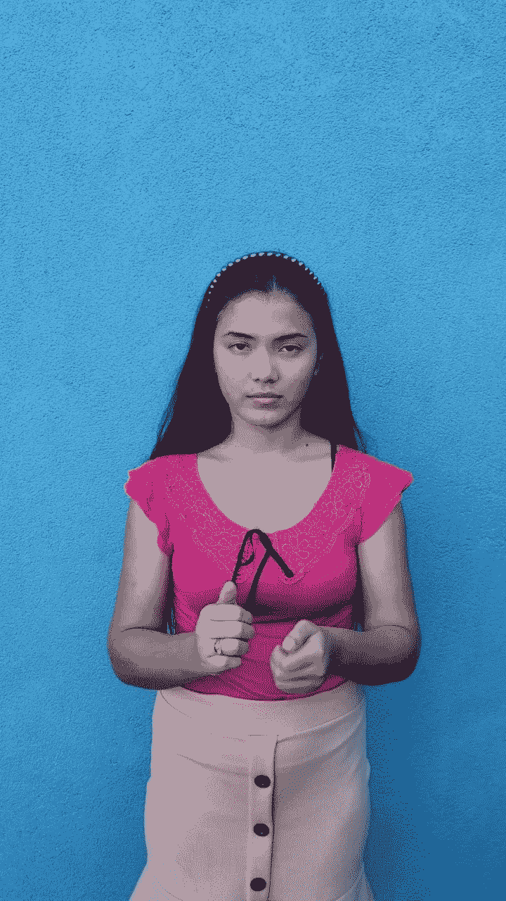

使用相同的背景和光照条件训练和测试图像。(图片由作者提供)

验证设置，使用不同的背景和光线条件。(图片由作者提供)。

# 假设和实验

这些是这项工作的主要假设，基于研究过程中出现的问题以及我们为回答这些问题所做的实验。

## 一旦减少运动模糊，60 FPS 可能比 30 FPS 更好。

必须有运动才能产生标志，而运动会在视频记录中产生模糊。在这种情况下，使用更大的 FPS 应该减少模糊，并且这可以提高模型精度。

**实验:**我们将比较以 30 和 60 FPS 记录的数据集的准确性

## 人工背景创建可以提高模型的泛化能力

在同一个静态背景下记录所有标志这比通过编程改变场景、移动设备和人员要容易得多。但我们认为，这可能会导致偏差，从而影响验证数据集上的模型准确性。

**实验:**我们将使用语义分割来创建新的数据集背景，并用清晰的场景来训练模型。

## 对于数据扩充，几何变换比强度变换更好

如果我们分析人类如何理解一个标志，很容易注意到几何特征(如手的位置和形状)是识别的基础。另一方面，背景、肤色、衣服、头发和其他配饰与我们无关。这就是为什么我们认为几何变换(旋转、缩放、剪切)将优于强度变换(亮度、通道反转)。

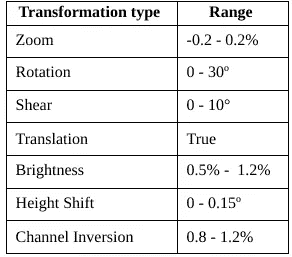

我们的转换用于增加数据和应用范围。(图片由作者提供)

**实验:**我们将分别测试不同的数据增强技术。

# 模型创建

CNN 模型是基于 [EfficientNet-B0](https://arxiv.org/abs/1905.11946) 的，因为它减少了参数数量并具有良好的准确性。在特征提取器之后，我们创建了一个神经网络来预测符号。每个测试在相同的设置中重复 3 次，获取平均结果并使用方差分析(ANOVA)或 T-student 测试进行统计比较。数据被随机分成 80%的样本用于训练，20%的样本用于测试。你可以在 [Google Colab](https://colab.research.google.com/drive/1sSp9pFIiUHcpbUGoqGCS5yzbkw6XcrFp?usp=sharing) 中查看细节和实现。

# 结果

## 数据扩充

下表显示了单独测试的每种数据扩充技术的平均精度。

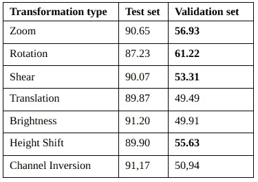

考虑到 20 FPS 数据集，三次执行的平均准确度。(图片由作者提供)

由于数据扩充的主要目标是提高模型不变性，我们将注意力集中在验证集的结果上，很明显，几何变换在提高符号识别方面表现得相当好。

除此之外，我们注意到数据扩充成功地减少了过度拟合，如下图所示。

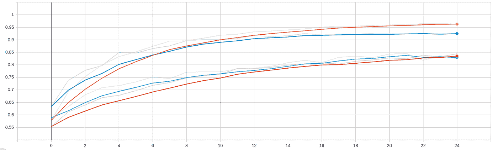

20 FPS 中数据增强前后的精度，显示它如何减轻训练(橙色)和测试(蓝色)差异。(图片由作者提供)

由于引入了图像不变性，一般准确性随着数据增加而降低，但结果在验证集中显著提高。此外，我们的几何变换假设得到了证实，如下表所示，达到了比强度变换更高的精度。

## **人工背景创建**

下图显示了基于 [DeepLabV3](https://arxiv.org/abs/1706.05587) 的语义分割结果，以改变背景。由于计算成本的原因，最终分辨率为 331x331 像素。

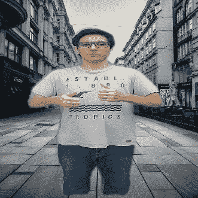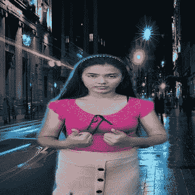

用新的人工背景签名执行。(图片由作者提供)

我们用 5 个不同的场景来代替每个标志的背景。下表显示了 de 结果。

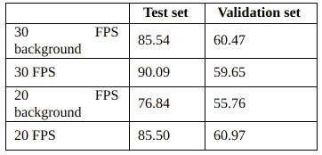

比较使用人工背景替换(“背景后缀”)和不使用人工背景替换的平均模型精度。(图片由作者提供)

为了更多地了解这些结果，我们使用了一个名为 [LIME](https://github.com/marcotcr/lime) 的工具来解释模型预测，突出显示了图像中对推断贡献更大的部分，如下图所示。

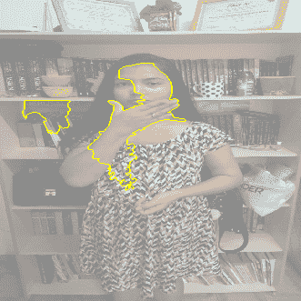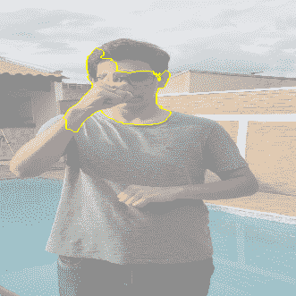

使用 LIME 来解释验证集中的模型预测。(图片由作者提供)

解释表明，考虑到解释者的手的位置来推断信号，该模型正专注于图像的正确部分。这表明背景没有偏向结果，这就是为什么替换没有聚集相关特征，就像颜色变换一样

**每秒帧数比较**

首先，我们研究了将视频二次采样为图像的最合适的 FPS，以便通过以 60 FPS 记录来训练模型。表 5 给出了结果。

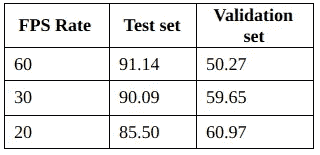

图像子样本之间的比较。(图片由作者提供)

值得注意的是，60 FPS 并不能补偿所需的计算资源，因为它在验证集中获得了大约 10%的低准确度。这可能是因为该帧速率的图像几乎是 30 和 20 FPS 的 2 到 3 倍，如图 2 所示，这可能会导致过度拟合，从而导致验证集中的差异更大。除此之外，视频的连续图像彼此相似，产生低的信息增益。

T-student 测试显示，30 帧/秒和 20 帧/秒在测试集中存在显著差异，因此得出结论，这是这种情况下的最佳选择，但这应根据数据集大小而有所不同，一旦 30 帧/秒的训练时间变长，时空特征的探索会影响需要从视频中提取的信息量。

最后一个涉及帧速率的测试是比较以 30 FPS 捕捉的数据集和以 60 FPS 捕捉的数据集之间的性能，如表 6 所示。

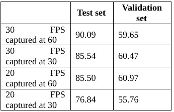

以 60 FPS 和 30 FPS 捕获的数据集之间的比较。(图片由作者提供)

在测试集中，结果有利于以 60 FPS 捕获的数据集，因为更多数量的图像有助于模型在训练期间更好地拟合(如表 5 所示)。另一方面，在验证集中，以 60 或 30 FPS 捕获的数据集之间没有显著差异(p 值为 0.58)。另一个相关的事实是，以 30 FPS 捕获的数据集比以 60 FPS 捕获并二次采样到 30 FPS 的数据集具有更少的图像，这是因为符号的执行更快，这是取决于解释者和情况的正常变化。因此，指示口译员缓慢执行手势应该有助于进一步缓解这些捕捉率的准确性差异，主要是在光线充足的场景中，**的运动模糊不太明显**。

因此，在不受控制的情况下，在不同的照明条件和口译员执行的手势速度下，以 60 FPS 捕捉视频并将其重新采样为 30 FPS 应该是最佳选择，在获得大量图像的同时避免运动模糊，缺点是需要更好的传感器和更多的存储空间。尽管如此，在控制良好的情况下，以 30 FPS 的速度捕捉会产生令人满意的结果。

**利用多流 CNN 提高验证准确性**

作为最后的测试，我们创建了一个多流 CNN 来捕捉图像中的本地和全局信息，如下图所示。

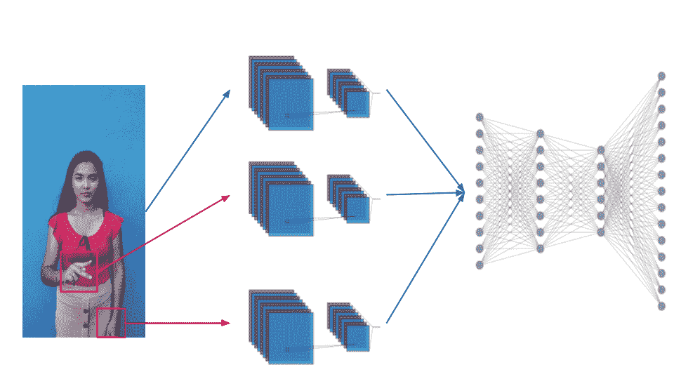

符号识别的多 CNN 架构。(图片由作者提供)

为了分割手，我们使用 [EfficientDet](https://arxiv.org/abs/1911.09070) 作为对象检测器，将各个图像传递到特征提取器，然后传递到神经网络。我们的最终结果显示，在测试集上的准确率为 96%，在验证集上的准确率为 81%，这表明即使使用简单的数据集进行训练，也有可能获得良好的结果并推广到更复杂的情况。

# 结论和最后想法

由于新算法和技术的出现，在一些年内，手语识别对于机器学习来说将变得相当容易，但我希望它已经明确了对创建数据集的效率进行进一步研究的需要，因为每个新的翻译系统都需要大量的数据。

我们看到，只需要很少的翻译、简单的记录设置、相同的背景，以及正确的数据扩充选择，就有可能推广到现实世界的场景。在未来的工作中，可以进行更深入的分析，用更多的人和标志来测试这里观察到的相同模式是否会重复。

如需进一步阅读和概念，请参考[原文](https://arxiv.org/abs/2103.12233)。感谢阅读！