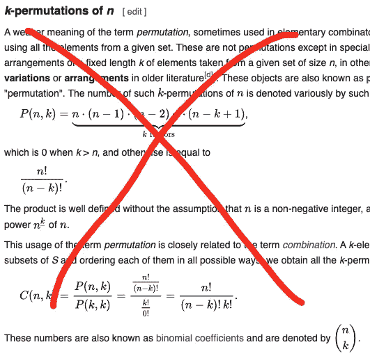
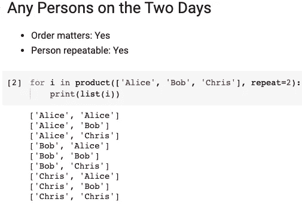
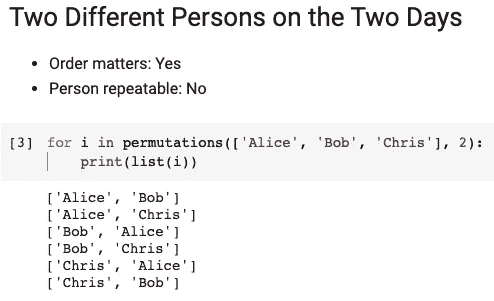
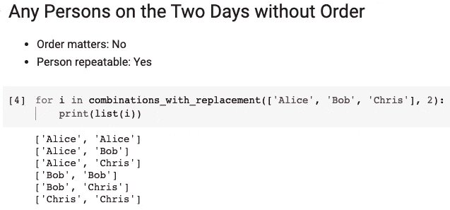
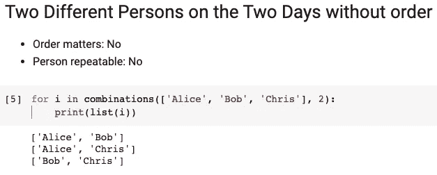
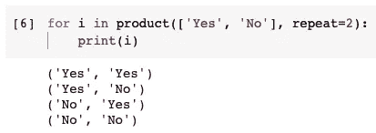
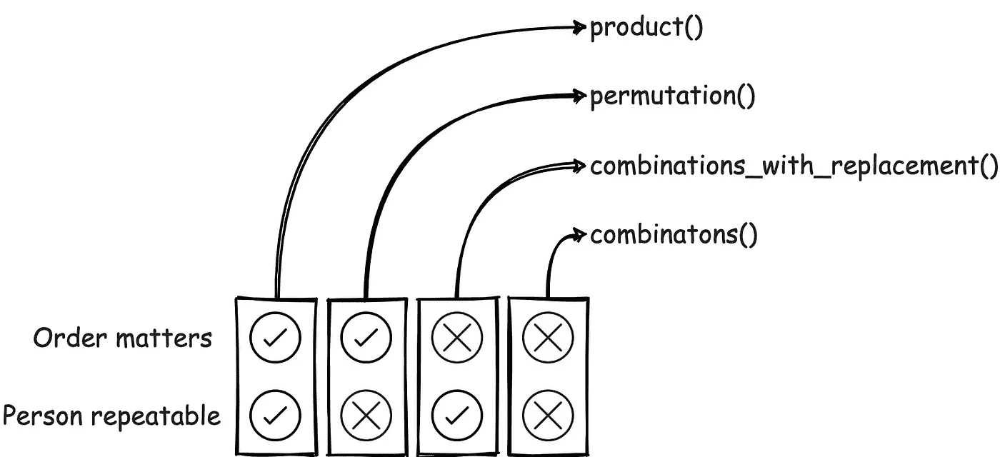

# Python 中的一个故事帮助你理解 Itertools

> 原文：<https://towardsdatascience.com/a-story-in-python-helps-you-understand-itertools-c8a45ed3d80b?source=collection_archive---------28----------------------->


图片由 [Boke9a](https://pixabay.com/users/boke9a-2225626/?utm_source=link-attribution&utm_medium=referral&utm_campaign=image&utm_content=1357419) 从 [Pixabay](https://pixabay.com/?utm_source=link-attribution&utm_medium=referral&utm_campaign=image&utm_content=1357419) 拍摄

## 不要总是从枯燥的理论开始学习

很多 Python 开发者喜欢用 Itertools 模块，这个模块确实非常强大。排列和组合是这个模块中最受欢迎的功能。

当人们学习这两个术语时，几乎总是从理论开始。这是数学领域之一——组合学。然后，有很多原理和公式要理解甚至记忆。



维基百科页面截图— [排列](https://en.wikipedia.org/wiki/Permutation)

嗯，理论是重要的，但有时它可能不是将知识应用于实践的最快方法，特别是当我们想用编程来解决现实生活中的一些问题时。

例如，无论有没有替换，我们都不太可能在袋子里捡起红色和蓝色的球。然而，我们更有可能使用编程来生成一个花名册，以计划谁负责某事:)

在本文中，我将使用一个实际的例子来介绍 Python 中 Itertools 模块的 4 个重要函数(`product()`、`permutations()`、`combinations()`和`combinations_with_replacement()`)。

# 0.问题定义和准备


图片由 [Gerd Altmann](https://pixabay.com/users/geralt-9301/?utm_source=link-attribution&utm_medium=referral&utm_campaign=image&utm_content=3233653) 来自 [Pixabay](https://pixabay.com/?utm_source=link-attribution&utm_medium=referral&utm_campaign=image&utm_content=3233653)

现在，我们直接进入问题。假设我们是一个三人团队:

*   爱丽丝
*   上下移动
*   克莉丝

我们需要有人在这个周末待命，因为促销活动应该会给我们的网站带来非凡的流量。所以，有两天时间，我们需要名字。

假设我们需要使用 Python 来生成花名册的所有可能性。因为我们需要使用 Itertools 模块，所以为了方便起见，让我们在本文中导入所有的函数。

```
from itertools import *
```

# 1.这两天有人吗

在第一种情况下，两个人的**顺序确实很重要**。这是可能的，因为周六和周日对某些人来说可能有不同的意义。

还有，假设这些人不介意这两天都**值班，只是假设:)**

在这种情况下，我们可以使用`product()`函数，它是一个笛卡尔乘积。基本上所有的可能性都会列出来，穷尽。

```
for i in product(['Alice', 'Bob', 'Chris'], repeat=2):
    print(list(i))
```



在上面的代码中，`product()`函数有两个参数。第一个是所有名字的列表，第二个告诉它我们需要名字填充多少个“空格”。

# 2.两天里两个不同的人

我能听到团队在抱怨，因为他们肯定不想两天都随叫随到。所以，花名册上的两个名字**应该不会重复**。除此之外，**顺序仍然很重要**。

在这种情况下，我们可以使用`permutations()`,因为它严格地选取两个而不重复。

```
for i in permutations(['Alice', 'Bob', 'Chris'], 2):
    print(list(i))
```



由于这个函数，签名已经改变，所以我们不应该使用参数名`repeat`。这两个参数不需要改变，仍然是名称列表和空格数。

# 3.任何人在这两天没有秩序

在这种情况下，假设团队成员有自己的灵活性，如果他们在名册上，他们可以随时待命。这意味着顺序不再重要了，因为被接走的人可以互相交流，决定哪一天走。

为了满足这个需求，我们需要使用`combinations_with_replacement()`函数。

```
for i in combinations_with_replacement(['Alice', 'Bob', 'Chris'], 2):
    print(list(i))
```



# 4.两个不同的人在没有订单的两天里

在前一次运行之后，团队再次抱怨，因为我们忘记了使人不可重复。因此，在这种情况下，名称不应重复，顺序也很重要。

在这个场景中，我们需要如下使用`combinations()`函数。

```
for i in combinations(['Alice', 'Bob', 'Chris'], 2):
    print(list(i))
```



# 摘要


图片来自 [Pixabay](https://pixabay.com/?utm_source=link-attribution&utm_medium=referral&utm_campaign=image&utm_content=5314645) 的 [Joshua Woroniecki](https://pixabay.com/users/joshuaworoniecki-12734309/?utm_source=link-attribution&utm_medium=referral&utm_campaign=image&utm_content=5314645)

你有没有注意到我们实际上在玩两个条件？

*   秩序是否重要
*   人员是否可重复

对于上述两个条件，我们有完全不同的可能性。我们实际上可以使用`product()`功能来帮助穷尽所有的可能性，因为“是或否”是可以重复的，而且顺序确实很重要。

```
for i in product(['Yes', 'No'], repeat=2):
    print(i)
```



到目前为止，我希望您已经理解了在某些情况下何时使用 Itertools 模块中的这 4 个函数。我也将它们组织在下图中。希望能说的更清楚一点！

<https://medium.com/@qiuyujx/membership>  

如果你觉得我的文章有帮助，请考虑加入 Medium 会员来支持我和成千上万的其他作者！(点击上面的链接)