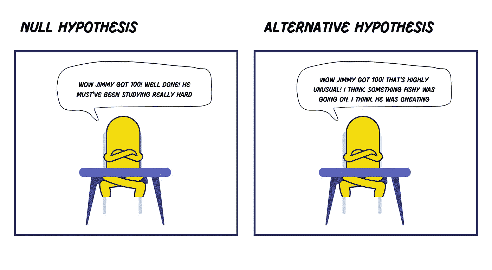
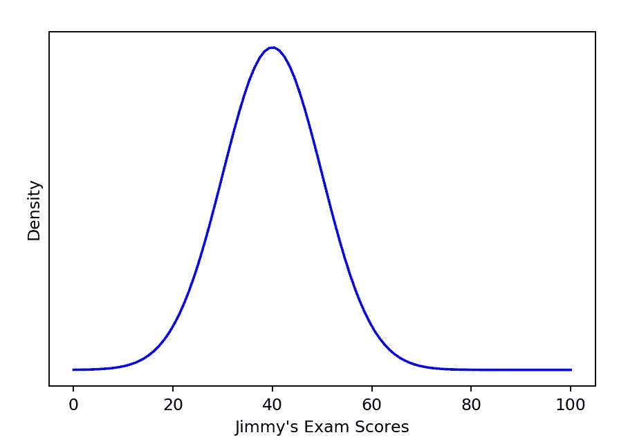
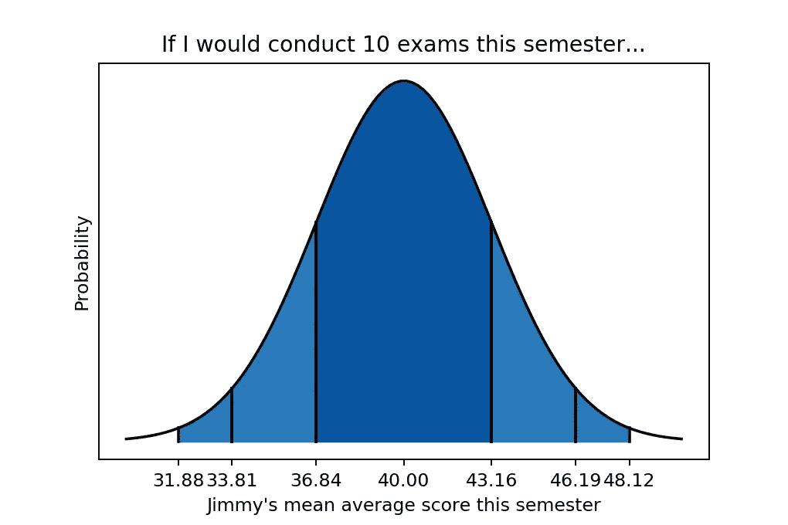
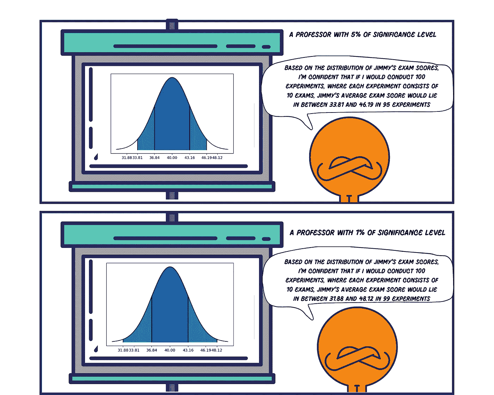
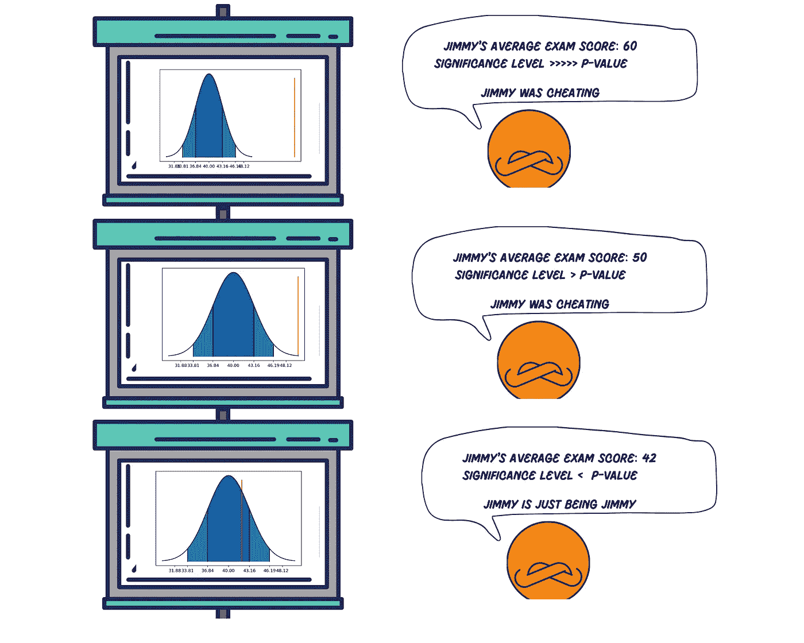
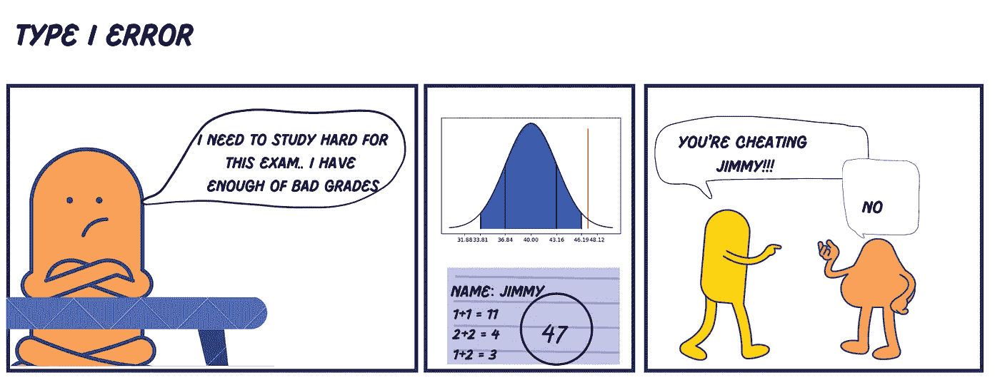
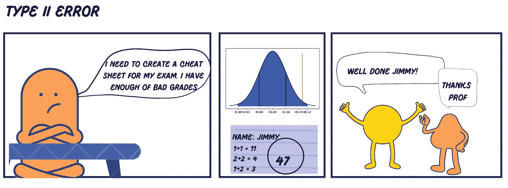

# 一个频繁统计推断的故事

> 原文：<https://towardsdatascience.com/a-story-of-frequentist-statistical-inference-12d38a7bcd77?source=collection_archive---------22----------------------->

## 为假人解释统计推断、假设检验、显著性水平和 p 值的概念。

照片由 [Siora 摄影](https://unsplash.com/@siora18?utm_source=unsplash&utm_medium=referral&utm_content=creditCopyText)在 [Unsplash](https://unsplash.com/s/photos/student?utm_source=unsplash&utm_medium=referral&utm_content=creditCopyText) 上拍摄

学习统计学应该是有趣且直观的，至少我是这么认为的。然而，当我们试图在研究生院或网上学习统计学时，所有与统计学相关的技术术语突然向我们扑来。

看看下面维基百科对统计假设的定义:

> **统计假设**是一种基于观察数据可检验的假设，观察数据建模为随机变量集合的实际值。—维基百科

什么？

对于刚开始学习统计学的初学者来说，上面的统计假设定义几乎没什么帮助。所以在这篇文章中，我们将会以一种有趣的方式讲述频率主义统计推断的基本原理。希望这篇文章能帮助你建立对推断统计学的直觉。

事不宜迟，让我给你介绍一个低于平均水平的学生吉米和他的教授之间的故事。

# 统计推断的故事

一个夏天的下午，就在假期开始前，吉米接到一个不同寻常的电话，电话是他的教授打来的，请他去他的办公室。

他的教授对他说:“我想和你讨论一些事情，请现在到我办公室来一趟。”。

在他教授的办公室里，吉米只是坐在桌子后面，想知道他的教授在想什么样的讨论。

作者图片

基本上双方都是因为不同的原因而震惊。教授震惊地发现，低于平均水平的学生吉米在期末考试中得了最高分。另一方面，吉米感到震惊，因为他的教授明确指控他作弊，尽管他为期末考试努力学习。

上面吉米和他的教授之间的场景是你需要知道的关于统计推断的好和坏的一面。

> 统计推断总是伴随着不确定性。然而，它是理解一切的有力工具。它告诉我们什么是可能的，什么是不可能的。

有了统计推断，你就有能力观察一些模式，然后用概率来确定这些模式最可能的解释。

如果吉米是个 A+的学生，他的教授不会对他在考试中获得最高分感到惊讶。然而，由于吉米是一个中等偏下的学生，他在这学期的考试中获得最高分的事实完全出乎意料。

教授的作弊指控是可以理解的，尽管他不能真正证明吉米作弊。从教授的角度来看，吉米有可能因为学习得当而获得最高分，但这种可能性极小。这是一种反常现象。

那么，教授怎么知道什么是可能的，什么是不可能的呢？从历史资料来看。吉米过去几个学期不太好的考试成绩记录。

> 统计推断在很大程度上依赖于数据来解释一切。

这就是统计推断的美妙之处。它结合了数据和概率，使我们能够对一个现象得出有意义的见解。

# 假设检验

假设检验只是一个书呆子术语，用来描述上面吉米和他的教授之间的场景。你可以把假设想成一种假设或者一种信念。所以当你试图用样本数据来解释你的假设或信念时，你基本上是在做假设检验。

> 假设检验是试图通过查看样本数据来理解假设的方法。

在假设检验的世界里，有两件事你应该知道:*零假设*和*替代假设*。

无效假设假设一切正常，没有异常情况发生，吉米是无辜的。与此同时，另一种假设认为有可疑或异常的事情正在发生。吉米成绩很好，因为他作弊了。

基于上面的故事，教授可以把他的无效假设和替代假设框定为这样:

*   零假设:吉米得到他的分数完全是因为一个随机的机会。任何低于平均水平的学生都可能偶尔在班上取得好成绩，对吗？
*   另一种假设:吉米因为作弊而得到分数。

作者图片

接下来，我们的主要工作是拒绝这两个相互冲突的假设中的一个。如果我们拒绝零假设，这意味着我们接受另一个假设，反之亦然。但是，我们如何接受一个而拒绝另一个呢？

再一次，通过观察我们的数据。记住，统计推断是数据和概率的结合。

假设教授有过去几个学期 1000 名学生各科考试成绩的历史数据。在每一个科目中，吉米的考试成绩总是在倒数 3 名。然而，在这学期的考试中，吉米在那 1000 名学生中得了最高分。

教授接着想:'*根据我在数据中看到的证据，吉米在 1000 名学生中随机获得最高分，这听起来有多荒谬？不，这太荒谬了。这不可能是偶然的。一些可疑的事情正在发生。*

因此，他决定拒绝零假设，支持替代假设。吉米一定是作弊了！

# 显著性水平

教授拒绝零假设的决定是可以理解的，即吉米得到最高分是由于一个随机的机会。为什么一个在 1000 名学生中考试成绩一直排在最后 3 名的学生突然得到了最高分？有可能，但是*极不可能*。

然而，现在我们需要通过解决一个基本问题来扩展这个概念:零假设有多荒谬或不可能让我们拒绝它而支持替代假设？

答案是:这取决于你和你的具体研究领域。每个人都有自己的主观判断来判断零假设是否足够荒谬。

然而，根据经验，人们有一个共同的阈值来拒绝零假设:5%或十进制形式的 0.05。这个 0.05 是显著性水平，表示假设我们的零假设为真，在我们的数据中观察到结果的可能性的上限。

> 显著性水平表示在我们决定拒绝零假设之前，我们对结果的容忍水平。

假设教授有吉米过去几个学期考试成绩的大量历史数据。根据数据，Jimmy 的考试成绩可以表示为如下分布。

从曲线中，我们可以看到，总体而言，吉米的平均成绩为 40，标准差为 10。然后教授能够形成他的零假设，就像:

*“吉米只是一个中等偏下的学生。我是说，看看他的成绩。他的平均成绩是 40 分！如果在这学期的考试中，他的平均分在 40 分左右，我不会感到惊讶。*

这学期，教授想进行 10 次考试。基于上面的分布和他想要进行 10 次考试的事实，教授能够对吉米这学期的平均考试分数做出假设。

首先，他将计算*标准误差*，即标准偏差(10)除以样本数量的平方根(他这学期将进行 10 次考试)。

基于 3.16 的标准误差，教授可以构建如下分布曲线:

基于如上所述的分布，教授能够基于所谓的经验法则形成假设:

*“如果我要进行几个实验，每个实验包括 10 次考试，我希望…*

*   在 68%的情况下，吉米的平均考试成绩会在平均值的一个标准误差范围内，平均值大约在 36.84 到 43.16 之间。
*   *在 95%的情况下，吉米的平均考试成绩都在平均值的两个标准误差范围内，平均值大约在 33.81 到 46.19 之间。*
*   *在 99%的情况下，吉米的平均考试成绩都在平均值的 2.5 倍标准误差范围内，平均值大约在 31.88 到 48.12 之间。*

对于显著性水平，假设教授遵循经验法则，这意味着在他说服自己拒绝他的零假设之前，他有 5%的显著性水平。

这意味着，如果他进行几个实验，每个实验包括 10 次考试，他预计在 95%的实验中，吉米的平均考试分数将大致位于平均值的两个标准误差内，或大约 33.81 至 46.19。相反，只有在 5%的实验中，吉米的平均考试分数会低于 33.81 或高于 46.19。

作者图片

如果教授有 1%或 0.01 的显著性水平，这意味着什么？这意味着，如果他进行几个实验，每个实验包括 10 次考试，他预计在 99%的实验中，吉米的平均考试分数将位于平均值的大约 2.5 个标准误差内，或大约 31.88 到 48.12。相反，只有 1%的实验中，吉米的平均考试分数会低于 31.88 或高于 48.12。

显著性水平越低，你就越谨慎地宣布发生了异常情况。这意味着在你决定拒绝零假设之前，你需要非常有力的证据或异常。

现在让我们回到吉米的教授和他的 5%显著性水平。

在批改完所有的试卷后，教授发现吉米这学期的 10 次考试平均得分为 50 分。基于他的显著性水平，教授有权拒绝零假设，即吉米由于随机机会得到 50 分的事实，因为:

*   吉米这学期的平均考试分数远高于他之前的预期范围，在 33.81 到 46.19 之间。如果教授具有 5%的显著性水平，他将期望吉米在仅 5%的时间内，或者在 100 次实验中的 5 次，或者在 1000 次实验中的 50 次实验中获得超出该范围的平均考试分数。
*   平均来说，教授 100 次中有 95 次会正确地拒绝零假设，即有可疑的事情发生。吉米一定是作弊了。
*   相反，100 次教授中只有 5 次是错的，这意味着他错误地指责吉米作弊，而实际上他没有。

# p 值

当教授发现吉米在考试中得了好成绩时，他有多惊讶，这可以用一个单一的标量值来量化。这个值叫做 p 值。

p 值的作用是，它为你提供了一个总结，告诉你，假设我们的零假设为真，你刚才看到的结果有多不可能。

> p 值越低，假设我们的零假设为真，我们刚刚看到的证据就越令人惊讶。

在统计学中，p 值代表概率值，您可以通过样本数据的分布来计算该值。将 p 值与您的显著性水平进行比较，将使您能够评估是否应该拒绝您的零假设。

如果吉米这学期的平均考试成绩是 60 分，那么在他的教授看来，p 值是如此之小(可能在 0.00001 左右)，以至于他不得不指责吉米作弊，也就是说，他拒绝零假设，而支持替代假设。

同时，如果吉米的平均得分是 50，而不是 60，p 值仍然很小，但不会像以前那么小。然而，p 值足够小，以至于它仍然低于教授的显著性水平(0.05)，这意味着教授很可能仍然拒绝零假设。

现在，如果吉米的平均分是 42，在平均值的两个标准误差范围内，那么在他的教授看来，p 值很大(高于 0.05)。这意味着没有发生任何令人惊讶的事情，一切都很正常。吉米就是吉米，一个一贯低于平均水平的学生。由于一个随机的机会，他得了 42 分。

# 第一类错误和第二类错误

当你有了一个 p 值，然后将它与你的显著性水平进行比较，你就有权力决定是否拒绝零假设。

然而，你需要记住我们在第一节讨论的内容:*统计推断总是伴随着不确定性*。它不是一个神奇的工具。即使是世界上最好的数学家也不会让你在做统计推断时没有机会犯错。

统计推断的要点是在数据和概率的帮助下理解你的问题。基于我们从数据中看到的证据，通过查看 p 值和显著性水平，我们有两个选择:

*   *拒绝替代假设，支持无效假设，或*
*   *拒绝零假设，支持替代假设。*

问题是，拒绝或接受零假设的决定完全是主观的。如前所述，每个人都可以微调自己的重要性级别。这意味着我们容易犯错误。

在统计学中，误差分为两种:**第一类误差**或**第二类误差**。

> 第一类错误是错误地拒绝零假设。
> 
> 第二类错误是未能拒绝零假设。

第一类错误意味着你错误地拒绝了零假设。你是说发生了一些特殊的事情，而实际上，什么都没发生，一切都只是一堆灰尘(想象一下马修·麦康纳在《华尔街之狼》中的场景)。

现在让我们回到吉米和他的教授身上。

假设吉米在这学期的考试中平均得了 47 分，因为他学习非常努力。比以前更努力。吉米光明正大地得到了分数。然而，他的教授并不相信，因为他预计 95%的情况下吉米的平均考试分数会在 33.81 到 46.19 之间。因为他 5%的显著性水平，p 值在他眼里已经足够小了。因此，教授指责吉米作弊，而实际上他并没有作弊。

他的教授犯了一个 I 型错误。他错误地指控一名无辜的学生。

作者图片

同时，第二类错误意味着你不能拒绝零假设。这意味着你说什么都没发生，而事实上，一些特殊的事情发生了。

和以前一样，假设吉米在这学期的考试中平均得了 47 分。剧透:他整个考试都在作弊，所以他的平均成绩是 47 分。但是，这次他的教授显著性水平非常低(0.01)。这意味着只有吉米的平均考试成绩大致在 48 分以上，教授才有信心指控吉米作弊。

当教授发现 Jimmy 的平均分为 47 时，他的显著性水平小于 p 值，因此他无法拒绝零假设。他断定吉米是无辜的，吉米得了 47 分是因为他努力学习，而实际上他并没有。

他的教授犯了一个第二类错误。他错误地释放了一名有罪的学生而没有受到惩罚。

作者图片

现在你知道有两种类型的错误。但是哪个更差呢？

同样，答案取决于你从事的研究领域。

如果你是一名经常试图诊断病人是否患有癌症的医生，你可能想要提高你的显著性水平，以抑制你犯第二类错误的机会。你不想告诉一个病人他们很好，很健康，但事实上，他们得了结肠癌。

另一方面，如果您正在构建一个垃圾邮件分类器，您可能希望构建一个具有较低显著性级别的算法，以抑制分类器犯 I 类错误的可能性。您不希望一封重要的非垃圾邮件被您的分类器归类为垃圾邮件。如果发生这种情况，你会收到同事和客户的投诉。

这就是用频率主义者的观点介绍统计推断的全部内容。希望这篇文章能帮助你学习统计学。