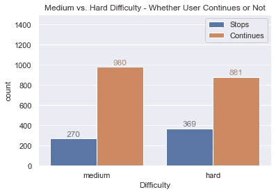

# Python 中 A/B 测试的简明指南

> 原文：<https://towardsdatascience.com/a-straightforward-guide-to-a-b-testing-in-python-4432d40f997c?source=collection_archive---------19----------------------->

## 通过几个简单的步骤，让您的实验更加严谨


杰森·登特在 [Unsplash](https://unsplash.com?utm_source=medium&utm_medium=referral) 上拍摄的照片

A/B 测试在实验过程中非常有用。在比较一个选项和另一个选项时，增加统计的严谨性。这是有助于防止做出错误结论的一个步骤。

本文将演示 A/B 测试中的关键步骤:

1.  **确定最小可检测效应**
2.  **计算样本量**
3.  **分析结果的统计显著性**

# 场景概述

为了演示公司可能采用 A/B 测试的情况，我将创建一个虚拟的视频游戏数据集。

在这种情况下，一家视频游戏开发公司意识到许多用户在一个特定的级别后会退出游戏。产品团队提出的一个假设是，关卡太难了，让它变得更容易会减少用户的挫折感，最终会有更多的玩家继续玩这个游戏。

# 样本量计算

## 期望的业务效果

我们的视频游戏公司对关卡做了一些调整以使其更容易，有效地将难度从*硬*改为*中*。在盲目地向所有用户推出更新之前，产品团队希望在一个小样本上测试这些变化，看看它们是否会产生积极的影响。

理想的衡量标准是达到我们的等级后继续玩游戏的玩家的百分比。目前，70%的用户在剩下的 30%停止游戏的地方继续玩。产品团队已经决定将这一比例提高到 75%,这将保证对游戏进行部署和更新。

## 最小可检测效应

这条信息(70%到 75%)帮助我们计算**最小可检测效应**——计算样本量的输入之一。我们的问题是测试两个比例，所以我们将使用 statsmodels 中的[**proportion _ effectsize**](https://www.statsmodels.org/dev/generated/statsmodels.stats.proportion.proportion_effectsize.html)函数将这种变化转换成我们可以处理的东西。

```
Output: For a change from 0.70 to 0.75 - the effect size is -0.11.
```

## 样本量

现在我们有了最小可检测效应，我们可以计算样本大小。为了解决比例问题，使用了[**ZT ind solve power**](https://www.statsmodels.org/stable/generated/statsmodels.stats.power.zt_ind_solve_power.html)(也来自 statsmodels 库)。

我们设置 **nobs1** (样本 1 的观察值)参数，表示这就是我们要解决的问题。

0.05 的**显著性水平和 0.8** 的**幂是通常选择的默认值，但是这些可以基于场景和期望的假阳性与假阴性灵敏度进行调整。**

```
Output: 1250 sample size required given power analysis and input parameters.
```

# 实验数据概述

在与产品团队沟通所需的样本量后，进行了一项实验，随机抽取 1250 名玩家玩新的较容易的级别，另外 1250 名玩家玩较难的级别。

收集数据后，我们了解到 980 名用户(1250 名)在达到中等难度后继续玩游戏，而 881 名用户(1250 名)在达到高难度后继续玩游戏。这看起来相当不错，超过了我们至少 5%改进的希望，我们应该做出改变吗？

在决定之前，测试统计显著性是很重要的，以防止这种差异可能只是随机发生的(考虑到我们的显著性和功效)。



作者提供的实验数据、图像和数据

# 分析结果

## 计算输入

我们将使用的统计测试是[比例 _ztest](https://www.statsmodels.org/dev/generated/statsmodels.stats.proportion.proportions_ztest.html) 。我们需要首先计算一些输入——成功和观察的数量。数据存储在 pandas 数据帧中，其中有中、硬列，0 代表停止游戏的用户，1 代表继续游戏的用户。

```
Output: Medium: 980 successes of 1250 trials. Hard: 881 successes of 1250 trials.
```

## 执行 Z 测试

执行 z 测试很简单，只需输入:

```
Output: z stat of 4.539 and p value of 0.0000. 
```

低于 0.05 的 ***p 值符合我们的标准*** 。把关卡难度降低到中等才是正道！

# 摘要

虽然这是一个虚构的简单示例，但是在现实世界中使用类似的方法可以为您的实验增加一些严谨性。当您有两个样本，并希望根据您想要的度量来判断某个实验是否导致了显著的变化时，可以考虑使用 A/B 测试。

*在*[*Github*](https://github.com/bstuddard/python-examples/tree/master/ab-testing)*上可以找到所有的例子和文件。*

*原载于*[*https://data stud . dev*](https://datastud.dev/posts/ab-testing)*。*