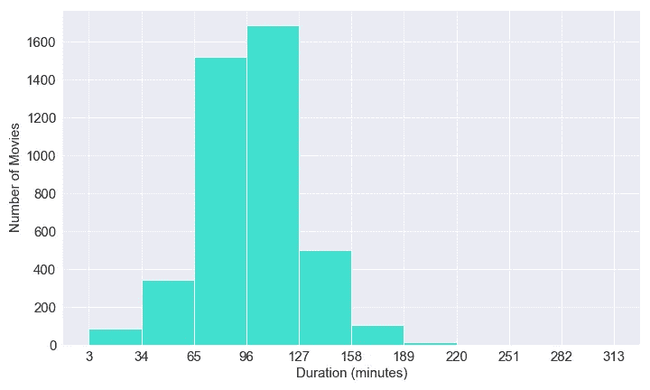
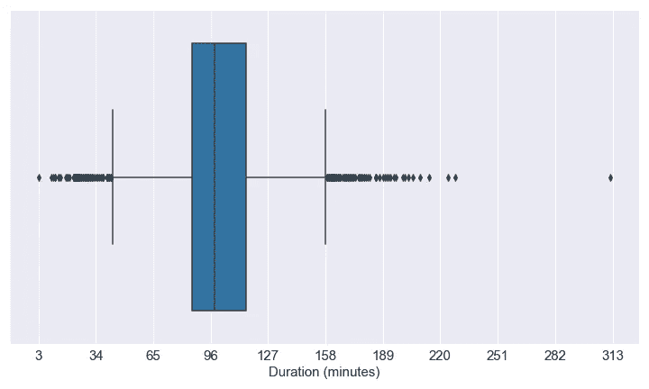
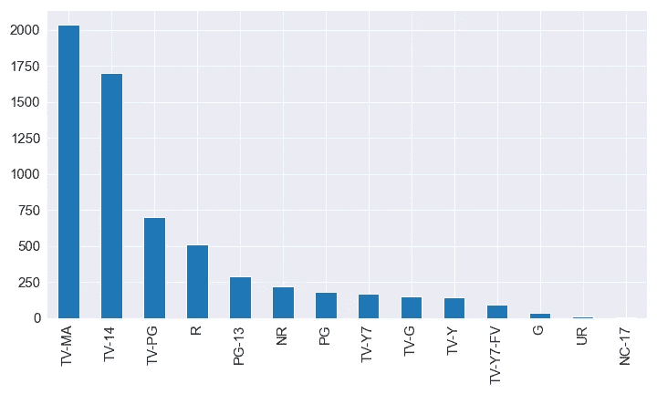

# 用 Python 清理和准备数据的简单指南

> 原文：<https://towardsdatascience.com/a-straightforward-guide-to-cleaning-and-preparing-data-in-python-8c82f209ae33?source=collection_archive---------2----------------------->

## 如何识别和处理脏数据？


杰西·奥里科在 [Unsplash](https://unsplash.com?utm_source=medium&utm_medium=referral) 上的照片

真实世界的数据是肮脏的。事实上，数据科学家大约 80%的时间都花在收集、清理和准备数据上。这些繁琐(但必要)的步骤使得数据适合我们想要建立的任何模型，并确保数据的高质量。

数据的清理和准备有时可能很棘手，因此在本文中，我想通过展示一些用于清理和准备数据的技术、方法和函数来简化这些过程。为此，我们将使用一个在 [Kaggle](https://www.kaggle.com/shivamb/netflix-shows) 上可用的网飞数据集，它包含了关于网飞所有图书的信息。我使用电影数据集是因为它们经常在许多数据科学项目的教程中使用，例如情感分析和构建推荐系统。您还可以遵循本指南，使用来自 IMDb、MovieLens 的电影数据集或任何需要清理的数据集。

虽然 Kaggle 数据集可能看起来组织良好，但它还没有准备好被使用，所以我们将识别丢失的数据、离群值、不一致的数据并进行文本规范化。下表详细显示了这一点。

```
**Table of Contents** 1\. [Quick Dataset Overview](#4e47)
2\. [Identify Missing Data](#8508)
 - [Create a percentage list with .isnull()](#3b34)
3\. [Dealing with Missing Data](#e729)
 -[Remove a column or row with .drop, .dropna or .isnull](#0a8b)
 - [Replace it by the mean, median or mode](#263c)
 - [Replace it by an arbitrary number with .fillna()](#06bb)
4\. [Identifying Outliers](#3eef)
 - [Using histograms to identify outliers within numeric data](#691c)
 - [Using boxplots to identify outliers within numeric data](#89e4)
 - [Using bars to identify outliers within categorical data](#199b)
5\. [Dealing with Outliers](#63cd)
 - [Using operators & | to filter out outliers](#3399)
6\. [Dealing with Inconsistent Data Before Merging 2 Dataframes](#49f0)
 - [Dealing with inconsistent column names](#5803)
 - [Dealing with inconsistent data type](#2f54)
 - [Dealing with inconsistent names e.g. "New York" vs "NY"](#d8d7)
7\. [Text Normalization](#1e4f)
 - [Dealing with inconsistent capitalization](#b2c9)
 - [Remove blank spaces with .strip()](#ff95)
 - [Remove or replace strings with .replace() or .sub()](#0b36)
8\. [Merging Datasets](#2e19)
 - [Remove duplicates with .drop_duplicates()](#3019)
```

# 1.快速数据集概述

下载数据集后要做的第一件事是检查每列的数据类型(列的值可能包含数字，但可能不是日期时间或整数类型)

读取 CSV 文件后，键入`.dtypes` 找到每一列的数据类型。

```
df_netflix_2019 = pd.read_csv('netflix_titles.csv')
df_netflix_2019.dtypes
```

一旦运行该代码，您将获得以下输出。

```
show_id          int64
type            object
title           object
director        object
cast            object
country         object
date_added      object
release_year     int64
rating          object
duration        object
listed_in       object
description     object
dtype: object
```

这将帮助您识别列是数值变量还是分类变量，在清理数据之前知道这一点很重要。

现在要找到数据集包含的行数和列数，使用`.shape` 方法。

```
In [1]: df_netflix_2019.shape
Out[1]: (6234, 12) #This dataset contains 6234 rows and 12 columns.
```

# 2.识别缺失数据

当数据收集不当、数据输入错误或数据值未存储时，有时会发生数据丢失。这种情况经常发生，我们应该知道如何识别。

## 创建一个百分比列表。isnull()

识别缺失数据的一个简单方法是使用`.isnull()`和`.sum()` 方法

```
df_netflix_2019.isnull().sum()
```

这向我们显示了每一列中的一些“NaN”值。如果数据包含许多列，您可以使用`.sort_values(ascending=False)` 将缺失值最多的列放在最上面。

```
show_id            0
type               0
title              0
director        1969
cast             570
country          476
date_added        11
release_year       0
rating            10
duration           0
listed_in          0
description        0
dtype: int64
```

也就是说，我通常用百分比来表示缺失值，因此我对缺失数据有一个更清晰的了解。以下代码显示了`%`中的上述输出

现在更明显的是，数据集中省略了许多控制器。

```
show_id: 0.0%
type: 0.0%
title: 0.0%
director: 31.58%
cast: 9.14%
country: 7.64%
date_added: 0.18%
release_year: 0.0%
rating: 0.16%
duration: 0.0%
listed_in: 0.0%
description: 0.0%
```

既然我们发现了丢失的数据，我们就必须管理它。

# 3.处理缺失数据

处理缺失数据有不同的方法。处理缺失数据的正确方法将在很大程度上受到数据和项目目标的影响。

也就是说，下面介绍了处理缺失数据的 3 种简单方法。

## 用移除列或行。下降，。dropna 或者。isnull

如果您认为有必要删除一个列，因为它有太多的空行，那么您可以使用`.drop()`并添加`axis=1` 作为参数来表示您想要删除的是一个列。

但是，大部分时间只够删除包含那些空值的行。这样做有不同的方法。

第一个解决方案使用`.drop` 和 `axis=0` 来删除一行。第二个解决方案标识空值，并通过使用求反运算符`~` 获取非空值，而第三个解决方案使用`.dropna`删除列中的空行。

如果您想在丢弃后保存输出，使用`inplace=True` 作为参数。在这个简单的例子中，我们不会删除任何列或行。

## 用平均值、中间值或众数代替它

另一种常见的方法是使用平均值、中间值或众数来替换空值。平均值和中值用于替换数值数据，而众数用于替换分类数据。

正如我们之前看到的,`rating` 列包含 0.16%的缺失数据。由于`rating`是一个分类值，我们可以很容易地用模式完成这一小部分数据。

首先我们计算了模式(TV-MA)，然后我们用`.fillna`填充了所有的空值。

## 用任意数字替换它。菲尔娜

如果数据是数字，我们还可以设置一个任意的数字来防止删除任何行，而不会影响模型的结果。

如果`duration` 列是一个数值(目前的格式是 string，例如`90 minutes`，我们可以用下面的代码将空值替换为 0。

```
df_netflix_2019['duration'].fillna(0, inplace=True)
```

此外，您可以使用`ffill`、`bfill`分别向前和向后传播最后一次有效观察。这对于某些数据集非常有用，但在`df_netflix_2019`数据集中却没有用。

# 4.识别异常值

异常值是指与其他观察值显著不同的数据。数据集可能包含真正的异常值或在数据收集不良后获得的异常值或由数据输入错误导致的异常值。

## 使用直方图识别数值数据中的异常值

我们将使用持续时间作为参考，这将有助于我们识别网飞星表中的异常值。在我们的数据集中，`duration`列不被视为数值(例如 90)，因为它与字符串混合在一起(例如 90 min)。此外，电视节目的持续时间是按季节划分的(例如，两季)，因此我们需要将其过滤掉。

使用下面的代码，我们将只从数据集中提取电影，然后从`duration`列中提取数值。

现在，数据可以显示在柱状图中了。你可以用 Python 中的 matplotlib，seaborn 或者 pandas 制作剧情。在这种情况下，我将使用 matplotlib。

```
import matplotlib.pyplot as pltfig, ax = plt.subplots(nrows=1, ncols=1)
plt.hist(df_movie['minute'])
fig.tight_layout()
```

下面的情节揭示了电影的时长是如何分布的。通过观察剧情，我们可以说第一个条(3 '–34 ')和最后一个可见条(> 189 ')的电影很可能是离群值。它们可能是短片或长纪录片，不太适合我们的电影类别(同样，这仍然取决于你的项目目标)



作者图片

## 使用箱线图识别数值数据中的异常值

另一种识别异常值的方法是箱线图。我更喜欢使用箱线图，因为它将离群值排除在了盒子的触须之外。因此，在不考虑异常值的情况下，更容易确定最小值和最大值。

我们可以用下面的代码很容易地做出箱线图。

```
import seaborn as snsfig, ax = plt.subplots(nrows=1, ncols=1)
ax = sns.boxplot(x=df_movie['minute'])
fig.tight_layout()
```

箱线图显示，低于 43 '和高于 158 '的值可能是异常值。



作者图片

同样，我们可以用`.describe()` 方法识别箱线图的一些元素，如下四分位数(Q1)和上四分位数(Q3)。

```
In  [1]: df_movie['minute'].describe()
Out [1]: count    4265.000000
         mean       99.100821
         std        28.074857
         min         3.000000
         25%        86.000000
         50%        98.000000
         75%       115.000000
         max       312.000000
```

除此之外，您可以轻松地显示 boxplot 的所有元素，甚至使其与 Plotly 交互。

```
import plotly.graph_objects as go
from plotly.offline import iplot, init_notebook_modefig = go.Figure()
fig.add_box(x=df_movie['minute'], text=df_movie['minute'])
iplot(fig)
```

## 使用条形识别分类数据中的异常值

如果数据是分类的，您可以通过绘制条形图来识别具有少量观察值的类别。

在这种情况下，我们将使用内置的熊猫可视化来制作条形图。

```
fig=df_netflix_2019['rating'].value_counts().plot.bar().get_figure()
fig.tight_layout()
```



作者图片

在上面的图中，我们可以看到模式(列中最常出现的值)是“TV-MA ”,而“NC-17”和“UR”并不常见。

# 5.处理异常值

一旦我们确定了离群值，我们就可以使用 Python 的操作符轻松地过滤掉它们。

## 使用运算符& |过滤掉异常值

Python 运算符很容易记忆。`&`相当于`and`，而`|`相当于`or`。

在这种情况下，我们将根据箱线图显示的值过滤掉异常值。

```
#outliers
df_movie[(df_movie['minute']<43) | (df_movie['minute']>158)]
#filtering outliers out
df_movie = df_movie[(df_movie['minute']>43) & (df_movie['minute']<158)]
```

现在创建的`df_movie` 只包含持续时间在 43 '到 158 '之间的电影。

# 6.在合并两个数据帧之前处理不一致的数据

我们经常遇到的一个常见任务是合并数据帧以增加观察的信息。不幸的是，大多数时候，数据集有许多不一致的地方，因为它们来自不同的来源。

**从现在开始，我们将使用第二个数据集** `**df_netflix_originals**` **，它只包含网飞原件(。csv 在 my**[**Github**](https://github.com/ifrankandrade/data_preprocessing.git)**上可用)，我们将它与原始数据集** `**df_netflix_2019**` **合并，以确定原创和非原创内容。**

## 处理不一致的列名

我们必须处理的一个常见问题是表之间不同的列名。使用`.rename` 方法可以很容易地更改列名。

## 处理不一致的数据类型

如果您试图基于具有不同数据类型的列合并两个数据集，Python 将会抛出一个错误。这就是为什么你必须确保类型是相同的。如果同一个列有不同的类型，你可以使用`.astype`方法来规范化它。

## 处理不一致的名称，例如“纽约”与“纽约”

通常，列和数据类型规范化足以合并到数据集；但是，有时，由于数据输入错误(打字错误)或单词书写方式不一致，导致同一列中的数据不一致。

电影片名一般不会有这些问题。他们可能在标点符号上有分歧(我们稍后会处理这个问题)，但是电影通常有一个标准的名称，所以为了解释如何处理这个问题，我将创建一个数据集和一个包含以不同方式编写的状态的列表。

有很多库可以帮助我们解决这个问题。在这种情况下，我将使用`fuzzywuzzy` 库。这将根据两根弦之间的距离给出一个分数。您可以选择更适合您的数据的计分器。在这个例子中，我将设置`scorer=fuzz.token_sort_ratio` 。

正如我们在输出中看到的，scorer 在匹配字符串方面做得很好。

```
states         match       score
CA             California  33       
Hawai          Hawaii      91       
NY             New York    40       
Washington DC  Washington  87 
```

但是，请记住，它仍然可以匹配错误的名称。

# 7.文本规范化

文本规范化是自然语言处理的必要条件。这涉及到以下使文本一致的技术。

*   删除空格、标点符号和非字母数字字符
*   标记化、词干化、词汇化、删除停用词

为了简单起见，本文将只涉及第一点。然而，在下面的文章中，我将解释如何在 Python 中标记文本。

[](/5-simple-ways-to-tokenize-text-in-python-92c6804edfc4) [## 用 Python 标记文本的 5 种简单方法

### 标记文本、大型语料库和不同语言的句子。

towardsdatascience.com](/5-simple-ways-to-tokenize-text-in-python-92c6804edfc4) 

## 处理不一致的大写

在合并 2 帧之前，我们必须确保大多数行匹配，规范大写有助于此。

有许多方法可以降低框架中的小写文本。下面你可以看到两个选项(`.apply` 或`.str.lower`)

## 用删除空格。条状()

有时数据有前导或尾随空格。我们可以用`.strip`方法摆脱它们

## 用移除或替换字符串。替换()或。sub()

两个数据集之间的文本常常在标点符号上有分歧。您可以使用`.apply and .sub` 或`.replace`将其移除

把它们中的任何一个和正则表达式一起使用都很好。例如，正则表达式`[^\w\s]` 将帮助您删除单词(a-z，A-Z，0–9，_)或空格以外的字符。

正则表达式(regex)可能看起来令人生畏，但它们比您想象的要简单，并且在从文本数据中提取信息时至关重要。在下面的链接中，你会发现我为轻松学习正则表达式而制作的简单指南。

[](/a-simple-and-intuitive-guide-to-regular-expressions-404b057b1081) [## 简单直观的正则表达式指南

### 轻松地从任何文本中提取信息。

towardsdatascience.com](/a-simple-and-intuitive-guide-to-regular-expressions-404b057b1081) 

# 8.合并数据集

最后，我们可以合并数据集`df_netflix_originals` 和`df_netflix_2019`。有了这个，我们可以识别哪些电影是网飞原创，哪些只属于目录。在这种情况下，我们执行一个外部连接，将“Catalog”值赋予“`Original"` 列中所有值为空的行。

## 用删除重复项。drop_duplicates()

具有两个键列的外部连接的一个缺陷是，如果我们只考虑一个列，我们将获得重复的行。在这种情况下，我们基于`title`和`release_year`列进行合并，因此很可能存在具有不同`release_year`的重复`titles`。

您可以使用`.drop_duplicates`方法删除一列中的重复项

按类型和来源分组的数据分布如下。

```
In[1]: df_netflix[['original', 'type']].value_counts()Out[1]:
original  type   
Catalog   Movie      3763
          TV Show    1466
Netflix   TV Show    1009
          Movie       504
```

就是这样！现在数据是干净的，准备好进行处理了！*此分析背后的代码可在我的* [*Github*](https://github.com/ifrankandrade/data_preprocessing.git) 上找到

[**如果你想学习西班牙语 Python，可以订阅我的 YouTube 频道。每周我都会发布类似下面这样的视频。**](https://www.youtube.com/channel/UCGKngc82bux4NIDar572E5Q/featured?sub_confirmation=1)

你仍然可以清理更多(如果必要的话)或者在你的数据科学项目中使用这些数据，就像我找到最好的[网飞](/the-best-netflix-movies-series-to-learn-english-according-to-data-science-dec7b047b164)和[迪斯尼](/the-best-disney-movies-to-learn-a-foreign-language-according-to-data-science-45e7fd084a78)电影来学习外语一样(NLP 项目)

[](/the-best-movies-to-learn-english-according-to-data-science-2dccb4b3ee23) [## 根据数据科学，学习外语的最佳电影

### 有史以来最大的电影对白词汇分析。找出前 3000 部分析过的电影中哪些是最好的…

towardsdatascience.com](/the-best-movies-to-learn-english-according-to-data-science-2dccb4b3ee23) 

下面是一些我争论真实世界数据的项目:

[](https://medium.datadriveninvestor.com/i-used-to-pay-180-yr-for-a-profitable-betting-tool-this-year-i-built-one-in-python-dda1a9b9581f) [## 我曾经每年花 180 美元购买一个有利可图的赌博工具。今年我用 Python 做了一个

### 完整的代码创建一个足球博彩工具与熊猫和硒。

medium.datadriveninvestor.com](https://medium.datadriveninvestor.com/i-used-to-pay-180-yr-for-a-profitable-betting-tool-this-year-i-built-one-in-python-dda1a9b9581f) [](https://medium.datadriveninvestor.com/make-money-with-python-the-sports-arbitrage-project-3b09d81a0098) [## 用 Python 赚钱——体育套利项目

### 充分代码，使额外的钱与体育套利。

medium.datadriveninvestor.com](https://medium.datadriveninvestor.com/make-money-with-python-the-sports-arbitrage-project-3b09d81a0098) 

*。*