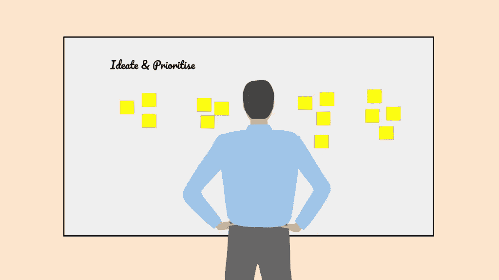
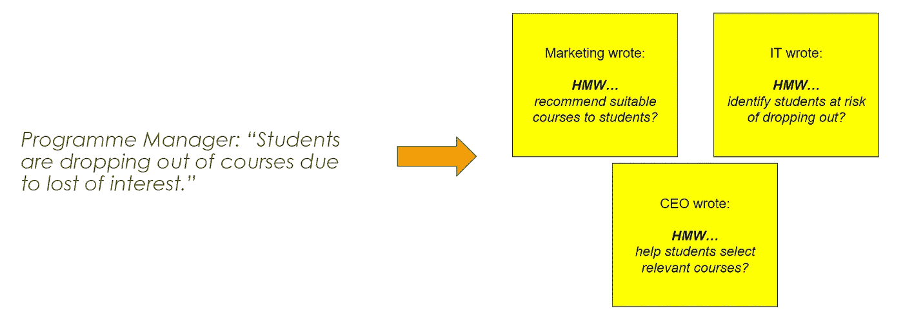
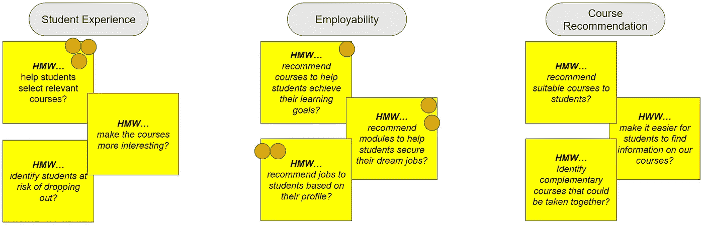
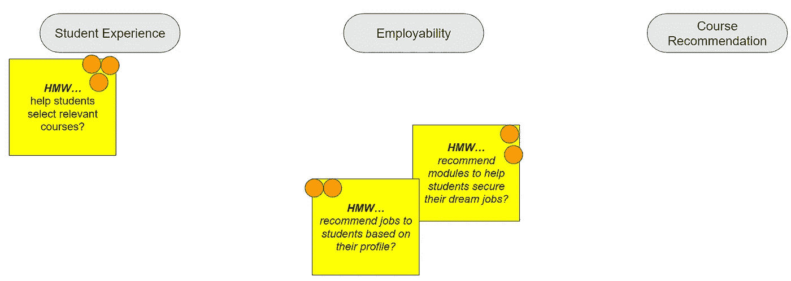
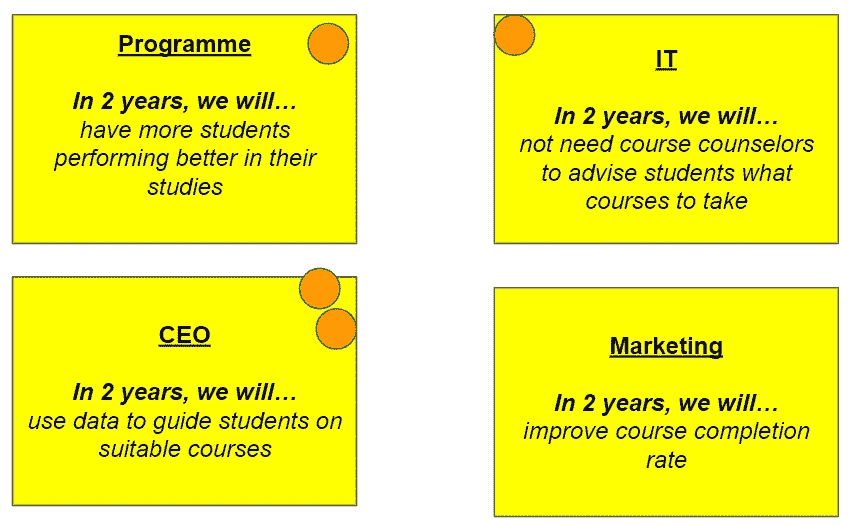
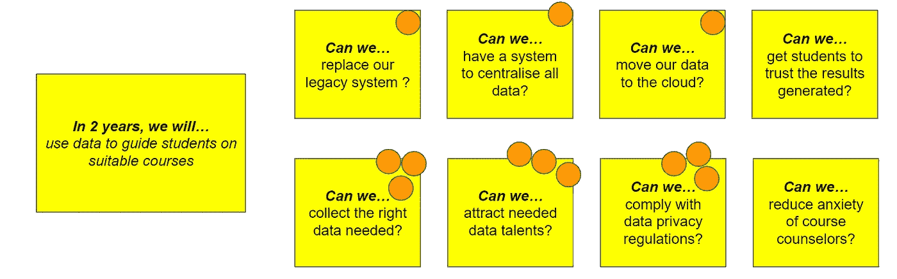
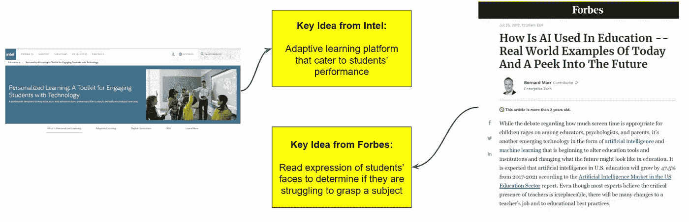
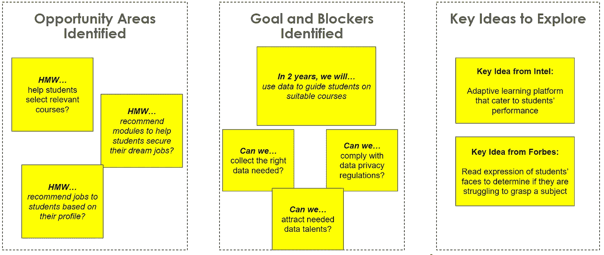

# 用人工智能发现构思人工智能用例的结构化方法

> 原文：<https://towardsdatascience.com/a-structured-approach-for-ideating-ai-use-cases-with-ai-discovery-85d00db078b5?source=collection_archive---------27----------------------->

## [行业笔记](https://towardsdatascience.com/tagged/notes-from-industry)

## 改编的设计 Sprint 可以帮助团队构思相关且有影响力的人工智能用例

图片来源:AI 新加坡

本月早些时候，我有机会在一个关于人工智能诊所和人工智能发现的[网络研讨会](https://makerspace.aisingapore.org/2021/03/ai-clinic-and-ai-discovery-your-first-steps-in-ai-transformation/)上分享，这是人工智能新加坡(AISG)综合项目的一部分，旨在帮助组织加快人工智能的采用。在这篇文章中，我将详细阐述在**人工智能发现**研讨会上发生的事情，在那里人工智能用例被构思和优先化。

AI 原型不同于软件原型，需要准备数据和实验算法来确定用例的可行性。既费时又费钱。组织必须想出正确的用例来减少浪费的努力，并增加采用人工智能的可能性。

作为 AI 新加坡的助理主管，我目睹了商业领袖在确定 AI 用例时犯的常见错误。这些错误导致了不可行或不完美的人工智能用例的开发，这些用例继续困扰着组织，并削弱了未来对人工智能的兴趣。这些本可以最小化。

# 构思人工智能用例的常见错误

## **1。没有最小化群体思维**

商业领袖通常会召集不同部门的代表，就潜在的人工智能用例进行头脑风暴。头脑风暴会议通常以商业领袖分享他们的想法、员工展示他们的想法或者非正式的圆桌讨论开始。

> *“首席执行官建议的第一个项目并不适合投资。”—亚马逊 re:MARS 2019 期间的吴恩达*

所有这些方法都有严重的缺陷:群体思维通常发生在高级管理层分享他们的想法之后；好的想法可能在提交给管理层之前就已经被筛选掉了；外向的人将主导讨论。所有这一切将导致一系列低风险和“常识性”的想法，无法利用人工智能的全部潜力。

## 2.没有对齐团队

部署人工智能解决方案不仅仅是安装新软件。鉴于人工智能的能力，它通常会要求组织调整业务流程，要求员工调整工作流程，以充分利用信息技术的潜力。换句话说，成功的人工智能模型部署需要一致的团队。

然而，商业领袖在构思过程中经常忽略团队的一致性。这导致缺乏对 AI 模型的支持和采用，因为具有不同优先级的团队不会投入时间和精力来调整他们现有的过程。人工智能解决方案将自然消亡。

## 3.没有聘请具有人工智能专业知识的主持人

我见过一些公司在内部“人工智能构思会议”后选择与人工智能无关的用例。根本原因？会议中没有人有人工智能方面的专业知识。他们无法破译选择的用例是否可能用于人工智能开发。这是徒劳的，因为参与者必须重新进行构思练习，以确定更好的和相关的人工智能用例。

例如，我工作过的一家公司选择了“使用人工智能来确保客户在现场收取快递”。这个用例与其说是 AI 用例，不如说是业务流程问题。它可以在构思研讨会期间更早存档，以将每个人的注意力集中在人工智能相关的用例上。

# 什么是 Design Sprint，它如何提供帮助？

Google Ventures 开发了 [Design Sprint](https://www.gv.com/sprint/) 来构思和测试结构化方法中的用例。它是专门为解决头脑风暴中提到的常见错误而设计的。然而，最初的过程并不是为构思人工智能用例而优化的。

基于我与各种公司合作的经验，我通过做一个主要修改，将它用于构思人工智能用例:当参与者投票决定要关注的挑战时，主持人将过滤掉非人工智能用例。此外，研讨会的第一部分将以'*寻找灵感*结束，而不是最初设计冲刺中描述的'*目标映射*。

# 个案研究

理解改进的构思过程如何工作的最好方法是通过案例研究。下面的案例研究来自我主持的一次实际会议；出于保密目的，公司名称和敏感信息已被掩盖。

## 客户背景

更好的大脑是一所高等学府。他们的首席执行官对在他们的组织中使用人工智能感兴趣。然而，首席执行官不确定从哪里开始。他决定让 AISG 为他的团队主持一个构思研讨会。

## 步骤 0:准备工作

主持人将与项目发起人或参加研讨会的最高级别人员讨论，以确定研讨会的合适主题。这为探索设置了一个软边界，将讨论保持在一个限定的空间内。

主持人还将建议谁应该参加研讨会。最好是来自与研讨会主题相关的不同部门/职能的 4-7 名参与者。

BETTER BRAIN 的首席执行官决定召集营销、IT 和项目部门的员工参加研讨会。他还决定了主题:改善学习者的体验和成果。

## 第一步:参与者分享挑战，并将挑战转化为“我们可以怎样做”(HMW)

每个参与者轮流分享他们的业务挑战。包括主持人在内的其余参与者将把共同面临的挑战转化为机会领域。这些问题将以“*我们如何……*”(HMW)的格式编写。

目的是产生潜在的想法来解决共同的业务挑战。由于每个参与者都有不同的视角，因此对于相同的业务挑战，会产生不同的想法。参与者之间没有讨论，以尽量减少集体思维，防止外向者主导讨论。

> *“我们使用‘我们会怎样’的格式，因为它暗示一个解决方案是可能的，并且因为它们给你提供了以各种方式回答它们的机会。一个恰当的框架“我们如何可能”并不建议一个特定的解决方案，而是给你一个创新思维的完美框架。”—视频*

在下面的例子中，在 BETTER BRAIN 的项目经理分享了她的商业挑战后，其余的人将其转换为 HMW 格式的问题:

参与者将共享的业务挑战转换为 HMW 格式。图片作者。

## 第二步:对挑战进行分类和投票

辅导员和参与者将确定整个 HMW 的共同主题，并相应地对其进行分类。然后，每位参与者都有两次投票来决定哪些挑战值得挑战。参与者之间没有讨论。

对质疑进行分类是为了便于投票；挑战投票旨在确定团队想要应对的重要且相关的挑战。

下图显示了为“更聪明的大脑”投票的结果:

HMW 根据相似性进行分类，并投票决定相关的 AI 用例。图片作者。

## 步骤 3:过滤挑战

少于两票的挑战被移除。主持人还将消除与人工智能无关的挑战，并向参与者解释为什么它们与人工智能无关；这是对原工艺的修改之一。

在这一步之后，所有剩下的用例都是人工智能解决方案开发的潜在候选对象。

少于两票的 HMW 和与 AI 无关的 HMW 被删除。图片作者。

## 第四步:定义目标

每位参与者用“*两年后，我们将…* ”的格式写下一个目标。然后参与者投票决定哪个是值得追求的目标；每个人都有一票。

本练习的目的是让参与者从他们的角度设想，如果所有确定的挑战都得到解决，公司或业务部门将会是什么样子。

对于更好的大脑，参与者已经确定他们在两年内的主要目标是利用数据来指导学生选择合适的课程。

参与者确定潜在的两年目标，并投票决定相关目标。图片作者。

## 第五步:识别阻挡者

每个参与者将列出 2-3 个可能阻止他们实现最高投票目标的潜在障碍。应该以“*我们能不能…* ”的格式来编写阻止程序。然后，每位参与者有 3 次投票来选择与确定的目标最相关的阻碍因素。

目的是强调潜在的陷阱，这些陷阱可能会破坏人工智能项目或阻止团队实现他们的目标。这允许管理层先发制人地解决它们，以增加人工智能项目成功的可能性。

为了更好的大脑，参与者已经确定了可能阻止他们实现目标的三大障碍:

已识别和投票的阻止者列表。参与者列出潜在的屏蔽程序，并投票决定相关的屏蔽程序。图片作者。

## 第六步:寻找灵感

参与者有 15 分钟时间寻找 1-2 个灵感来解决类似的挑战，并记下每个灵感的关键想法。这些灵感不一定来自同一个行业。

当参与者到达这一部分时，他们会对潜在的解决方案有初步的想法。分享想法的挑战在于它们可能很难解释，人们对相同的抽象解释有不同的解释。

因此，本部分的目的是让参与者以具体的形式展示他们的想法，并分享他们想法的关键应用。

参与者共享的解决投票问题的潜在应用程序。图片作者。

## 总体结果

在规划过程结束时，参与者将获得以下信息:

*   已确定的机会领域和潜在解决方案列表。
*   参与者设想的人工智能用例将有助于实现的目标，以及可能破坏人工智能项目的潜在障碍。
*   通过一系列投票环节，参与者就需要解决的关键问题达成一致。

管理层在决定他们应该开发哪些人工智能用例时，可以考虑这些输入。

工作坊结束时制作的艺术品。图片作者。

# 结论

确定可行且有影响力的人工智能用例具有挑战性。组织用来确定人工智能用例的常用方法不适合人工智能的模糊性和数据依赖性。AISG 将设计 Sprint 改编成一种结构化的、经过验证的方法，用于构思人工智能用例。

如果您希望了解更多信息，您可以致电 ai-advisory@aisingapore.org[T3 联系我们。](mailto:ai-advisory@aisingapore.org)

本文首发于 [AI 新加坡 makers space](https://makerspace.aisingapore.org/2021/03/a-structured-approach-for-ideating-ai-use-cases-with-ai-discovery/)。