# 一套用于电子商务推荐、个性化和产品分类的基本数据产品

> 原文：<https://towardsdatascience.com/a-suite-of-essential-data-products-for-e-commerce-recommendations-personalisation-and-product-316b9d75f99e?source=collection_archive---------21----------------------->

弗兰基·查马基在 [Unsplash](https://unsplash.com?utm_source=medium&utm_medium=referral) 上拍摄的照片

## [理解大数据](https://towardsdatascience.com/tagged/making-sense-of-big-data)

# 内容列表

> 介绍
> 
> Word2Vec 到 Product2Vec —产品嵌入生成器
> 
> 产品一:相似商品推荐
> 
> 产品 II:产品分类扩展器
> 
> 产品三:基于内容的高级相似项目推荐器
> 
> 产品四:个性化商品推荐
> 
> 产品 V:列表类别修正器
> 
> 产品六:用户兴趣分类器
> 
> 结论—总体情况

# 介绍

这是一个关于我们如何为电子商务平台开发包含 6 种不同解决方案的数据科学产品捆绑包的故事。(在我们的例子中是一个市场)这个故事的本质是，捆绑包中的所有这些产品都来自一个单一来源，这是一个产品数字代表列表，或者更通俗地称为*“产品嵌入”*。这些产品被开发成一个链条，从一个产品结果到另一个产品结果。最终产品套件可以被视为一个与推荐、个性化和产品分类相关的电子商务综合解决方案。

> 就个人而言，我最喜欢这个项目的是，一旦你有了代表性的产品数值向量，你就可以为你的业务提供所有 6 种不同的数据产品。因此，这里最重要的事情是提出一种健壮的方法来生成位于所有产品核心的高质量产品嵌入。因此，本文将首先描述我们创建嵌入的方式。

在深入这个多层项目的细节之前，让我提醒您注意一个简单而微妙的事实:数据科学家对业务/产品透彻理解的重要性。正如您将在本文的其余部分看到的，我们在整个项目中开发的每个产品都从不同的方面解决了我们的业务问题。因此，将特定的业务问题与适当的数据解决方案相匹配必须是数据科学家的关键素质之一，这需要良好的产品知识水平。

从技术角度来看，数据科学家还必须能够转换现有的机器学习算法，以适应自己的业务问题。在下一节中，我们将给出一个例子，并讨论我们如何将最著名的 NLP(自然语言处理)算法之一-*“word 2 vec”-*转换为一个“*产品嵌入生成器”*。

*重要提示:*在整篇文章中，“产品”、“项目”和“列表”这些词将交替使用。

# WORD2VEC 到 PRODUCT2VEC —产品嵌入生成器

Word2Vec 是一种众所周知的利用单层神经网络的 NLP 方法。它使用隐藏层的激活作为结果，而不是使用最终输出层的预测。这种方法背后的主要逻辑是在隐藏层上创建一个瓶颈，并将稀疏的 one-hot-encoded 输入单词向量转换为密集的低维数值向量。

为这种神经网络生成训练数据的方法是使用上下文窗口，在一组文档中的所有句子上滑动。上下文窗口是句子中连续单词的固定大小的分组。使用上下文窗口中的单词对组合，我们生成(x =输入单词，y =输出单词)标记的训练数据，然后将其馈送给网络。最终，共享相同上下文的单词会以相似的嵌入结束。例如，人们总是交替使用“荷兰”和“荷兰”这两个词。(有趣的事实:该国的官方名称是“荷兰”,代表所有 12 个省,“荷兰”是一个中部地区的名称，仅包含 2 个省，包括阿姆斯特丹市。)由于这两个词在许多文档中用相似的词包装或共享相似的上下文，所以它们也将从算法中获得相似的嵌入。深入讨论 Word2Vec 超出了本文的范围，但是有很多博客文章可以让您了解更多。

现在，让我们考虑一个电子商务平台来回答这个问题:电子商务业务中的基本单元是什么？首先，主要资产是我们的产品、用户以及这两者之间的互动。每个用户很可能在某个时间段在平台上有几个会话。这些会话由同一用户的大量连续产品视图组成。现在，退一步，尝试在 Word2Vec 和电子商务平台中的基本单元之间进行类比。

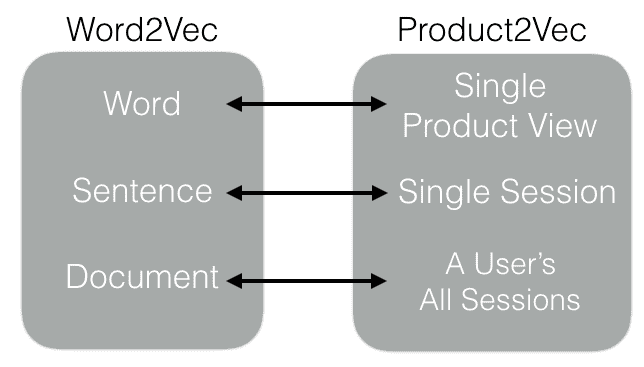

**word 2 vec 和 Product2Vec 的类比**(图片由作者提供)

如图，一个词和一个单一的产品观有一个类比。此外，由用户查看的产品序列组成的单个会话可以被解释为一个句子。包含所有会话的用户的整个旅程可以被视为一个文档。

借助这个类比，我们可以使用 Word2Vec 算法来生成我们的产品嵌入，就像它对 Word 的工作方式一样。我们将拥有产品的数字代表，而不是以单词嵌入结束。这就是为什么，为了命名惯例，将我们的产品嵌入生成器命名为*‘product 2 vec’*是有意义的。

现在，让我们花一点时间来思考产品嵌入维度中的这些价值代表了什么。Product2Vec 仅基于用户点击/查看数据，它隐式地对产品属性进行编码。换句话说，在创建嵌入时，我们不使用任何明确的产品质量、属性或特征。因此，我们无法将每个维度与特定的产品属性相匹配，但您可以将每个维度视为随机属性，如颜色、尺寸、位置或卖家信任分数等。

我们不得不使用这种方法来生成代表性特征向量的原因是，我们平台上的列表没有很多明确的产品属性或标签。我相信这是绝大多数电子商务平台的共同问题，但特别是市场平台遭受产品信息不足的问题，因为它们的内容完全依赖于用户。然而，如果你的平台上的每一件商品都有许多清晰的描述性产品标签，我强烈建议你使用这些明确的产品标签来生成产品嵌入。

在结束这一部分之前，我想提一下我们在嵌入过程中采取的两个技术决策。第一个决定是关于创建我们的训练数据的不同方法。请记住，我们将每个用户会话视为一个句子，并相应地生成(输入单词-输出单词)对。(注意:会话是一系列产品视图，任何后续视图之间的间隔不超过 30 分钟。)我们还尝试通过滑动用户的整个旅程——所有会话的组合，来创建训练数据对。事实证明，在我们的案例中，后者给了我们更高质量的产品嵌入。这是一个依赖于问题的设计决策，需要由项目开发人员进行调整。

我们做的第二个决定是关于嵌入的最佳尺寸。正如您将在以下部分看到的，不同的产品需要不同的嵌入大小。对于推荐者，我们使用 64 维产品嵌入，对于聚类分析涉及的其他产品，我们使用 16 维嵌入，以避免遭受维数灾难。因此，值得注意的是，您还需要根据您的问题来调整嵌入大小。

本文的主要目的是向您介绍 6 种不同产品的开发过程，并向您展示产品嵌入是如何为这些产品铺平道路的。我不会在这里深入讨论 Product2Vec 的更多技术细节，但是如果你感兴趣，你可以阅读我之前的关于它的博客文章。在本文的其余部分，产品将按照我们想出它们各自想法的完全相同的顺序呈现给你。通过这种方式，我们旨在传达整个项目中所有产品的实时开发链。

# 产品一:相似商品推荐

相似商品推荐器是最受欢迎的推荐器类型之一，被许多电子商务平台广泛使用。它对 CTR(点击率)和 CR(转化率)的强大影响使其成为所有产品中最具吸引力的数据科学产品。常见的用例是通过给产品页面命名为“推荐的相似产品”或“相似”,在推荐转盘中向用户展示相似的产品。

现在，让我们快速浏览一下下面的“流程—构建模块”图表。您将看到所有后续产品的类似图表，因此现在有必要花点时间来定义这些单独的模块。最上面一行表示带有一些构建模块和中间数据集的高级产品流。构建模块将显示为黑色椭圆形，我们将在相应产品部分下的单独小节中简要讨论每个构建模块的详细信息。这些构建模块可以是现有的算法，也可以是我们为特定任务创建的函数。

在流程中，这些灰色矩形代表输入或中间数据集。我们放大的最后一个彩色块显示了每个产品的最终结果。正如你在图表中看到的，为了便于理解，我们用一组小的彩色编码方块来表示嵌入。在本例中，直观地看，奥迪汽车列表具有相似的颜色嵌入，而福特汽车的嵌入与奥迪不同，但彼此相似。

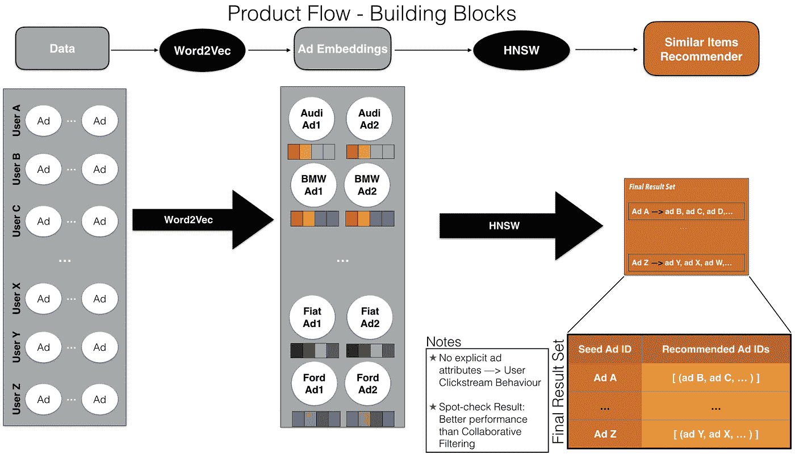

**产品一—流程图**(图片由作者提供)

## 构建模块:HNSW

一旦我们有了代表产品内在质量和属性的嵌入，为了提出对特定产品的类似商品推荐，您应该做的就是使用距离度量在嵌入空间中找到最近的产品。如果您的问题中没有很多产品，那么使用强力 k-最近邻算法来寻找最近的嵌入是最好的办法。然而，由于我们讨论的是数以百万计的产品，强力算法——将单个商品与所有其他商品进行比较——对我们来说不是一个合适和及时的选择。相反，我们使用了一种“近似最近邻”算法:HNSW。如果你只有 10 秒钟，你需要知道这些算法是如何工作的，就是在空间中画一组线(这些线的数量是你可以设置的参数)，然后通过比较空间中两个点在每条线的同一侧停留的时间来决定它们有多近。换句话说，它假设如果空间中的点或向量彼此靠近，它们将倾向于停留在与所画的线相对的同一侧。这种方法使这个过程比它的暴力版本快得多，因为不是将一个点与其余的点进行比较，而是只与行数进行比较。你可以在下面看到近似最近邻的简化解释。

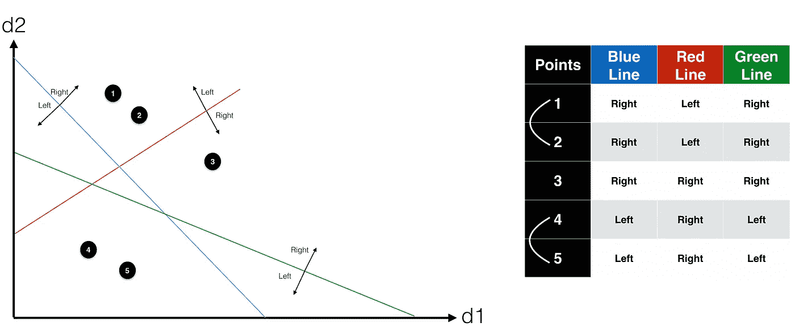

**简化的近似最近邻**(图片由作者提供)

对于每个产品，只需使用 HNSW 找到前 N 个最接近的嵌入，并将它们作为推荐产品保存在一个表中。正如上面的产品 I 流程图中所总结的，您现在有了类似的商品推荐器。最终结果就像一个只有两列的表格一样简单，其中一列是我们正在生成推荐的产品 id，第二列是相似产品 id 的列表。

在开始展示之前，我想提一下我们在项目的这个阶段做出的一个技术决定。由于 HNSW 只是返回输入产品嵌入的类似项目，我们有机会看到由 Product2Vec 生成的那些产品嵌入的质量。在这个过程中，我们意识到，被用户浏览几次的产品不会获得高质量的嵌入，因此，HNSW 会返回相关的类似商品推荐。换句话说，这些产品之前不会被点击很多次，因为可能有各种原因，例如它们可能是新发布的新鲜列表或只是平台上不受欢迎的列表。那些以非代表性嵌入结束的原因是 Word2Vec 算法在设计上对罕见单词的较差性能。

在算法中有一个名为“最小词频”的特定参数，以防止为那些罕见的词生成嵌入。您可以将该参数设置为某个值，算法将忽略那些在整个语料库中出现次数少于您设置的值的单词(或我们示例中的产品)。在我们的例子中，我们将这个参数设置为 10，基本上是告诉算法不要去理会以前浏览次数少于这个数字的产品。当然，这也是一个应该由开发人员调整的特定问题参数。正如你现在所看到的，这个产品只为以前浏览过至少 10 次的“热门”列表生成推荐。其余的呢？继续阅读这篇文章，你会在产品 III 部分看到一个专门为新鲜、新的或不受欢迎的产品开发的解决方案。

## *展示区*

在评估产品的性能和推荐的质量时，我们首先随机选择一个产品 id 作为种子项目，然后为它获取类似的产品。我们将种子的产品页面和推荐项目放在一张图片中，以帮助我们直观地评估它。如下图所示，您将在左上角看到种子产品，在右手边看到其前 4 名推荐的类似产品。

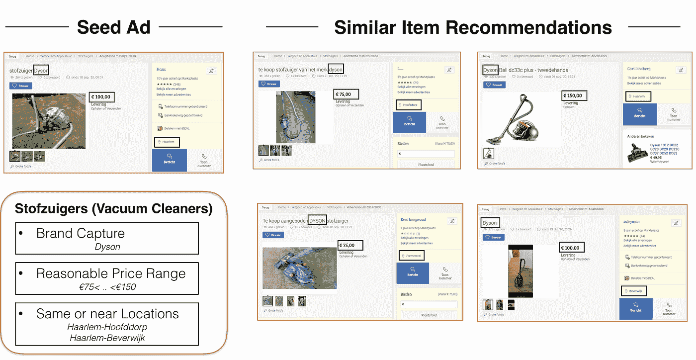

**产品一——展柜**(来源:【www.marktplaats.com】T4)

种子广告是一个居住在哈勒姆的用户发布的吸尘器，其价格为 100 欧元。从广告的标题，我们确实看到它的品牌是戴森。现在，让我们检查一下那些被推荐的项目。正如你所看到的，所有的推荐都是 Dyson 真空吸尘器，贴在哈勒姆附近的各个地方，价格在 75 到 150 欧元之间。值得称赞的是，这种方法很好地捕捉了产品的不同品质，如位置、价格或品牌，尽管根本没有使用任何一个明确的产品属性。同样，这一切都是基于用户点击行为数据。

# 产品 II:产品分类扩展器

在产品 I 之后，我们再次将焦点转移回产品嵌入。我们开始思考如何以其他不同的方式利用它们。这是因为我们相信在这些嵌入中隐藏着许多潜力。这种想法让我们想到了我们的第二个产品，即产品分类扩展器。

由于市场平台的内容完全依赖于用户，产品分类可能会变得具有挑战性，很容易脱离我们的控制，因为我们的库存是如此动态，并由我们的用户管理。实际上，这是市场和纯电子商务平台的主要区别。在电子商务平台上，所有产品都由单独的库存或分类团队列出，他们相对容易控制这些产品类别的名称。然而，如果你正在经营一家市场企业，你很可能在某个时候需要自动化产品分类。我们的业务需要这样一个自动化系统的原因是为了动态地发现平台上存在的更具体的产品类型，以便组织所有可用的列表，使客户能够以最少的点击次数找到他们想要的东西。

在这个产品中，流程从嵌入开始，然后是两个不同的构建块:K-Means 和定义集群。让我们在接下来的两节中更深入地研究它们。

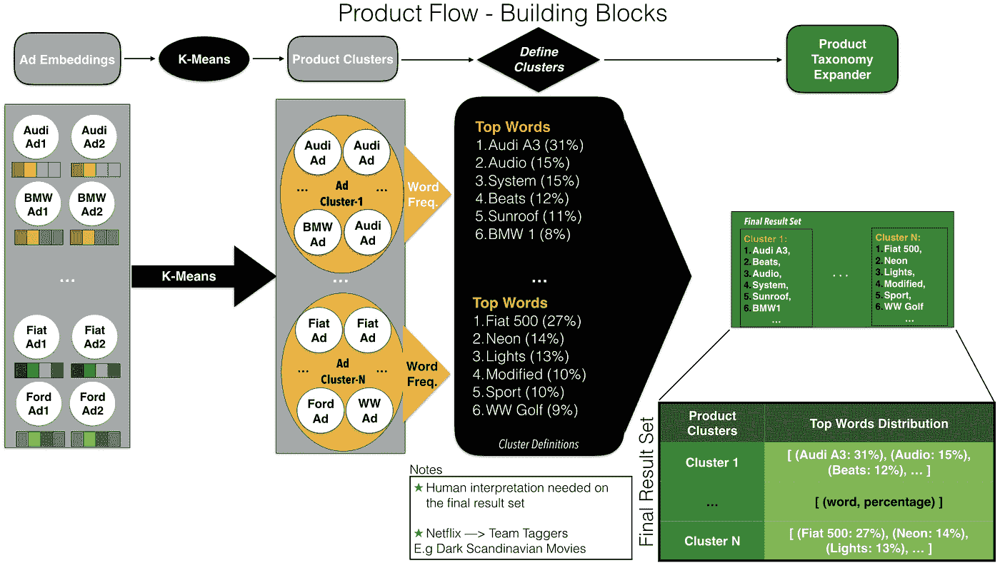

**产品二——流程图**(图片由作者提供)

## 构建模块 I: K-Means

在第一步中，我们在嵌入的基础上使用 k-means 聚类算法将相似的产品聚集到同一个产品组中。我们已经在市场上列出了一些现有类别，如洗碗机或冰箱，但数量不多，也不够详细。因此，一旦我们将聚类数参数(K)设置为某个任意数，最好大于当前类别的总数，这将使我们能够在我们的平台上结束更具体且更详细的产品类型组，如台面洗碗机或葡萄酒冰箱。

为了便于理解，让我们继续使用前面提到的产品 II 流程图中的汽车示例。由于这种聚类，奥迪汽车将被收集到同一个聚类中，而菲亚特汽车将聚集在另一个单独的聚类中。当然，这些集群不会只由奥迪或菲亚特汽车组成。你可能会看到来自同一细分市场的其他品牌。例如，奥迪集群中可能有一些宝马汽车，而菲亚特集群中可能有一些福特或大众汽车。这是完全正常的，对我们的解决方案来说没有问题，只要我们的聚类算法像预期的那样将相似的产品分组在一起。这只是一个假设的例子，以便向您阐明我们的观点，但实际上，您可能希望将分类数设置得更高，这样，即使不同类型的特定汽车品牌也将归入单独的分类，如菲亚特 500 Lounge Manual 或黑色菲亚特 500 Sport。根据集群的数量(参数 K)，我们有机会调整这些产品集群的细化程度，并相应地选择最佳参数值。

在我们的例子中，我们如何找到最佳 K 值？首先，我们在一个主要类别——白色家电和设备——上测试了这款产品，该类别包括大约 40 个不同的子类别，如洗衣机或炉灶。因此，我们希望将 K 设置为大于 40，因为我们的主要目标是扩展当前类别并发现更详细的类别。在寻找最佳 k 值时，你可以将现有类别的数量作为你的下限，那么上限呢？在这里，集群的大小开始发挥作用。我们可以将这个数字 K 增加到某一点，这样那些产品簇仍然足够大，可以被称为类别。我们从 40 开始逐渐增加 K 的值，并找到 100 左右的最佳值，最终得到最有意义的产品组。底线是这个数字 K 需要根据问题和平台进行特别的调整。

## 构建模块 II:定义集群

将我们的产品分成几个子类别后，下一步是找出这些新产品类别的良好描述，以便给它们命名。这个构建块可以做到这一点，逻辑很简单:对于每个集群，我们取所有集群成员产品的标题，然后计算词频分布，并列出最常用的词及其各自的百分比。由于在市场中，商品的标题对于吸引更多的买家非常重要，因此大多数商品的标题都已经被卖家写得非常清楚和详细，例如“*移动冷藏箱——服务柜——带轮子的冰箱****”***。因此，这有助于我们在分析列表标题时，为每一个产品群找到好的描述性词语。

如产品 II-流程图所示，该构建模块的输出也是产品的最终结果，该产品是一个具有两列的表格:产品聚类数和热门词分布。关于该表的一个重要注意事项是，尽管它如此简单易用，但我们仍然需要对结果进行人工解释，以便对新发现的产品类别进行花哨和高质量的命名。这也是同样的程序，它是如何做的网飞 Tagger 团队想出电影类型，如黑暗斯堪的纳维亚电影。

## *展柜*

在下面的图片中，您将看到来自总共 100 多个产品集群中的 2 个不同集群的一些示例。在第一行中，所有这些产品都来自一个名为“闹钟”(荷兰语为“wekkers”)的类别，正如您从顶部的面包屑中看到的那样。然而，在这些产品中有一些独特和共同的东西。这些不仅仅是闹钟，还是一盏唤醒灯，所有人的品牌都是飞利浦。这一产品群的前四个词是“飞利浦唤醒灯”，这对于这一特定产品群来说已经是不言自明的了。在第二行中，所有这些产品都属于相同的现有类别“个人护理设备”，但看起来它们实际上是一种特定类型的产品，即“足浴”(荷兰语为 Voetenbad)。不出所料,“Voetenbad”一词的使用率比该产品群中的任何其他词都要高。

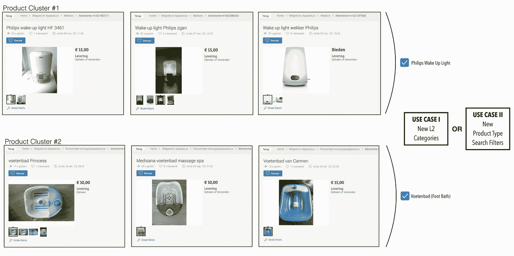

**产品二——展示区**(来源:【www.marktplaats.com】T2)

该产品在我们的市场上主要有两个明确的使用案例。在第一种情况下，我们可以将这些产品组作为新的二级类别，列在一级 ***主类别页面*** 上。(注意，在第二个用例中，1 级类别是白色家电和设备)在结果的帮助下，我们可以通过添加更多的产品类型过滤器来改进我们的 ***优化搜索结果*** 组件。你可以在我们的市场平台上看到下面的页面，在那里我们可以使用该产品的最终结果

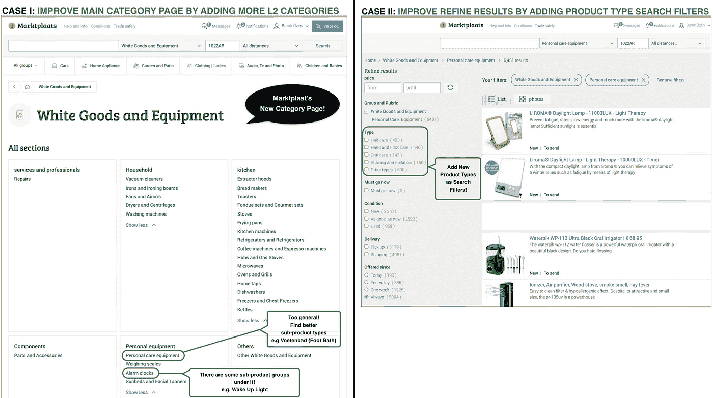

**产品二—使用案例**(来源:[www.marktplaats.com](http://www.marktplaats.com/))

# 产品三:基于内容的高级相似项目推荐器

请记住，在产品 I 中，我们跳过了为用户仅浏览几次的广告生成推荐。这些产品中的绝大多数都是新发布在平台上的新鲜商品。在推荐空间，我们对这种情况有一个专门的称呼:冷启动问题。在这里，我们有机会处理这个问题，并且能够为这些列表生成推荐。

在这个产品中，我们利用了前一个产品的结果，即带有描述性顶词的产品簇。如上面的流程图所示，我们只是在这个结果和新发布的列表标题的数据集合之间添加了一个新的构建块——加权 Jaccard 距离。

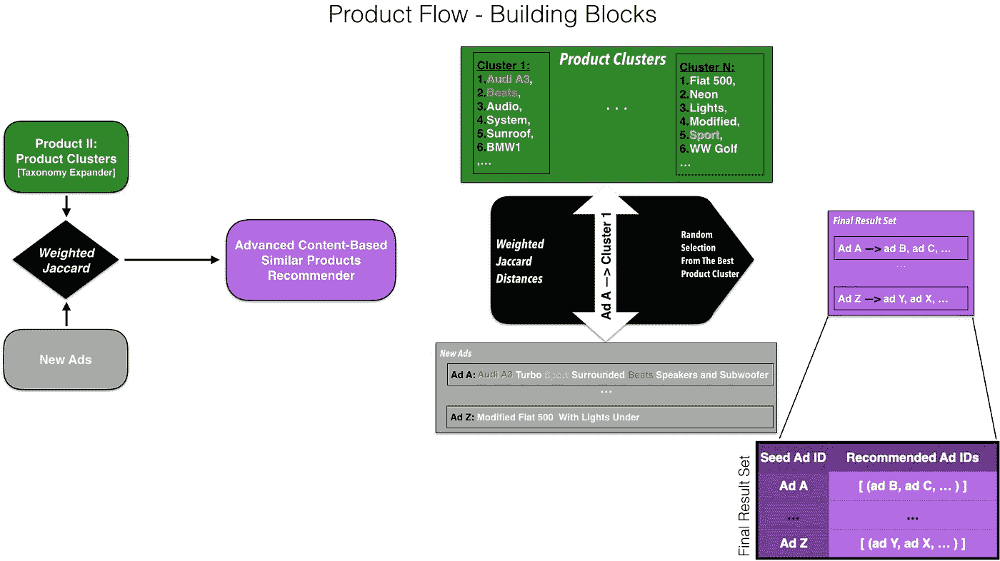

**产品三——流程图**(图片由作者提供)

## 构建块:加权 Jaccard 距离

该函数将每个新发布的列表的标题与每个产品分类的描述性单词列表进行比较。为了决定哪个产品群最适合某个新发布的列表，我们使用 Jaccard 距离(相似性)和一点权重技巧。Jaccard 距离是两个句子之间的常用词数量与总联合集中的词数量的比率。

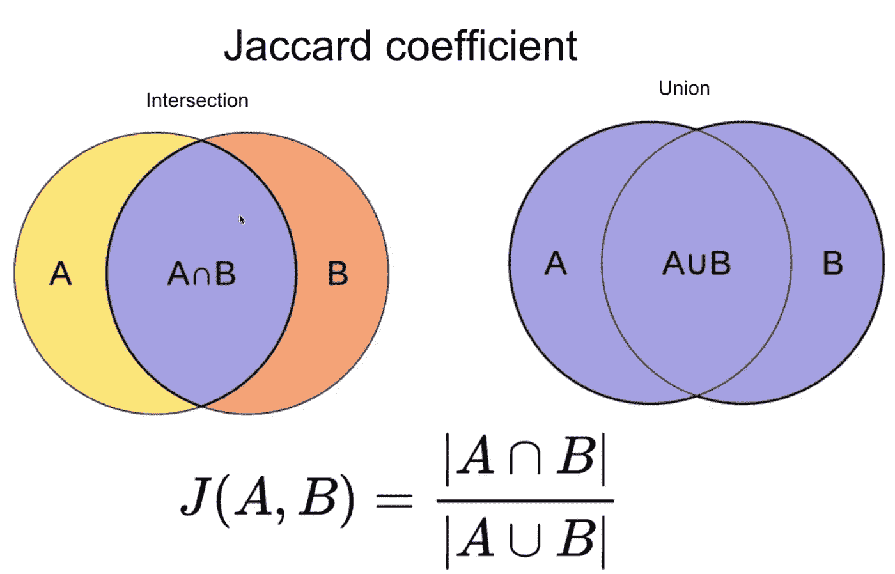

**雅克卡距离/相似度**(来源:维基百科)

我们在计算分子时使用了一点权重技巧，分子是一个列表的标题和一个产品群的描述性词语的交集。如果与描述性单词列表顶部的单词匹配，它会给出更多的权重。您可以看到，这是一个直观的、更强有力的指示，表明了列表和产品集群之间的相似性，如下面的简单示例所示。

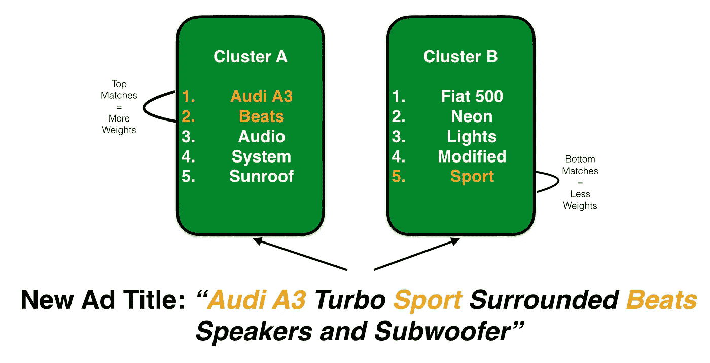

**重量戏法**(图片由作者提供)

一旦一个列表以我们上面描述的方式与每个产品群进行了比较，这个构建块就将每个列表分配给一个特定的最适合的产品群。之后，它通过从指定的产品群中随机挑选一些商品，为每个列表生成相似的商品推荐。

该构建模块的输出也是该产品的最终结果，其格式与我们为产品 I 中的“热门”列表创建的最终表格完全相同。换句话说，通过产品 I 和该产品的组合，我们现在可以为我们平台上的所有库存提供类似的商品建议。

还有一件事我故意跳过了，但在这里值得一提。在我们的案例中，总共有大约 100 个产品集群。当通过计算加权 jaccard 距离将新列表与那些聚类进行比较时，它可能与几个不同的聚类具有一些平局分数。为了打破这些束缚，最终只分配一个产品群，我们还将地区和列表价格与这些产品群的地区分布和中间价格进行比较。您可以将此视为推动集群分配过程的最后一小步。

这种方法相对于冷启动问题的其他解决方案的最大优势是基于用户行为数据，而不仅仅是一对一的属性比较。我们将每个列表与一组产品进行比较，这些产品实际上是用户点击行为分析的结果。与仅基于属性比较的一对一方法相比，这可以被视为更健壮的一对多方法。

## *展柜*

该展示与我们在产品 I 中看到的非常相似。我们用一个新发布的列表作为种子输入，并获得前 4 名推荐的类似商品作为回报。正如你从上面的图片中看到的，我们正在寻找类似项目的种子列表是一个机器人吸尘器。在右侧，您会看到这一特定产品类型的相关建议。其中三个是不同的机器人真空吸尘器列表，其中一个是机器人真空吸尘器的特殊过滤器。实际上，最后一个过滤器建议总结了我们的方法及其相对于其他方法的优势。

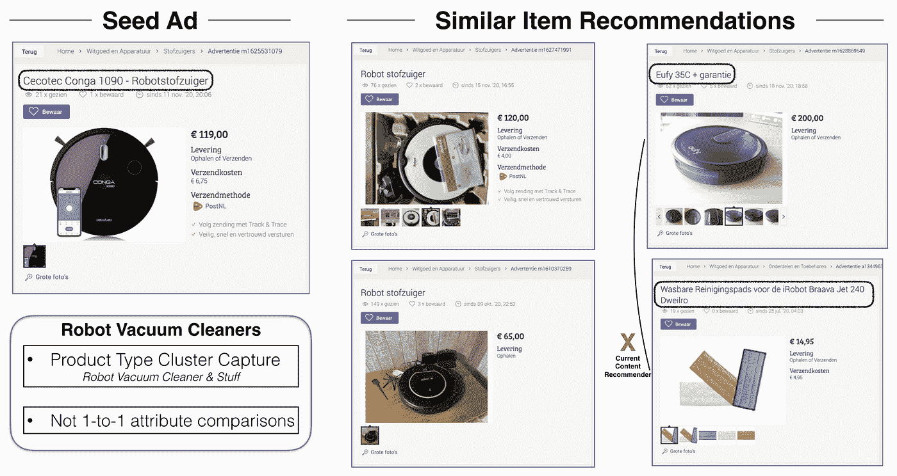

**产品三——展示区**(来源:【www.marktplaats.com】T2)

由于这些建议来自指定的特定产品群，因此可以看到不同的产品类型，但在某种程度上都是相关的。这使我们能够为某个列表增加相似项目推荐的多样性。除此之外，让我们快速看一下上图中右上方的清单。在那个和种子列表之间没有共同的单词或属性共享。如果使用了一对一的属性比较方法，那么就没有办法得出这样的建议。总的来说，我们可以说这个新发布的列表的推荐器可以正确地捕获产品类型，然后相应地生成相关的推荐。

# 产品四:个性化商品推荐

在项目的这个阶段，我们开始考虑如何为用户提供个性化的产品推荐。该产品的主要目标是根据用户最近在平台上的浏览行为，向用户展示最相关的产品推荐。

请记住，在产品 I 作为热门广告推荐器和产品 III 作为新发布的新鲜广告推荐器的帮助下，现在我们能够为我们平台上的所有商品提供类似的商品推荐。因此，我们所要做的就是在用户查看的最后列表和产品 I 和产品 III 的结果组合之间放置一个新的构建块——“加权随机选择”。你可以在下面的流程图中清楚地看到这些联系。

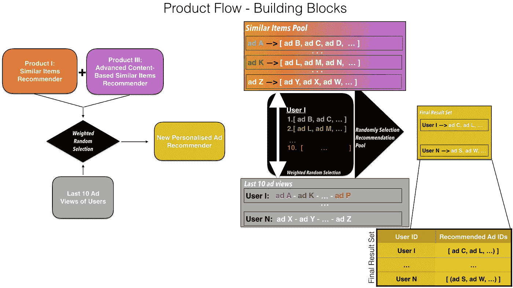

**产品四——流程图**(图片由作者提供)

## 构建模块:加权随机选择

该函数将用户查看的最后 10 个列表作为输入，并且对于该输入中的每个列表，从先前开发的推荐器中检索前 5 个相似的项目推荐。正如你所想象的，最终会有一个由 50 个列表组成的推荐池。这最后 10 个列表和前 5 个推荐数字是任意的，但是决定了最终推荐候选人池的大小。换句话说，你应该根据你想给用户的最终推荐增加多少种类来设置这些数字。

该构件的下一步是根据它们各自的种子广告的新近性和它们在推荐的相似项目列表中的顺序，给池中的所有列表赋予不同的权重。它以这样的方式分配权重，即用户观看的最后一个列表的顶部推荐项目将具有最高的权重，并且类似地，用户观看的最后 10 个列表的第 5 个推荐项目将具有最低的权重。下图描述了这一过程。

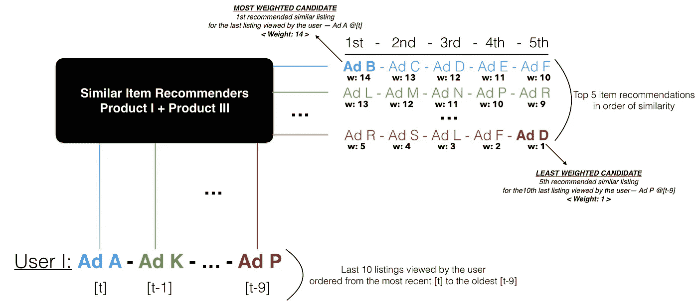

**对推荐池中的候选人进行加权**(图片由作者提供)

在加权步骤之后，最后要做的是根据给定的权重从推荐池中随机选择。那些选中的列表将作为个性化推荐提供给我们的用户。从上面的产品 IV 流程图中可以看出，最终的结果是一个只有两列的表:用户 Id 和推荐的产品 Id。

在展示步骤之前，我想强调一下为什么我们想采用像加权随机选择这样的方法。主要原因是，就个性化产品推荐而言，提供各种不同的推荐产品非常重要。你应该给不同的产品一个被挑选出来推荐的机会，而不是坚持只推荐一种产品或者一遍又一遍地推荐同样的产品。通过这种方式，你也可以在许多不同的产品中公平地分配用户流量。

## *展柜*

在下图的上方，你会看到一个用户最近的观看序列。我们列出了用户查看的最后 10 个项目，从最早的到最近的。正如你所看到的，这些列表中的大多数都是机器人吸尘器，尤其是包括最近访问过的那些。还有一些不同产品类型的列表，如移动空调(1、3 和 7)和分体空调(5)。

产品四——展示区(来源:[www.marktplaats.com](http://www.marktplaats.com/))

现在，看一下最下面一行，其中显示了为该特定用户生成的前四个推荐。正如所料，推荐的清单中有两个是机器人吸尘器。这是因为用户查看的大多数和最近的最后列表是真空吸尘器。因此，首先显示更多来自该产品类型的推荐相似项目是有意义的。在第二个和第四个推荐中，你会看到一些来自不同产品类型的列表，就像你之前在用户最近查看的项目序列中看到的一样。这是用户推荐中良好多样性的重要标志。

# 产品 V:列表类别修正器

在市场平台中，由于内容完全依赖于用户，平台上可能有许多错误分类的列表。这里值得一提的原因是为了深入理解业务问题。首先，用户总是有可能无意中从类别列表中为他们的项目选择了错误的类别。另一个原因可能是没有找到他们正在寻找的特定类别，不得不将他们的项目放在他们找到的下一个最佳类别下。这只是问题的一个方面，这些实际上是我们平台上大多数错误分类的主要原因。

然而，这个问题还有另一个更有害的方面，它与用户的免费增值使用剥削和欺诈行为有关。例如，如果你有 2 台冰箱要在我们的平台上出售，你有权在冰箱类别下免费发布其中一台，但你必须支付发布费才能将第二台冰箱列在同一类别下。因此，一些用户故意喜欢将这些列表放在一些其他不相关的类别下，如洗碗机，以避免支付任何费用。

这种情况对我们的平台有两个有害的影响。首先，它导致企业亏损，更糟糕的是，它将市场平台变成了一个产品大杂烩，用户很难找到他们想要的东西。

对于这个问题的解决方案，我们将回到我们之前生成的产品集群。一些产品集群可能由不同的产品类型组成，但大多数集群倾向于更加同质。在这些同类群中，大多数列表属于同一产品类别。其中只有少数产品发布在其他类别下，但与其他产品归为同一类，因为我们的模型认为这些产品也是相似的。在这种情况下，我们将这一小群产品命名为通常的嫌疑产品。下一节，我们来详细说说这个积木。

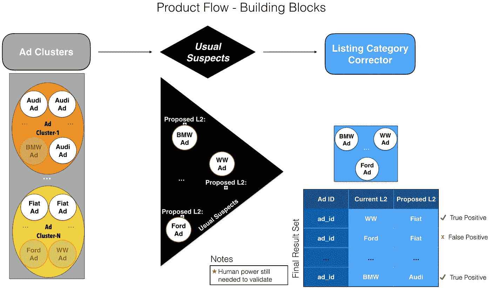

**产品 V —流程图**(图片由作者提供)

## 构建模块:常见的嫌疑人

这个构建块首先在这些集群的列表中找到最常见的产品类别。现在，让我们称之为主导集群类别。然后，将每个集群成员列表的实际类别与同一集群的主导类别进行比较。如果两者之间存在不匹配，我们将该集群成员标记为通常的可疑成员。我们的模型认为，那些通常的嫌疑人可能被错误地分类，因此他们落入主导产品类别不同于他们自己的产品类别的集群中。很可能他们的正确类别应该是集群的主导类别。因此，模型为这些列名提议的新类别是其各自集群的主导类别。

让我们看看上面产品 V 流程图中的汽车示例。顶部的产品集群主要由*奥迪*汽车组成，底部的另一个集群以*菲亚特*品牌为主导产品类别。从图中可以看出，奥迪集群中有一个宝马，菲亚特集群中有一个福特和大众。这些列表有点像其他集群成员中的离群值。因此，我们的模型怀疑宝马上市可能是一辆奥迪汽车事实上。同样，我们的模型也怀疑这些福特和大众上市可能是菲亚特汽车。

最终的结果集就像一个总共只有三列的表一样简单:Listing Id—Current Category—Proposed Category。这是一个动态表，定期更新，并及时捕捉越来越多的错误分类列表。然而，仍然需要人力来验证最终的结果集。这是因为在那些通常的嫌疑人中可能有一些假阳性。换句话说，我们的模型仍然有可能怀疑一个列表，即使它发布在正确的类别下。这种情况有一个直观简单的解释。

记住，聚类算法将相似的列表分组到同一个聚类中，并且有可能那些通常的嫌疑可能是来自其他不同类别的相似列表，并且不一定被错误地分类。事实证明，如果一个聚类的纯度很高(占主导地位的类别的比率)，那么那些通常的嫌疑人就更有可能在现实中被错误地分类。因此，您可以通过调整主要产品类别比率的阈值来更改最终结果集的准确性，同时选择我们将在其中寻找常见可疑点的分类。如果你提高这个阈值，你可能会得到更少的普通嫌疑人，但有更高的真实阳性率。下图描述了通常嫌疑人分析的阈值选择过程。

**选择产品集群进行常规嫌疑人分析**(图片由作者提供)

## *展柜*

下图中。在许多被发现的错误分类的列表中，你只会看到 3 个例子。我们在发布的列表的实际类别上画了一个矩形。在底部，您会看到每个列表的推荐或提议的正确类别。由于这些截图来自我们的荷兰平台，所有标题和类别都是荷兰语。让我来帮你把这些翻译成英语。如你所见，在最左边，是一个迷你冰箱列表，但贴在“风扇和空调”类别下。我们的模型建议将冰箱作为正确的类别。在中间，这是一个雀巢 Dolce Gusto 咖啡机，列在 Taps 类别下，但我们的模型建议将其类别更改为正确的类别:咖啡机和浓缩咖啡机。在最右边的图片中，它是一个台钟，由卖家发布在其他白色家电类别下。事实上，我们有一个单独的类别，那就是闹钟。请注意，我们尝试了单一主要类别(L1 级别)的所有产品:白色家电和设备。因此，它在底部显示了推荐的 L2 类别，因为我们的目标是检测我们平台上 L2 级别的错误类别。

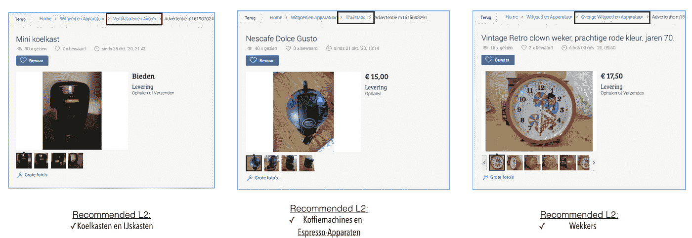

**产品 V——展示区**(来源:【www.marktplaats.com】T2)

# 产品六:用户兴趣分类器

在使用产品嵌入创建这些产品集群之后，我们认为也可以对我们的用户应用类似的集群。通过这种方式，我们将有机会根据用户最近在我们平台上的浏览历史，将相似的用户分组到相同的兴趣群中。该产品的主要目标是，如果我们有显示相似特征的用户群，那么我们将能够以更个性化的方式瞄准不同的用户群，从而进行更有效的营销。

使用本产品的结果，我们希望通过回答以下 3 个问题及时发现用户不断变化的兴趣:

*   *Q1:用户目前对哪种具体的产品类型感兴趣？*
*   Q2:这些用户更喜欢昂贵的物品还是更便宜的搜索者？
*   *Q3:对于这些用户来说，列表位置是一个决定性因素吗？*

首先要做的是找到一种生成用户嵌入的方法，这样我们才能进行下一步。构建模块——加权平均值——就是为此目的而添加到流程中的。现在，让我们看看下面的方法的细节。

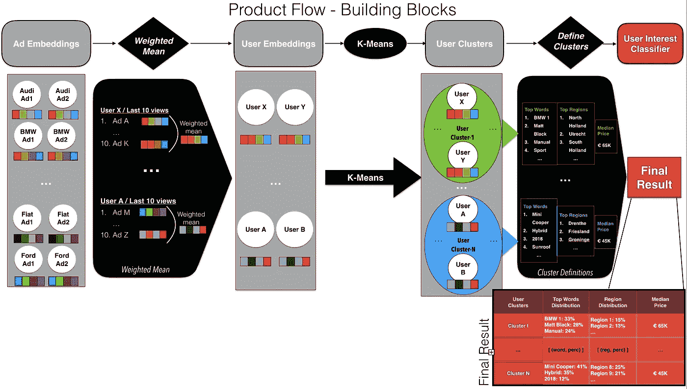

**产品六——流程图**(图片由作者提供)

## 构建模块 I:加权平均值

在生成用户嵌入时，我们希望在第一个产品中利用以前创建的产品嵌入。我们在流程中放置一个构建块，只是为了将这些产品嵌入转换成新的用户嵌入。我们的方法非常简单明了，甚至连构造块的名字都透露了这一点。基本上，我们检索用户查看的最后 10 个列表，并以这样的方式对列表嵌入进行加权平均，即用户查看的列表越近，其嵌入在计算中得到的权重就越大。

在上面的产品 VI 流程图中，如果我们再次查看我们的汽车示例，由于用户往往对某些品牌或汽车类型更感兴趣，我们最终将获得展示用户在平台上的最新产品品味的用户嵌入。因此，如果两个用户最近访问了相似的项目，那么在这个过程结束时，他们将具有相似的嵌入。现在，是时候在用户嵌入的基础上应用聚类算法了。

## 构建模块二:K-Means

这个构建模块的工作方式与产品 II 中的 K-Means 完全相同。这次我们对用户嵌入应用了聚类。这基本上是这两个构建模块的唯一区别。因此，我不会在这里再深究细节。这个构建块的结果是一组用户群，它们作为输入被传递给下一个构建块。

## 构建模块三:定义集群

该构造块的工作方式与产品 II 中的定义集群构造块类似。请记住，我们在描述产品集群时只使用了热门词汇。这里，在生成用户群的描述性质量时，我们还考虑了地区和价格范围。

最后一个构建块的结果也是该产品返回的最终结果集。它是一个总共有 4 列的表:聚类 Id —热门词分布—地区分布—中间价格。

**集群 Id:** 代表用户集群的编号

**热门词汇分布:**这是特定集群的用户在最近查看的列表的标题中频繁使用的词汇的列表

**地区分布:**发布感兴趣物品的邮政编码列表

**中间价格:**集群用户所有感兴趣的列表的中间价格

## *展柜*

在下面的图片中，您将看到 4 个不同用户群的例子。当我们成对比较时，这 4 个聚类总结了该产品的所有品质。让我们从比较用户群 1 和 2 开始。先看这两个集群的词分布。圆圈的大小表示该词在感兴趣的列表标题中出现的频率。

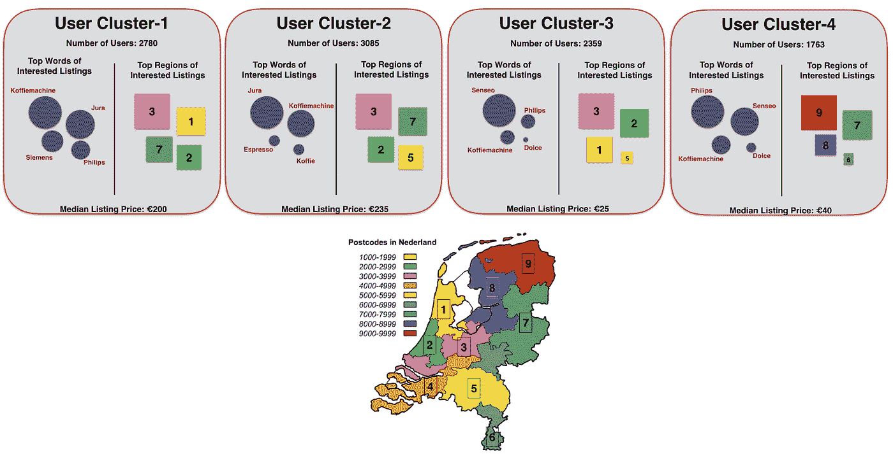

**产品六——展示区**(来源:【www.marktplaats.com】T2)

很明显，集群 1 中的用户正在寻找咖啡机，但是他们在品牌上没有任何明确的偏好。他们检查了不同品牌的咖啡机，如汝拉、西门子和飞利浦。集群 2 中的用户也在寻找咖啡机，但是他们对单一的特定品牌 Jura 感兴趣。可以说，与用户群 1 相比，群 2 中的用户是品牌特定的。

现在，让我们比较用户群 3 和前两个群的区域分布。如您所见，第 3 类用户的绝大多数感兴趣的列表发布在区域 1、2 和 3 中。实际上，这是荷兰一个特别著名的阿姆斯特丹地区，而你看不到前两个集群的任何区域模式。这里我们可以得出一个结论，物品的位置是集群 3 的用户的事情。

最后，让我们比较用户群 3 和用户群 4 的地区分布和中值价格。与聚类 3 的情况一样，我们也可以看到聚类 4 的区域模式。这些用户喜欢从荷兰北部(格罗宁根地区)发布的房源。更有趣的是，尽管这两个用户群都喜欢同一种特定的产品类型，即飞利浦 Senseo 咖啡机，但中间价格却有所不同。如您所见，与另一个集群相比，第四个集群中的用户对更昂贵的列表表现出兴趣。我们相信，在最终的结果集中，有一个隐藏的潜力，让营销人员从中提取一些有用的关于用户的信息。

# 结论—总体情况

如果你设法看到了这篇文章，可能你已经意识到所有的产品都以某种方式相互联系着。正如你从下面的大图中看到的，这个项目最令人惊讶的方面是，所有的产品都来自同一个来源: ***广告嵌入*** 。除此之外，一个产品 的 ***输出作为另一个产品*** 的 ***输入。因此，它可以被视为多个数据产品的开发链。***

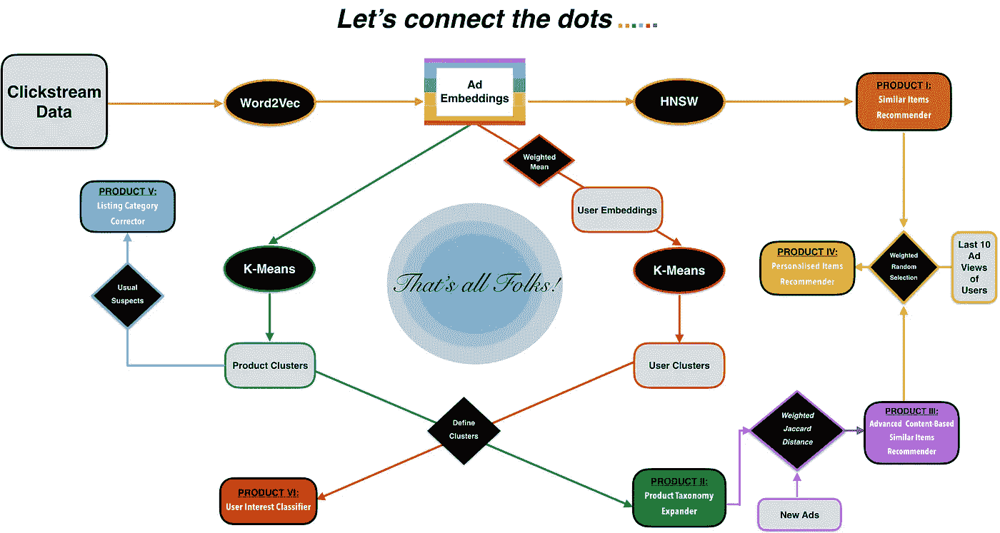

**大图！**(图片作者提供)

为了对您的业务有一个如此全面的了解和这 6 种不同的数据产品，您需要的只是用户产品视图和这些产品标题的基本点击流数据。仅此而已！将这一大图景整合到您的业务中就这么简单。请记住，所有产品的性能都强烈依赖于初始产品嵌入的质量。因此，如果您可以通过使用另一种方法或者在我们的方法之上添加一些额外的逻辑层来改进您的产品嵌入，那么您的所有产品将会逐渐给出更好的结果。

干得好！你坚持到了最后。这成了我写过最长的一篇文章。希望你喜欢读它，尽管它很长。我们欢迎您对文章和项目的反馈或评论。此外，如果你觉得这项工作很有趣，并想让其他人知道它，请随时在你的个人资料中分享它。

作者签名