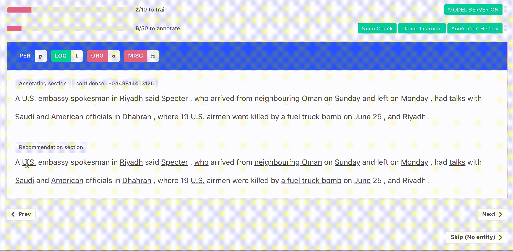

# 主动学习框架综述

> 原文：<https://towardsdatascience.com/a-summary-of-active-learning-frameworks-3165159baae9?source=collection_archive---------20----------------------->

## 比较不同的主动学习工具实现框架，选择最适合自己需求的框架


[萨彦纳特](https://unsplash.com/@sayannath?utm_source=unsplash&utm_medium=referral&utm_content=creditCopyText)在 [Unsplash](https://unsplash.com/?utm_source=unsplash&utm_medium=referral&utm_content=creditCopyText) 上的照片

# TL；速度三角形定位法(dead reckoning)

如果您正在处理分类任务，我推荐 modAL。至于序列标记任务，羊驼是你唯一的选择。


*AL freamworks 对比(图片由作者提供)*

# 主动学习工具

主动学习可以减少标签数量，节省标注预算。为了找到一个适合序列标记任务的主动学习工具，我对 OSS 主动学习工具做了一些调查。我想在这里分享我的结果。

## [模态](https://github.com/modAL-python/modAL)

> 它建立在 scikit-learn 之上，允许您以近乎完全的自由度快速创建主动学习工作流

modAL 的 API 设计的很好，很好用。下面是朱庇特笔记本中 MNIST 的一个互动例子。左上角显示图像，底部要求人类输入该图像的标签。输入标签后，右上角会重新训练模型，并立即显示精度。


Jupyter 交互界面(*图片作者)*

我真的很喜欢莫代尔。它有很多好的特性，格式良好的[文档](https://modal-python.readthedocs.io/en/latest/content/overview/modAL-in-a-nutshell.html)，简单友好的 API 接口。它还支持定制模型。但遗憾的是，它只支持分类任务，不支持序列标签任务。

## [ALiPy](https://github.com/NUAA-AL/ALiPy)

> ALiPy 提供了一个基于模块的主动学习框架，允许用户方便地评估、比较和分析主动学习方法的性能

ALiPy 拥有简单的使用界面，支持比其他工具更多的主动学习算法。我在运行下面的例子时遇到了一个错误。原因是 Python 3.8 中删除了 time.clock()。我们在使用 ALiPy 时不得不注意 python 版本。

```
from sklearn.datasets import load_iris
from alipy.experiment.al_experiment import AlExperiment

X, y = load_iris(return_X_y=True)
al = AlExperiment(X, y, stopping_criteria='num_of_queries', stopping_value=50,)
al.split_AL()
al.set_query_strategy(strategy="QueryInstanceUncertainty", measure='least_confident')
al.set_performance_metric('accuracy_score')
al.start_query(multi_thread=True)
al.plot_learning_curve()----
AttributeError: module 'time' has no attribute 'clock'
```

一些例子和格式不良的文档提高了尝试这个工具的水平。我希望开发者能对文档做一些改进。

## libact

> 一个 Python 包，旨在使现实世界的用户更容易进行主动学习。

libact 类似于 modAL。它们都基于 scikit-learn 并具有相似的界面。

```
# interface of libactqs = UncertaintySampling(trn_ds, method='lc') # query strategy instance
ask_id = qs.make_query() # let the specified query strategy suggest a data to query
X, y = zip(*trn_ds.data)
lb = lbr.label(X[ask_id]) # query the label of unlabeled data from labeler instance
trn_ds.update(ask_id, lb) # update the dataset with newly queried data
```

该文档格式良好，并提供了一些示例供您尝试。但是由于依赖错误，我不能安装 libact，即使我创建了 Python 3.6 环境。

```
ERROR: Could not find a version that satisfies the requirement libact ERROR: No matching distribution found for libact
```

## [羊驼](https://github.com/INK-USC/AlpacaTag)

> 用于序列标记的基于主动学习的群体注释框架，例如命名实体识别(NER)。

AlpacaTag 是我发现的唯一支持序列标记任务的工具。通过使用 [doccano](https://github.com/doccano/doccano) 具有友好的交互界面。设置有点复杂。

下面是我在本地的实现。但是与预期的实现不同，本地版本不能激活在线学习功能。这可能是我的错误，但是其他的在文件上没有解释。


本地实现(*作者图片*)



预期实现(图片来自[羊驼](https://github.com/INK-USC/AlpacaTag/wiki/Annotation-Tutorial))

# 其他主动学习工具

*   [主动学习操场](https://github.com/google/active-learning):这是一个 python 模块，用于实验不同的主动学习算法。
*   [深度主动学习](https://github.com/ej0cl6/deep-active-learning):以下主动学习算法的 Python 实现
*   [PyTorch 主动学习](https://github.com/rmunro/pytorch_active_learning):常用主动学习方法库
*   [主动学习工作坊](https://github.com/Azure/active-learning-workshop) :KDD 2018 动手教程:用 R 和 Python 大规模主动学习和迁移学习。 [PDF](https://github.com/Azure/active-learning-workshop/blob/master/active_learning_workshop.pdf)

**GitHub:** [**荆棘徐**](https://github.com/BrambleXu) **LinkedIn:**[**徐亮**](https://www.linkedin.com/in/xu-liang-99356891/) **博客:** [**荆棘徐**](https://bramblexu.com/)