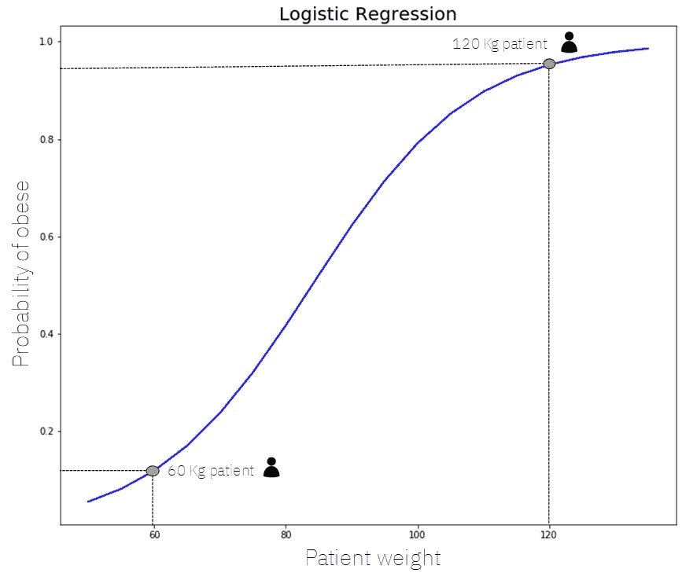
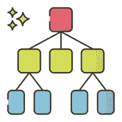
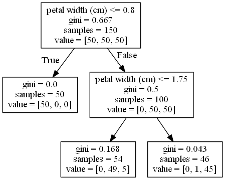
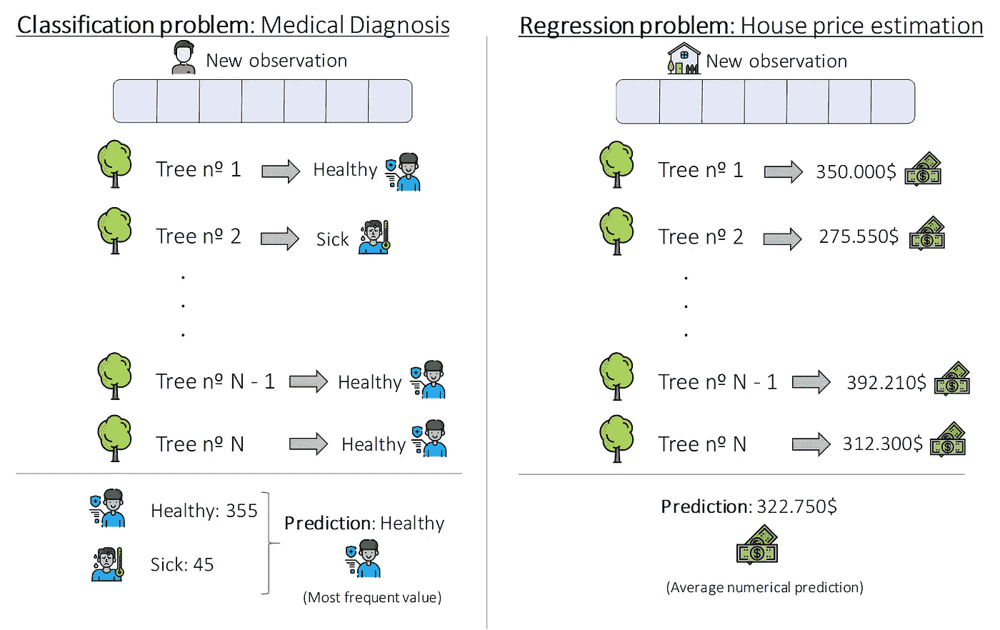
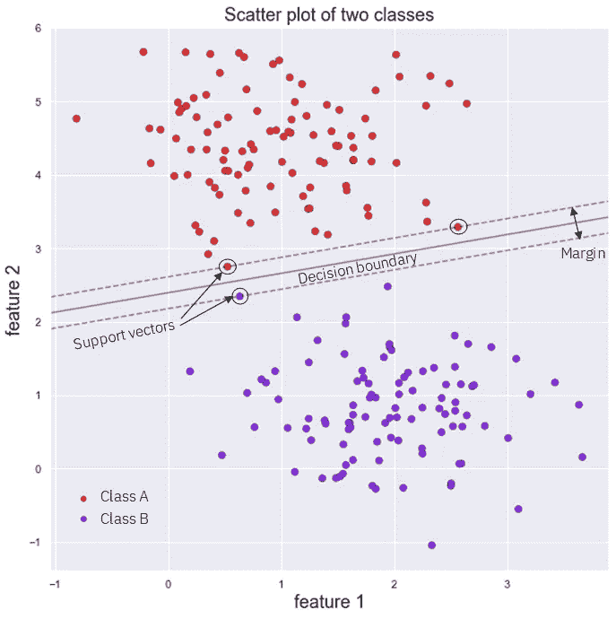

# 基本机器学习模型综述

> 原文：<https://towardsdatascience.com/a-summary-of-the-basic-machine-learning-models-e0a65627ecbe?source=collection_archive---------16----------------------->

## 从线性回归到支持向量机

图片来自 [Unsplash](https://unsplash.com/photos/gySMaocSdqs) 。

亲爱的读者你好！这篇文章的目标是概述最基本的，有时也被称为*【传统】*机器学习模型，简要描述它们每一个，并引导你到无数的资源，在那里你可以深入了解它们。

我们将从最简单的模型到最复杂的模型，概述每个模型的优势，它们可以在哪里使用以及应该在哪里使用，并查看一些示例。当你争论使用哪种 ML 模型时，你可以使用这篇文章作为你的指南。

太棒了，现在我已经让你着迷了，让我们开始吧，从最开始开始:线性回归。

# 线性回归

图片来自 Flaticon.com

**线性回归**倾向于所有老师先讲解，大多数书先开始，大多数人最后学习以此开始职业生涯的机器学习算法。

这是一个非常简单的算法，它将一个特征向量(我们数据的变量或特征)作为输入，然后**给出一个数字的连续输出**。正如它的名字和前面的解释大纲，它是一个 ***回归*算法**，也是*广义线性模型* ( *GLMs* )来源的线性算法家族的主要成员和始祖。

它可以使用封闭形式的解决方案进行训练，或者，正如机器学习领域通常所做的那样，使用迭代优化算法，如 ***梯度下降*** 。

线性回归是一种 ***参数化*** 机器学习模型(具有固定数量的参数，这些参数取决于我们数据的 n 个特征，并且训练速度非常快)，对于与我们的目标变量(我们希望稍后预测的连续数字特征)线性相关的数据非常有效，学习起来非常直观，并且易于解释。这就是我们所说的一个' [*可解释的人工智能模型*](/explainable-artificial-intelligence-14944563cc79) *'，*因为它做出的预测在知道模型权重的情况下非常容易解释。

线性回归模型的一个例子是预测房价的模型，该模型考虑了每个家庭的特征，如表面积、位置、房间数量或是否有电梯。

下图显示了线性回归如何仅使用一个特征来预测特定房屋的价格:房屋的表面积(平方米)。在我们的模型中包含更多变量的情况下，X 轴将反映这些特征的加权线性组合。

用于预测的线性回归示例。图片作者。

上图中的直线将在使用优化算法(如梯度下降)的训练过程中拟合，该算法迭代地改变直线的斜率，直到获得我们任务的最佳可能直线。

要了解更多信息，请查看以下资源:

*   StatQuest 的 Youtube 视频:'[线性回归【T1]'](https://www.youtube.com/watch?v=nk2CQITm_eo)
*   走向数据科学文章:'[线性回归解释【T3 ' '](/linear-regression-explained-d0a1068accb9)
*   机器学习掌握:'[机器学习的线性回归【T5 ' '](https://machinelearningmastery.com/linear-regression-for-machine-learning/)
*   统计学习介绍:在第三章 R 中的应用。

现在我们知道什么是线性回归，让我们学习它的离散兄弟:逻辑回归！

# 逻辑回归

图片作者。

**逻辑回归**是线性回归的兄弟，用于 ***分类*** 而不是回归问题。作为线性回归，它接受一个输入特征向量，但这次它给出的是一个类标签，而不是一个连续的数值。

逻辑回归的一个例子可以是一种算法，该算法根据某个病人的医疗记录来预测他是否患有疾病。

它使用一个 ***sigmoid* 函数**来实现这一点，因此它不仅能够给我们分类标签(生病与否)，还能给我们这个事件发生的**概率**；即患有某种疾病的概率，或者我们店的某个顾客会购买某种产品的概率。

这真的很有用，因为我们可以根据从模型中获得的输出概率选择执行不同的操作，而不仅仅是二元预测。

作为线性回归，它是一种非常**直观和可解释的算法**，因为仅通过分析模型参数或权重，我们就可以看到我们的数据的哪些[特征是最重要的](/an-introduction-to-feature-selection-dd72535ecf2b)，并且还可以看到为什么模型会预测它所预测的内容。

这使得它成为一个非常强大的分类模型，这通常是**在面临分类问题**时尝试的第一种方法，并希望快速获得结果以建立基线。

下图显示了一个逻辑回归模型的示例，该模型仅使用一个特征(*患者体重*)来计算该患者肥胖的概率:

逻辑回归示例。图片作者。

在上图中，我们可以看到具有特定形状的 *sigmoid* 曲线，用于预测 60Kg 患者肥胖的概率，我们可以看到该概率约为 10%(纵轴为 0.1)，120Kg 患者肥胖的概率约为 93%(纵轴为 0.93)。

如果有不止 1 个特征，在水平轴上我们将看到这些特征的线性加权组合，在 Y 轴上我们将再次看到概率。

有关逻辑回归的更多信息，请查看以下资源:

*   StatQuest 的 Youtube 视频:'[逻辑回归](https://www.youtube.com/watch?v=yIYKR4sgzI8&t=1s)'
*   走向数据科学文章:[“逻辑回归解释”](/logistic-regression-explained-9ee73cede081)
*   KD 金块:'[线性和逻辑回归黄金贴子](https://www.kdnuggets.com/2020/03/linear-logistic-regression-explained.html)'(令人惊叹的图解资源)
*   安德烈·布尔科夫对《百页机器学习书》第 3 章的精彩简明解释。

Oki Doki！让我们继续另一个非常简单和直观的模型:决策树！

# 决策树

图片来自 [Flaticon](https://www.flaticon.com/free-icon/decision-tree_1809086?term=decision%20tree&page=1&position=8&page=1&position=8&related_id=1809086&origin=search) 。

**决策树**是非常通用的机器学习模型，可以用于回归和分类。

它们由两种元素构成:**节点和**分支。在每个节点上，我们会评估数据的一个特征，以便在训练过程中拆分观察值，或者在进行预测时使特定的数据点遵循特定的路径。

简而言之，决策树就是:评估不同变量的路径，这些路径通向一个离开节点，在这里**相似的观察结果被分组。**

在训练过程中，通过分析可能的特征及其值来构建树，并决定哪些特征最好地分割我们的数据，以便不同的数据点位于分割的一侧，同时最小化某种错误。

在下图中，你可以直观地看到什么是决策树。

使用 Iris 数据集构建决策树。图片作者。

正如你所看到的，它们是非常简单的模型，这通常意味着它们**不会像例如神经网络那样产生如此强大的结果**，并且它们也倾向于过度拟合(非常好地学习训练集，并且很难归纳到新的数据点)，这限制了它们在行业中的使用。

然而，尽管有这些缺点，它们可能是**最直观和最容易理解的机器学习模型**，通过检查我们的数据点遵循的路径，我们可以很容易地知道为什么一棵树做出了某种预测。

对于分类问题，进行预测时所选择的类是新观察值沿着其路径穿过树后落入的离开节点的训练数据点的最频繁的类。对于回归，它是这些点的目标值的平均值。

*   StatQuest 视频:“[决策树解释](https://www.youtube.com/watch?v=7VeUPuFGJHk&t=6s)”
*   迈向数据科学文章:'[决策树解释](/decision-trees-explained-3ec41632ceb6)
*   Towardsai post: ' [决策树用实例说明](https://towardsai.net/p/programming/decision-trees-explained-with-a-practical-example-fe47872d3b53)
*   塞巴斯蒂安·拉斯卡在他的书' [Python 机器学习](https://howtolearnmachinelearning.com/books/machine-learning-books/python-machine-learning/)'第 3 章中解释道。

酷！让我们看看如何堆叠大量的决策树来创建一个随机森林！

# 随机森林

图片来自[Flaticon.com](https://www.flaticon.com/)

**随机森林**模型是一种 ***非*** ***参数化*模型**，可用于回归和分类。它们是最流行的集成方法之一，属于 *Bagging* 方法的特定类别。

e*n 集合方法*包括使用**多个学习者**来单独提高其中任何一个人的表现。这些方法可以被描述为使用一组**弱学习者** ( *那些平均成绩仅比随机模型*稍好的人)在一起的技术，以便**创建一个更强的、聚合的**。

在我们的例子中，随机森林是许多个体决策树的**集合，这是我们之前看到的机器学习模型家族。**

随机森林**将随机性和数字引入方程**，修复了单个决策树的许多问题，如过度拟合和预测能力差。

在随机森林中，每棵树都是使用训练数据的子集构建的，并且通常只使用可能特征的子集。随着越来越多的树被建立，我们的数据被更广泛地使用，更多的功能开始发挥作用，从而形成非常强大的聚合模型。

单独的树是独立构建的，使用与普通决策树相同的过程，但是仅使用数据的随机部分，并且仅考虑每个节点的特征的随机子集。除此之外，训练过程与单个决策树完全相同，重复 N 次。

要使用随机森林进行预测，需要从每棵树中获得一个单独的预测。然后，如果是分类问题，我们将最频繁的预测作为结果，如果是回归问题，我们将所有单棵树的平均预测作为输出值。下图说明了这是如何实现的:

使用随机森林模型的预测。图片作者。

有关随机森林的更多信息，请查看:

*   StatQuest 在[随机森林](https://www.youtube.com/watch?v=J4Wdy0Wc_xQ&t=1s)上的视频。
*   走向数据科学岗:[随机森林讲解](/random-forest-explained-7eae084f3ebe)。
*   内置:[随机森林完整指南](https://builtin.com/data-science/random-forest-algorithm)。

随机森林和 [Boosting 方法](/what-is-boosting-in-machine-learning-2244aa196682)可能是工业中最常用的传统机器学习模型，因为它们易于使用、强大且灵活。

让我们看看这些*【助推法】*是什么！

# **升压方式**

图片来自 [Flaticon](https://www.flaticon.com/free-icon/startup_1067357?term=rocket&page=1&position=9&page=1&position=9&related_id=1067357&origin=search) 。

**助推方法**类似于我们刚刚看到的' *Bagging'* 随机森林，但有一个关键区别:在随机森林中，所有的树都可以并行建造，它们非常独立。在 boosting 方法中，每个树都是按顺序构建的，从前面的树中获取信息:树 4 依赖于树 3，树 3 依赖于树 2，依此类推。

Boosting 最初被命名为 ***假设 Boosting*** ，其思想是对用于训练我们的弱学习者团队的数据进行过滤或加权，以便每个新学习者给予更多的权重，或者只使用先前学习者分类不佳的观察值进行训练。

通过这样做**，我们的模型团队**学会了对各种数据做出准确的预测，而不仅仅是对最常见或最简单的观察。此外，如果其中一个单独的模型非常不擅长根据某种观察结果做出预测，这也没关系，因为其他 N-1 个模型很可能会弥补这一点。

Boosting 方法非常强大，当面对机器学习/数据科学行业中的普通表格数据时，LightGBM、AdaBoost 或 XGBoost 等模型以及之前讨论的随机森林可能是最常用的方法。

有关增强的更多信息，请查看以下资源:

*   [什么是机器学习中的 Boosting？](/what-is-boosting-in-machine-learning-2244aa196682)@走向数据科学
*   由我们可爱的乌达城助推。
*   在 QuantDare 博客上解释了。

让我们以最后一个令人敬畏的模型结束:支持向量机！

# 支持向量机

图片来自 [Flaticon](https://www.flaticon.com/free-icon/road_2554881?term=road&page=1&position=12&page=1&position=12&related_id=2554881&origin=search) 。

**支持向量机**或 SVMs 是一个广泛使用的机器学习模型家族，**可以解决许多 ML 问题**，如线性或非线性分类、回归，甚至异常值检测。

话虽如此，**的最佳应用**是在将**应用于小型**或中型**复杂数据集**的分类时。

对于分类，支持向量机通过在我们的数据之间创建一个决策边界来工作，该边界试图尽可能地将数据分开，如下图所示:

线性 SVC 的判决边界。作者图。

有时，使用线性决策边界来完全分离我们的数据是不可能的，有时也是不可能的，所以支持向量机使用一种称为 ***内核技巧*** 的聪明技巧来尝试分离我们的数据，尽管它们有时必须让错误类的一些点位于决策边界的一侧，而它们不应该在那里。

通过调整多少点，以及我们使用哪种内核，支持向量机可以非常强大，特别是当我们的数据有很多特征时。然而，它们需要相当长的时间来训练，所以它们应该只用于小型或中型数据集。

想了解更多关于 SVMS 的信息，请访问:

*   [支持向量机讲解](/support-vector-machines-explained-25a685e4d228)走向数据科学。
*   我们的朋友 Josh Starmer 的 SVMs 视频。
*   MonkeyLearn 上的[支持向量机简介](https://monkeylearn.com/blog/introduction-to-support-vector-machines-svm/)。

# 结束语和其他资源。

就是这样！一如既往，我希望你**喜欢这篇文章**，我设法帮助你了解了一些基本的机器学习模型，并给你提供了深入研究它们的资源。

我们排除了人工神经网络，并包括了助推模型(有些人排除在这个列表之外)。概率方法也没有包括在内，但是你可以在我的其他关于数据科学的文章中学到很多。最后，无监督的模型没有包括在内。

为了使本文更加完整，我将在下面的列表中为您提供资源，以帮助您决定在每种情况下使用哪种机器学习算法:

*   [sci kit-Learn 的机器学习模型备忘单](https://peekaboo-vision.blogspot.com/2013/01/machine-learning-cheat-sheet-for-scikit.html)。
*   [机器学习算法是你的朋友。](https://blog.dataiku.com/machine-learning-explained-algorithms-are-your-friend)
*   [SaS 机器学习算法小抄](https://blogs.sas.com/content/subconsciousmusings/2020/12/09/machine-learning-algorithm-use/)。

*此外，你可以查看* [***这个资源库***](https://howtolearnmachinelearning.com/) *获取更多关于机器学习和人工智能的资源！*

*   封面图片来自[***Unsplash***](https://unsplash.com/)。
*   来自 Flaticon.com 的图标
*   所有其他图像都是自己制作的。