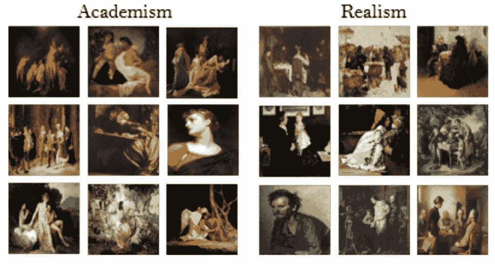
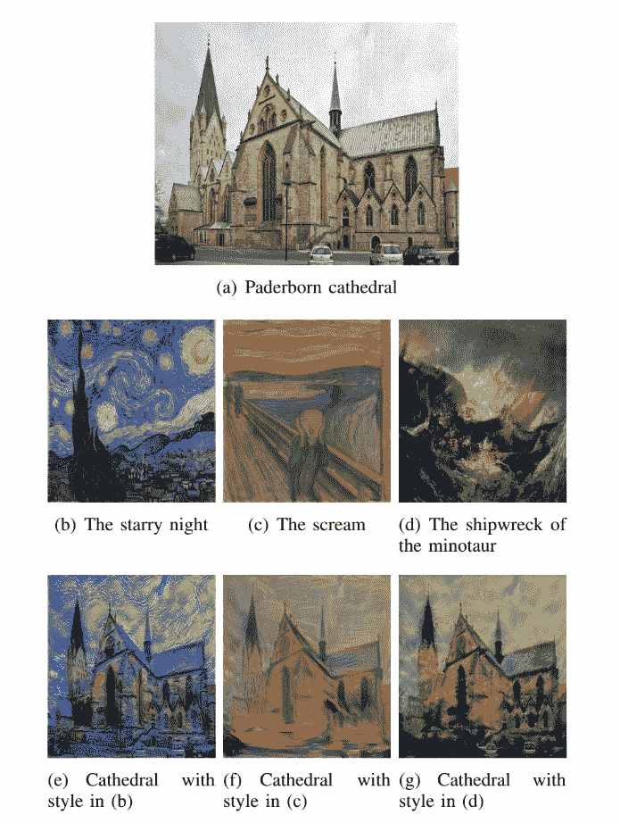
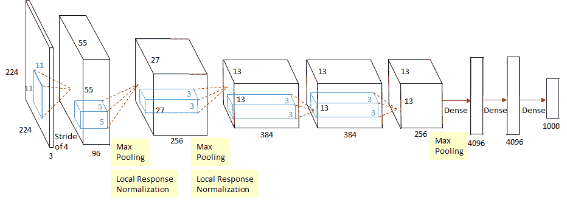
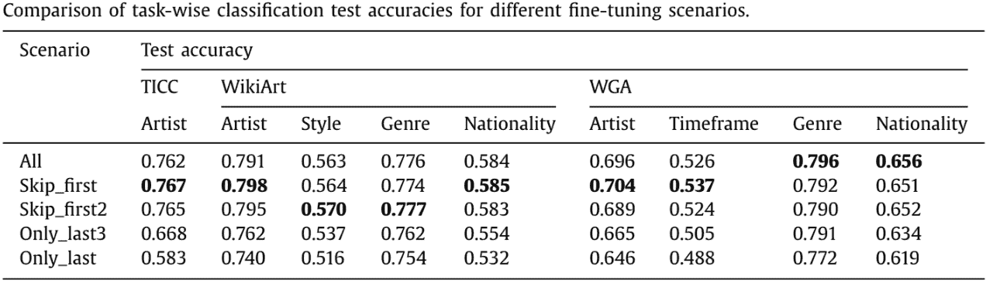
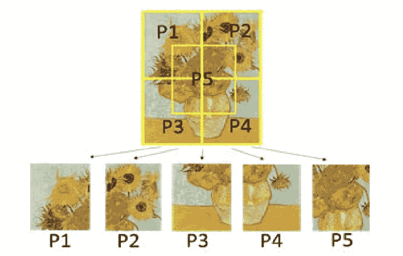
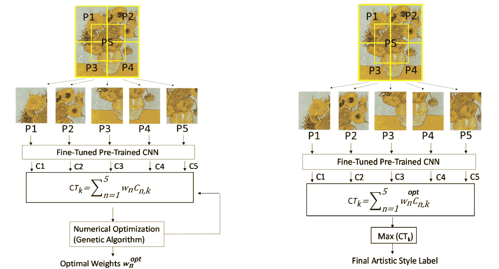
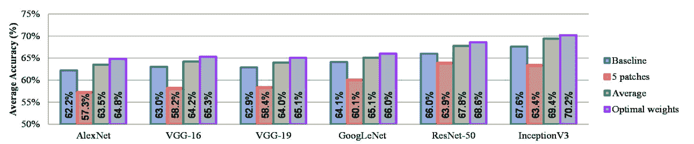
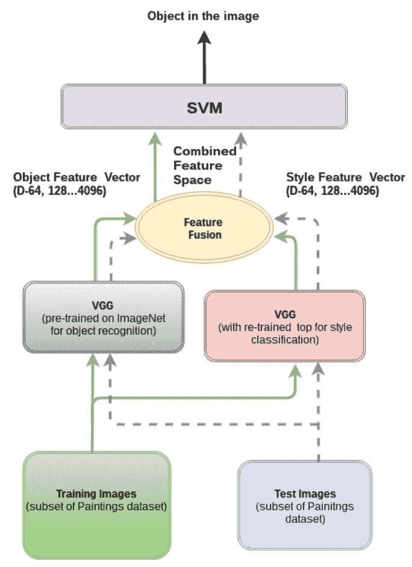

# 计算机视觉在美术分类中的应用综述

> 原文：<https://towardsdatascience.com/a-survey-of-computer-vision-in-fine-art-classification-9c7e60ad3fc2?source=collection_archive---------22----------------------->

图片来自 [Cetinic 等人(2018)](https://www.vcl.fer.hr/papers_pdf/Fine-tuning%20Convolutional%20Neural%20Networks%20for%20fine%20art%20classification.pdf)

# 概观

随着在线画廊和在线美术市场的出现，数字化美术绘画收藏变得越来越有需求。Google Arts & Culture 是一个教育和娱乐在线平台的优秀例子，它让人们更容易接触到在线艺术——让人们甚至可以通过其 VR 技术沉浸在虚拟艺术画廊中。另一个例子是 Artsy，这是一家在线艺术品经纪公司。它利用一个搜索系统来链接基于彼此关系的艺术作品。此外，许多其他应用需要美术分类技术。因此，提高数字化艺术的搜索算法的能力以及记录和管理这种文化遗产的过程仍然是必要和有意义的。然而，要解决这个问题，至少还有一些挑战需要解决。

# 问题

一个重大的挑战是缺乏大数据集的标记数字化艺术品。如果没有大量的数据，即使公认的分类模型也不会产生好的分类结果。分类模型的设计和模型训练的实现也同样重要。因此，在以下几节中，我将首先回顾一种数据增强方法，该方法试图克服 Smirnov & Eguizabal (2018)提出的标记精细艺术数据的缺乏。以及他们在一些著名的 CNN(卷积神经网络)上改进迁移学习的方法。接下来，将讨论 Rodriguez 等人(2018)提出的一种使用图像补丁和迁移学习对美术图像进行分类的新方法。最后，我将前述作品与 Cetinic 等人(2018)提出的设计进行比较。他们发现，场景识别和情感预测可以为这项工作产生更好的结果，而不是专注于分类任务的对象检测。

# 资料组

上述三篇论文中使用的数据集是:

*   帕斯卡 VOC
*   绘画数据集
*   TICC 版画数据集
*   网络美术馆(WGA)
*   维基亚特

*PASCAL VOC* 包括 20 类由摄像机拍摄的带注释的图像，无需进一步的风格转换即可用于对象识别和分割任务。*绘画数据集*包含 10 类美术绘画，标签来自 *PASCAL VOC* 。 *TICC 版画数据集*是一个在纸质版画上复制数字化摄影作品的数据集。WGA 包括从 3 世纪早期到 19 世纪的美术绘画。除了 WGA， *WikiArt* 是最大的在线数字化绘画收藏之一，包括 19 至 20 世纪 3000 名艺术家的超过 25 万件艺术品。

# 算法和方法

## 数据扩充

与一些最知名的数据集相比，如 ImageNet (14 M+图像，20000 个类别)和腾讯 ML 图像(约 18M 图像，11166 个类别)，美术绘画的数据要少得多。幸运的是，一组研究人员已经找到了解决这个问题的方法。

Smirnov & Eguizabal (2018)提出对从 *PASCAL VOC* 获得的真实世界图像应用风格转移。这个概念结合了(或者用一个更专业的术语来说，多重)PASCAL VOC 的自然图像和特定艺术风格的图像，比如印象主义或现实主义。因此，它允许生成具有相同内容(对象)但具有不同艺术风格或纹理的各种新图像。下图显示了该流程的一个示例。

*图一。风格转移过程的一个例子。图像(e)、(f)和(g)分别应用了样式(b)、(c)和(d)。所有结果图像呈现图像(a)的相同内容，但是具有独特的艺术风格。图片来自* [斯米尔诺夫&equizabal(2018)](https://www.researchgate.net/profile/Stanislav-Smirnov-2/publication/330753678_Deep_learning_for_object_detection_in_fine-art_paintings/links/5db6a18292851c577eced626/Deep-learning-for-object-detection-in-fine-art-paintings.pdf)

## 卷积神经网络的迁移学习

为了从一些预先训练的细胞神经网络中获得有价值的特征并节省计算成本，这三篇论文都在不同的细胞神经网络模型上采用了迁移学习方法来对美术绘画进行分类。

## 1.卡芬内及其变体

Cetinic 等人(2018)使用了 CaffeNet 的基础架构，这是对 AlexNet 的轻微修改。它是一个只有八层的浅网络。五个三卷积层，后面是三个全连接层。此外，在第一、第二和第五卷积层之后还有三个最大池层。他们选择 ReLU 作为所有层的激活函数，输出层连接到 softmax 层。下图描绘了卡芬内的建筑。

*图二。卡芬内的建筑。图片来自*[https://medium . com/coin monks/paper-review-of-Alex net-caffenet-winner-in-ils vrc-2012-image-class ification-b 93598314160](https://medium.com/coinmonks/paper-review-of-alexnet-caffenet-winner-in-ilsvrc-2012-image-classification-b93598314160)

由于迁移学习的目的是利用预训练的权重，作者保留了前七层的权重，但保留了预训练的 CaffeNet 的最后一层。相反，他们用与数据集中目标类数量相对应的特定数量的神经元替换了最后一个完全连接的层。他们还试图测试冻结层的不同组合(意味着设置和权重保持与预训练模型相同)，以评估它们是否会影响分类任务的最终性能。他们认为，最初的几层 CNN 是为了发现像明显的斑点或边缘这样的一般特征。相比之下，其余的层将深入到每个图像，提取更多的细节特征。有趣的是，根据下表，他们发现最佳性能是通过仅冻结第一个或前两个卷积层的权重并重新训练所有其他层来实现的。

*图三。不同微调场景下的测试精度比较。图来自* [Cetinic 等人(2018)](https://www.vcl.fer.hr/papers_pdf/Fine-tuning%20Convolutional%20Neural%20Networks%20for%20fine%20art%20classification.pdf)

除了专注于对象识别，该研究还发现，使用预训练的 CNN 的场景和对象识别的组合产生了比仅仅对象识别更好的结果。此外，数据集混合了地点和 ImageNet 图像。该实验可以表明美术分类任务可能需要场景特征来帮助提高分类准确度。

## 2.图像补丁或分割

Rodriguez 等人(2018 年)建议，数据集中的每张图像都应被等分成五份，作为 CNN 模型的输入。然后，结合来自前一步骤的加权分类结果，可以预期比未分割图像的分类结果更高的分类精度。

三个主要步骤如下:首先，将来自训练集的每个图像的大小调整为当前大小的两倍。然后，每个图像被分割成大小相等的五块，其中四块是与原始图像具有相同高度和宽度的角块，第五块是中心块，正好占每个角块的 25%。

*图 4。将原始图像分割成五个大小相等的片段的示例。图片来自* [Rodriguez 等人(2018)](https://ieeexplore.ieee.org/abstract/document/8631731)

第二，新的图像集(补丁图像)然后被馈送到一些预先训练的 CNN 模型，以对每个图像分割的风格进行分类。本实验中使用的预训练 CNN 模型有 AlexNet、VGG-16、VGG-19、GoogLeNet、ResNet-50 和 InceptionV3。值得注意的是，它们只替换了这些神经网络的最后三层，以适应类别的目标数量。这里，重点不是每个 CNN 的性能，而是观察是否有任何趋势或指示加权图像补片可以带来更高的分类精度。

最后，对每个原始图像执行优化过程，以根据前一步骤的分类结果发现每个分割图像的类别概率的最优权重。由于每个图像碎片被独立分类，这意味着来自同一原始图像的所有图像碎片不会影响分类过程，因此来自同一原始图像的不同图像碎片被分类到不同的目标类别(艺术风格)是可能的。因此，他们应用了一个优化过程，即遗传算法，来迭代地搜索最优组合加权结果，以最终决定每个原始图像的决策类。算法及其过程如下图所示。

*图五。每个图像块的权重优化过程。图片来自* [罗德里格斯等人(2018)](https://ieeexplore.ieee.org/abstract/document/8631731)

这里，Cn，k 是来自 CNN 的每个图像块的结果，wn 表示 Cn，k 的相应权重，CTk 是第 k 个原始图像的总结果向量。现在，找到了每个图像块结果的最佳权重，最后一步是通过最佳权重和每个图像块的概率向量的点积运算来找到最大总概率向量 CTk。此外，每个图像补片权重被设置为小于或等于 1 (100%)有一个约束，以保证没有单独的图像补片权重比其他图像补片权重超过 100%。最终结果如下图所示。

*图六。不同模型和场景组合的风格分类结果。图片来自* [罗德里格斯等人(2018)](https://ieeexplore.ieee.org/abstract/document/8631731)

从条形图中，我们可以观察到，与仅使用原始图像作为输入数据相比，使用加权图像块在风格分类任务中产生更高的准确度。当图像被分割时，它似乎无助于解决这个问题。然而，考虑那些具有最佳权重的单个片段显示了图像补片如何通过贡献更高的分辨率来提高分类准确度。因此，该研究得出结论，分辨率较高的图像可以为美术风格分类任务添加有价值的信息，如艺术风格。

## 3.CNN 与 SVM 的融合

美术分类任务的一个常见问题是缺乏数据。没有足够的数据，任何分类或目标检测任务都将是困难的。为了解决这个问题，Smirnov & Eguizabal (2018)提出了上面提到的数据增强方法和他们的训练方法——两个 CNN 和一个 SVM。概念是首先训练两个 CNN，然后连接来自 CNN 的结果向量，并将它们馈送到 SVM，用于最终的对象检测。下图说明了流程图。这里，一个 CNN 用于物体检测，另一个用于风格分类。PASCAL VOC 数据集被训练用于对象检测任务，而 WikiArt 图像数据集被训练用于风格分类。他们用 VGG-19 作为两个 CNN 的模型。两个 CNN 的权重保持与原始预训练的 VGG-19 相同，除了最后一个完全连接的层，为来自两个 CNN 的输出特征向量的后续连接而定制。测试结果表明，它比传统的目标检测和分类方法提高了 5%。这项研究证明了通过将艺术风格应用于日常图像来增加艺术图像数据集的功效，以及用 SVM 融合两个训练不同主题(对象和风格)的 CNN 的可行性。

*图 7。SVM 的两个 CNN 的流程图。图片来自* [斯米尔诺夫&埃奎扎巴尔(2018)](https://www.researchgate.net/profile/Stanislav-Smirnov-2/publication/330753678_Deep_learning_for_object_detection_in_fine-art_paintings/links/5db6a18292851c577eced626/Deep-learning-for-object-detection-in-fine-art-paintings.pdf)

# 未来研究趋势

有几种方法可以改进目前对美术图像进行分类或检测的方法。在 Cetinic 等人(2018 年)的研究中，他们建议，除了从事美术图像分类任务，研究人员还可以发现数字化艺术品之间图像特征的内在联系。在未来的研究中，也可以考虑摄影和图像中的情感、质量和美学等目标。此外，研究人员与美术历史学家和相关领域的专家合作，以更好地了解美术领域，这总是一个好主意。

其他研究建议调查其他神经网络或 CNN，以评估它们的计算成本和分类性能，并找到这项任务的最佳平衡。例如，尽管 InceptionV3 模型在分类图像方面具有更高的准确性，但与 AlexNet 和其他简单的 CNN 相比，它需要更长的时间来训练相同的数据集。因此，这是一个值得研究的优化课题。

# 创造力

在美术分类中发现的一个普遍问题是印象主义和表现主义艺术品之间的高错误分类率。是因为后者是由前者进化而来的。然而，我想出了一个主意——两阶段分类法，来解决这个问题。最初，对数据集中的所有图像进行粗略分类。然后，执行专门为区分印象主义和表现主义数字化图像而设计的更精细的分类。在建立第二个分类器之前，我们需要知道这两种艺术风格的一些共同特征。印象主义侧重于光线的变化，表现主义主要关注人脸上的表情。有了这些先验信息，我们可以构建一个提取图像和面部表情像素值的分类器。如果输入图像显示强烈的面部表情，我们可以假设它属于表现主义艺术作品。另一方面，如果一幅图像被检测到有大量的像素值偏移而没有人脸特征，我们可以说它是一件印象派作品。

# 结论

美术分类中的计算机视觉是一个有趣的话题，可以给现实世界带来巨大的价值。随着近年来数字化艺术品越来越流行，以及在线艺术品拍卖市场的蓬勃发展，艺术品分类开始在这些趋势中发挥至关重要的作用。有了这项技术，各方将更容易识别从古代历史到现代世界的不同艺术品。节省了对每件艺术品进行确认、分类甚至鉴定的人力成本。然而，需要进一步的研究来利用计算机视觉的力量，让人类从这项技术中受益。

# 参考

塞蒂尼奇公司、立皮奇公司和格吉奇公司(2018 年)。用于美术分类的微调卷积神经网络。*专家系统与应用*， *114* ，107–118。

罗德里格斯，C. S .，莱赫，m .，&皮罗戈瓦，E. (2018，12 月)。使用迁移学习和加权图像补片对美术绘画风格进行分类。在 *2018 第十二届信号处理与通信系统国际会议(ICSPCS)* (第 1–7 页)。IEEE。

Smirnov，s .，& Eguizabal，A. (2018 年 10 月)。美术绘画中物体检测的深度学习。在 *2018 考古与文化遗产计量学(MetroArchaeo)* (第 45–49 页)。IEEE。