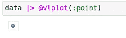
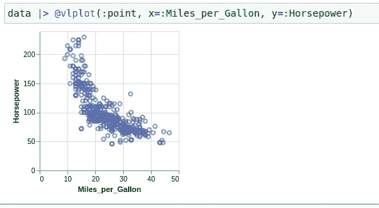
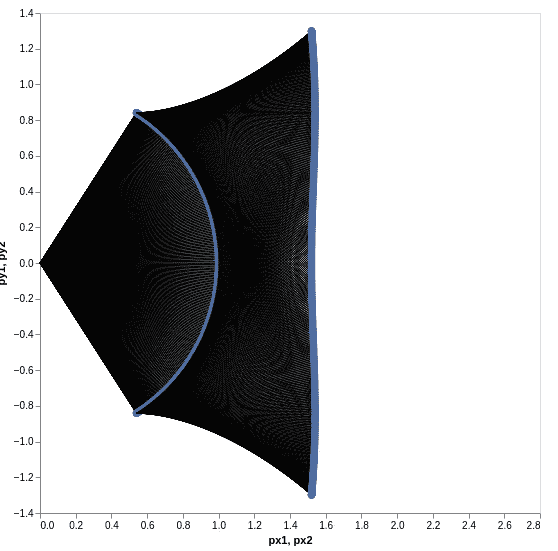

# VegaLite.jl 快速介绍 Julia 的统计图表

> 原文：<https://towardsdatascience.com/a-swift-introduction-to-vegalite-jl-statplots-for-julia-640c02263fd6?source=collection_archive---------26----------------------->

## VegaLite.jl 使用基础的快速概述；Julia 最受欢迎的统计绘图库之一

数据可视化是一项极其重要的技术，数据科学家或分析师可以通过这项技术了解更多关于数据的信息。可视化您的数据可以使相关性更容易发现，并且可以很好地了解数据的其他方面，如变化和样本数。不用说，对于科学计算来说，可视化数据非常重要。如果有一种编程语言想要将一个生态系统投射到可能想要使用该语言的数据科学家身上，那么这个生态系统很可能需要包含一些可视化库。针对这个领域的最年轻的语言之一是 Julia。

Julia 是一种很棒的编程语言，尤其是对科学而言。它有多重调度，速度快，层次很高。然而，与类似的选择相比，Julia 确实有一些不足之处，那就是它的生态系统。实际上，我在另一篇文章中多次谈到这一点，在那篇文章中，我讨论了 Julia 语言及其各自的生态系统所面临的问题。如果你对这样的阅读感兴趣，你可以在这里找到那篇文章:

</the-depressing-challenges-facing-the-julia-programming-language-in-2021-34c748968ab7>  

鉴于 Julia 确实有一个相当不成熟的生态系统，这是否意味着在 Julia 中数据可视化的选择相当有限？这个问题的第一个答案是否定的，但第二个答案是，即使受到限制——Julia 是 LLVM 编译器库和 C 编程语言的好朋友，这意味着在 Julian 包不适合应用程序的任何情况下，它通常都可以调用外部库。

虽然 Julia 相对不成熟，而且使用不同的语言可能会得到更好的可视化和更健壮的 API，但仍然有一些强大的选项是完全用 Julia 编写的。这种库的一个例子是 Vega lite . JL。Vega lite . JL 是一个针对 Julia 的调制可视化库，我认为它很可能与 Plot.ly 最相似……这真的不是一件坏事——

> 我爱 Plot.ly！

另一个值得一提的是，Julia 现在也有了一个 Plot.ly 端口，所以你也可以一直使用 Plot.ly。此外，他们甚至对朱丽亚有所图谋。如果您想了解更多关于 Julia 语言的非 Plot.ly 或 Vegalite.jl 库的信息，那么我强烈推荐这篇文章，在这篇文章中，我讨论了 Plots.jl 包以及我个人最喜欢的 Julia 库，牛虻. jl:

</julia-visualization-libraries-which-is-best-e4108d3eeaba>  

在我们深入研究这个包之前，最后一件事是，那些可能想跟随或查看源代码的人可以查看这个笔记本的内部:

<https://github.com/emmettgb/Emmetts-DS-NoteBooks>  

# 更多关于 VegaLite.jl

关于 Vegalite，我想讨论的第一件事是这个图书馆实际上有多包容。只要看一下文档的主页，我们很快就会看到 Vegalite.jl 包中包含了多少内容。这个包可以做很多事情，而且不仅仅局限于绘图。

Vegalite 最大的优势在于数据。Vegalite 处理绘图和几何数据的方式是一种更现代的软件工程方法，它使用 JSON 数据作为参数，以便使绘图更加基于数据，而不是基于会话。这种说法的问题当然是这是否会给一揽子计划带来任何好处。

关于这个方法应该说的第一件事是，它很可能比它最终可能与之竞争的大多数其他包表现得更好。这种 JSON 的做事方式至少在 CPU 处理方面非常有效，但是如果我在工作中经常使用这个包，我可能会担心我的内存。我想补充的另一点是，预编译真的很快。我讨厌很多 Julia 模块的一点是，预编译会花费令人不安的时间，Plots.jl 就是一个很好的例子。也就是说，这是一个非常酷的方法，但是这种方法也有一些奇怪的地方。

在数据可视化的世界中，对这类场景使用特定的方法是一种惯例。例如，大多数语言的代码都类似于这样:

```
plt = plot(feature, other_feature, arguments)
```

然而，在 Vegalite，事情变得有点古怪。宏@vlplot 几乎可以用于任何事情。这个宏返回一个类型，当我们开始绘图时，我们将会看到这个类型，并且这个类型也被分派来处理一些非常酷的事情。这个包的强大之处在于该类型的内部构造函数。

# 基本绘图

现在我们已经了解了 Vegalite，让我们深入了解一下，并在其中完成一些绘图！

```
import VegaLite: @vlplot
```

如前所述，这个包中确实没有太多我们需要导入的内容。考虑到这一点，我将通过直接导入宏来保持环境整洁。现在让我们看一个基本的散点图示例。我们需要为此提供的数据将是数组类型。我们为关键字参数提供了各自的数组。Vegalite 也有一组数据集，可以用来下载一些数据，所以我会这样做，然后将数据分配给一个新的数组，然后准备好放入我们的宏调用中。

```
using VegaDatasetsdata = dataset("cars")
```

然后，我们可以使用右边的按位运算符将这些数据“注入”到宏中，并创建一个新的绘图:

```
data |> @vlplot(:point)
```



作者图片

恭喜你，你刚刚完成了你的第一个素食主义者计划！我不确定我们是否应该称之为阴谋，它更像是一个要点。VegaLite 实际上正在绘制我们提供给宏的所有数据，唯一的问题是它没有最大值或最小值。允许详细说明，每当图形数学完成时，我们需要在屏幕上找到一个完美的像素来放置给定的形状。问题是分辨率和屏幕尺寸总是不一样。也就是说，如果我在 1080p 的屏幕上放一张 30px 高的自己的照片，或者放在那个尺寸的图片中，如果我们换成 240p，它就不会在同一个地方了。

为了减轻这种情况，通过将该值除以分辨率来计算分数，以获得像素占整体的百分比。之后，从图像尺寸中减去该百分比与分辨率或图像尺寸的乘积，这就是像素的最终位置。我怎么知道这么多？我实际上做了我自己的奇怪的小图形库，不久前在 Medium 上写了关于它的文章，你可以查看我在软件包上发布的最后更新，我可能很快会继续工作！

</metaprogramming-grids-and-labels-for-hone-jl-f434c8dc24ad>  

为了让我们的 VegaLite 图实际工作，我们需要在宏调用中添加两个新的关键字参数。这些只是我们的 x 和 y 值。

```
data |> [@vlplot](http://twitter.com/vlplot)(:point, x=:Miles_per_Gallon, y=:Horsepower)
```



作者图片

# 调整我们的情节

在这个神奇的 VegaLite.jl 包的快速介绍中，我想做的最后一件事就是回顾一下人们可以对其情节进行的一些基本更改。我不想太详细地介绍 Vegalite 中的所有内容，因为内容实在太多了，至少对于一篇文章来说是这样的，也许我会在以后继续讨论这个包。

首先，散点图是一个很好的东西，也是一个很棒的工具，但是它们并不是在每种情况下都有用，所以让我们改变我们正在使用的图的类型。第一个参数，也是唯一的位置参数，符号点是我们想要替换的。例如，酒吧:

```
data |> [@vlplot](http://twitter.com/vlplot)(:bar, x=:Miles_per_Gallon, y=:Horsepower)
```

我们可以在这里提供各种关键字，但仅举几个例子:

*   因素
*   宽度
*   不透明
*   改变

他们有很多，所以我们将只关注基本的，有一点闪光。现在让我们制作一些新的数据:

```
arm_motion_data = [(; ϕ1 = cos(t), ϕ2 = sin(t), t) for t in 0:0.01:2pi]
```

现在让我们创建一些参数。现在让我们创建一个基本的情节，我将使用表情来创建形状，这对于动画之类的东西来说是理想的，但这里我将出于方便使用它。

```
arm_motion_data |>
VegaLite.[@vlplot](http://twitter.com/vlplot)(
    width = 500,
    height = 500,
    transform = [
        {calculate = "cos(datum.ϕ1)", as = "px1"},
        {calculate = "sin(datum.ϕ1)", as = "py1"},
        {calculate = "datum.px1 + cos(datum.ϕ2)", as = "px2"},
        {calculate = "datum.py1 + sin(datum.ϕ2)", as = "py2"},
    ],
)
```

最后，我将使用加法运算符+来添加一些新标记:

```
+
VegaLite.[@vlplot](http://twitter.com/vlplot)(
    mark = :rule,
    x = {datum = 0, scale = {domain = [0, 2.8]}},
    y = {datum = 0, scale = {domain = [-1.4, 1.4]}},
    x2 = "px1:q",
    y2 = "py1:q"
) +
VegaLite.[@vlplot](http://twitter.com/vlplot)(mark = :point, x = "px1:q", y = "py1:q") +
VegaLite.[@vlplot](http://twitter.com/vlplot)(mark = :rule, x = "px1:q", y = "py1:q", x2 = "px2:q", y2 = "py2:q") +
VegaLite.[@vlplot](http://twitter.com/vlplot)(mark = :point, x = "px2:q", y = "py2:q")
```

整个结果看起来像这样:

```
arm_motion_data = [(; ϕ1 = cos(t), ϕ2 = sin(t), t) for t in 0:0.01:2pi]arm_motion_data |>
VegaLite.[@vlplot](http://twitter.com/vlplot)(
    width = 500,
    height = 500,
    transform = [
        {calculate = "cos(datum.ϕ1)", as = "px1"},
        {calculate = "sin(datum.ϕ1)", as = "py1"},
        {calculate = "datum.px1 + cos(datum.ϕ2)", as = "px2"},
        {calculate = "datum.py1 + sin(datum.ϕ2)", as = "py2"},
    ],
) +
VegaLite.[@vlplot](http://twitter.com/vlplot)(
    mark = :rule,
    x = {datum = 0, scale = {domain = [0, 2.8]}},
    y = {datum = 0, scale = {domain = [-1.4, 1.4]}},
    x2 = "px1:q",
    y2 = "py1:q"
) +
VegaLite.[@vlplot](http://twitter.com/vlplot)(mark = :point, x = "px1:q", y = "py1:q") +
VegaLite.[@vlplot](http://twitter.com/vlplot)(mark = :rule, x = "px1:q", y = "py1:q", x2 = "px2:q", y2 = "py2:q") +
VegaLite.[@vlplot](http://twitter.com/vlplot)(mark = :point, x = "px2:q", y = "py2:q")
```



作者图片

# 结论

如果您使用 Julia 编程语言，或者即使您碰巧对它感兴趣，我也强烈推荐您查看 Vegalite 包。这个包有各种各样令人敬畏的特性，和一个我以前从未见过的非常酷和有趣的方法。非常感谢您的阅读，我希望这个整洁的小软件包和文章能够激发您对在 Julia 中可视化数据的兴趣！