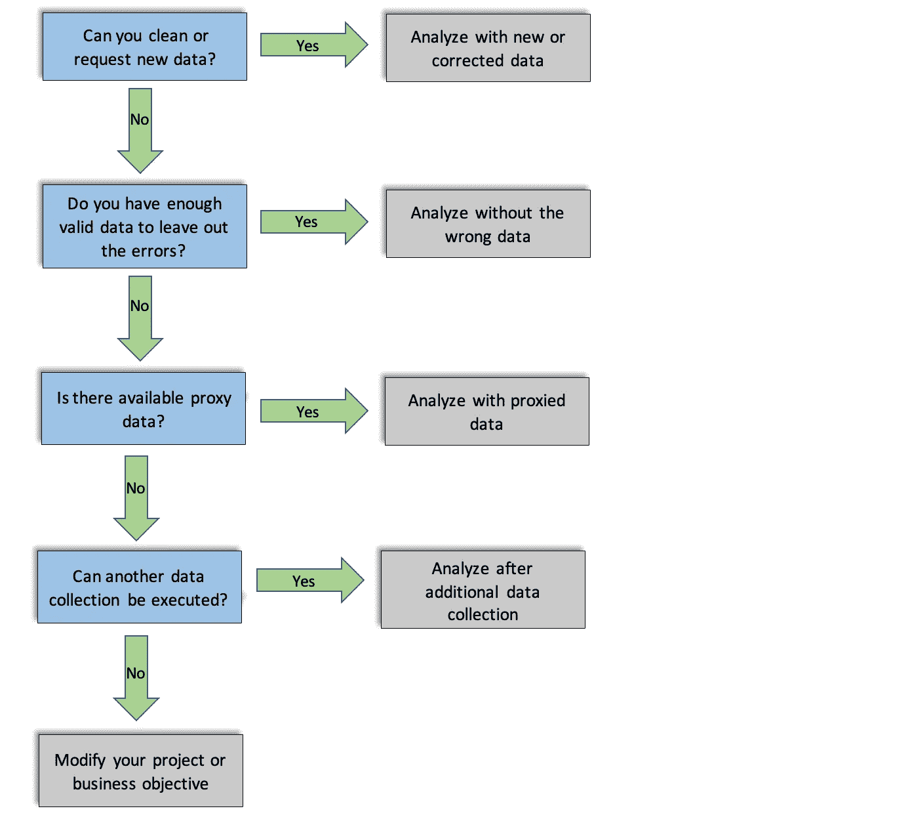
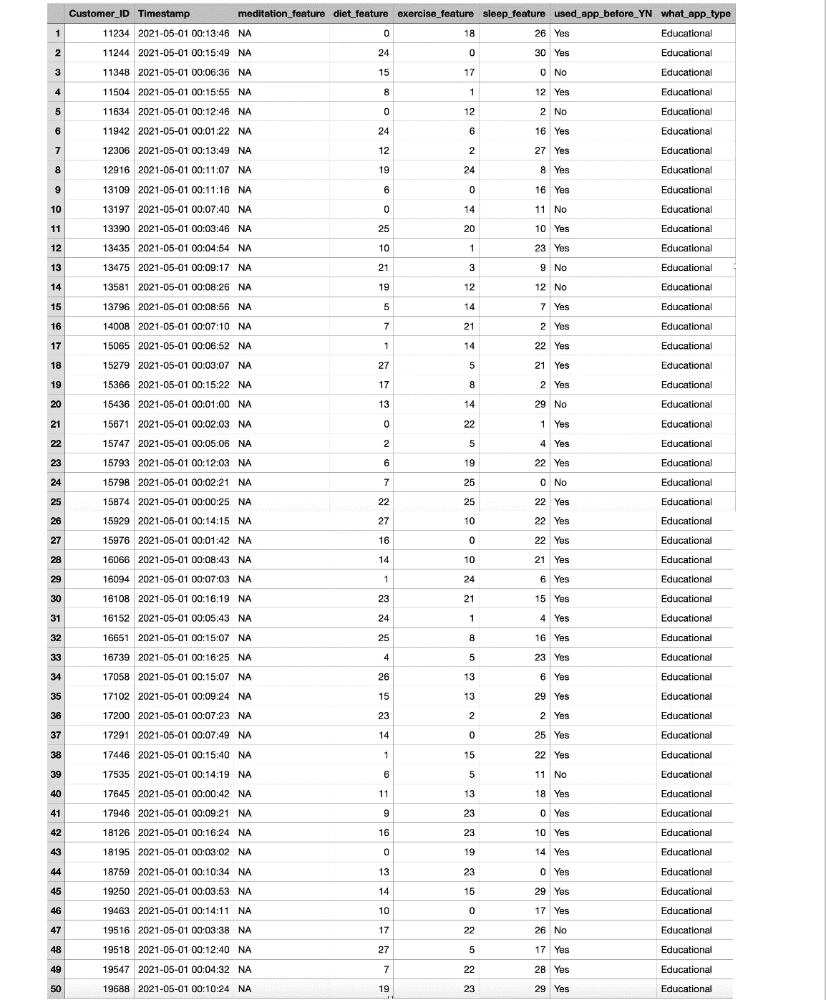
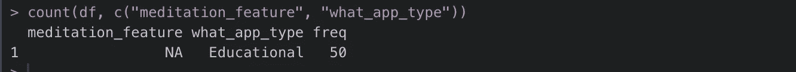
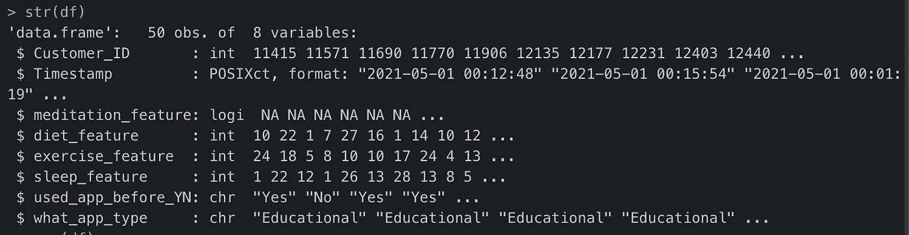
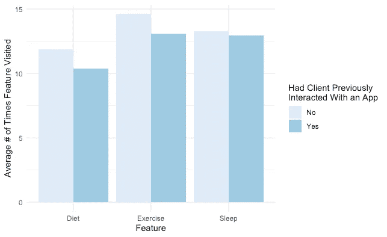

# 处理不良数据的系统方法

> 原文：<https://towardsdatascience.com/a-systematic-approach-to-bad-data-6c7e2f86e5ef?source=collection_archive---------20----------------------->

## [行业笔记](https://towardsdatascience.com/tagged/notes-from-industry)

## 因为有时候仅仅打扫是不够的

由[萨姆·穆卡达姆](https://unsplash.com/@itssammoqadam?utm_source=medium&utm_medium=referral)在 [Unsplash](https://unsplash.com?utm_source=medium&utm_medium=referral) 上拍摄的照片

任何与数据打交道的人都知道最初的预处理步骤是多么耗时(而且会让人白发苍苍)。我们都已经咬了分析位，急切地盯着项目路径到我们遥远的建模目的地。那么如果数据不完美呢？几个可疑的值或变量*真的*会对研究结果产生多大影响？

抵制掩盖原始数据的冲动。

相信我。你的雇主、股东和未来的自己都会感谢你。为什么？

简单地说，没有首先验证所提供数据的质量就一头扎进探索性分析或运行模型是一个重大疏忽。据 IBM 估计，人为错误和随之而来的低质量每年给美国造成了超过 3 万亿美元的损失。是的，你没看错。脏数据不是小事。

幸运的是，数据清理通常是数据科学和分析相关课程的早期主要内容。面对当今“大数据”时代常见的膨胀、复杂的数据集，新手可以在掌握经典数据清理技术中找到解脱。**清洗无疑是确保高质量数据的重要步骤。**如果您不确定这些技术需要什么，或者需要复习最佳实践，请查看我以前的文章，详细介绍一个基本的数据清理框架[这里](/data-cleaning-in-r-made-simple-1b77303b0b17)。

但是，数据新手要当心… **有时候清理并不能解决问题。**

米歇尔·特雷瑟默在 [Unsplash](https://unsplash.com?utm_source=medium&utm_medium=referral) 上拍摄的照片

我知道。不是你想听到的。但是，严峻的事实是，有些数据无法清理到足够的程度。

> 数据不仅可能是“脏的”，还可能在体系结构上不合理。

## 好吧，但是“建筑不合理”是什么意思？

数据架构是一个相当宽泛的概念。它描述了构建什么系统来将数据连接到总体业务战略，从收集什么数据到如何存储、管理、转换和最终使用数据。

不幸的是，任何给定的数据管道都有出错的空间。这些错误可能以各种方式出现，包括数据集工程中的失误和数据流错误。

因此，体系结构不健全的数据将具有诸如缺失数据的整行或整列、不正确的强制选择答案响应、在错误的时间范围内或用错误的样本收集的数据，或者(恐怖的恐怖😱)不符合原始业务或项目目标的数据。

## 好吧，但是我该怎么做呢？

你可以清理掉长时间的工作，但是，如果在你争吵的过程中出现这样的错误，你可能会想把事情暂时搁置。**无论您捕捉了多少个“NA”或重新标记了多少个变量名，都无法弥补完全缺失或无效的数据**。

没有人希望收集来之不易的数据却发现这些数据是不可用的。但是你如何判断数据是否真的*不可用呢？您是否必须立即丢弃每个不可靠数据的实例并重新运行收集？*

简单的回答是不！

照片由[布鲁斯·马尔斯](https://unsplash.com/@brucemars?utm_source=medium&utm_medium=referral)在 [Unsplash](https://unsplash.com?utm_source=medium&utm_medium=referral) 拍摄

有了**清晰的四步系统**，您可以减少架构错误，挽救可用数据，潜在地为您的公司节省重新运行数据收集措施的财务负担，并确保最高质量的数据。咻。

**该系统的首要目标是在管道源头识别并纠正错误**。要做到这一点，只需按顺序一个接一个地遵循提出的问题，直到找到最适合您的特定体系结构问题的解决方案。

下面我们来概述一下流程图:

***专业提示:*** *在一头扎进上面的流程图之前，检查一下你的原始数据集。寻找指示错误数据的模式。是否有大量数据神秘失踪？测量值能否回答您的项目问题？您信赖的清洁包(如 R's tidyverse)是否存在无法轻易解决的重大错误？不到万不得已，不要收集更多的数据。*

## 一个简单的合成例子

在教程领域，实例胜于雄辩。

假设你在一家整体精神健康初创公司工作，该公司希望在他们的应用程序上试行一项新的调查。这项调查旨在通过进一步了解以前的应用体验如何影响客户当前的应用活动来促进客户与应用的互动，并最终让产品团队更好地锁定互动时间较短的客户。在一些团队会议之后，在应用范围内启动之前，设计了一个调查，并提供给 50 个客户的小组。

作为该项目的分析团队的一员，您被要求查看最终的调查数据。你很快意识到有些事情不对劲。*请注意，本例中使用的数据集是人工生成的，不一定代表真实的数据趋势。*

这里有几个问题。

**第一个**，app 追踪的四个客户端行为(冥想习惯(*冥想 _ 特征*)、饮食习惯(*饮食 _ 特征*)、运动习惯(*运动 _ 特征*)、睡眠习惯(*睡眠 _ 特征*))中，冥想值全部缺失。

**第二个**,*what _ app _ type*变量的每个值都是“教育性”的，虽然这是可能的，但在统计上是不可能的。

**第三个**，每个功能都是通过它被访问的次数来跟踪的，而不是花在该功能上的总时间。尽管有用，但是这些数据并没有像最初希望的那样捕捉到项目目标。

现在让我们看一下处理坏数据的流程图！

## 第 1 步:您能清理或请求新数据吗？

**是**:正如之前的专业建议，除非万不得已，否则不要请求新数据。数据错误是常见的，许多是可以修复的。再次，查看我的帖子[这里](/data-cleaning-in-r-made-simple-1b77303b0b17)关于数据清理，更多关于识别和纠正可修复类型错误的见解。

如果错误确实是可以清除的，那么在分析之前就清除。

不幸的是，当前数据集的误差太大，不能简单地清除掉。在众多的探索工具中，我们可以运行 R "plyr "包的 count()函数来确定数据集(df)的频率分布:

正如我们在上面看到的，完整的*冥想 _ 特征*数据丢失(“NA”)，并且*什么 _ 应用 _ 类型*数据可疑地同质。是的，插补在许多情况下是一种可行的清理技术，但预测整列数据是一种加剧有效性问题的明确方法。

空的*沉思 _ 特征*栏也表明数据流故障可能是错误的根本原因，因为已建立的应用程序特征的所有数据不太可能丢失。同质的 *what_app_type* 列也暗示了一个架构错误，因为同样不可能所有 50 个客户端之前只与“教育”应用交互过。

**否**:如果问题的根源是架构本身，简单地请求新数据并不能修复错误。而且，由于错误的程度，清理也是不可能的，我们被迫进入步骤 2。

## 第二步:你有足够的有效数据来排除错误吗？

**是**:在得出这个结论之前，要确保你的样本量足够大，能够在剔除有误差的观测值后可靠地运行你的后续模型。如果你不确定，这里有一个关于如何做的外部概述。

此外，确保删除无效数据不会导致系统错误。如果你不确定这需要什么，这里有一个关于这个主题的维基百科概述。

如果您的数据集足够大，可以忽略架构错误而不会产生显著的统计成本，请在数据集被适当地划分后执行您的分析。

**否**:在我们的示例中，数据集的所有列都会受到影响。因此，去除每个有误差的观察结果是不合理的，因为我们将没有任何数据。

此外，请记住，与大型数据集相比，移除观测值对小型数据集的准确性影响更大。让我们再次检查数据集的大小:

我们的特定示例数据集相对较小，只有 50 个观察值，不幸的是，这远远不在“大数据”的范围内。

记住这些警告，我们没有足够的有效数据来排除错误。我们将进入第 3 步。

## 步骤 3:是否有可用的代理数据？

**是**:代理数据可能与项目目标不直接相关，但仍可用于未测量变量的*代理*的数据。同样，为了更仔细地了解代理数据的定义，请查看这个[维基百科页面](https://en.wikipedia.org/wiki/Proxy_(statistics))。

照片由[斯科特·格雷厄姆](https://unsplash.com/@homajob?utm_source=medium&utm_medium=referral)在 [Unsplash](https://unsplash.com?utm_source=medium&utm_medium=referral) 上拍摄

在我们这里的例子中，代理数据可以以**历史数据**的形式出现(即，由创业公司在较早的时间点收集的具有最接近的相关变量的数据)。历史代理数据也可以以公开可用的数据集或其他公司自愿共享的数据集的形式出现。

更具体地说，我们的虚拟初创公司可能有来自以前项目的数据，这些数据也测量每个功能在较早时间戳被访问的次数。

**否**:为了举例，我们假设“冥想”功能最近才推出，还没有足够的客户端功能交互数据来预测当前项目的准确使用趋势。

因为我们没有冥想特征数据的替代品，所以我们将转到步骤 4。

## 第四步。可以执行另一次数据收集吗？

**是的**:这似乎是一个很简单的问题，但在评估答案时，往往会有几个因素在起作用。

其中一个因素是重新运行数据收集的成本。**无论是时间费用、重新安排公司优先事项，还是支付参与者、相关技术服务和/或员工本人的实际资金投入，数据收集都会造成预算损失。**在前进之前，一定要和你的团队成员商量。

另一个起作用的因素是数据管道本身。如果这些错误实际上是架构性的，那么简单地重新运行集合将会返回最初导致这一步的不一致。为了避免这一点，再次咨询您的团队成员，以确定根管道故障。*调查误差前端设计有错误吗？有没有不同的流媒体服务可以更好地与您选择的应用平台集成？在合并多个数据集时，数据是否会丢失？只有当这些问题得到回答，小故障得到适当修正后，数据收集才能再次开始。*

一旦解决并批准了架构错误和运行额外收集方法的负担，您就可以在新数据集可用时继续进行分析。

**否**:同样，为了举例，让我们假设你的创业公司是新成立的，资金最少，期限严格。在与您的团队成员交谈后，他们认为及时提供可用数据比拥有最初的完美数据更重要。

这将我们引向流程图中的最终解决方案:**修改您的项目目标**。因为我们的可用数据无法在团队最初希望的微观层面上衡量之前的应用程序交互是否对客户与当前应用程序功能的交互产生积极影响(即行为是否受到应用程序类型、全部功能的评估以及花在功能上的总时间而非总访问次数的影响)，所以必须改变项目目标，以突出宏观评估。

考虑到这一点，您可以模拟一个条形图，将这些新的宏观分析可视化，放入您的演示文稿中。

不像希望的那样进行细致的分析，但总体趋势仍然存在。然而，你确实注意到，与自然假设相反，有应用经验的客户不太可能打开给定的功能。因此，在您的演示中，您肯定会强调，为了更好地分析趋势，可能需要更多关于在每个功能上花费的总时间的数据。您还包括了完全解决潜在架构错误的建议，以便不会加剧未来的数据有效性问题。

## 最后

记住对数据质量要诚实和现实。无论我们希望以多快的速度完成数据检查和清理，如果没有适当的审查，坏数据将仍然是坏数据。

尽管包含的示例是一个简单的综合示例，但是无论手头的项目有多复杂，流程图步骤都是一样的。将这种简单的方法结合到日常数据预处理中，可以很容易地将不安、浪费的时间和金钱以及使用劣质数据转化为信心、财务效率和高质量的分析✨

## 参考

我的[数据清理框架](/data-cleaning-in-r-made-simple-1b77303b0b17)

Coursera 的[“处理数据从脏到干净”课程](https://www.coursera.org/learn/process-data/home/welcome)来自*谷歌数据分析证书*

[确定样本量](https://www.qualtrics.com/experience-management/research/determine-sample-size/)

[*观察错误*](https://en.wikipedia.org/wiki/Observational_error) 维基

[代理统计](https://en.wikipedia.org/wiki/Proxy_(statistics)) Wiki