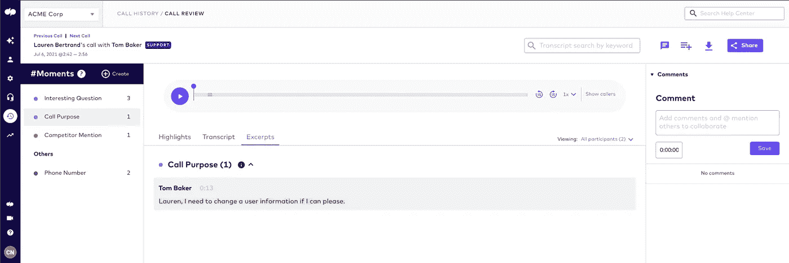
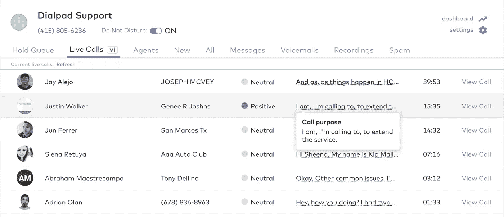

# 两个模特的故事

> 原文：<https://towardsdatascience.com/a-tale-of-two-models-6c0c7a14d1c9?source=collection_archive---------44----------------------->

## *语言课程:我们如何构建决定通话目的的人工智能模型*

由拨号盘提供。

Dialpad 的 ASR 和 NLP 团队在不断创新。事实上，我们最近推出了一项新功能，利用人工智能的力量来检测呼叫的目的，以便客户可以更好地了解常见的交互模式，并从这些模式中提取可操作的见解。

然而，正如我们所发现的，打电话并不像看起来那么简单。查看我们关于[为什么我们建造这个](https://www.dialpad.com/blog/call-purpose-ch-1/)和[的其他文章，我们查看了](https://www.dialpad.com/blog/call-purpose-data-deep-dive/)的数据以获得额外的背景。在这篇文章中，我们将深入研究我们为这一特定功能开发的两个人工智能模型，包括我们看到的成功和我们克服的挑战。

# 更简单的基于规则的模型

首先，根据我们对数据的洞察(参见上面提到的[博客](https://www.dialpad.com/blog/call-purpose-data-deep-dive/)，我们构建了一个简单的基于规则或启发式的模型，仅用了几周时间就投入生产。由于 Dialpad 为许多行业的许多企业提供服务，我们不能依赖基于呼叫主题的模型，这种模型经过培训可以识别吸尘器维修的所有方面，对于安排采访或收集教育产品的反馈几乎没有用处。

我们必须找到更通用的东西。

我们训练模型要看的一些东西:

*   特定词汇模式的存在或缺失，这些模式通常出现在呼叫语句的目的中，例如“呼叫是因为”或“呼叫的原因”
*   围绕文本上下文——看看之前说了什么，问了什么问题
*   时间线索—多注意通话的某些部分，如通话的开始或客户帐户验证后的通话部分。
*   扬声器类别—确定扬声器是发出呼叫的人还是正在接收呼叫的人

在处理模糊会话数据时，该模型必须考虑词汇和结构的可变性，容忍语音识别错误，并处理口语的特性，如不完整的句子和填充词的大量使用。

我们决定首先建立一个简单的模型，原因有两个——在投入更多时间之前衡量客户对该功能的兴趣，以及为有监督的机器学习模型廉价地收集训练数据集。

正如每一位经验丰富的机器学习科学家可以证明的那样，建立一个好的人工智能模型的关键是好的数据。但是组装高质量数据集的成本和劳动可能令人望而生畏。对于这种模式，它将涉及到检查整个通话记录，其中许多很长，有些包含转录错误，并确定通话目的的陈述点。

这需要几个月的时间，而且收集起来相当繁琐。

但是我们的顾客很感兴趣！他们希望这种能力能够检测通话的目的。

因此，我们开始构建一个更强大的模型(功能开发的下一阶段)。

由拨号盘提供。

# 深度学习模型

启发式模型精确度高，但召回率低，这意味着它没有像我们希望的那样频繁启动——但当它启动时，它非常准确。这实际上是启发式模型的一个常见问题，因为规则是相当生硬、不灵活的工具，不可能解释进行预测时令人眼花缭乱的变量数量。

例如，一个只关注于呼叫开始时检测呼叫目的的规则将错过在呼叫的很晚时候才陈述呼叫目的的时间，而一个关注于匹配陈述的规则将错过呼叫目的作为问题出现的情况。

启发式模型也很难维护，因为组成模型的规则需要定期更新，例如当模型使用的数据在内容或结构上发生变化时。但是由于其有限的范围，基于规则的模型对于最明显的情况来说是相当准确的，并且运行起来很便宜。

这种设置实际上证明了它非常能够生成标记为通话目的陈述的通话记录部分的丰富训练数据集，并由一个人在循环中验证数据子集以确保质量。

然后，用基于规则的模型所遗漏的语言模式来扩充数据集。现在，我们可以用它来训练一个深度学习模型，该模型根据话语表达呼叫目的的可能性来评分。

以前的模型是做出一个*二元*决策，即命中或未命中，而这一新的概率评分模型能够找到最具信息性的通话目的陈述，一旦更好地代表对话的话语进入系统，该陈述就会实时更新。

因此，在对话开始时出现的以下话语是有效的呼叫目的:

*你好。是的，我想和经理谈谈最近的交货问题。*

但是，新模型能够捕捉到随后出现的更具信息性的通话目的:

我会解释我打电话的原因。上周，我接到通知，我订购的自行车 X-5 型号将于周二交付，我不得不呆在家里接受交付。我不得不请了一天假，等了一整天，但是没有发生。这辆自行车本周四才到，包装破损，到处都是划痕。我想在这个问题上得到帮助。

以前的模型面临的另一个挑战是检测*隐式声明的*调用目的。例如，您能猜出“*似乎无法登录*”是客户打电话的*原因*还是解决另一个更大问题的*步骤*吗？

确定这一点的规则将过于复杂和不灵活，但深度学习模型能够从数据中学习这些细微差别，并相应地对话语进行评分。

然而，这种设置有其自身的弱点:深度学习模型非常消耗资源，运行起来非常耗时。为了减少负载，我们开发了简单的规则来过滤提供给深度学习模型的数据，这样它就不必在对话的每个部分都运行*。这种过滤机制使得模型快速有效。*

这种混合模型目前正在生产中，具有高精度和高召回率，能够捕获更广泛的呼叫目的陈述，更少地依赖于抄本的质量，并且比基于规则的模型更容易维护，因为它无缝地适应变化的数据。

由拨号盘提供。

# 简洁明了

通话目的陈述，尤其是在通话的早期说出，也可能有其他目的:问候、建立联系、寒暄、确保技术正常工作(你能听到我吗？！)，使通话目的难以识别。因此，我们精心设计了一些规则来剔除这些陈述中的错误。曾经是这样的陈述:

很好，谢谢。下午好。我是带拨号盘的本杰明。是的，我能听见你。我正在联系我们的新产品报价。现在打电话合适吗？

现在就像*一样简单:“我正在联系我们的新产品报价。”*

特别感谢我的同事 Elena Khasanova。