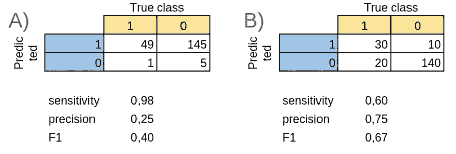
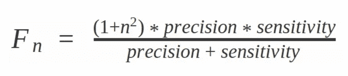
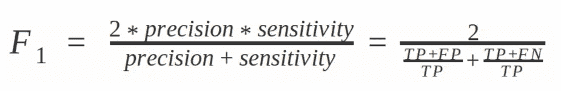
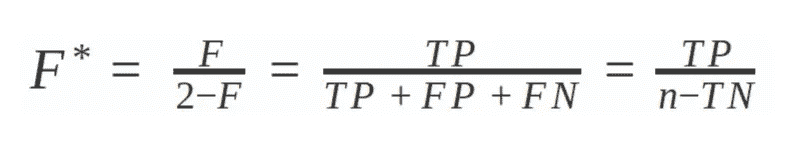

# 用于分类评估的 F 值的有形变量

> 原文：<https://towardsdatascience.com/a-tangible-variant-of-the-f-value-for-classification-evaluation-8a82092e66e4?source=collection_archive---------41----------------------->

## 全面证明您的型号选择

作者图片

一旦您开始执行分类任务并尝试不同的分类算法、超参数调整或特征选择，您将需要选择您最喜欢的设置。这绝不是一项微不足道的任务，需要仔细检查您的数据结构以及您想要实现的目标。如果您有不平衡的类，基于准确性选择分类器可能完全不合适 Matthews 系数可能是更好的选择。

有时，您并不关心非类(“0”)的预测，在这种情况下，您可能会根据算法的敏感度来决定算法，即算法检测阳性(“1”)类的能力。然而，一个超级敏感的预测器可能只是一个总是预测“1”的预测器(如图 A 所示)，你可以通过其蹩脚的精度立即认出它。

因此，在导致图 A 或图 B 中给出的分类的设置之间进行选择，您应该选择哪个？答案可能取决于您的任务，但平衡您的灵敏度和精确度的一个常用方法是 F1 测量。

F1 测度是 F 测度的特例，F 测度是两个值之间的调和平均值。一般来说，F 值定义为:

在 n=1 的情况下，这变成了众所周知的公式(其中 TP =真阳性，FP=假阳性，f n=假阴性，TN =真阴性):

这是灵敏度和精度之间的合理折衷，有助于您选择在生产中不会出错的算法。然而，一旦你试图理解 F1 值的含义，你就会意识到翻译成人类语言有多么困难。毕竟，什么是谐波呢？虽然您可以将精确度表示为真阳性与预测阳性病例的比例，但是 F 值并不容易解释。

当我和戴维·汉德以及他在澳大利亚国立大学的合作者争论基于 F 值的算法时，这困扰了我。他们提议将 F 值稍微转换成他们所谓的“F*”:

因此，F*可被解释为所有样品的真阳性与真阳性、阴性、但预测阳性以及遗漏阳性的比率。或者，作为除了正确的阴性预测之外的所有样品的真阳性的比率。或者，真阳性与所有误分类或正确阳性预测样本的比率。作者还表明，F 和 F*密切相关，不太可能基于 F 做出决定，而基于 F*做出的决定会有所不同。

对于从业者来说，这意味着 F 值可以安全地用 F*代替，从而获得可解释性，并为客户报告提供更具体的内容。

[1] Hand，D.J .，Christen，p .和 Kirielle，n . F:F-测度的可解释转换。*马赫学* (2021)。https://doi.org/10.1007/s10994-021-05964-1