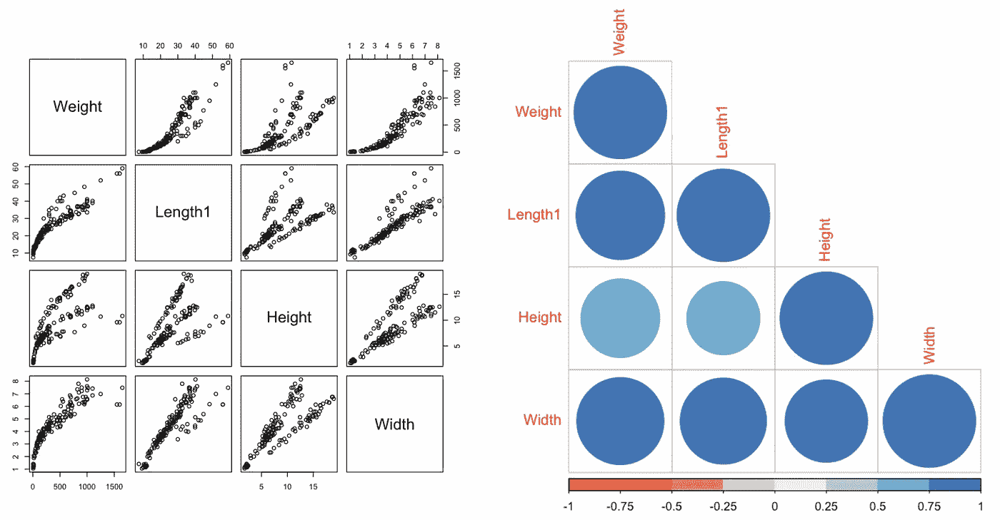
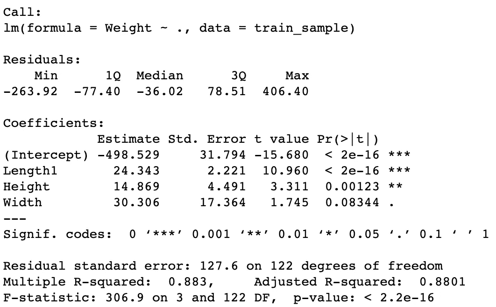
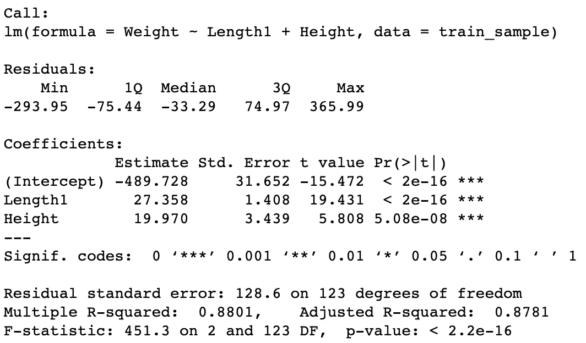
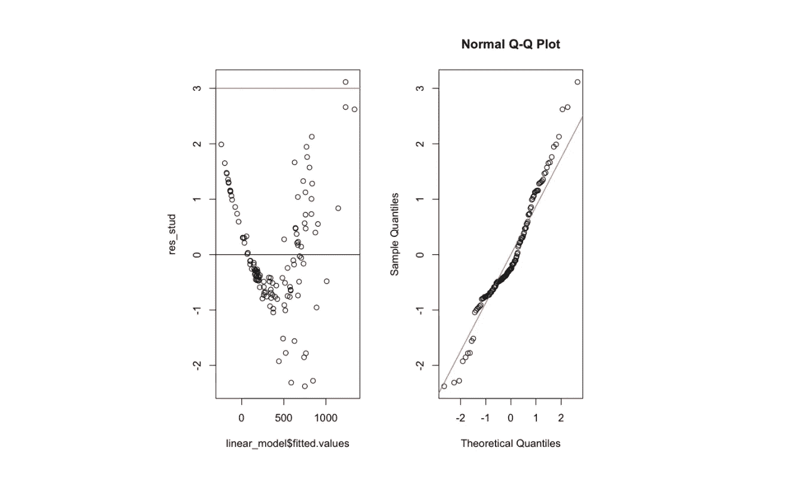
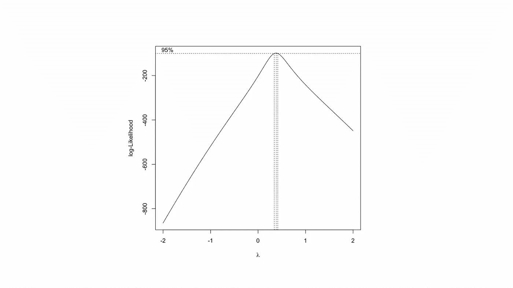
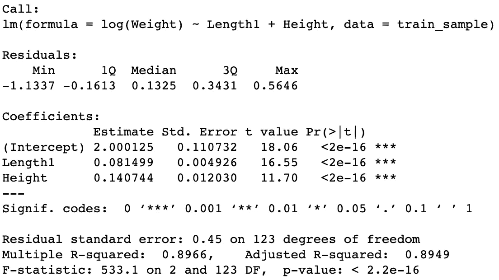
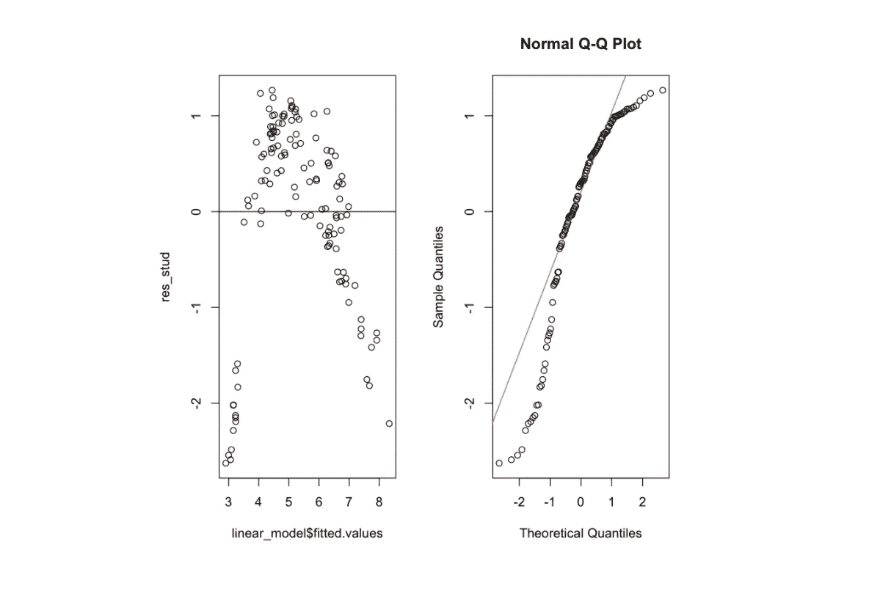

# 线性回归的技术探讨

> 原文：<https://towardsdatascience.com/a-technical-dive-into-linear-regression-7636077f42aa?source=collection_archive---------37----------------------->

## 了解在尝试解释线性模型结果之前应考虑哪些因素


[Teo Duldulao](https://unsplash.com/@teowithacamera) 在 [Unsplash](https://unsplash.com/) 上的照片

众所周知的线性回归模型可能是数据科学家口袋里的第一批工具之一。虽然被视为“简单”，但它的潜力不应该被低估，尤其是如果你有兴趣做预测，同时也了解它们背后的原因。事实上，许多研究人员继续使用这一伟大的工具，通过各种商业和科学领域的数据进行推理。然而，在一些情况下，在花了一些时间试图解决“现实世界的问题”之后，数据科学家倾向于将线性回归模型降级，并将他们的注意力转向具有更强预测能力的算法。当然，所选择的方法应该始终取决于手头的问题和目标，即您只是想回答“什么”还是也需要理解“如何”？。

无论如何，使用线性回归不一定是一项简单的任务，因为它需要时间、统计知识和非线性过程(矛盾的是)来处理数据。这不仅仅是运行一个脚本和验证某些超参数，你需要更深入地挖掘。

在这篇短文中，我们打算总结一下实现线性回归模型时要考虑的主要方面和考虑事项。请注意，这不是处方，而是在试图解释结果之前，了解要考虑什么和注意哪里的指南。

## 应用程序

正如我们提到的，我们可能有兴趣回答的问题之一是“如何”。例如，了解学习时间与考试成绩、教育水平和工资之间的关系；或者也许你拥有一个企业，并有兴趣了解边际增长的销售每一美元花在一个特定的营销活动。无论哪种方式，您都会注意到每个例子中的关键是“理解”这个词，它可以被解释为理解变量之间的相关性。在这种情况下，线性回归非常有助于捕捉一些可解释的模式，并“给出”一些关于数据背后发生的事情的想法。

作为复习，当应用线性回归时，我们假设数据存在某种“函数或自然分布”，这种分布不能直接看到，但可以使用来自人群样本的一组特征进行部分估计。特别是，这一假设涉及许多考虑因素，我们应该对其进行测试和验证，以便能够就结果的“准确性”进行辩论。

## 示例:R 中的线性回归模型分析

话虽如此，让我们从一个用 R 实现的实际例子开始，但首先是一个简短的上下文介绍。

假设你计划下周末和几个朋友去钓鱼，你想让他们大吃一惊，告诉他们你只用卷尺就可以非常精确地估计鱼的重量。但这还不是全部！你也可以告诉他们鱼的重量可能会有多大的变化，如果任何特定的尺寸测量(垂直长度，高度等。)变化。所以在这一点上，你可能不是你朋友中最受欢迎的，但是你可以赢得一些赌注。

这只是使用我们的线性回归模型和钻研高级技术的一个有趣的背景。在这个例子中，我们将使用鱼市场中常见鱼类的数据库，您可以从 [Kaggle](https://www.kaggle.com/) 的 [Aung Pyae](https://www.kaggle.com/aungpyaeap/fish-market) 处获得。这个数据集包含几列，描述了不同的大小和物种的措施，并有 158 个观察。对于这个分析，我们将从使用 3 个简单的尺寸测量变量开始:垂直长度、高度和对角线重量(所有变量都以厘米为单位)。这些变量是我们模型的预测器。对于响应变量，我们有鱼的克重。所以现在，我们去钓鱼吧！

## 导入包

```
library(MASS)
library(Kendall)
library(car)
library(corrplot)
library(RColorBrewer)
```

## 创建绘制残差的函数

首先，我们将创建一个函数，允许我们绘制回归模型产生的残差。在这种情况下，我们采用学生化残差，因为它们在执行后续异方差分析时比原始残差表现得更好。这是因为理论线性模型中的方差被定义为“已知的”，而在应用中，样本方差是估计的，因此原始残差可能在误差中显示异方差，即使残差是同方差的。[在这里](https://stats.stackexchange.com/questions/44033/what-advantages-do-internally-studentized-residuals-offer-over-raw-estimated-r)你可以找到关于这个效果的简要解释。

```
plot_residuals = function(linear_model){
    res_stud=rstudent(linear_model)
    k=1
    for(i in res_stud){
      if(is.na(i)){res_stud[k]=0}
      else{res_stud[k]=i}
      k=k+1}
par(mfrow=c(1,2))
plot(linear_model$fitted.values,res_stud); abline(0,0); abline(-3,0,col="red"); abline(3,0,col="red")
qqnorm(res_stud); qqline(res_stud, col = 2)
}
```

## 导入和浏览数据集

我们最初将使用变量鱼的垂直长度、高度和宽度作为预测值，变量“重量”作为响应变量。

```
df_fish = read.csv('Fish.csv',header=TRUE)
selected_cols = c('Weight','Length1', 'Height','Width')
df_fish = df_fish[,selected_cols]
attach(df_fish)summary(df_fish)
```

## 删除有错误的行

在对数据进行简要回顾后，我们发现一个“权重”等于 0 的观察值，因此我们将其删除以避免将来出现问题。此外，应该注意的是，用于随后转换响应变量和预测值的技术要求变量总是取正值。

```
df_fish = df_fish[Weight!=0,]
rownames(df_fish)=1:nrow(df_fish)
```

## 探索数据

我们通过绘制变量散点图和相关矩阵来继续研究数据。我们的目的首先是发现回归变量和响应变量之间的相关性，其次是在预期可能的多重共线性问题中看到预测变量之间的相关性。

```
# Scatter plot
par(mfrow=c(1,3)) 
pairs(df_fish)# Correlation matrix
M = cor(df_fish)
corrplot(M, type="lower",col=brewer.pal(n=8, name="RdYlBu"))
```



正如我们从图表中看到的，不仅预测变量和响应变量之间，而且预测变量本身之间似乎也有很高的相关性。这意味着我们将不得不面对多重共线性的问题。

此外，还可以观察到预测值和响应变量之间存在非线性关系，这意味着如果我们要实现一个没有任何变量变换的线性模型，我们将面临残差中的结构问题。

在这方面，我们将继续使用测试和转换技术来评估这些推论，这将允许我们实现模型的更精确的修正。

## 训练测试分割样本

我们分别使用 80%和 20%的观察值来执行训练和测试分割。

```
n_sample = floor(0.8*nrow(df_fish))
set.seed(7)
train = sample(seq_len(nrow(df_fish)),size = n_sample)
train_sample = df_fish[train,]
row.names(train_sample) = NULL
test_sample = df_fish[-train,]
row.names(test_sample) = NULL
```

## 模型 1

*原始线性模型*

我们使用 3 个原始预测值和响应变量来拟合第一个模型。然后我们打印回归的结果。

```
lm_original = lm(Weight~., data=train_sample)
summary(lm_original)
```



正如我们所料，回归结果显示了回归器的良好性能。事实上，该模型作为一个整体优于其预测由预测响应变量的平均值组成的模型(这种差异在传统的置信水平值上具有统计学意义)。我们可以在 p 值接近 0 的 Fisher 统计量和调整后的 R 平方中观察到这一点，其值表明该模型解释了响应变量在其均值附近的 88%的可变性。

此外，当分析模型内每个变量的统计显著性时，我们可以看到鱼的截距、垂直长度(长度 1)和高度在 1%具有统计显著性，而鱼的宽度变量仅在 10%具有显著性。

此外，值得注意的是，根据我们在初始图中看到的，我们可以预期鱼的“重量”和“宽度”之间有更高的相关性或显著性水平。我们所期望的和我们所发现的之间的差异是由于所谓的多重共线性。

这怎么解释呢？我们在开始时看到的效果并不符合变量“宽度”和变量“重量”之间的关系，而是符合这个变量与变量“垂直长度”和“高度”密切相关的事实。当孤立地看待因变量时，它使用其他变量所反映的信息来显示其部分相关性。然而，一旦我们添加了直接影响响应变量的变量，所有这些信息就不再被“宽度”所捕获，从而降低了它的解释力。

*检查多重共线性*

这种现象的主要问题是什么？在预测因子之间存在很高相关性的情况下，变量的解释效果很难分离，并且在许多情况下会扭曲相关系数的值及其统计意义。您必须记住，在大多数情况下，我们可以发现我们的解释变量是相互关联的，但是当这种相关性很高时，问题就出现了。如果您试图做出推论并需要解释变量，这一点很重要，而在纯预测模型的情况下，这并不相关。

让我们看看在这种情况下多重共线性会发生什么。为此，我们将使用方差通货膨胀因子(VIF)，因为它使我们能够理解每个预测因子相对于其他预测因子的相关性(更详细的信息[(此处为](https://www.displayr.com/variance-inflation-factors-vifs/))并帮助我们定义变量是否可能成为我们模型的风险。

没有确定多重共线性高或低的 VIF 值，但是，在实践中，认为该指数接近 10(或更高)的值可以表示多重共线性，而接近 1 的值表示多重共线性非常低。

```
vif(lm_original)
```


观察结果，我们先验地注意到，存在与变量“宽度”相关的更高 VIF。因此，我们将通过消除多重共线性最高的变量来减少模型，并使用剩余模型重新计算 VIF。

## 型号 2

*简化线性模型*

现在，我们只使用变量“垂直长度”和“高度”再次拟合我们的模型。

```
lm_reduced = lm(Weight~Length1+Height, data=train_sample)
summary(lm_reduced)
```



具有新变量子集的模型结果实际上保持不变。我们实际上可以观察到的是，调整后的 R 平方值小幅下降，均方误差小幅上升，变量“高度”的统计显著性水平小幅改善。

*检查多重共线性*

让我们看看每个预测器的 VIF 发生了什么。

```
vif(lm_reduced)
```


正如我们所看到的，对于剩余的两个解释变量，VIF 显著下降。这告诉我们，删除变量“宽度”似乎是一个好决定(越简单越好)。

*绘制残差*

现在我们已经定义了变量，我们继续对回归结果进行彻底的分析。

在这个过程中，残差分析是充分利用回归模型的基本要素。首先，当使用这种类型的模型时，我们从误差分布的正态性假设出发，不是任何类型的正态分布，而是均值为 0 的正态分布。这让我们能够利用这个模型在推理方面给我们带来的所有好处。

然后，我们使用该函数对残差进行分析，以绘制上述学生化残差。

```
plot_residuals(lm_reduced)
```



正如我们在图中看到的，残差和一些异常值中似乎有一种二次结构。这表明使用预测器仍然可以提取一些额外的信息，但是我们必须对变量执行某些转换来提取这些信息。

关于数据的正态性(正态 Q-Q 图),与正态分布的理论分位数相比，我们可以观察到残差分布的一些偏斜和重尾，因此很可能误差的分布不具有正态分布。为了验证这种直觉，我们将使用 Kolmogorov-Smirnov 检验，该检验允许我们比较两个分布是否相等，以及在这种特殊情况下，残差的分布是否类似于均值为 0 且方差等于样本方差的理论正态分布。

*检验残差的正态性*

```
lm_reduced_residuals=rstudent(lm_reduced)
ks.test(lm_reduced_residuals,"pnorm",mean(lm_reduced_residuals),sd(lm_reduced_residuals))
```


Kolmogorov-Smirnov 检验的零假设是两个分布不相等，而另一个假设是两个分布相等。然后，我们将演示在运行测试后，零假设被拒绝(我们需要一个高 p 值)。然而，在这种情况下，我们观察到 p 值小于一些传统的置信水平，因此我们可以说(在 1%的水平上)我们不拒绝零假设，因此我们没有足够的证据表明两个分布是相等的。

*异方差:检验残差和拟合值之间的相关性*

接下来，我们对检验残差的同方差感兴趣。我们所说的同方差是指误差不会随着模型预测值的增加或减少而增加或减少。这是模型构建中的一个期望属性，因为测试残差中的结构缺失将表明不再有可能对当前使用的变量进行转换，从而允许我们改进模型的性能。

在这种情况下，我们需要证明残差中存在某种一致性，并且它们是尺度不变的。否则，我们将面临最小二乘估计的效率损失，以及在计算估计的方差和协方差矩阵时产生的问题。

这是我们在之前的剧情中已经可以观察到的。然而，我们的目标是能够进行假设检验，使我们能够验证相关性的缺失。

```
summary(Kendall(abs(lm_reduced$residuals),lm_reduced$fitted.values))
```


应用检验(肯德尔检验)是一种类似斯皮尔曼检验的相关检验，在计算相关系数(肯德尔检验中的 Tau，斯皮尔曼检验中的 Rho)时有一定优势。更多详情请访问以下[链接](https://www.spss-tutorials.com/kendalls-tau/)。

肯德尔检验表明，残差和拟合值之间的相关系数(tau)为正(0.16)，在 1%时具有统计显著性。这表明没有足够的证据来支持缺乏相关性的假设，这意味着我们处于异方差残差的情景中。

## 模型 3

*转换响应变量*

那么，当残差中有结构时，我们该怎么做呢？我们有两个选项可以帮助我们扭转这个问题:a)转换响应变量，b)转换预测变量。开始执行转换没有正确的方法，但在实践中，通常的做法是从转换响应变量开始，并在提出新的转换之前重新评估结果。

然后，我们将从使用 Box-Cox 最大似然技术转换变量“权重”开始，因为它允许我们估计一个λ值，变量可以转换为 x 次λ(希望这将减少残差中的结构)。更多详情请访问以下[链接](https://onlinestatbook.com/2/transformations/box-cox.html)。

```
y_transformed=boxcox(lm_reduced)
y_transformed$x[which.max(y_transformed$y)]
```



结果表明，对变量“权重”的一种可能的变换是应用λ幂= 0.38。请注意，这种量级的转换会使模型最终结果的解释变得复杂。为了解决这个问题，一般来说，最好是应用一个接近建议值的变换，这仍然允许我们容易地解释系数。为此，我们选择对数变换。

*运行响应变量转换后的线性模型*

```
lm_transform_y = lm(log(Weight) ~ Length1 + Height, data=train_sample)
summary(lm_transform_y)
```



在应用这个转换之后，我们注意到模型的性能有了一个微小但重要的改进。我们可以观察到调整后的 R 平方增加了 1%以上，同时保持了模型本身和预测因子的统计显著性水平。关于误差，重要的是要强调，现在它与以前的情况不可比，因为响应变量在另一个尺度上。

*绘制残差*

```
plot_residuals(lm_transform_y)
```



那么，我们解决问题了吗？当评估误差的结构时，第一次变换不仅没有逆转异方差问题，而且似乎“恶化”了残差的分布，这远远不是正态分布。

让我们看看测试会发生什么。

*检验残差的正态性*

```
lm_transform_y_residuals=rstudent(lm_transform_y)
ks.test(lm_transform_y_residuals,"pnorm",mean(lm_transform_y_residuals),sd(lm_transform_y_residuals))
```


残差的分布越来越远离正态分布，正如我们在新的 p 值(当前为 0.01，之前为 0.04)中看到的那样。因此，我们继续拒绝误差分布的正态性。

*异方差:检验残差和拟合值之间的相关性*

```
summary(Kendall(abs(lm_transform_y$residuals),lm_transform_y$fitted.values))
```


关于异方差，它似乎也“恶化”了，虽然只是轻微的，所以我们仍然不能扭转这个问题。

## 模型 4

*转换预测值*

然后我们继续讨论预测因子的转换。为此，我们将使用 Box-Tidwell 最大似然变换技术，像 Box-Cox 变换一样，该技术将允许我们理解从解释变量中提取更多信息的建议λ功效是什么。

```
boxTidwell(log(Weight) ~ Length1 + Height ,data=train_sample)
```


获得的结果建议对可变长度 1 应用λ= 0.007 的变换，对可变高度应用λ=-0.38 的变换。在这两种情况下，建议的转换在 1%的水平上具有统计学意义，如两个变量的 p 值所示。因此，我们又一次处于这样一个场景中，相对于建议的值进行过于精确的转换可能会使结果的后续解释变得非常复杂。因此，我们再次选择对两个变量进行对数变换。

*使用转换后的响应变量和预测值运行线性模型*

有了这些新的转换，我们继续再次调整我们的线性回归模型。

```
lm_transform_y_X = lm(log(Weight) ~ log(Length1) + log(Height), data=train_sample)
summary(lm_transform_y_X)
```


可以看出，作为一个整体进行的转换对模型的性能产生了实质性的改善，其中调整后的 R 平方显示了约 9%的增加，同时保持了模型和预测值的统计显著性水平。

*绘制残差*

```
plot_residuals(lm_transform_y_X)
```


当分析残差图时，我们还可以观察到残差结构的简化和接近正态分布方面的显著改进。

*检验残差的正态性*

```
lm_transform_y_X_residuals=rstudent(lm_transform_y_X)
ks.test(lm_transform_y_X_residuals,"pnorm",mean(lm_transform_y_X_residuals),sd(lm_transform_y_X_residuals))
```


最后，我们已经能够拒绝零假设(p 值= 0.5！)因此，对于当前模型，没有足够的信息来证明残差的分布是不正常的。实际上，这个绕口令可以归结为这样一个事实:残差可以被认为是正常的。

*异方差:检验残差和拟合值之间的相关性*

```
summary(Kendall(abs(lm_transform_y_X$residuals),lm_transform_y_X$fitted.values))
```


最后但并非最不重要的是，我们还发现残差和拟合值(0.01)之间的相关性显著降低，p 值较高(0.84)，这表明没有足够的证据甚至可以说存在的少量相关性具有统计显著性。所以我们颠倒了异方差的问题。

## 结果

事不宜迟，这里是我们的最终模型及其结果。


正如我们已经提到的，该模型的性能似乎非常好，决定系数(调整后的 R 平方)接近 99%，因此仅用变量“垂直长度”和“高度”我们就可以解释变量“体重”的几乎所有变化。换句话说，我们的朋友没有机会在赌注上击败我们。

此外，正如我们强调的，我们很好地说明了这种类型的模型还允许我们推断预测因素对响应变量的部分影响(在这种情况下，我们不讨论因果关系),由于应用的变换是对数函数，我们可以将系数解释为解释变量的百分比变化。换句话说，当转换建立了一个对数-对数模型(对数中的响应变量-对数中的预测变量)时，我们就有可能用百分比变化率来解释偏相关。

这样，伴随转换后的变量 log (Length1)的系数接近于 2，这告诉我们，如果我们没有捕获我们刚刚捕获的鱼，而是捕获了一条长 10%的鱼，那么这些鱼的估计重量将比我们现在所拥有的大约重 20%。类似地，伴随转换后的变量 log(高度)的系数接近 1，这告诉我们，如果我们没有捕获我们刚刚捕获的鱼，而是捕获了一条高度高 10%的鱼，这种类型的鱼的估计重量也将比我们现在拥有的重 10%左右。

这太棒了！我们已经将系数转换成因变量和每个预测值之间的弹性度量。没错，我们连规模都不在乎！

有了这个我的朋友，放心你会成为书呆子钓鱼之王的。

## 结论

总之，这个简单的实际例子让我们能够处理大量的概念并深入研究线性回归模型。有趣的是，就像这个玩具例子一样，许多次线性模型，无论它们看起来多么简单，都可以有非常好的表现，同时让我们有可能从结果中获得非常有价值的见解。记住，问题的最佳答案并不总是最复杂的。