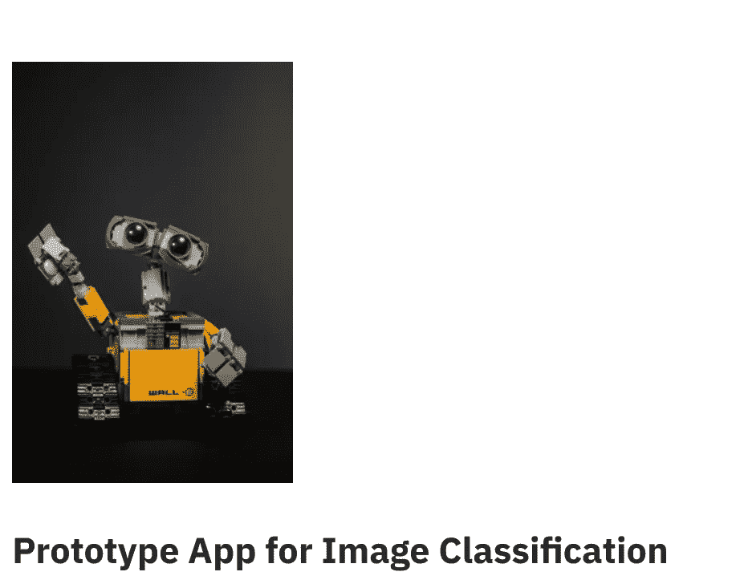
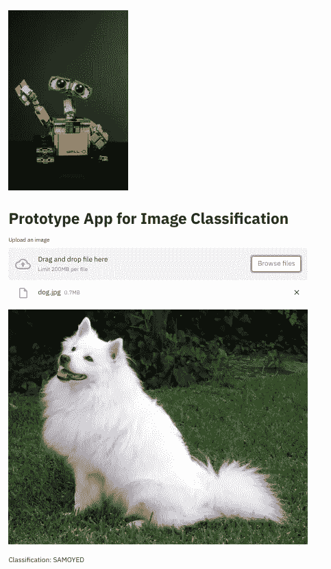

# 编写快速机器学习应用程序的模板

> 原文：<https://towardsdatascience.com/a-template-for-writing-quick-machine-learning-apps-7c7b8bdfeb91?source=collection_archive---------38----------------------->


在 [Unsplash](https://unsplash.com?utm_source=medium&utm_medium=referral) 上由[Cookie Pom](https://unsplash.com/@cookiethepom?utm_source=medium&utm_medium=referral)拍摄的照片

## 使用 PyTorch 和 Streamlit 加速您的机器学习原型

# ML 应用原型

开发一个机器学习模型的过程可以是很多事情:从一个有益的学习体验，到一个可怕和令人沮丧的低准确性和调试噩梦的过程。机器学习工作流程的一个方面曾经很棘手，那就是原型阶段，在这个阶段，我们希望有一个简单的界面来展示我们模型的功能。

编写数据应用程序的框架 Streamlit 填补了这一空白，它让人们能够尽快赋予他们的人工智能模型生命，而无需编写成熟的 GUI。

在这篇文章中，我将向你展示一个用 Streamlit 和 Pytorch 编写简单 ML 应用程序的模板。

# 从模型到原型

在这个例子中，我们将编写一个简单的图像分类应用程序。编写人工智能应用程序的步骤如下:

1.  **导入依赖关系**

2.**写一个标题，顶部有一个漂亮的标志图像**

**输出:**



图片由作者提供。来自 Unsplash 的 Jason Leung 的标识

**3。设置文件上传程序以加载图像**

**输出:**


图片由作者提供。来自 Unsplash 的 Jason Leung 的标识

4.**编写一个脚本，加载一个预先训练好的模型来运行推理**

在这里，我们可以将训练模型的权重放在一个文件夹中，或者从标准库中加载一个预训练模型。在这个例子中，我们将使用 [PyTorch 库](https://pytorch.org)加载 [Resnet](https://pytorch.org/hub/pytorch_vision_resnet/) 模型。

在此之前，我们需要下载 imagenet 类:

```
# source: [https://pytorch.org/hub/pytorch_vision_resnet/](https://pytorch.org/hub/pytorch_vision_resnet/)
!wget https://raw.githubusercontent.com/pytorch/hub/master/imagenet_classes.txt
```

现在，我们可以编写加载模型和运行推理的脚本了:

在这里，我们在图像上做一些基本的转换，比如调整大小，裁剪，然后把它输入到我们的模型中。我们在这里创建的函数`predict()`将从我们的主应用程序中调用，如下所示:

5.**加载测试图像**

为了加载样本图像进行测试，我们将使用与本 [Pytorch 教程](https://pytorch.org/hub/pytorch_vision_resnet/)中相同的示例，

最终的应用程序如下所示:



图片由作者提供。来自 Unsplash 的 [Jason Leung 的 Logo](https://unsplash.com/photos/81rOS-jYoJ8)

我们可以看到底部的分类是*萨摩耶，*这是我们讨论的狗的品种。

# 关于人工智能应用的最后一点说明

在本教程中，希望你学会了如何编写一个简单的人工智能应用程序来使用 Streamlit 和 Pytorch 对图像进行分类，你可以在这里找到完整的源代码。

在本文中，您了解了:

*   如何用 Streamlit 写一个简单的图像分类 app
*   如何设置一个脚本，用 Pytorch 加载一个预先训练好的模型进行推理

如果你喜欢这篇文章，请在 [Twitter](https://twitter.com/LucasEnkrateia) 、 [LinkedIn](https://www.linkedin.com/in/lucas-soares-969044167/) 、 [Instagram](https://www.instagram.com/theaugmentedself/) 上联系我，并在 [Medium](https://lucas-soares.medium.com/) 上关注我。谢谢，下次再见！:)

# 参考

*   [Pytorch Vision ResNet](https://pytorch.org/hub/pytorch_vision_resnet/)
*   [流线](https://streamlit.io)
*   Pytorch