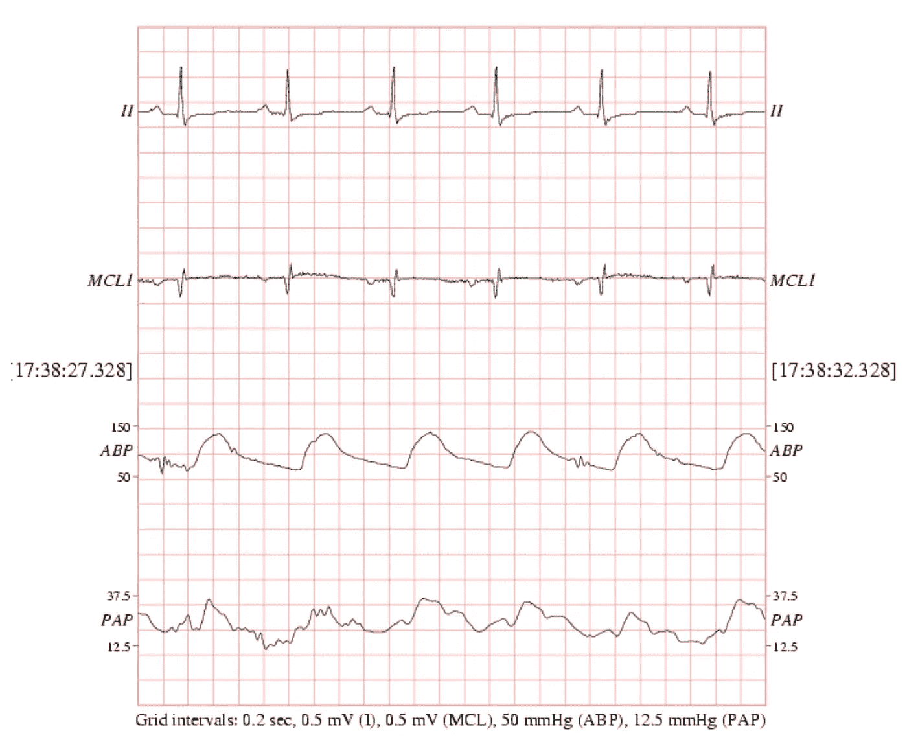
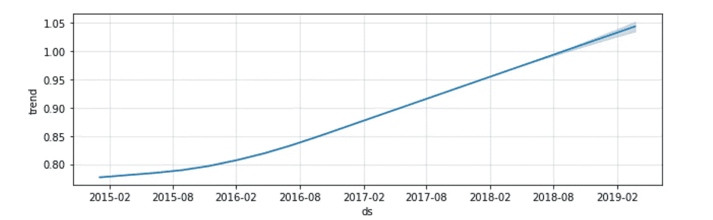
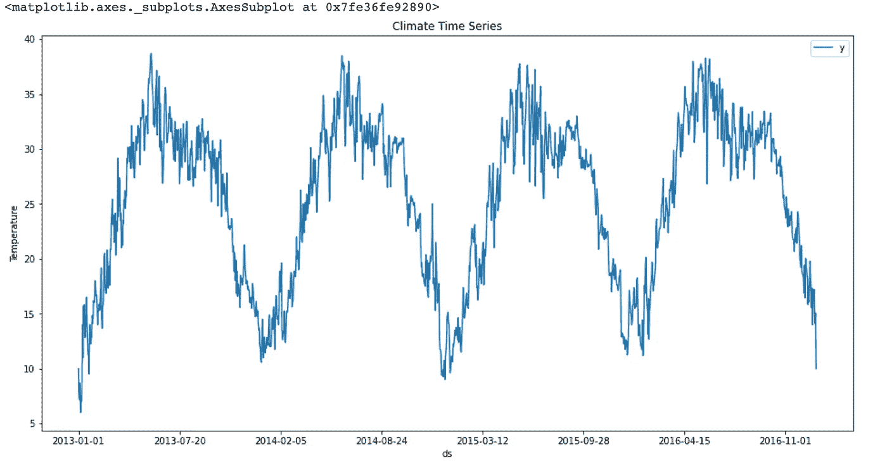
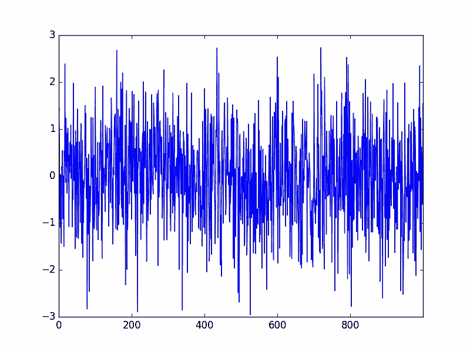
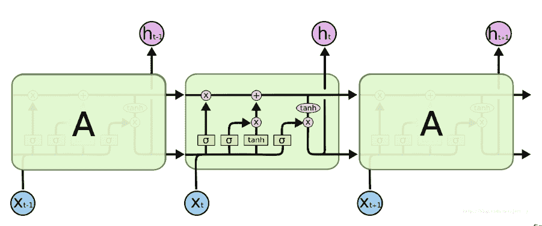
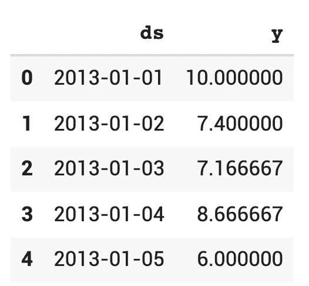
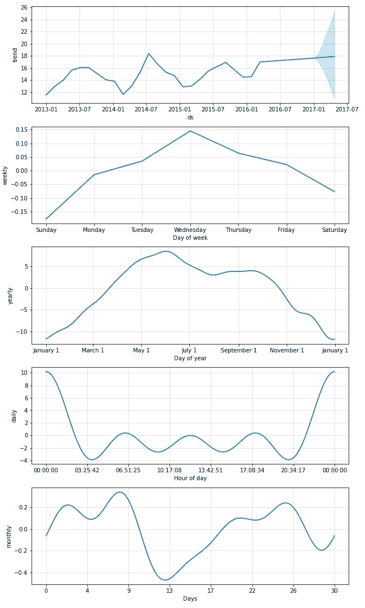
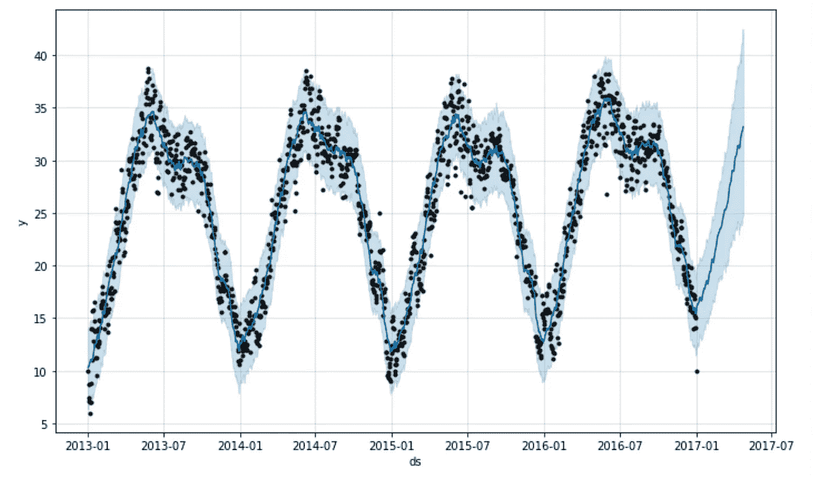
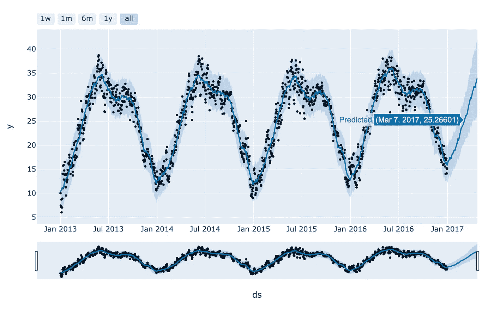
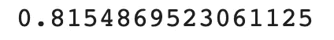

# 时间序列分析彻底指南

> 原文：<https://towardsdatascience.com/a-thorough-guide-to-time-series-analysis-5439c63bc9c5?source=collection_archive---------12----------------------->

## 理解时间序列数据的组成部分。将机器学习和统计模型应用于现实生活中的数据。


来自 [Unsplash](https://unsplash.com/) 的

本文将指导您完成以下部分:

1.  什么是时序数据？
2.  时间序列数据的组成部分。
3.  时间序列分析有什么用？
4.  最常用的时间序列预测方法(统计和机器学习)。
5.  使用机器学习模型预测气候数据的端到端示例。

事不宜迟，我们开始吧！

# 1.什么是时间序列数据？

*一个* [*时间序列*](https://en.wikipedia.org/wiki/Time_series) *是一系列* [*数据点*](https://en.wikipedia.org/wiki/Data_point) *按时间顺序索引(或列出或绘制)。最常见的是，时间序列是在连续的等间隔时间点拍摄的* [*序列*](https://en.wikipedia.org/wiki/Sequence) *。*简单来说，时间序列数据是一个数据集，它随着时间的推移跟踪一个样本，并定期收集。例如，商品价格、股票价格、房价、天气记录、公司销售数据以及心电图等患者健康指标。时间序列数据广泛存在于我们的生活中。因此，作为一名数据科学家，分析数据的能力至关重要。玩起来也很有意思。



患者的心电图数据(来自 [MIMIC-III 波形数据库](https://archive.physionet.org/physiobank/database/mimic3wdb/)的图像)

# 2.时序数据的组成部分

大多数时间序列数据可以分解为三个部分:趋势、季节性和噪声。

**趋势** — 数据有一个系列的长期运动，不管是向上还是向下。它可能是由人口增长、通货膨胀、环境变化或技术的采用引起的。例子可以是过去十年美国股票市场的长期增长，以及过去一年世界大部分地区房地产市场的增长，以及人们寿命的延长。



过去五年美国鳄梨价格的趋势(图片由作者根据 Prophet 模型生成)

**季节性** —数据与日历相关的影响相关联，无论是每周、每月还是季节性的，并且是特定于域的。例如，对于大多数电子商务平台来说，他们在 12 月份左右的销售额因为圣诞节而上升。相比之下，对于房地产来说，加拿大夏季的房屋销售量会高于冬季，因为人们不愿意在冬季四处迁移。



季节性很强的德里气温数据(图片由作者提供)

**噪音** —噪音也被称为残留物或不规则物。这是除去趋势和季节性之后剩下的东西。这是不可预测的短期波动。有时，与趋势和季节性相比，噪声可能占主导地位，使这种时间序列数据更难预测。股票价格就是一个明显的例子。

**白噪声**是没有趋势和季节性的噪声的极端情况。因此几乎不可能预测，这是一种平稳的时间序列数据。



白噪声(图片来自[维基媒体共享](https://commons.wikimedia.org/wiki/File:White_noise.svg))

# 3.时间序列分析有什么用？

时间序列分析在多个行业有不同的用例。根据一般经验，它可用于以下情况:

*   基于历史数据预测未来价值，如预测房价、售价和股价。
*   识别经济、业务或健康指标中的异常值或波动，也称为异常检测。例如，当经济受到地缘政治事件或患者生命体征不规则性的影响时，可以确定转折点。
*   模式识别、信号处理、天气预报、地震预测等。

# 4.最常用的时间序列预测方法

文献中有一些时间序列预测模型。我将在本文中介绍使用最广泛的:脸书先知，一个叫做 LSTM 的深度神经网络模型，以及 ARIMA。

> 脸书先知

正如在[文档](https://facebook.github.io/prophet/)中所述， *Prophet 是一种基于加法模型预测时间序列数据的程序，其中非线性趋势符合每年、每周和每天的季节性，加上假日影响。* ***它最适用于有强烈季节效应的时间序列和几个季节的历史数据。Prophet 对缺失数据和趋势变化非常稳健，通常能够很好地处理异常值。*** 这意味着 Prophet 已经考虑到了上面提到的所有组成部分:趋势、季节性和噪音，加上假日效应，并将其与一个加法模型相结合。

Prophet 有一个 Python API 和 R API。这很容易实现和预测。

在下一节中，我们将应用这个模型来预测印度的气温。

> LSTM(长短期记忆)

LSTM 是一种递归神经网络(RNN ),擅长处理序列数据。它广泛应用于机器翻译和语音识别。如果你已经熟悉 RNN 的结构，LSTM 在每个细胞中添加了三个特殊的门，以记住长期和短期记忆，而香草 RNN 模型不擅长记住长期序列。



LSTM 各牢房的结构([来源](http://colah.github.io/posts/2015-08-Understanding-LSTMs/))


前一幅图像中的符号([来源](http://colah.github.io/posts/2015-08-Understanding-LSTMs/))

你也可以参考[这篇博客](https://www.analyticsvidhya.com/blog/2017/12/fundamentals-of-deep-learning-introduction-to-lstm/)来更好地了解 LSTM 和[这篇博客](https://machinelearningmastery.com/time-series-prediction-lstm-recurrent-neural-networks-python-keras/)来亲自动手用 Python 中的 LSTM 预测一个时间序列数据对一条国际航线的乘客量进行预测的问题。

> ARIMA

ARIMA 是自回归综合移动平均的统计方法的简称。自回归意味着模型使用一个观察值和一些滞后观察值之间的依赖关系。综合是指对原始观测值进行差分(例如，从上一时间步的观测值中减去一个观测值)以使时间序列平稳。移动平均是指模型使用观测值和应用于滞后观测值的移动平均模型的残差之间的相关性。听起来有点混乱；然而，我们不会在文章中深入探讨这种方法，但您可以转到[这篇博客](https://machinelearningmastery.com/arima-for-time-series-forecasting-with-python/)来更好地了解。它将向您全面介绍 ARIMA 以及如何使用 Python 在洗发水销售数据集上实现 ARIMA。

# **5。利用脸书预言家预测印度日平均气温**

太好了！现在，您更好地了解了什么是时间序列数据，它是用什么构造的，它的用途是什么，以及最常用的预测模型。现在是时候摆弄一些现实生活中的数据并开始预测了！你可以通过[这个 git 回购](https://github.com/fangyiyu/Time_Series_Analysis/blob/master/Weather_prediction.ipynb)拿到笔记本。

我们正在使用的数据集提供了 2013 年 1 月 1 日至 2017 年 4 月 24 日印度德里的训练和测试气候数据，具有四个特征:*平均温度*、*湿度、* *风速、平均气压*。它是从 Weather Underground API 收集的，并发布在 [Kaggle](https://www.kaggle.com/sumanthvrao/daily-climate-time-series-data) 上。

我们将使用 Google Colab 作为我们的 python 笔记本，让我们首先安装所需的包。

```
pip install pystan==2.19.1.1 prophet
```

我们正在安装一个不熟悉的名为 *pystan* 的包。在引擎盖下，Prophet 正在使用 stan 进行优化(如果用户需要，还可以进行采样)，Stan 是一个用于统计建模和高性能统计计算的平台，而 *pystan* 是 Stan 的 python 接口。

导入必要的库:

```
import pandas as pdimport numpy as npimport matplotlib.pyplot as pltfrom prophet import Prophetfrom datetime import datetimefrom prophet.plot import plot_plotly, plot_components_plotly
```

然后让我们从 Kaggle API 下载数据。可以参考我另一篇关于[如何从 Kaggle 下载数据到 Google Colab 的帖子。](https://medium.com/@fangyiyu/how-to-download-datasets-from-kaggle-to-google-colab-7bb3c5a44c51)我把代码贴在这里供参考:

```
! pip install kaggle
from google.colab import drive
drive.mount('/content/gdrive')import os
os.environ['KAGGLE_CONFIG_DIR'] = "/content/gdrive/My Drive/TimeSeries"  #The folder TimeSeries is where you kaggle.json file is.!kaggle datasets download -d sumanthvrao/daily-climate-time-series-data!unzip \*.zip && rm *.zip
```

压缩数据集 zip 文件夹后，我们可以找到一个训练数据集和一个测试数据集。我们将使用训练数据集来训练我们的 Prophet 模型，并使用测试数据集来测试模型的准确性。

```
df = pd.read_csv('/content/DailyDelhiClimateTrain.csv')
df_test = pd.read_csv('/content/DailyDelhiClimateTest.csv')
```

训练和测试数据集都有五列，我们可以使用其中任何一个功能作为预测的标签。作为一个例子，我们将在教程中使用 *meantemp* 。Prophet 只需要两个有特定名称的列:“ds”和“y”。所以下一步是过滤掉列并重命名它们。小心两个数据集中的重复:日期 2017–01–01 存在于两个数据集中。您可以在任一数据集中删除它。在我的例子中，我在训练集中删除了它，并将其作为一个预测日。

```
df=df[['date','meantemp']]df=df.rename(columns={'date':'ds','meantemp':'y'})pd.to_datetime(df.ds)# Delete the last row (2017-01-01)
df = df[:-1]df.head()
```

这是数据现在的样子，准备输入到 Prophet 模型中。



先知训练数据的前五行(图片由作者提供)

让我们初始化模型和预测！我们将预测未来 114 天，因为测试数据具有确切日期的真实值。

```
# Initialize model
m = Prophet(interval_width=0.95, yearly_seasonality=True, weekly_seasonality=True,daily_seasonality=True)# Add monthly seasonality to the model
m.add_seasonality(name='monthly', period=30.5, fourier_order=5, prior_scale=0.02)# Fit the model with training data and make prediction
m.fit(df)
future = m.make_future_dataframe(periods=114)
forecast = m.predict(future)
fig = m.plot_components(forecast)
```



温度时间序列数据的组成部分(图片由作者提供)

```
figure = m.plot(forecast)
```



预言家预测图(图片由作者提供)

让我解释一下上面的图表。黑点是我们从 Kaggle API 中获得的历史数据。深蓝色线是预测数据。浅蓝色的上限和下限也是基于 80%的置信区间预测的。你可以看到蓝色的数据在黑点之后，这些是 114 天的预测。

您还可以使用 Plotly 生成一个交互式图表，以便更好地理解数据点。

```
plot_plotly(m, forecast)
```



Plotly 生成的交互图(图片由作者提供)

一切就绪！让我们看看先知有多准！

我们将使用度量标准[的 R 平方](https://www.investopedia.com/terms/r/r-squared.asp)来检查准确性。幸运的是 Python 在 sklearn 库中有一个内置函数。还是直接用吧！

```
from sklearn.metrics import r2_scorey_true = df_test.meantempy_pred = forecast.yhat.tail(114)r2_score(y_true, y_pred)
```



预测值和真实值之间的 R_squared(图片由作者提供)

准确度还不错！通过配置 Prophet 模型的参数，应该可以达到更好的效果。例如，添加变点和假日；改变季节性参数。

接下来，我们可以构建一个 web 应用程序，并将模型部署到云中。但是我们今天已经讲了很多了，关于如何部署模型的话题我就不细说了，但是如果你有兴趣，请在下面留下评论。我将撰写另一篇关于使用 Django+JQuery+Heroku+VSCode 堆栈将机器学习模型部署到动态 web 应用程序的帖子。

感谢阅读。如果你有任何想法或建议，请告诉我，我很乐意在 [Linkedin](https://www.linkedin.com/in/fangyiyu/) 上帮你联系。