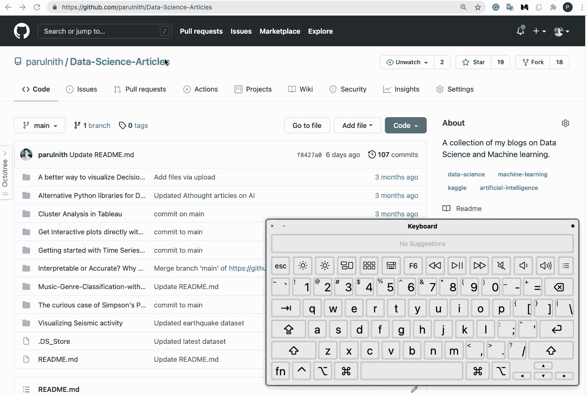
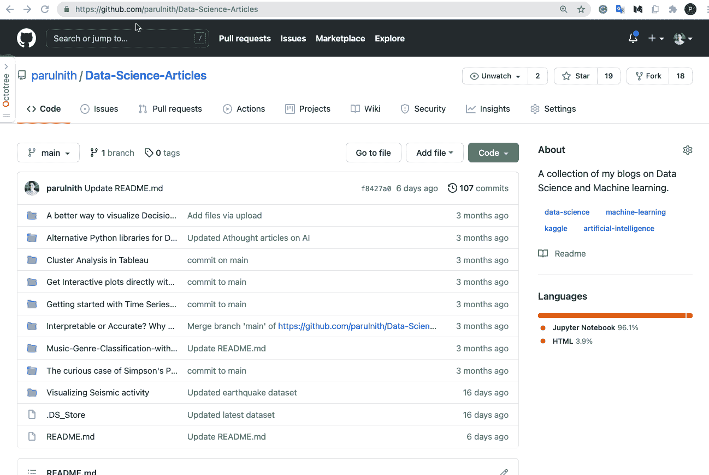
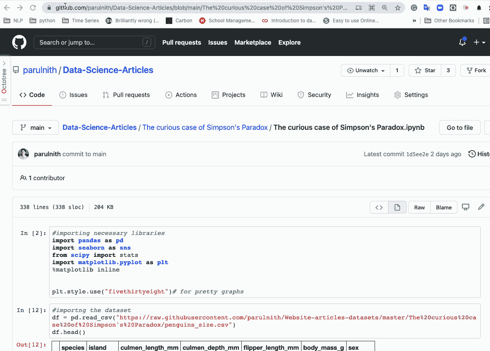
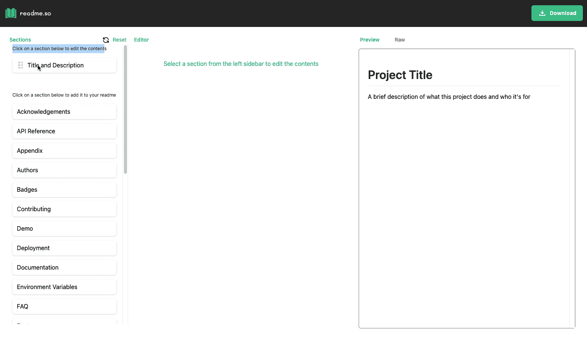
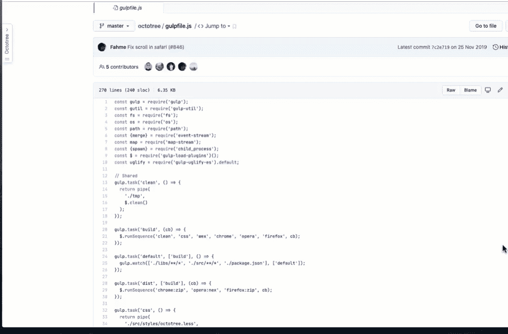
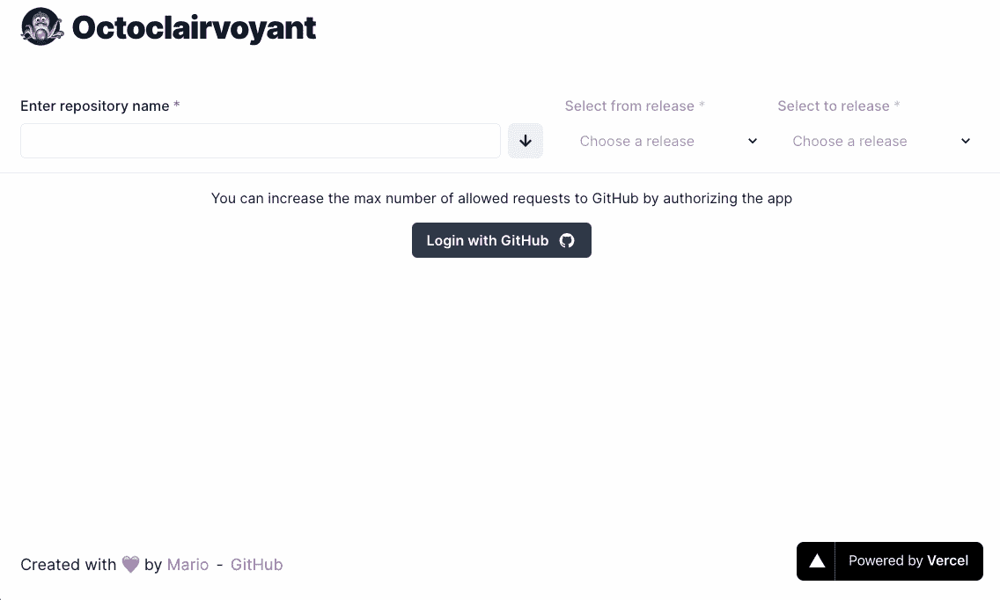
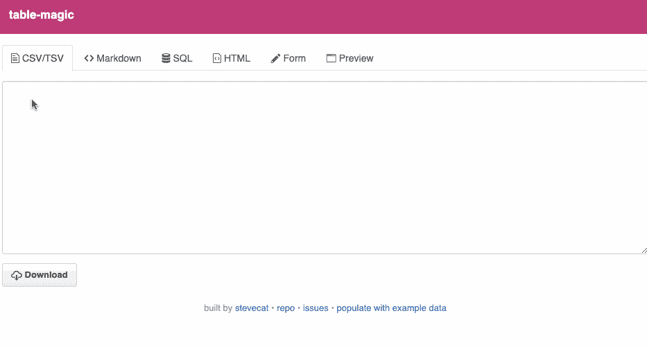
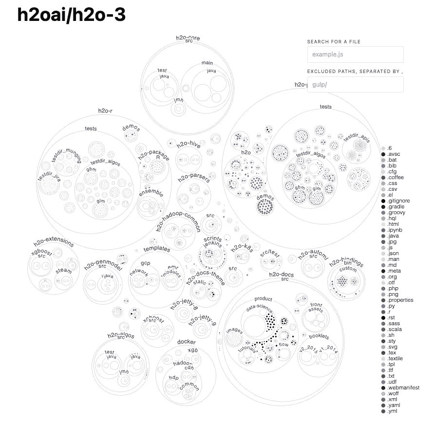

# 10 个有用的 Github 特性之旅

> 原文：<https://towardsdatascience.com/a-tour-of-10-useful-github-features-d92dde0bf412?source=collection_archive---------27----------------------->

## 充分利用 Github 体验的一些提示和技巧


由[罗曼·辛克维奇](https://unsplash.com/@synkevych?utm_source=medium&utm_medium=referral)在 [Unsplash](https://unsplash.com?utm_source=medium&utm_medium=referral) 上拍摄的照片

本文汇集了我在使用 Github 的过程中发现的一些有用的技巧和窍门。这些是随着时间的推移从各种来源收集的。我已经把那些太熟悉的过滤掉了，以免重复。我相信你会发现这个列表很有用，你可能会在日常工作中用到它们。


作者图片

有时候，我们希望直接通过 Github 库编辑代码，而不是先将其克隆到我们的本地环境中。有两种方法可以做到。

## Github 的网络编辑器

基于 web 的编辑器[是一个免费的轻量级编辑器环境，可以直接从您的存储库中创建和提交代码更改。您可以通过以下方式在基于 web 的编辑器中打开任何 GitHub 存储库:](http://Github's Web-based editor)

*   按下圆点(。)键浏览 GitHub 上的任何存储库。



Github 的网络编辑器|作者图片

*   将网址从`github.com`改为`github.dev`。



访问 Github 的网络编辑器|作者图片

## 直接在 Colab 中打开 GitHub Jupyter 笔记本

也可以直接在 [Colab](https://colab.research.google.com/notebooks/intro.ipynb?utm_source=scs-index#recent=true) 中打开 Github 笔记本。将 URL 中的`github`替换为`githubtocolab`，其他内容保持不变。这会在 Colab 中打开同一个笔记本。



在 Colab 中打开 GitHub Jupyter 笔记本|作者图片


作者图片

README 是 Github 存储库中的一个降价文件，让其他人知道项目的范围和其他细节。自述文件中包括的内容有:投稿指南、行为准则、项目运作等。

## 自动生成自述文件。

有一个方便的工具叫做 [**readme.so**](http://readme.so) 可以帮助你轻松创建和定制你的 readme。它是一个简单的编辑器，你只需要点击一个部分来编辑内容，这个部分就会被添加到你的自述文件中。



使用 readme.so |图像按作者生成自动阅读材料

## 创建配置文件级自述文件

您还可以自定义您的 GitHub 个人资料页面，以包含您想要展示的信息。Github 个人资料自述文件是一个**公共**存储库，包含一个 README.md 文件，显示在您的个人资料页面的顶部。你想在 Github 页面上展示的所有内容都应该包含在这个 README.md 文件中。但是，有几点需要记住:

*   存储库的名称应该与您的 GitHub 用户名相匹配。例如，如果您的用户名是`octo`，那么存储库名称必须是`octo`。
*   存储库应该是公共的。
*   在存储库的根目录下应该有一个 README.md 文件，并且应该填充一些内容。


按作者创建配置文件级别的自述文件|图像

查看[**matiassingers/awesome-readme**](https://github.com/matiassingers/awesome-readme)获取一些很酷的读物的灵感。


作者图片

现在让我们看看对 Github 有用的浏览器扩展和应用程序。

## 八叉树

[Octotree](https://github.com/ovity/octotree) 是一个浏览器扩展，增强了 GitHub 代码审查和探索。它可以帮助你浏览目录和打开一个熟悉的树状结构的文件。



[八叉树](https://github.com/ovity/octotree)浏览器扩展|作者图片

## 透视眼

[Octoclairvoyant](https://octoclairvoyant.vercel.app/comparator?repo=scikit-learn%2Fscikit-learn&from=0.23.2&to=latest)**是一个工具，可以在一个视图中过滤和比较多个版本的 GitHub 变更日志。很容易发现哪个版本引入了特定的变化，以及一系列其他的优点。**

****

**八眼透视工具|作者图片**

## **Github URL 缩写**

**Github 有自己的 URL 缩短器，名为 [Git.io](https://git.io/) ，可以缩短任何 Github 库的 URL。**

****

**Github 网址缩写|作者图片**

****

**作者图片**

**本节包括一些有助于创建 wikis 和文档的格式化技巧。**

## **`<kbd>`标签使文本看起来像按钮**

**您可以通过包含`<kbd>`标签将文本转换成类似按钮的格式。这在编写文档时很方便。**

```
Pressing the <kbd> .</kbd> key while browsing any repository on GitHub.
```

****

## **神奇的减价表**

**[Table-magic](http://stevecat.net/table-magic/) 是一个开源工具，允许您轻松快速地在几种表格格式之间转换，包括 CSV、TSV、Markdown、SQL 和 HTML。**

****

**魔力减价表|作者图片**

****

**作者图片**

**最后，文章结尾，有一个 Github 的优秀可视化项目。**

## **Github Octo**

**[Github Octo](https://octo.github.com/projects/repo-visualization#explore-for-yourself) 项目是一种自动生成代码库鸟瞰图并理解我们的代码是如何构造的方式。下图是来自 H2O.ai 的 [H2O-3](https://github.com/h2oai/h2o-3) 库的可视化图，你可以点击[亲自尝试一下](https://octo.github.com/projects/repo-visualization#explore-for-yourself)！**

****

**作者使用 Github Octo | Image 对 [H2O-3](https://github.com/h2oai/h2o-3) 储存库进行可视化**

# **结论**

**这些是我发现有帮助的一些 Github 黑客。我相信你还会遇到其他人，如果你能把他们列在评论里，那就太好了，这样我就可以把他们添加到这篇文章里。有时候，了解工具的一些鲜为人知的事实是有好处的。如果您觉得这篇文章有帮助，我已经写了一篇关于使用 Colab 的类似文章。别忘了去看看。**

**[](/use-colab-more-efficiently-with-these-hacks-fc89ef1162d8) [## 通过这些技巧更有效地使用 Colab

towardsdatascience.com](/use-colab-more-efficiently-with-these-hacks-fc89ef1162d8)**