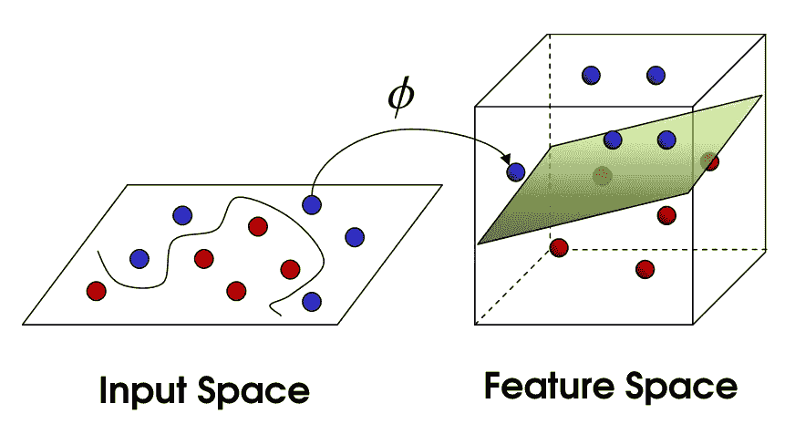

# 非数学家的内核指南

> 原文：<https://towardsdatascience.com/a-tourist-guide-to-kernels-for-non-mathematicians-639c9d7ab03a?source=collection_archive---------9----------------------->

## [思想和理论](https://towardsdatascience.com/tagged/thoughts-and-theory)

## 在不走出房间的情况下，进行一次到无限的往返旅行

[布鲁斯唐](https://unsplash.com/@brucetml?utm_source=medium&utm_medium=referral)在 [Unsplash](https://unsplash.com?utm_source=medium&utm_medium=referral) 上的照片

我经常从数学中获得关于现实和我们人类如何适应的灵感(尽管并不完美)。我明白内核实际上为我做了什么的那一天仍然是那些令人难忘的敬畏时刻之一。

数据科学家和机器教师肯定熟悉*内核技巧*的概念。他们研究它，经常理解它，哪怕只是一秒钟，然后迅速把它束之高阁。有数十篇关于内核及其对数据科学家的意义的技术论文和帖子。但是它们的美丽、优雅，以及它的使用可以给非数学家带来的关于符号思维能力的直觉，使我确信值得花时间为非数学家写一本内核的旅游指南。

尽管我会以不严谨为代价，尽可能减少数学术语(请原谅)，但这一旅程需要一些耐心。相信我，会有回报的。

**如果你认为你不能线性分离一组物体，你只是没有从正确的角度看待它**

由[大卫·拉古萨](https://unsplash.com/@davideragusa?utm_source=medium&utm_medium=referral)在 [Unsplash](https://unsplash.com?utm_source=medium&utm_medium=referral) 上拍摄的照片

想象一下，你在一个亭子前排队领取你的(疫情之前的)音乐会门票，队伍由你、你前后的几个朋友以及一群你不认识的人组成。

现在，从你的角度来看，没有办法把你的朋友和其他人区分开来。假设你们都整齐有序地排队，除了谁在后面，谁在前面，你看不到什么。但是如果你在一栋建筑的二楼，俯瞰同一条线，这个练习反而会非常容易；从顶部你可以清楚地看到你的朋友在哪里停下来，其他人在哪里开始排队。

换句话说，对你来说，在二维停车场上和其他东西放在一起，看起来像前面的一个点和后面的一个点，对住在三维建筑中的你上面的观察者来说，看起来像一楼有序的线。对于这个人来说，很容易画出另一条假想的线来区分朋友和陌生人。这种维度转换就是数学家所说的添加一个额外的特征来使数据集线性可分。

这个戏法从二维到三维，从三维到四维，从四百万到五百万都有效。无需发明任何东西，只需转换你所拥有的关于一组物体的信息，为这些物体增加新的维度或坐标，你就可以几乎线性地分离任何一组。

我再举两个例子。

图片来自悉达多·夏尔马，SVM 的内核把戏

在左边的图表中，你可以看到一个二维空间中的点云，这些点永远无法线性分离(在那个空间中)。换句话说，一条线必然会穿过一些红色或绿色的点，却无法将红色和绿色区分开来。但是看看右手边发生了什么:通过某种特征转换，将这些数据从二维空间转移到三维空间，可以画一条线(或者更好，现在是一个平面)来完美地区分两组。回到我们最初的二维空间，同一个平面看起来就像一条圈出红点并将它们从绿色中分离出来的圆形线。这又是一个视角问题。

**特征转换是什么意思？**数学家们之所以谈论特征变换，是因为在从二维空间到三维空间的变换中，没有添加任何东西，而只是增加了一些内部特征。在数学中，这种转换可以描述如下。二维空间中的每一个点都可以用坐标向量**x**= x₂}.{x₁来表示特征变换函数ϕ( **x** )将这两个坐标组合起来，并吐出三个坐标:ϕ( **x** ) = {x ₁，√2x₁x₂，x ₂}.由于ϕ( **x** ，右手边的图形将所有点 **x** 绘制到新的空间中。

图片来自 Sourodip Kundu，在 SVM 发现非线性决策边界

第二个也是最后一个例子不太直观，但让我们了解了离散特征到(更)高维空间的转换是多么强大。在这种情况下，ϕ将二维空间的特征扩展到一个更高维的空间(不要被立方体所迷惑，我们根本无法在一张照片中表现出许多维度)。在这个更高维度的假设空间的某个地方，数据仍然可以被一个更高维度的超平面线性分离——你需要相信我。在纸张的二维平面上，这个超平面看起来像一条围绕红点弯曲的线。

当你认为一种现象太模糊而不能被清楚地理解和分类时，这可能仅仅是因为你不能从一个足够复杂的角度来看待所有的信息，从而对它有所了解。

没关系，但是内核是什么？

再忍耐我一会儿。事实证明，在这个更高维度的空间中进行计算会使事情变得非常复杂。你通常想要处理(和分离)的信息比具有两个坐标的点复杂得多，这意味着它已经存在于高维空间中。例如，一幅图片有数千或数百万个像素，每个像素代表一个坐标。将这些高维对象投影到一个甚至更多维的宇宙中，会使这些对象之间的每一次操作都变得极其昂贵，当你知道机器学习需要大量计算，涉及数百万条数据，这些数据已经具有令人难以置信的数量的独特特征时，你不会感到惊讶。

在机器学习中(或者更具体地说，在线性 SVM 分类中)，我们需要执行的最典型的操作之一称为**点(或内)积**，涉及将一个对象的每个坐标乘以另一个对象的相同坐标，然后将所有这些乘积的结果求和。回到我们的第一个例子，**x**= x₂}{x₁和**y**= y₂}{y₁的点积将是(x₁y₁ + x₂y₂).)这个点积包括 3 次运算、2 次乘法和一次求和，从而得到结果。相反，将相同对象的点积转换到它们新的三维空间ϕ( **x** )={x ₁，√2x₁x₂，x ₂}和ϕ( **y** ) = {y ₁，√2y₁y₂，y ₂}会更昂贵，(x \y \+2x y \y \y \+x \y \y \y \u)涉及变换、乘法和求和之间的若干运算。

在更高维度的空间中，也就是机器通常运行的空间中，这种复杂性的差异是巨大的，使得这些转换在我们的有生之年往往是不可行的。正是在这里，所谓的*内核技巧*(终于)来帮助我们了。内核实际上是一个能够仅基于原始向量 **x** 和 **y** 来计算ϕ( **x** 和ϕ( **y** 之间的点积的函数，因此不必计算(甚至不必知道)变换ϕ.可以证明(默瑟定理)，在很少的数学条件下，这样的函数 K( **x** ， **y** )总是存在的。

在我们的具体例子中，函数 K( **x** ， **y** ) = ( **xᵗ ∙ y** )，即原向量 **x** 和 **y** 的点积的平方(在 **x** 上面的上标 **t** 代表*转置*，这只是由于矩阵代数和你的复杂性然而，不同之处在于，为了计算 K( **x** ， **y** )，我们需要 4 次运算(2 次乘法和一次点积求和，加上数字的平方)，仅此而已。

所发生的事情乍看起来可能是无辜的，但实际上却是强大的。通过在概念上想象一个在我们的原始空间中运行的功能，我们可以获得在更高维度空间中运行的全部好处，而不必去访问这样的空间，或者为与之相关的复杂性而烦恼。

但是让我进一步扩展一下，以防你仍然需要一些说服力。

就拿下面的核函数来说，所谓的高斯核。

K( **x** ，**y**)= exp(-γ∨x-y∨)

可以证明，处理函数 K( **x** ， **y** ，即在 **x** 和 **y** 所在的原始离散维空间中进行简单的数学运算，等于将 **x** 和 **y** 投影到一个**无限维**空间中，并计算这些变换的点积。如果你对前面的例子没有什么印象，现在试着比较一下我们求解这个核函数所需的运算次数，包括计算无限次的变换、无限次的乘法和无限次的求和。

我们从概念上思考的能力，不受时间和空间的限制，使我们有可能在办公桌上或通过屏幕享受无限的未知之旅的所有实际好处。