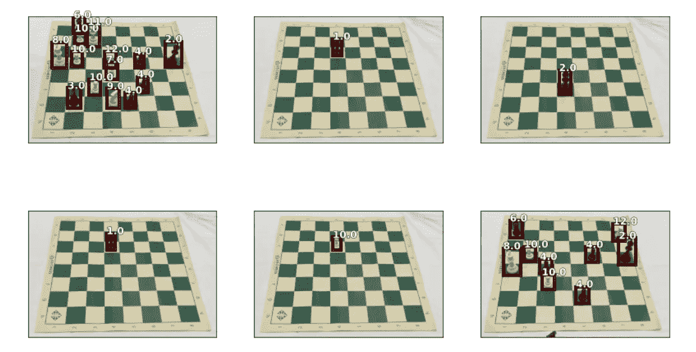
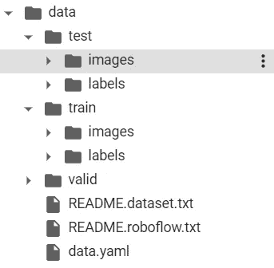
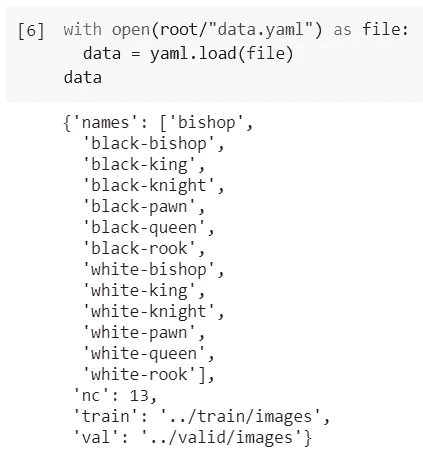
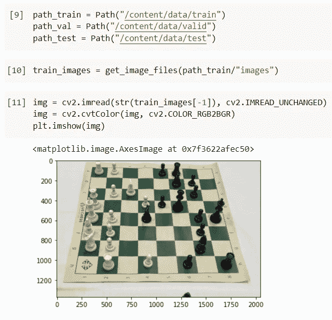
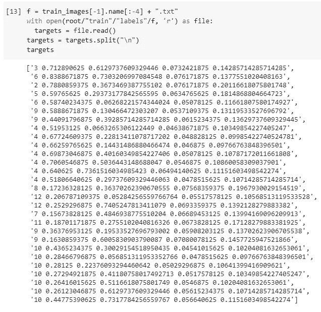
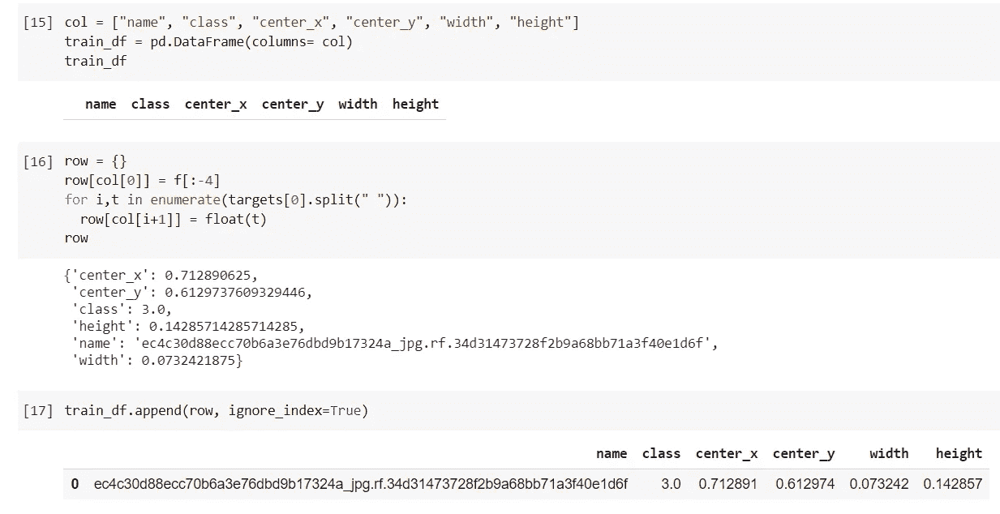
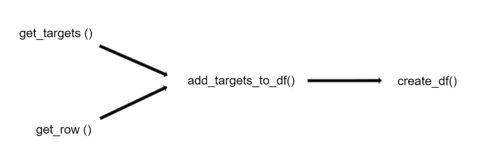
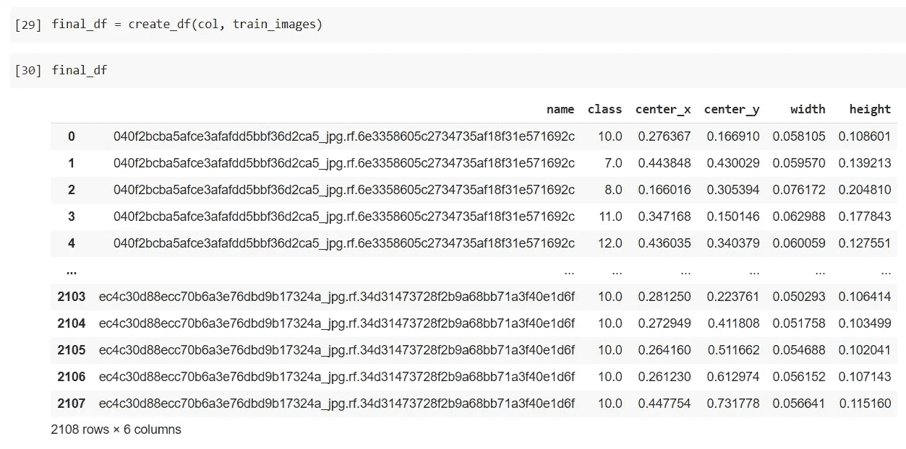
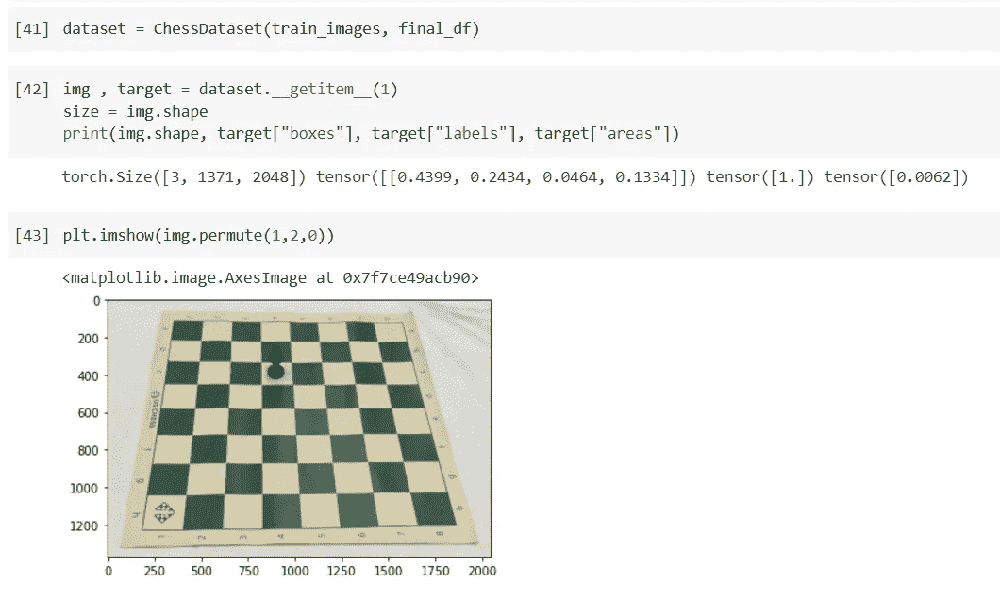

# 使用 PyTorch 和 Fastai 创建对象检测数据管道的教程

> 原文：<https://towardsdatascience.com/a-tutorial-on-creating-data-pipeline-for-object-detection-using-pytorch-and-fastai-eae20a4e8472?source=collection_archive---------7----------------------->

## PyTorch 中的数据管道

## 一种构建数据管道的通用方法



作者图片

大多数时候，你开始使用预处理数据集(如 Sklearn 的数据集)进行机器学习，以实现机器学习算法，但随着你转向更新颖的机器学习项目，数据集通常是原始格式，可能具有非常松散的结构。

我在这里分享一个我开发的通用方法，从这些原始数据集开始，在 PyTorch 中构建一个数据集管道。

我们要使用的数据集是象棋数据集，这是一个对象检测数据集，您可以使用链接[https://public.roboflow.com/object-detection/chess-full/23](https://public.roboflow.com/object-detection/chess-full/23)下载数据集，在本教程中，我们将使用 Yolo v5 PyTorch 版本的数据集。

使用[https://github . com/varun 9213/Blog _ machine _ learing/blob/main/Dataset _ pipeline _ Blog _ 1 . ipynb](https://github.com/Varun9213/Blog_machine_learing/blob/main/Dataset_pipeline_blog_1.ipynb)下载教程的笔记本


作者图片

您可以直接从笔记本上下载带有网站生成的链接的数据集。本文的其余部分将由小节组成，这些小节将构建一个创建 PyTorch 数据集管道的逐步方法。

# 数据集中的一般结构和文件扩展名

原始数据集通常看起来像复杂的谜题。第一次打开一个非常原始的数据集时，我也不知所措，但后来我仔细查看了一段时间，然后将问题分解成更小的部分，它开始变得有意义了。将拼图分成小块总是一个好主意。

一般来说，你会遇到两种形式的结构化方案。

更常见的结构是根据标签将图像划分到单独的文件夹中。父文件夹的名称是这些图像所属的标签。另一种常见的结构是将所有图像放在一个文件夹和一个单独的文件中。csv，。txt，。json 等。)保存标签，其索引或文件名是图像和相应标签的名称。



作者图片

Chess 数据集包含三个文件夹 train、valid 和 test，每个文件夹都有一个 images 文件夹和 labels 文件夹。有两个自述文件和一个名为 data.yaml 的 YAML 文件。我们的数据集属于第二种类型，其中类和边界框位于单独的。txt 文件，这是您通常会在对象检测数据集中找到的结构。

现在，我们已经研究了结构并查看了我们正在处理的文件的扩展名，让我们打开这些文件，以便更好地理解我们接下来需要采取的步骤。

# 打开并浏览数据集中的文件

开始时，你会经常遇到你从未处理过的文件类型，这似乎是一件复杂的事情，但是，大多数情况下，这只是一个五分钟的谷歌搜索，并不像一开始看起来那么复杂。

该数据集有 3 种类型的文件。jpg，。大多数读者可能熟悉前两种文件类型，虽然 yaml 对一些读者来说可能是新的，但 YAML 只是一种类似于 JSON 的序列化标准，主要用于存储配置。在大多数情况下，您不需要了解文件类型遵循的协议，您只需要知道如何在 python 中打开这些文件并从中提取数据。

我们将从研究 YAML 档案开始。你可以点击链接[https://stack abuse . com/read-and-write-YAML-to-a-file-in-python/](https://stackabuse.com/reading-and-writing-yaml-to-a-file-in-python/)了解如何处理 YAML 文件。它几乎涵盖了在 python 中处理 YAML 文件所需的所有工具。

让我们从安装和导入本教程所需的所有库开始。

```
!pip install fastai --upgrade
!pip install pyyamlfrom fastai import *
from fastai.vision.all import *
from fastai.imports import *
import yaml, cv2, os
from torchvision import transforms as Troot = Path("/content/data")
```

路径是 fastai 中的一个对象，它让你的生活变得更加容易，你可以在 fastai 网站【https://course19.fast.ai/part2】的 [docs.fast.ai](https://docs.fast.ai/) 上阅读 fastai library 提供的路径和其他非常方便的工具，我也强烈推荐 Jeremy 在 fastai 网站[上的免费 fastai 深度学习课程。](https://course19.fast.ai/part2)

现在让我们看一下 data.yaml 文件。

```
with open(root/"data.yaml") as file:
data = yaml.load(file)
data
```



作者图片

这是一个字典，包含标签名称、类别数量以及训练和验证文件夹的路径。为了构建管道，我们可以忽略这个文件。

接下来，让我们看看图片

```
path_train = Path("/content/data/train")
path_val = Path("/content/data/valid")
path_test = Path("/content/data/test")train_images = get_image_files(path_train/"images")img = cv2.imread(str(train_images[-1]), cv2.IMREAD_UNCHANGED)
img = cv2.cvtColor(img, cv2.COLOR_RGB2BGR)
plt.imshow(img)
```



作者图片

get_image_files()是另一个非常方便的 fastai 方法，可以获取所有常见格式的图像，如 jpg、png 等。从所有子目录中。返回的列表不包含图像本身，而是包含所有图像的路径。

> **注意**注意图像的分辨率是 1371 x 2048，这是相当高的，大多数对象检测算法，如 yolo，允许矩形图像，但是当使用高分辨率图像时，训练自然会慢一些。因此，我们可能希望将这些图像调整到较低的分辨率。然而，与分类任务相反，在对象检测中，目标对于分辨率不是不变的，因为如果图像被调整大小，边界框也必须被调整大小。

让我们最后打开相应的标签。

```
f = train_images[-1].name[:-4] + ".txt"
with open(root/"train"/"labels"/f, 'r') as file:
  targets = file.read()
targets = targets.split("\n")
targets
```



作者图片

样本的第一个条目显然是类，接下来的 4 个条目定义了边界框。边界框的格式对于不同的算法是不同的，Yolo 的边界框格式是[ center_x，center_y，width，height][https://towards data sciences . com/image-data-label-and-annotation-you-the-knowledge-86 ed 6 c 684 b 1](/image-data-labelling-and-annotation-everything-you-need-to-know-86ede6c684b1)如果你想更深入地探讨这个主题，这是一个很好的资源。

# 准备数据帧以有效访问图像标签

这个步骤非常主观，每个人都有自己的偏好，我喜欢在创建 PyTorch 数据集对象之前，将数据编译到一个数据框中。

> ***注*** *此步骤无必要且可跳过。然而，在我看来，只需少量的工作和几行代码，就可以大大简化数据集构建步骤。话虽如此，任何方法中最重要的是来自实践的熟悉，所以我强烈建议您找出一个您熟悉的通用方法，并尽可能多地坚持下去。*

让我们从选择一个样本开始，并为这个样本制作一个数据框。数据框将具有图像的名称、类和边界框坐标。

```
col = ["name", "class", "center_x", "center_y", "width", "height"]
train_df = pd.DataFrame(columns= col)
train_dfrow = {}
row[col[0]] = f[:-4]
for i,t in enumerate(targets[0].split(" ")):
  row[col[i+1]] = float(t)
rowtrain_df.append(row, ignore_index=True)
```



作者形象

> **注意**通常最好从整个数据集中抽取一个样本，并使用该样本。这有两个优点，一是速度快得多，尤其是在数据集非常大的情况下，二是处理单个样本比处理整个数据集容易得多。*这种做法极大地提高了我高效准备数据集管道的能力。*

最后，我们将把这些单独的命令转换成函数，将整个数据集转换成一个数据框架

```
def get_targets(image_path):
  f = image_path.name[:-4] + ".txt"
  with open((image_path.parent).parent/"labels"/f, 'r') as file:
    targets = file.read()
  return targets.split("\n")def get_row(image_path, target, col): 
  row = {}
  row[col[0]] = image_path.name[:-4]
  for i,t in enumerate(target.split(" ")):
    try:
      row[col[i+1]] = float(t)
    except:
      print("Could not convert {} to float".format(t))
  return rowdef add_targets_to_df(df, image_path):
  targets = get_targets(image_path)
  df_new = df
  for target in targets:
    row = get_row(image_path, target, df.columns)
    df_new = df_new.append(row, ignore_index = True)
  return df_newdef create_df(cols, images_paths):
  df = pd.DataFrame(columns=cols)
  for path in images_paths:
    df = add_targets_to_df(df, path)
  return df
```

将复杂的任务分解成更小的部分并将每个部分包装成一个函数总是一个好的做法，它简化了问题并产生了更可读的代码，这使得故障诊断比将所有事情都塞进一个函数中更容易。



作者形象

```
final_df = create_df(col, train_images)
final_df.head()
```



作者形象

现在，最后一步是创建 PyTorch 数据集对象，这将是最后一部分。

# 创建 Pytorch 数据集

Pytorch 和 Tensorflow 是最受欢迎的深度学习图书馆，PyTorch 因其提供的灵活性最近在研究人员中变得更受欢迎。

让我们从为象棋数据集构建数据集管道开始。

```
def get_target_ds(name, df): rows = df[df["name"] == name[:-4]]
  return rows["class"].values, rows[bboxes_cols].valuesclass ChessDataset(torch.utils.data.Dataset):

  def __init__(self, images_path, df):
    super(ChessDataset, self).__init__()
    self.images_path = images_path
    self.df = df def __len__(self):
    return len(self.images_path) def __getitem__(self,idx):
    img_path = self.images_path[idx]
    img = cv2.imread(str(img_path), cv2.IMREAD_UNCHANGED)
    target = {}
    labels, boxes = get_target_ds(img_path.name, self.df)
    areas = boxes[:,2] * boxes[:,3]
    iscrowd = torch.zeros((boxes.shape[0],))
    image_id = torch.tensor([idx])
    labels = torch.as_tensor(labels, dtype=torch.float32)
    boxes = torch.as_tensor(boxes, dtype=torch.float32)
    areas = torch.as_tensor(areas, dtype=torch.float32)
    target["boxes"] = boxes
    target["labels"] = labels
    target["areas"] = areas
    target["iscrowd"] = iscrowd
    target["image_id"] = image_id img = F.to_tensor(img) return img, target
```

ChessDataset 类从 PyTorch 继承 torch.utils.data.Dataset 类，我们需要为其定义 __init__()、__len__()和 __getitem__()函数，以更深入地了解如何创建 PyTorch 自定义数据集。

最后，让我们通过创建一个实例来测试我们的类，并通过调用 __getitem__()来获得一个样本，以查看它是否正常工作。

```
dataset = ChessDataset(train_images, final_df)img , target = dataset.__getitem__(1)
size = img.shape
print(img.shape, target["boxes"], target["labels"])plt.imshow(img.permute(1,2,0))
```



作者图片

您的数据集可以与 PyTorch 的数据加载器一起使用了！！

# 结论

这里的想法是有一系列的步骤，对大多数数据集来说足够宽泛。为训练准备数据集也是一项技能，正如任何技能练习都是胜任的关键一样，我强烈建议你继续 Kaggle，用看起来复杂的数据集打开封闭的比赛，并尝试为这些比赛建立一个数据集管道，然后使用人们为这些比赛发布的内核来排除故障，数据集越让你不舒服，你就越能从练习中学到更多。

最后，我希望这篇文章为所有读者提供一些见解，我计划继续发表这篇文章，讨论相同的数据集，包括各种绘图函数和策略，在 PyTorch 中挑选和训练预训练的模型，以及其他任何可能与主题相关的内容，敬请关注，谢谢。