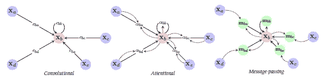
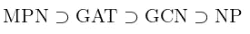
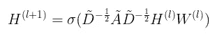
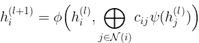
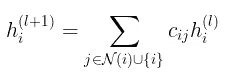
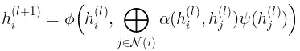
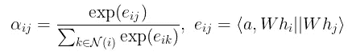
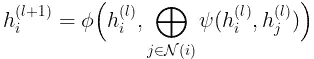
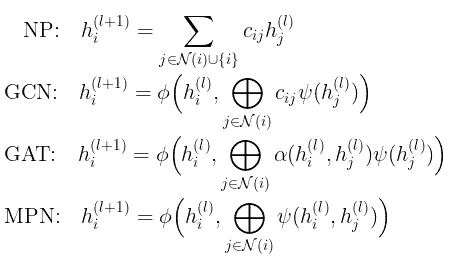

# 图形神经网络的统一视图

> 原文：<https://towardsdatascience.com/a-unified-view-of-graph-neural-networks-12b40e8fdac5?source=collection_archive---------14----------------------->

## [实践教程](https://towardsdatascience.com/tagged/hands-on-tutorials)

## 图形注意、图形卷积、网络传播都是图形神经网络中消息传递的特例。

三种不同 gnn 的插图。图片来自[1]。

消息传递网络(MPN)、图形注意力网络(GAT)、图形卷积网络(GCN)，甚至网络传播(NP)都是属于图形神经网络(GNN)范畴的密切相关的方法。这篇文章将提供这些方法的统一观点，主要来自于[1]中的第 5.3 章。

# TL；速度三角形定位法(dead reckoning)

*   NP 是 GCN 的特例，没有隐藏特征变换和非线性。
*   GCN 是 GAT 的一个特例，其“注意力”完全由图结构单独决定，没有节点特征。
*   GAT 是 MPN 的一个特例，具有作为“消息传递”规则的隐藏特征聚合。
*   这些 gnn 之间的关系可以通过包含关系总结如下。

# 图形卷积-隐藏特征的局部聚合

图形卷积[2]遵循层传播规则:

就每一个节点而言，传播可以看作是邻居节点的变换( *psi* )隐藏特征 *h* )的**局部聚集** ( *圈加*)，之后是某种变换(*φ*)*。*具体来说，在 GCN [1]中， *phi* 是仿射变换( *W* )后跟非线性( *sigma* )。

聚集量( *c_{ij}* )完全由**图结构**决定，比如谱归一化邻接矩阵。

注意:聚合( *circle-plus* )可以是任何排列不变函数，如求和、元素乘积等。

有趣的是，网络传播可以被视为没有任何特征转换的图形卷积的特例，正如我在上一篇[帖子](/network-learning-from-network-propagation-to-graph-convolution-eb3c62d09de8)中更详细讨论的那样。简而言之，按照这里相同的符号，网络传播将遵守如下传播规则

# 图形注意-重新学习边权重

类似于 GCN，GAT [3]执行隐藏特征的局部平均。但是，它不是只使用图结构来指导传播，而是通过一个可学习的函数 *alpha* ，根据隐藏的特征来学习**重新加权传播权重** ( *c_{ij}* )。

在[3]中，这个**“自我注意机制”** *alpha* 被计算为可学习向量 *a* 和两个节点的仿射变换隐藏特征的串联之间的 softmax 归一化内积。

# 消息传递—更一般的聚合

消息传递网络[4]通过用两个节点的隐藏特征的某个**任意函数**代替隐藏特征聚集，进一步概括了对聚集的信息量进行控制的思想。

将所有不同的 GNN 方法放在一起，我们可以看到它们都遵循相同的**局部聚集**，或者通过局部平均(NP)或者置换不变函数(*圆加*)。

最后，现在更清楚不同的 gnn 是如何相关的。

*   GCN 是通过将注意力函数*α*设置为谱归一化邻接矩阵来实现 GAT 的。
*   GAT 是 MPN 的一种实现，通过以自我关注为消息传递规则的隐藏特征聚合。

# 参考

[1] M. M .布朗斯坦，j .布鲁纳，t .科恩，p .维利科维奇，[几何深度学习:网格、组、图、测地线和量规](https://arxiv.org/abs/2104.13478) (2021)

[2] T. N. Kipf，M. Welling，[利用图卷积网络的半监督分类](https://arxiv.org/abs/1609.02907) (2016)

[3] P .韦利奇科维奇，g .库库尔，a .卡萨诺瓦，a .罗梅罗，p .莉雅，y .本吉奥，[图形注意网络](https://arxiv.org/abs/1710.10903) (2018)

[4] J. Gilmer，S. S. Schoenholz，P. F. Filey，O. Vinayls，G. E. Dahl，量子化学的神经[信息传递](https://arxiv.org/abs/1704.01212) (2017)

[5] [网络学习——从网络传播到图形卷积](/network-learning-from-network-propagation-to-graph-convolution-eb3c62d09de8)