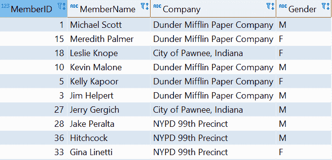
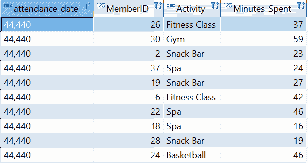
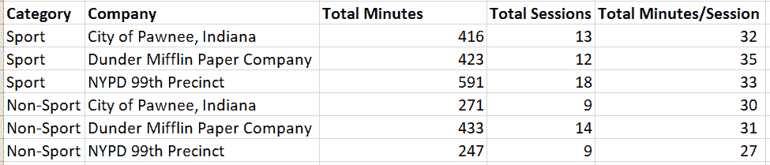
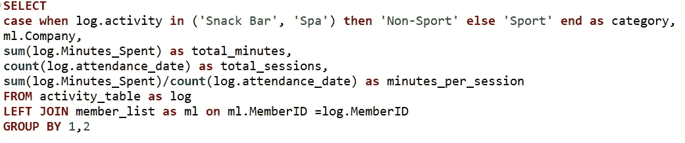
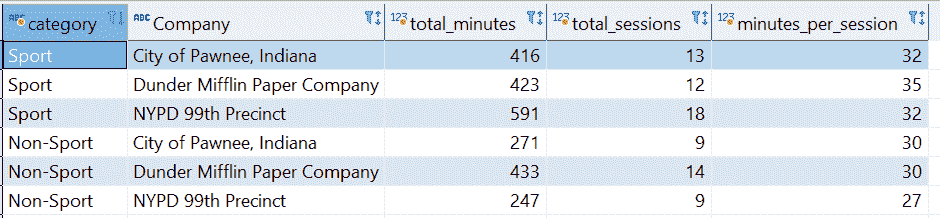

# 学习 SQL 的有益心态

> 原文：<https://towardsdatascience.com/a-useful-mindset-for-learning-sql-b0c98764e17?source=collection_archive---------11----------------------->

## 分享这种思维加速了我的 SQL 学习过程

卡斯帕·卡米尔·鲁宾在 [Unsplash](https://unsplash.com?utm_source=medium&utm_medium=referral) 上的照片

对于好奇的工作者来说，尤其是那些在科技行业工作的人，探索数据库可以把你带到天堂。这就是我在挖掘大量数据集，为我的项目寻找有见地的信息时的感受。使用结构化查询语言(SQL ),我可以轻松地组合和聚合来自各种来源的数据来回答我的问题。这真的消除了下载各种 excel 文件，然后编写和复制所有 VLOOKUP 和 IF 函数的痛苦。通过我的定制 SQL 脚本，我可以使用 Tableau 或 PowerBI 创建数据可视化，与业务利益相关者分享见解。关键工具确实是 SQL，我现在认为它是新的 Excel。

说实话，我一开始很害怕学 SQL。它看起来像一种复杂的编码语言，只有计算机科学家才能理解。然而，事情通常没有看起来那么复杂。有一次跟同事学了之后实际尝试了一下，真的掌握了窍门。我开始探索用例并生成以前没有使用过的模型。最重要的是，这项新技能带来的灵活性和速度让工作变得更加愉快。

在这篇文章中，我想分享我的 SQL 故事:帮助我快速获得这项技能的心态。

# 这都是简单的数学

照片由[安托万·道特里](https://unsplash.com/@antoine1003?utm_source=medium&utm_medium=referral)在 [Unsplash](https://unsplash.com?utm_source=medium&utm_medium=referral) 上拍摄

高中时，基础数学是我最喜欢的科目。我喜欢解二次方程和三角学问题。这就像解决一个难题或谜团，比如谁是 x，或者当我们知道 o 的正弦值时，a 点到 b 点的距离是多少？这种心态带来的兴奋会建立你的逻辑思维。

数学和 SQL 都是关于逻辑的，你只需要理解逻辑就能得到预期的结果。体现数学思维真的有助于加速我的 SQL 学习过程。这种思维模式还帮助我学习了会计学(我的本科专业)、经济学和 Microsoft Excel 中的数据建模。后者实际上是最重要的，我将在下一节讨论。

# 和 Excel 没那么大区别

在从事技术工作之前，我几乎所有的工作都使用 Microsoft Excel。我被要求使用 VLOOKUP、IF 和 Pivot tables 等函数为价格计算和市场份额分析等案例创建模型。多亏有一个像老鹰一样盯着我的老板，还有时间来完善我的技能，我可以学习 Excel 的逻辑并创建更有效的模型。掌握这些知识对我学习 SQL 至关重要。我发现编写一个查询与构建一个 Excel 模型没有什么不同。数据仓库就像一个包含 Excel 文件的大型共享文件夹，我的查询就是填充这个空白表格。下面是我为这篇文章做的一个简单的例子。

假设有一家健身公司，姑且称之为好地方，它为公共和私营部门的组织提供企业会员。每个俱乐部都有这些活动/设施:健身班、健身房、篮球场、游泳池、水疗中心和小吃店。有几组数据:(1)从客户组织的注册表单中提取的成员列表，以及(2)每次成员使用他们的卡登记/离开时收集的活动日志。Good Place 希望进一步分析每个客户组织的活动。

第一个数据集包含成员的唯一 ID、全名、公司/机构和性别，如下所示。

作者使用 DBeaver 制作的图像

而第二个数据集包含日期 id、成员 ID、活动和花费的分钟数，如下所示。

作者使用 DBeaver 制作的图像

如您所见，两个数据集之间唯一的共享列是 MemberID。与此同时，The Good Place 的首席执行官 Eleanor Shellstrop 希望了解每个客户组织花费的平均时间，并按运动(健身班、篮球、游泳、健身房)和非运动(小吃店和 spa)对活动进行分类。Excel 和 SQL 都可以做到这一点，我们来看看它们是如何比较的。

## 擅长

由于有两个独立的数据集，最好从将成员列表中的列添加到活动日志开始，因为后者被视为事实表(存储度量和指标)。prior 是一个维度表，因为它提供了成员 ID 列的详细信息/属性。

为了创建链接，我们将在“Minutes_Spent”之后的列中使用 VLOOKUP 函数，即:VLOOKUP(MemberID，' Sheet1_Member_List！一个:D，列号，0)。一个更方便但未被充分利用的函数是 INDEX + MATCH，它将是:INDEX(MemberList Array，MATCH(MemberID，' Sheet1_Member_List！A:A，0)，MATCH(列名，' Sheet1_Member_List！A1:D1！, 0).这消除了为 VLOOKUP 函数填充列号的需要。

要添加自定义列，我们可以使用流行的 IF 函数结合 OR，那将是 IF(OR(Activity = "Snack Bar "，Activity="Spa ")，" Non-Sport "，" Sport ")。

下一步是汇总数据以生成所需的见解。有两种方法可以做到这一点:创建一个数据透视表或者使用 SUMIFS 和 COUNTIFS 这样的聚合函数。前一个要简单得多，你所需要做的就是阻塞数据区域并插入一个数据透视表。但是，它的可持续性较差，因为(1)它为 Excel 文件增加了更多的内存，使其操作更加繁重,( 2)如果有额外的行，每次更新数据和更改范围时，您都需要刷新它。

如果文件将被长期重用，那么聚合函数更为有利。为了满足 Eleanor 的请求，我们可以复制类别和客户组织，然后删除重复项。然后，我们使用 SUMIFS 计算总分钟数，使用 COUNTIFS 计算总会话数，因为它不是数字。该功能将是:

总分钟数:=SUMIFS('Combined Dataset.csv '！$D:$D，'组合数据集. csv '！$E:$E，A5，'组合数据集. csv '！$F:$F，B5)

会话总数:=COUNTIFS('Combined Dataset.csv ')！$E:$E，A5，'组合数据集. csv '！$F:$F，B5)

有了这两个汇总，我们可以用总分钟数除以总会话数，得到总分钟数/会话数。最终输出如下所示:

作者使用 Microsoft Excel 制作的图像

对于 excel 用户来说，这似乎很简单。但是想象一下，如果有更多的客户组织和活动日志，再加上 Eleanor 每天都在请求这些信息，那该有多好？此外，如果埃莉诺要求更多的报告呢？制作模型、下载各种文件和复制数据将花费大量时间，这也容易出现人为错误。现在让我们看看 SQL 方法。

## 结构化查询语言

我们不必打开所有这些文件，只需编写一个简单的查询，如下所示:

作者使用 DBeaver 制作的图像

这将生成 Excel 格式的精确输出:

作者使用 DBeaver 制作的图像

用 Excel 的术语来解释，SELECT 就像使用等号在 FROM 中声明的主数据集中召唤所需的列，在本例中是活动日志。不使用 VLOOKUP，我们可以输入 LEFT JOIN，然后输入我们想要链接的数据集(就像 Excel 公式中的列选择),然后设置链接列(查找单元格)。CASE WHEN 类似于 IF 函数，只是格式不同。对于聚合，您只需要使用 SUM 和 COUNT，然后在最后使用 GROUP BY 来表示所使用的列。这与 SUMIFS 和 COUNTIFS 函数的后半部分相同，在后半部分，我们选择列和单元格作为聚合的基础。使用 SQL 可以消除上一节中提到的所有 Excel 工作。

为了让 Eleanor 了解情况，可以用 Tableau 编写这个查询，并创建一个可访问的仪表板。然后，她的分析师可以处理其他项目，而不必进行任何手动操作，也不必为这个特定主题发送电子邮件。

# 不断探索和挑战自己

通过不断练习和访问新的数据集，我对 SQL 的理解变得更加流利。有更多的机会刺激好奇的头脑进一步探索。当学习数据集时，我总是很兴奋，因为这可以加强我的分析。这将带来被忽视的新见解，并对问题陈述有更深的理解。

由于技术增加了工作动力，我总是认为有必要挑战自己。主要目标是如何更有效地工作，以产生及时和准确的见解。我花时间回顾我以前的问题，并思考如何缩短它，首先想到的是“总有改进的空间”。有许多可能的功能尚未使用。像 Presto 这样的 SQL 引擎在[网站](https://prestodb.io/)上有完整的列表供进一步学习。另一个简单的学习方法是不断搜索，搜索的信息就会出现。不断完善你的技能总是很重要的，或者用斯蒂芬·柯维的话说，磨利锯子。

# 结束语

我强烈建议任何从事分析工作的人都应该学习 SQL，尤其是从事技术工作的人。它不仅会加快你的交付速度，还会给你探索新见解的空间和灵活性。此外，精通 SQL 将使你更容易进入下一个层次:Python。从我的个人经验来看，我可以用类似的思维方式快速学习 Python Pandas:这都是简单的数学，与 SQL 没有太大的不同，并且不断练习。最重要的是，我们必须承认当前的技术发展需要新的技能。因此，我们必须不断学习，成为我们组织的宝贵财富。