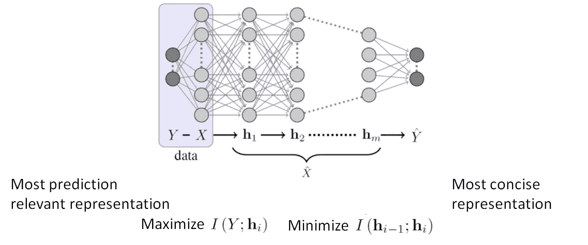
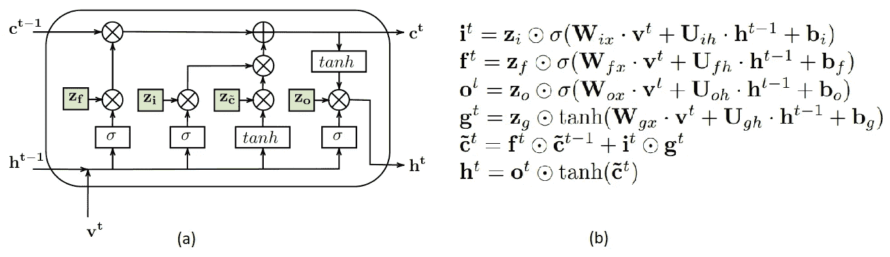
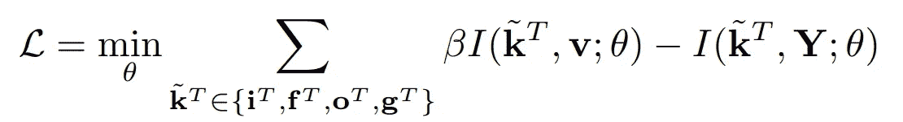
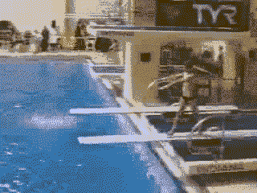

# 基于变分信息瓶颈(VIB)的人体动作识别序列网络压缩方法

> 原文：<https://towardsdatascience.com/a-variational-information-bottleneck-vib-based-method-to-compress-sequential-networks-for-human-b559d3a50e30?source=collection_archive---------35----------------------->

## 压缩 LSTMs 并推断边上的模型

本文是关于我们 [**最近在 WACV 2021**](https://openaccess.thecvf.com/content/WACV2021/papers/Srivastava_A_Variational_Information_Bottleneck_Based_Method_to_Compress_Sequential_Networks_WACV_2021_paper.pdf) 上发表的关于神经网络压缩的论文。

# **需要压缩网络以执行具有序列数据的任务，例如用于动作识别的视频:**

递归神经网络(RNNs)及其高级变体长短期(LSTM)等网络专门用于处理文本、口语和视频等序列数据。但是这些网络具有大量的参数，并且导致大量的推理时间。这些网络中隐藏状态的数量是一个超参数，通常选择的数量(256 或 512 或 1028)通常比精确预测所需的数量大得多，并导致过度参数化。在视频动作识别任务中，输入视频帧通常由 RGB 叠加彩色帧组成，形成高维输入。因此，对于 RNNs，输入的维数变高，使得输入-隐藏矩阵非常大。例如，来自 UCF11 数据集的视频具有尺寸为 160x120 像素的 RGB 帧。因此，总输入大小必须为 160x120x3= 57，000。即使相对较小的隐藏状态大小为 256，单层 LSTM 模型中所需的总参数为**5890 万。**天真的*过参数化*一层端到端 LSTM 模型在 UCF11 数据集上以 67.7%的精度过度拟合[4]。

# **具有可变信息瓶颈的“相关性”思想:**

几种张量分解方法[3，4，5]已应用于 RNNs，以低秩结构取代标准的输入-隐藏矩阵。这些方法修改输入并对输入-隐藏矩阵建模，以保留较低秩的密集权重矩阵。然而，大多数压缩 RNNs 的方法并不压缩隐藏到隐藏矩阵的大小。作为一个简单的动作识别数据集，UCF11 比其他大型数据集(如 UCF101)具有更少的类，数据集中的变化很小。这提示只需要几个与正确预测动作相关的隐藏状态来对数据表示进行建模。Tishby 等人[1]提出的*变分信息瓶颈(VIB)* 理论引入了在神经网络中仅保留*相关中间数据表示*同时保持预测准确性的思想。

图 1: Tishby 等人。文献[1]提出了基于信息论测度的变分信息瓶颈原理，以获得最简洁而又可预测的相关表示。

我们将这一想法应用于 RNNs 的复杂变体，LSTM 网络*移除冗余输入特征和隐藏状态*，从而减少模型参数的总数。

# **如何用 VIB 保留相关的隐藏状态和输入特征到 LSTMs？**

受 VIB 去除冗余神经元思想的启发，我们在压缩时序网络方面做出了以下贡献:

(a)我们提出了如图 2(a)所示的新型 VIB-LSTM 结构，用于训练高精度稀疏 LSTM 模型。

(b)我们开发了一个顺序网络压缩流水线，该流水线稀疏化 RNNs/lstm/gru 的预训练模型矩阵。

(c)对于结合 CNN 和 LSTM 的架构，我们的 VIB 框架仅保留预测相关特征，这些特征可以作为 VIB-LSTM 结构的输入。

(d)我们在流行的动作识别数据集 UCF11、UCF101 和 HMDB51 上评估我们的方法，以产生具有可与最先进模型相比的验证准确度的紧凑模型。

图 2: (a)单个 VIB-LSTM 电池。它在每个门输出后有一个 VIB 层 **z** (显示为绿色)，作为一个可训练的面具。每个 **z** 遵循具有可训练参数的多元高斯分布。(b)VIB-LSTM 结构的方程表明只需要对原始方程稍加修改。

我们的目标是学习一个压缩表示门表示 *i^t、f^t、o^t 和 g^t* ，同时保留 *v^t* 中预测所需的相关空间和时间信息。在变分信息瓶颈(VIB)框架[1]中，这是一个优化问题，目标是学习 *k\tilda^T* ，使其具有最少的关于 LSTM 输入 *v^t* 的信息，同时保留学习目标 *Y* 所需的所有相关信息。注意，压缩 *k\tilda^T* 等同于压缩 *h^T、*，因为它们之间存在确定性映射。从数学上讲，它相当于优化以下目标函数:

其中 I()表示两个随机变量之间的互信息， *θ* 是将 *v^t* 转换为 *k\tilda^T 的压缩神经网络的参数集，β* 是控制压缩和预测精度之间的折衷量的超参数。由于模型的复杂性和互信息项的不可行性，上述方程通常是难以处理的，因此调用了变分上限[2]。我们将 VIB 理论作为一个层应用于 LSTM 门输出，这产生了图 2(b)中的方程。这仅保留了相关的隐藏状态，从而降低了 LSTM 的隐藏到隐藏矩阵的隐藏状态维数。类似地，对于端到端和 CNN-LSTM 架构，我们在 LSTM 的输入上引入 VIB 层，以仅保留预测相关的特征向量，从而降低 LSTM 的输入到隐藏矩阵的输入维度。这种基于 VIB 的模型压缩方法稀疏化了所有的 LSTM 矩阵，不像以前的动作识别张量分解方法[3，4，5]。

# **对树莓 Pi 的推断:**

为了测试使用我们的方法获得的压缩 CNN-VIB-LSTM 模型相对于相同任务的天真的 CNN-LSTM 模型的推理速度，我们在 Raspberry Pi 模型 3 上部署了这两个模型。我们从 UCF11 数据集中提取了一个人从跳板上跳水的视频，标记为“跳水”,并分别使用未压缩和压缩模型来推断动作。如图 3 所示，压缩模型的执行速度比未压缩版本快 100 倍。

图 3:来自 UCF11 数据集的视频的动作识别，标记为在 Raspberry Pi 模型 3 上潜水运行。左图:使用经过训练的未压缩 CNN-LSTM 模型，在 1.26 秒内使用 33.57 米的 LSTM 参数推断动作。右图:使用经过训练和**压缩的** CNN-VIB-LSTM 模型在 0.013 秒内使用 2052 个 LSTM 参数进行动作推断。

# **结论和进一步工作:**

我们提出了一种基于 VIB 理论的通用 RNN 压缩技术。具体来说，我们提出了一种从输入特征中提取预测相关信息的压缩方案。为此，我们制定了一个损失函数，旨在利用端到端的 LSTM 压缩和 CNN-LSTM 架构进行人体动作识别。我们最小化公式化的损失函数，以表明我们的方法显著压缩了基线的过参数化 LSTM 结构矩阵，从而减少了它们中的过拟合问题。因此，我们的方法可以产生适合部署在边缘设备上的模型，我们通过在 Raspberry Pi 上部署我们的 CNN- VIB-LSTM 训练模型并对其进行推理来展示这一点。此外，我们表明，我们的方法可以有效地与其他压缩方法一起使用，以获得更显著的压缩，而精度略有下降。进一步的研究可以尝试将张量分解和基于 VIB 的压缩相结合，用于 RNNs 的所有变体。

更多细节可以在论文和下面的 Youtube 视频中找到。

# **参考文献**

[1] Tishby，Naftali 和 Noga Zaslavsky。"深度学习和信息瓶颈原理." *2015 年 IEEE 信息论研讨会(ITW)* 。IEEE，2015。

[2]Alemi，Alexander A .等，“深度变分信息瓶颈” *arXiv 预印本 arXiv:1612.00410* (2016)。

[3]杨、尹冲、丹尼斯·克龙帕斯和福尔克·特雷普。"用于视频分类的张量训练递归神经网络."*机器学习国际会议*。PMLR，2017。

[4]潘，于，等.“用张量环压缩递归神经网络进行动作识别.”*AAAI 人工智能会议记录*。第 33 卷。№01.2019.

[5]叶，金冕，等.“用块项张量分解学习紧致递归神经网络”*IEEE 计算机视觉和模式识别会议论文集*。2018.