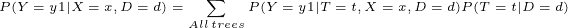
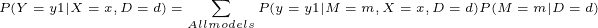

# 决策树和其他机器学习算法的非常贝叶斯的解释

> 原文：<https://towardsdatascience.com/a-very-bayesian-interpretation-of-decision-trees-and-other-machine-learning-algorithms-b9d7280a9790?source=collection_archive---------29----------------------->

## 介绍

我记得我注册了一门课，在这门课中，我的教授花了两堂课仔细研究数学萌芽决策树，然后否认说，“同学们，决策树算法不使用这些。”。请注意，这些课程与基尼指数或熵增无关。他在几分钟内避开了他们。两节课是 180 分钟的贝叶斯定理和贝塔分布的对抗。那么，为什么我们被鼓励去痛饮那些数学？嗯，生长决策树的通常方法是贝叶斯模型的一种近似。但不是这样。这个模型也包含了集合方法的思想。就此，让我们投入到一些数学中，揭示贝叶斯定理的优越性。(注意:我假设你知道概率概念，如随机变量、贝叶斯定理和条件概率)

弗拉季斯拉夫·巴比延科在 [Unsplash](https://unsplash.com?utm_source=medium&utm_medium=referral) 上的照片

## 构建挑战

我想你熟悉决策树，以及它们如何使用基尼系数或熵损失来工作。所以，我们会忽略它，而使用贝叶斯定理。考虑一个布尔分类问题，你需要使用决策树来解决。因为我是一个好人，所以我代表你做苦工，用训练数据建立一个所有可能的决策树的花园。为什么都是？嗯，你的挑战是通过在决策过程中包含所有的树来分类一个新的数据实例 x。你将如何进行？

如前所述，你必须用贝叶斯心理来处理这个问题，它涵盖了 x 属于特定类别 Y (y1 或 y2)的概率。利用这个概率，你可以决定合适的类。注意，从现在开始，我们将把 X 和 Y 视为随机变量(RV)。但是它们是你唯一需要的房车吗？不，估计值 P(Y|X=x)取决于另外两个因素。

让我们思考一下包含所有可能的决策树的难题。并非所有的树都足够绿来解决这个问题。为什么这样对于任何问题，人们通常使用基尼指数或熵增益来挖掘最佳分离训练数据的树。这表明任何特定的数据集 d 都有唯一的匹配树。因此，如果您将树和数据集视为 RVs，那么对于特定的树 T=t 和训练数据集 D=d，您可以找到 T 对 D 的作用效果的概率估计 P(T=t|D=d)。理想的树将具有 P 的最大值(T=t|D=d)。此外，每个树还会对数据实例进行不同的分类。本质上，一个新数据实例属于任何类 P(Y|X=x，T=t，D=d)的概率在不同的树上是不同的。现在，你是否认识到，为了平息我的奇怪挑战，你需要两个讨论过的每棵树的概率？观察下面的等式。你对它有什么看法？

L.H.S 是属于 y1 的 x 的最终概率估计。这取决于训练数据集，因为对于不同的数据集，树将会修改。R.H.S .提出，要在决策过程中包括所有的树，我们应该对一棵树 t 取 x 属于 y1 的概率，用它乘以该树是理想候选树的概率，并对所有乘积求和。换句话说，您做出的最终决定应该是所有树的分类概率的加权和。因此，如果一棵树很好地分离了训练数据，P(T=t|D=d)很高，它在最终决策中就有更多的发言权。

## 等式的可能扩展

高级集成方法是最可靠的预测模型之一，也根据上述方程起作用。他们使用来自众多小树的预测的加权和来对数据实例进行分类。请注意，与我的挑战不同，集合方法并不衡量所有可能的树的预测。那会浪费计算能力。通过基尼指数或熵增等方法，他们隐式地逼近 P(T|D ),并忽略劣质树。因此，基尼系数和熵仅仅是计算上有效的方法，而不是贝叶斯解。

但是我们不一定要把这个方程局限在树上。您可以使用不同的分类或回归模型(ML 算法)并计算其概率预测的加权平均值来做出最终决策，而不是使用几棵树。在这里，你只需要用另一个随机变量 M 代替随机变量 T，这个随机变量 M 包含了一系列不同的模型(算法)。

## 总结

这篇文章非常简要地概述了贝叶斯定理是如何构成集合方法的核心的。目的是从贝叶斯的角度理解决策树，并强调贝叶斯统计如何总是在任何 ML 算法的背景下悄悄地忙碌。我故意没有讨论所讨论的方程中的每一项是如何计算的。这将运行很长时间，还涉及一些其他的数学概念，如贝塔分布。然而，由衷地欣赏决策树是很重要的。我希望以后能报道它。