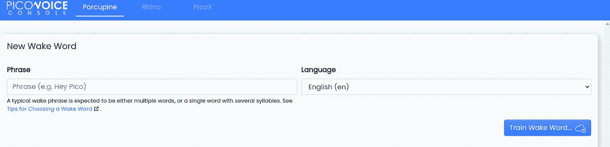
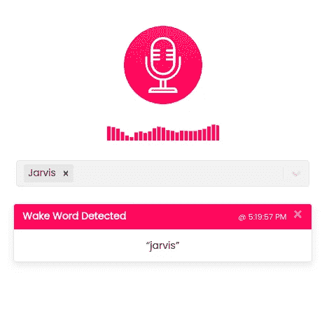
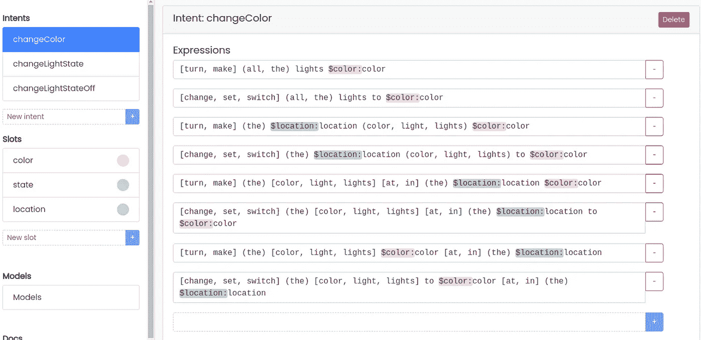
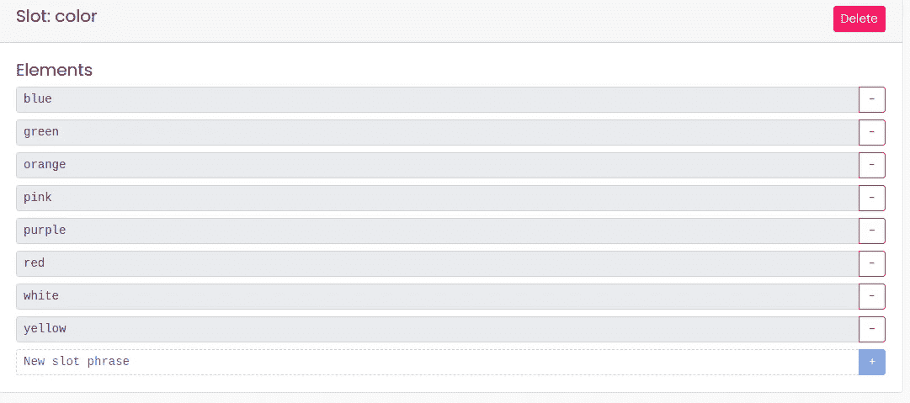
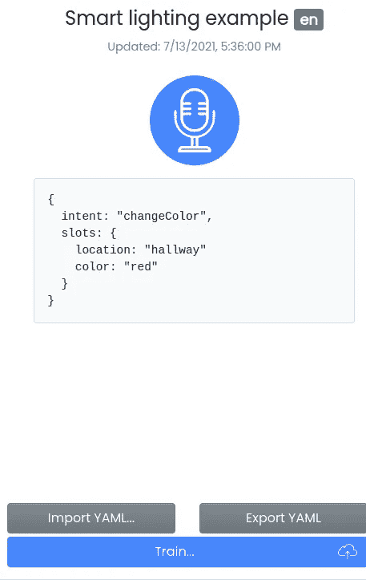
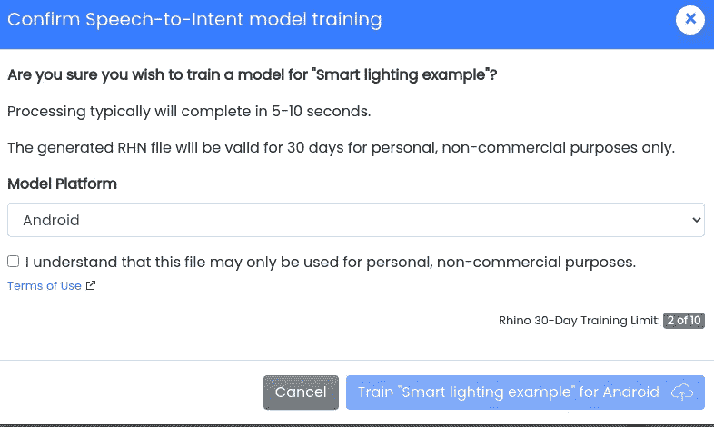
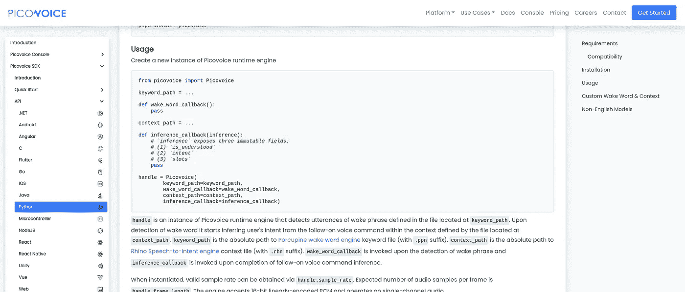

# 一个非常好的方法来建立一个“Ok Google”语音应用程序…没有谷歌

> 原文：<https://towardsdatascience.com/a-very-nice-way-to-build-an-ok-google-vocal-application-without-google-6c29681616d1?source=collection_archive---------33----------------------->

杰森·罗斯韦尔在 [Unsplash](https://unsplash.com?utm_source=medium&utm_medium=referral) 上的照片

我们都知道，由于更好的 NLP 模型和像 Alexa 或 home 这样的消费者家庭硬件，语音驱动的应用程序在数量和效率上都在增加。

根据谷歌的数据，27%的全球在线人口正在使用手机语音搜索，这一趋势正在上升，而且一旦你开始使用它，它就会变得非常快速和自然。

因此，对于我正在开发的一个个人项目(未来几周会有更多相关内容)，我决定构建一个语音界面来执行一些操作，我的需求是:

*   能够有一个唤醒词，就像“嘿谷歌”，开始语音输入阶段
*   拥有一些结构化的数据模型，比如链接到命令执行的“意图”，而不是仅仅通过文本库的语音来捕捉单词，并编写大量的*“如果 word== 'this' do that”。*换句话说，拥有像 DialogFlow 或 Lex 这样的聊天机器人方法。
*   出于隐私考虑而离线，但没有在本地构建和部署 TensorFlow 或 Pytorch 解决方案，这肯定不是一项简单的任务

因此，当我不得不放弃隐私和控制来换取易用性时——毕竟还是老一套——我发现了 Picovoice！

# 输入微微语音

引用他们的网站，*的话来说，Picovoice 是一个端到端的平台，可以根据你的需求构建语音产品。*

最相关的功能是它可以部署在特定的设备上并在本地运行，因此该解决方案不需要互联网连接就可以工作。

这是因为可以使用特定的 web 应用程序(Picovoice 控制台)在线训练特定的模型，然后只需下载并由应用程序使用，无需进一步连接。

但是让我们更详细地看看它是如何工作的

首先，它有四个不同的引擎:

*   豪猪尾流发动机
*   犀牛语音意图引擎
*   Cheetah 和 Leopard 语音转文本引擎

顾名思义，第一个用于处理唤醒词，在检测到时触发操作，第二个用于理解意图，基于特定的词检测，另外两个用于一般的语音到文本。

我只使用前两个，但我可能会检查其他的一个，因为有一个完整的和工作良好的离线语音到文本的解决方案会很棒

我们来深究一下吧！

## 豪猪

控制台非常简单。你输入一个唤醒词，选择一种语言，训练模型。

Picovoice 控制台截图

一旦准备好了，你可以立即在控制台上测试它(或者测试一些已经存在的默认设置，比如“嘿谷歌”、“Alexa”、“Jarvis”等等)

Picovoice 控制台截图

我们马上会看到如何在应用程序中使用它。

## 钱

控制台也非常直观，但这里的事情有点复杂，因为我们需要声明意图，最终在其中包含变量。

让我们看一个例子，假装建立一个家庭解决方案来控制灯光。

Picovoice 控制台截图

在这个例子中，有三个意图，但让我们关注第一个:它与不同的短语相关联以触发它，每个短语都由替换词、可选词和可能的参数组成，称为槽。

因此，要触发第一个触发器，我可以说“把灯变成绿色”或“把灯变成绿色”或“把所有的灯都变成绿色”等等。

由于模型被预先训练以供本地使用，因此也必须预先决定时隙。当然，如果事情发生变化，这可能是一个缺点，因为新的模型需要用新元素进行训练(在这个例子中，如果新的颜色变得可用)。

Picovoice 控制台截图

在这种情况下，语音到文本的解决方案可以更好地工作，因为不需要再培训。

一旦一切就绪，几乎可以立即测试模型。只需点击麦克风并讲话！

Picovoice 控制台截图

最后，可以在目标设备上本地下载和使用它

Picovoice 控制台截图

请注意，它可以用于个人用途，但有一些限制，但也有企业许可证。

但是，然后呢？如何使用这些模型？只需构建一个应用程序并使用 Picovoice API 和 SDK

有详尽的[文档](https://picovoice.ai/docs/)和几个可用选项，所以开始使用它们应该很快。

从文档网站截取的屏幕截图

# 结论

好的，但是我应该使用它吗？是的，肯定的

首先，也是最重要的，在谷歌和 AWS 服务层面上，它在单词检测方面做得非常好，甚至可能更好。

然后，在本地运行它不仅在隐私方面而且在性能方面都有优势，因为没有网络延迟。

但是，能够在网上试用这个模型，而不需要在本地下载和测试，真的可以节省时间。

最后，它可以部署在几个不同的平台上(Linux，Windows，macOS，Android，iOS，Raspberry Pi 和更开放的其他平台)，非常灵活。

因此，如果你需要建立一个基于语音的应用程序，或者只是给你的应用程序添加一些声音，Picovoice 是一个很好的选择:也许比使用托管服务稍微复杂一点，但性能和隐私值得额外的努力。