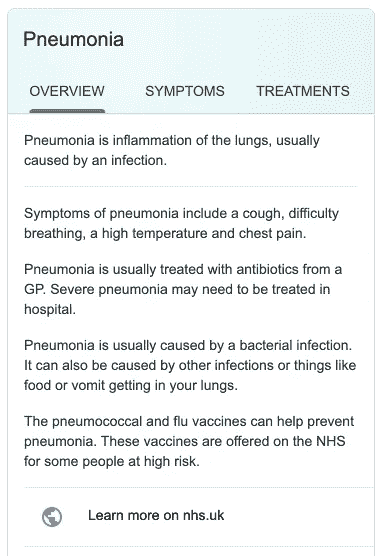
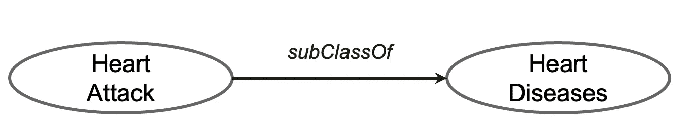
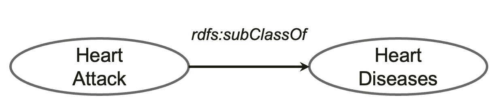
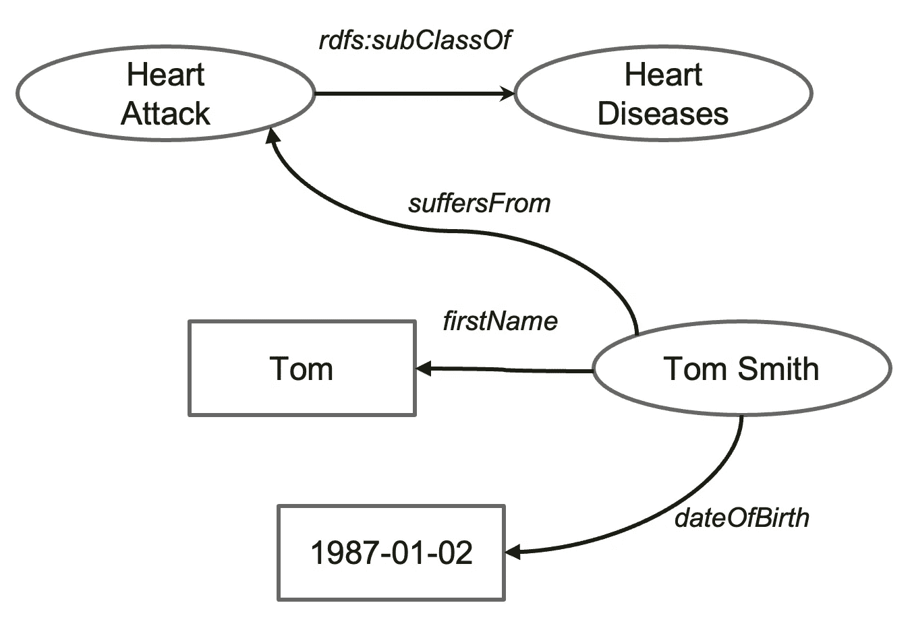
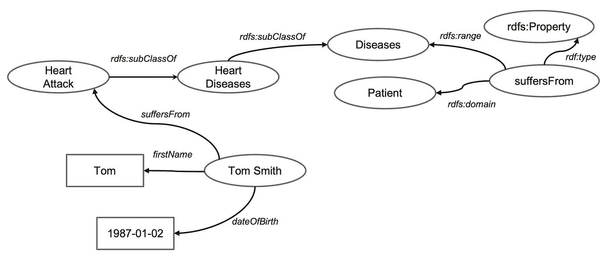
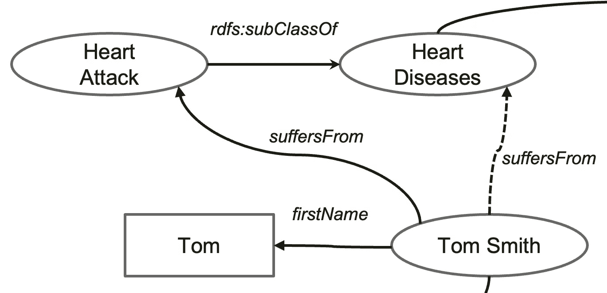
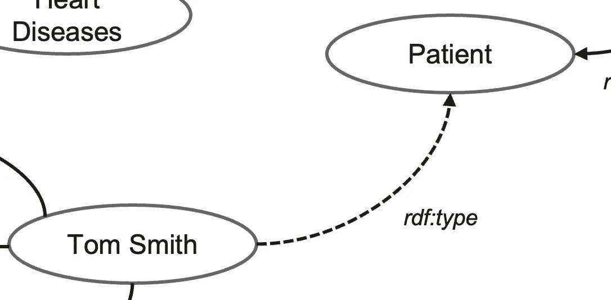
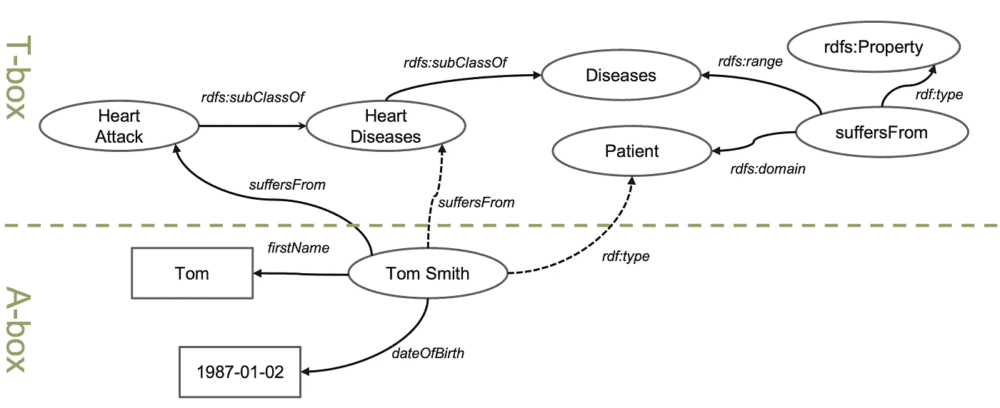

# 一个非常简单的健康数据科学家知识图表指南

> 原文：<https://towardsdatascience.com/a-very-simple-guide-of-knowledge-graph-for-health-data-scientists-bb8cefc1db31?source=collection_archive---------12----------------------->

## 本文旨在为那些对知识图在健康数据科学中的应用感兴趣的人提供一个非常快速的知识图介绍。

凯莉·西克玛在 [Unsplash](https://unsplash.com?utm_source=medium&utm_medium=referral) 上的照片

# 什么是知识图？

好吧，什么是知识图？事实上，我们很多人几乎每天都在使用它。例如，当你在谷歌中搜索单词`UCL`(点击[这里](https://www.google.com/search?q=ucl)查看它的运行情况)，你会在搜索结果页面的右侧看到一个名为 Infobox 的小框。它给你一个伦敦大学学院的快速总结，包括标志，谷歌地图链接，以及关键属性，包括其地址，电话号码和与 UCL 有关的人。所有这些数据实际上都是谷歌从其**知识图谱**中提取出来的。假设部分或全部这样的信息可以作为你搜索背后的假设问题的直接答案。而且，就像我们所有人都经历过的那样，在许多情况下，这个假设成立。

(谷歌搜索结果的截图)谷歌关于肺炎的信息框，由它的知识图提供支持

同样，如果你搜索一种疾病，比如`Pneumonia`，谷歌会向你展示一个更加结构化的信息框，让你了解这种疾病的概况、症状以及治疗方法。(点击[此处](https://www.google.com/search?q=Pneumonia)查看)

同样，毫不奇怪，如果你搜索`Google Knowledge Graph`，谷歌会显示它的信息框。当然，`Google Knowledge Graph`的信息来自`Google Knowledge Graph`。

# 知识图谱从何而来？

好吧，那么，`Knowledge Graph`这个概念是何时何地产生的呢？万维网之父蒂姆·伯纳斯·李爵士提出了所谓的`the Web of Linked Data`的概念，意思是网络不应该仅仅是相互链接的文档，还应该是相互链接的数据。它还有一个名字叫`Semantic Web`。其背后改变游戏规则的主要思想是，相互关联的数据可以被计算机直接理解和使用。通过这种方式，计算机可以通过直接与不同的 web 服务对话来自动完成任务。“数据网络”的理念是`knowledge graph`的根源。对于那些想知道更多的人来说，你可以在下一个网站上查看 Tim 先生 2009 年的 TED 演讲。

# 知识表示是知识图的核心

*(图片作者)* ***三联*** —知识图的原子

“数据网”和“知识图”共享同一个技术栈，叫做`knowledge representation`。本质上，它由两个主要组件组成:

*   第一个叫做**本体**:它是一个特定领域的工件，描述了特定领域中的概念及其关系。例如(上图)，二型糖尿病是一种人类疾病，二甲双胍是一种用于治疗二型糖尿病的药物。
*   第二个组成部分是**计算**，这就是计算机如何在本体术语上进行类似人类的推理。这叫做推理。大致来说，有两种类型的推理:一种是基于集合论的，另一种是基于规则的。

从技术上讲，有一套实现数据网络的技术(见[这里](https://en.wikipedia.org/wiki/Semantic_Web_Stack))。万维网联盟 W3C 规定了所有这些技术的技术细节。正如我所承诺的，我不会讨论这些技术细节。

# 临床知识图表的玩具示例

*(作者图片)我们知识图谱的第一个三元组*

让我们看一个知识图的例子。假设我们都同意`heart attack`是`heart disease`的一种类型，并把它作为一条知识放在我们的知识图中(如上)。

*(图片由作者提供)包含关于汤姆·史密斯的知识*

现在，我们有一个叫`Tom Smith`的家伙。我们知道他的基本信息，包括姓名和出生日期。不幸的是，汤姆心脏病发作了。我们将所有关于 Tom 的信息添加到我们的图表中(如上所述更新)。

我们现在进一步扩展我们对`Heart Diseases`的知识。假设所有的`Heart Diseases`都是一种`Diseases`。并且，我们定义了上面使用的关系`*suffersFrom*`，指定它将`Patient`关联到`Diseases`。

*(作者图片)更多关于概念及其关系的定义*

有了这样的知识，计算机现在可以从我们的知识图谱中推断出一些新的知识。比如，它会说——好吧，你说所有的`Heart Attacks`都是`Heart Diseases`。所以，任何患`Heart Attacks`的人，也患`Heart Diseases`。因此，计算机将绘制一个标记为`suffersFrom`的虚线箭头，如下所示。

*(图片由作者提供)*电脑可以推断汤姆·史密斯也患有*心脏病*

*现在，计算机查看`suffersFrom`关系的定义，它将`Patient`关联到`Diseases`。现在因为`Tom Smith`有两个`suffersFrom`的关系，那么这个人一定是一个`patient`。因此，它绘制了另一个虚线箭头(见下文)。*

**

**(图片由作者提供)*电脑可以推断汤姆·史密斯是**患者***

*这两种推断的关系对人类来说似乎微不足道。但是，这是一个相当大的进步，因为计算机现在可以像人类一样进行推理，尽管只是一小步。完整的知识图现在看起来如下，包括两个推断的关联。*

**

**(图片由作者提供)*两次推理计算后的全知识图*

*在知识图中，我们通常把事物分成两组:`T-box`和`A-box`(见上面用绿色虚线隔开的两个区域)。任何关于概念及其关系的东西都是 T-box 的一部分，T-box 代表术语盒。任何描述实际实体的东西，比如特定的病人，都是 A-box 的一部分，A-box 代表断言框。显然，T-box 是领域特定知识，类似于关系数据库的模式，而 A-box 是实际数据，类似于数据表中的数据行。*

# *T-box 和 A-box 的在线资源*

*语义 web 社区在创建和共享许多领域的 T-box 和 A-box 方面做了大量工作，生命科学是最受欢迎的领域之一。对于开放领域的 T-box，有一个很棒的网站叫做[链接开放词汇](https://lov.linkeddata.es/dataset/lov/)。截至 2021 年 9 月，LOV 现在包含大约 760 个词汇(本体)。*

*对于生物医学领域的 T-box，有一个名为[生物门户](https://bioportal.bioontology.org/)的网站，由美国国家生物医学本体论中心维护，由斯坦福大学领导。是做生物医学信息学的人必备的工具。它有 922 个本体(截至 2021 年 9 月)，包括许多广泛使用的本体，涵盖疾病、药物、遗传学和临床程序。像 [SNOMED-CT](https://bioportal.bioontology.org/ontologies/SNOMEDCT) 、 [UMLS](https://www.nlm.nih.gov/research/umls/index.html) 、 [ICD](https://bioportal.bioontology.org/ontologies/ICD10) 和[基因本体](https://bioportal.bioontology.org/ontologies/GO)这样的东西应用广泛。*

*对于可公开访问的 A-box， [DBpedia](https://www.dbpedia.org/) 是一个广泛使用的知识库，本质上是维基百科的结构化版本。可以理解，它包含了广泛的开放领域和常识知识。这是一个由德国研究人员领导的项目。维基数据是一个协作编辑的知识图表。它由> 22k 用户维护，目前包含>9500 万个实体的数据，大约是 DBpedia 的 20 倍。在开放和互联的 also 方面也有机构群体的努力。它被称为[链接开放数据云](https://lod-cloud.net/)，有跨越 10 个不同领域的> 1200 个数据集。*

# *摘要*

*我们已经学习了关于知识图的四件事。*

*   *什么是知识图？*
*   *它从哪里来的？*
*   *临床领域的一个玩具例子*
*   *使用知识图表的在线资源*