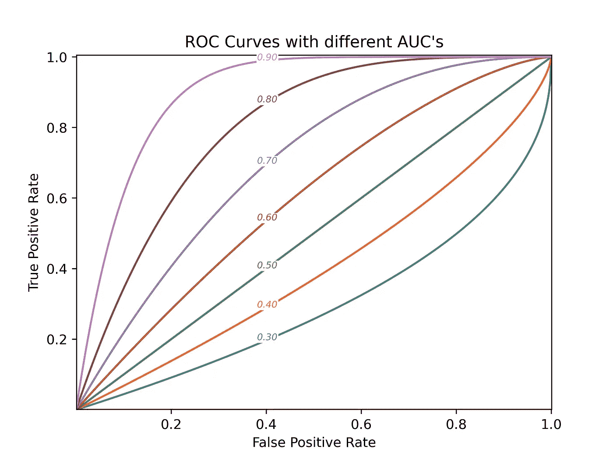
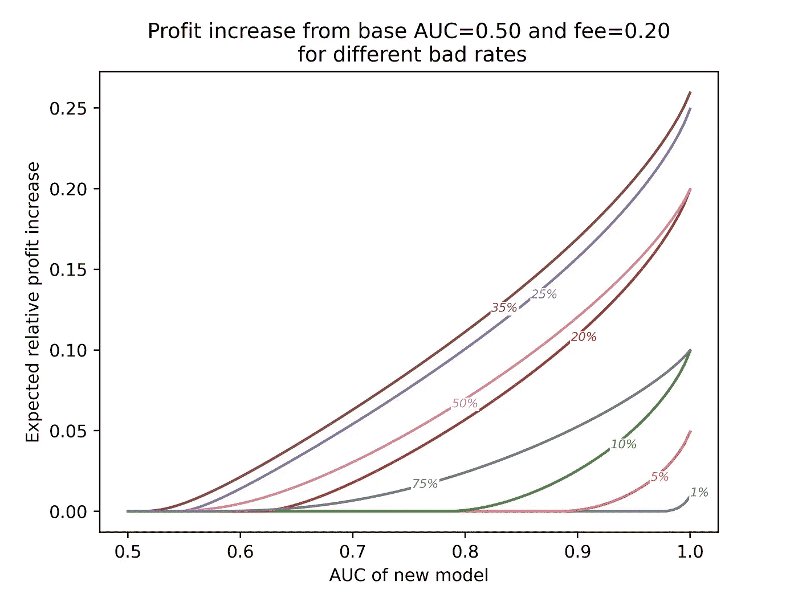
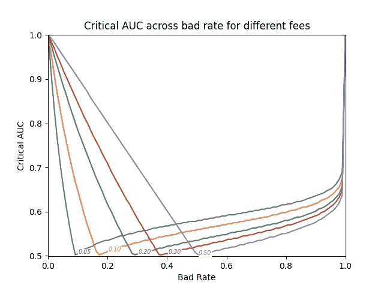

# 一种(非常)简化的 ML 模型定价方法

> 原文：<https://towardsdatascience.com/a-very-simplified-approach-to-ml-models-pricing-4af251226779?source=collection_archive---------34----------------------->

## 如何评估实现模型的预期收益

通常，在数据组织中，利益相关者必须做出关于 ML 策略的决策。诸如是否追求新模型的开发、决定实现一个新模型(希望花费很少的部署成本)或者从数据提供者那里购买信息的选择通常仅仅基于直觉。

在这篇文章中，基于对情景、公司经营的经济模式和 ROC 曲线形状的一般假设，我试图阐明这个话题。目标是有一个函数来计算将基于具有给定 AUC 的模型的策略替换为具有不同 AUC 的模型的边际预期利润增益。

# 经济模式

在该研究的第一次迭代中，我们将商业模型近似为一个游戏，当客户不违约时，公司赚取费用，否则将失去一个单位价格。

公司可以选择是否向任何顾客出售产品。让我们将条件正定义为客户违约的事件，将预测正定义为公司拒绝运营的事件。

预期利润是:

> 预期利润=概率真阴性×费用-概率假阴性-概率假阳性×费用

一个假阳性的成本费用作为机会成本，一个假阴性的成本 1，因为价格是单一的。

# 从 AUC 到 ROC 曲线

目的是在给定 AUC 的情况下构建 ROC 曲线。我们假设所有 ROC 曲线是参数 a 设置为 1 的正则化β函数，并且参数 b 使得曲线的面积等于 AUC 这意味着 b = AUC/(1-AUC)。

下面我们展示了这些曲线的一些例子:



具有不同 AUC 的 ROC 曲线—作者图片

# 从运营角度到利润

在具有恒定总体不良率的场景中，可以基于一个操作点——(假阳性率，真阳性率)ROC 空间中的一个点——获得经济模型计算代理期望利润所需的所有概率:

```
Probability true negative = False Positive Rate × bad rate Probability false negative = (1 - True Positive Rate) ×bad rate Probability false positive = False Positive Rate ×(1 - bad rate)
```

如果公司有一个给定 AUC 的模型，它可以选择最优操作点作为最大化期望利润的点。

# 预期利润增长

至此，我们可以建立一个从 AUC 到预期利润的函数。

一个公司，在一个给定的场景-不良利率和费用-面临的问题是，是否改变其基于模型的战略，一个新的算法，承诺更好的 AUC，可以使用这个函数作为决策的输入。基于当前模型的 AUC 的该函数的输出减去基于新模型 AUC 的输出是预期利润增加。

让我们通过调查一些示例场景来研究不同的因素如何促成预期利润的增加。

作为第一个例子，让我们看看在费用为 0.2 和不同坏账率的情况下，不使用模型(AUC=0.5)的相对利润增加。



预期利润增加示例-作者图片

可以做一些评论:

*   对于任何 AUC 收益，利润的显著增加并不是在每种情况下都发生。
*   在不良率较低的情况下，AUC 收益应该非常显著，以证明模型变化的合理性。

更具体地说:在费用为 0.2 且不良率为 10%的情况下，当新模型的 AUC 至少为 0.79 时，从不使用模型且不过滤掉任何操作的策略进行切换是有利的。

在这种情况下，对提供 AUC 0.85 模型的服务进行查询的最高价格是产品价格的 0.009 倍。

接下来，我们绘制了针对不同场景改变模型时的预期利润增长:


不同情景下的相对利润增长—图片由作者提供

一些进一步的结论:

*   只有当达到某个临界性能时，切换模型才是有利的。
*   在分析空间中，结果似乎对 fee 比对基础 AUC 更敏感。

# 关键 AUC

在示例中，我们看到只有达到某个 AUC 阈值，转换模型才是明智的决策。让我们称之为临界 AUC:给定场景中的最小值，如果被模型超越，则可以看到利润增加。

下面我们可以看到在基本 AUC=0.5 的情况下，不同费用的关键 AUC 在不同坏账率之间的变化。



关键 AUC 示例—按作者分类的图像

对这一结果的观察:

*   对于一个固定的费用，只有在一个特定的坏率的情况下，任何模型性能增益增加利润。在这种情况下，公司会收支平衡。
*   对于低不良率，新模型的性能应该非常高，以证明改变简单地不过滤任何操作的天真策略是正确的。
*   费用越少，就越容易获得关键 AUC。
*   对于接近 1 的不良率，该模型也应该非常好，以取代拒绝任何操作的天真策略。

# 警告

*   本研究中考虑的 AUC 是从整个人群中计算的。实际上，这是很难做到的:我们只能观察实际服用该产品的人的事件结果。这就是为什么没有考虑新人是否有资格进行手术。
*   我们还认为，改变策略时，费用将保持不变。因此，减少费用以增加产量的可能性就被忽略了。
*   所考虑的 ROC 曲线族很小。虽然我相信曲线的形状不会对整体结果产生重大影响，但这还有待于进一步的分析来证实。
*   我们认为模型是完全连续的。专注于某些预测在模型开发中很常见，可能会改变结果。

# 结束注释

这项研究并不自称已经完成。如果您看到一些可以更好地解决的问题或任何荒谬的假设，请通过任何方式 ping，或者更好的是，使用我在本次研究中使用的[回购](https://github.com/mesquita-daniel/model_price_study)并进行调整。

如果您想自己探索结果，在回购中实现了计算从具有基本 AUC 的模型切换到不同模型的预期利润的功能。