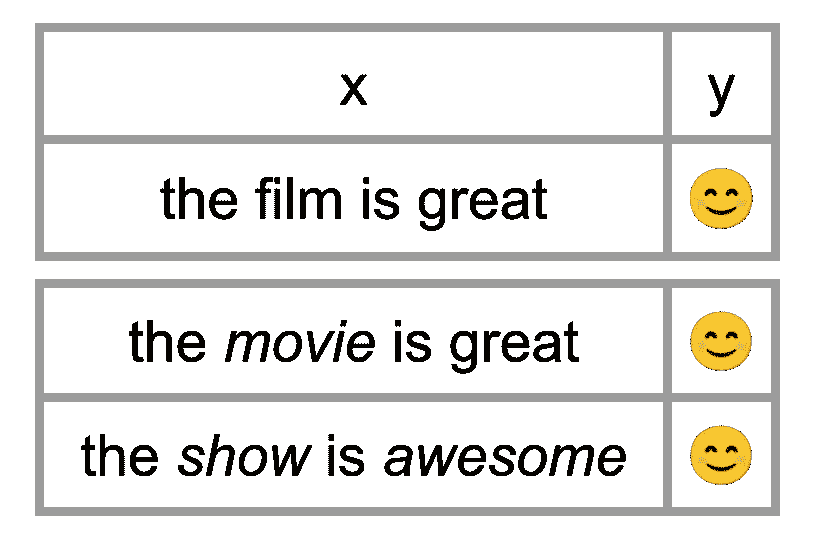
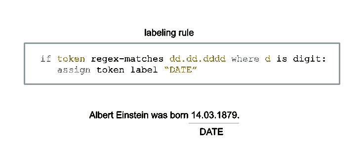
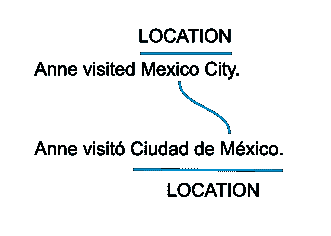
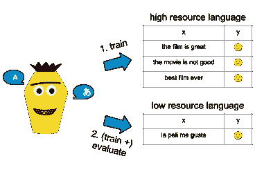

# 低资源 NLP 的可视化指南

> 原文：<https://towardsdatascience.com/a-visual-guide-to-low-resource-nlp-d7b4c7b1a4bc?source=collection_archive---------20----------------------->

## [思想和理论](https://towardsdatascience.com/tagged/thoughts-and-theory)

## 如果您只有有限数量的标记数据，最近的方法可以帮助您训练 NLP 模型。

由[保罗·基亚布兰多](https://unsplash.com/@chiabra?utm_source=unsplash&utm_medium=referral&utm_content=creditCopyText)在 [Unsplash](https://unsplash.com/?utm_source=unsplash&utm_medium=referral&utm_content=creditCopyText) 上拍摄的照片

深度神经网络在自然语言应用(NLP)中变得无处不在。然而，它们需要大量的带标签的训练数据，而这些数据通常只适用于英语。对于标记数据有限的许多语言和领域来说，这是一个巨大的挑战。

近年来，已经提出了多种方法来处理这种情况。本文给出了这些方法的概述，帮助您在资源贫乏的场景中训练 NLP 模型。这既包括增加标记数据量的想法，也包括遵循流行的预训练和微调范式的方法。我们希望提供指导，帮助您决定哪些方法适用于您的低资源场景。

这篇文章的基础是我们最近关于低资源 NLP 的[调查](https://aclanthology.org/2021.naacl-main.201/)，在那里你可以找到更多的细节和对公开问题的进一步讨论(但是更多的文字和更少的彩色图像😉).

# 资源可用性的维度

当讨论低资源场景时，通常焦点在于缺少标记数据。然而，存在不同类型的数据，并且许多低资源方法对特定数据的可用性有某些假设。理解一个人的低资源环境和特定方法强加的假设对于选择最佳方法是至关重要的。我们区分资源可用性的三个维度:

*   **特定任务标注数据**:最突出的维度。需要领域专家手动注释实例，这通常既费时又费钱。
*   **未标记的特定于语言或领域的文本**:通常更容易获得，但对于某些资源匮乏的场景来说可能很少。对于大多数基于某种形式的预训练嵌入的现代 NLP 方法来说，它已经成为需要考虑的重要资源。
*   **辅助数据**:虽然在“正常”NLP 中不太占优势，但大多数低资源方法都需要某种形式的辅助数据。这可以是例如不同语言的标记数据、知识库或机器翻译工具。必须考虑到这一点，因为如果一种方法对辅助数据的假设被打破，那么来自一个低资源情景的见解可能无法转移到另一个情景。

我们现在将给出针对低资源场景的当前方法的概述。

# 数据扩充

在数据扩充中，我们需要少量的标记数据。然后，我们通过获取现有实例并更改其特征而不更改标签来创建更多数据。这是计算机视觉中的一种流行技术，例如，旋转猫的图像不会改变猫的标签。

在下面的例子中，我们有一个情感任务。我们可以扩充句子“电影很棒”，例如，用“电影”或“棒极了”这样的同义词替换一些单词这就保持了情绪标签不变。新句子仍然有积极的情绪。

作者图片

Amit Chaudhary 给出了一个很好的，可视化的[调查](https://amitness.com/2020/05/data-augmentation-for-nlp/)关于不同的技术来增加 NLP 数据集(他的文章是这篇文章的灵感来源)。

# 监管不力

弱监督通过一个(半)自动化的过程获取未标记的数据并标注标签。关于如何获得这种自动注释，存在不同的方法。有些是针对某项任务的，有些则可以更普遍地应用。

**a)远程监督**

对于命名实体识别或关系提取等任务，远程监督是一种流行的方法(Mintz et al .，2009)。需要一个外部知识库作为辅助数据。这可能只是一个名单，但也可能是一个更复杂的知识库，如维基数据。

未标记文本中的标记被自动映射到知识库。在下面的例子中，我们想要自动标注位置。获得城市名称的列表(例如，从[维基百科](https://en.wikipedia.org/wiki/Lists_of_cities))。如果令牌序列匹配列表中的条目，则为其分配相应的标签；在这里是位置。

**b)标签规则**

领域专家的许多见解可以用简单的规则来表达。专家可以写下一小组规则，然后使用这些规则自动注释未标记的数据。与必须手动标记大量实例相比，这可以更有效(和有趣)地利用专家的时间。

在下面的例子中，我们编写了一个在文本中查找日期术语的规则。由两个点分隔的一系列 8 位数字通常匹配日期，如 14.03.1879。类似的日期规则已被用于(Strö tgen & Gerz，2013 年)各种语言的时间标记，或(Hedderich 等人，2020 年)检测豪萨语和约鲁巴语的日期。这种标记规则、标记函数或试探法的不同应用可以在例如 such 中找到(Ratner 等人，2020)。

**c)跨语言投影**

如果一项任务在一种语言中得到很好的支持，而在另一种语言中得不到支持，那么可以使用跨语言预测(Yarowsky 等人，2001)。在下面的例子中，我们假设西班牙语是一种低资源语言，我们只有一个用于英语的命名实体识别工具。我们把这个句子从西班牙语翻译成英语。在英语中，我们的工具识别墨西哥城是一个位置。通过翻译我们知道，英语中的墨西哥城在西班牙语中是 Ciudad de México(所谓对齐)。因此，我们也可以给出墨西哥城的标签位置。

为了从两种语言获得文本，可以使用句子已经对齐的平行语料库，例如 [OPUS](https://opus.nlpl.eu/) 或 [JW300](https://opus.nlpl.eu/JW300.php) 。或者，如果存在对这两种语言的支持，也可以使用机器翻译。

**d)噪声处理**

虽然弱监督允许快速和自动地获得标记的数据，但是与完全手动注释的数据相比，标记的质量通常较低。为了消除不正确标签的负面影响，已经提出了各种标签噪声处理方法。可以训练另外的模型，例如，检测和过滤不正确的标签或者给予它们较低的权重。或者，可以对噪声本身进行建模以清除标签，或者可以使用噪声鲁棒性类型的模型。

# 预先训练的语言表达

远程监督和数据扩充产生并扩展特定任务的训练数据，

NLP 中最近工作的一个重点在于使用在未标记数据上训练的预训练语言表示。这些方法通过转移学习的表示和模型来减少对标记的目标数据的需要。

**a)预培训变压器**

变换模型，如 BERT (Devlin 等人，2019)或 RoBERTa(刘等人，2019)，在大规模文本语料库上进行训练，其语言建模目标是通过预测下一个单词或句子来创建上下文感知的单词表示。这些模型对于低资源语言特别有帮助，对于这些语言，大量的未标记数据是可用的，但特定任务的标记数据是稀缺的(Cruz 和 Cheng，2019)。

Jay Alammar 在他的博客文章中提供了对 BERT 和相关语言模型的详细描述和可视化效果:[图文并茂的 BERT、ELMo 和 How NLP 如何破解迁移学习)](http://jalammar.github.io/illustrated-bert/)。

**b)特定领域的预培训**

专业文本领域的语言可能与标准语言有很大不同。因此，许多文本域也经常资源不足。然而，最近的大多数语言模型都是在通用领域数据上预先训练的，例如来自新闻或网络领域的文本，当应用于不同领域时，这可能导致所谓的“领域差距”。

克服这一差距的一个解决方案是通过微调语言模型或从头开始训练新的特定于领域的语言模型来适应目标领域。常见的公开可用的领域适应模型包括 BioBERT (Lee 等人，2020 年)、ClinicalBERT (Alsentzer 等人，2019 年)和 SciBERT (Beltagy 等人，2019 年)。

**c)多语言语言模式**

在跨语言设置中，在低资源目标语言中没有可用的特定于任务的标记数据。相反，来自高资源语言的标记数据被利用。多语言模型可以在高资源语言的目标任务上进行训练，然后应用于看不见的目标语言。

这通常需要通过为多种语言训练单个模型来训练多语言语言表示，例如多语言 BERT (Devlin 等人，2019 年)或 XLM-罗伯塔(Conneau 等人，2020 年)。这些模型使用来自不同语言的未标记的单语语料库进行训练，并且由于在预训练期间看到了许多语言，因此可以在跨语言和多语言环境中使用。

# 结论

除了上面提到的方法，还有其他令人兴奋的方法来处理低资源 NLP，未来还会有更多的方法出现。关于当前方法和参考文献的更详细概述，以及关于开放问题的讨论，我们想参考我们的 NAACL 论文[关于低资源场景中自然语言处理的最近方法的调查](https://aclanthology.org/2021.naacl-main.201/)。基于这些见解，我们对未来的发展以及低资源 NLP 的其他方面感到兴奋。

作者:迈克尔·海德里希和卢卡斯·兰格。

**引文**

如果您发现这项工作有用，并希望在学术背景下引用它，请引用 NAACL 的论文:

> @ inproceedings { Hedderich-et al-2021-Survey，
> title = "低资源场景下自然语言处理近期方法综述"，
> 作者= {Hedderich，Michael A. and Lange，Lukas and Adel，Heike and Str{\"o}tgen，Jannik and Klakow，Dietrich}，
> booktitle = "计算语言学协会北美分会 2021 年会议论文集:人类语言技术"，
> year = "年

**参考文献**

*   Alsentzer 等人，“[公开可用的临床 BERT 嵌入](https://aclanthology.org/W19-1909/)”(2019)，ClinicalNLP@NAACL
*   Beltagy 等人，“ [SciBERT:科学文本的预训练语言模型](https://aclanthology.org/D19-1371/)”(2019)，EMNLP
*   曹等.[语境词表征的多语种对齐](https://openreview.net/forum?id=r1xCMyBtPS)(2020)，
*   Conneau 等人，“[大规模无监督跨语言表征学习](https://aclanthology.org/2020.acl-main.747/)”(2020)，ACL
*   Cruz 和 Cheng，“[评估低资源语言的语言模型微调技术](https://arxiv.org/abs/1907.00409)”(2019)，arXiv
*   Devlin 等人，“ [BERT:用于语言理解的深度双向转换器的预训练](https://aclanthology.org/N19-1423/)”(2019)，NAACL
*   Hedderich，Lange 等人，“[低资源场景下自然语言处理的近期方法综述](https://aclanthology.org/2021.naacl-main.201/)”(2021)，NAACL
*   Hedderich 等人，“[多语言变压器模型的迁移学习和远程监督:非洲语言研究](https://aclanthology.org/2020.emnlp-main.204/)”(2020)，EMNLP
*   艾尔的李。、“ [BioBERT:一种用于生物医学文本挖掘的预训练生物医学语言表示模型](https://doi.org/10.1093/bioinformatics/btz682)”(2020)，生物信息学
*   刘等，“ [Roberta:一种稳健优化的 bert 预训练方法](https://arxiv.org/abs/1907.11692)”(2019)，arXiv
*   Mintz 等人，“[无标记数据关系提取的远程监督](https://aclanthology.org/P09-1113/)”(2009)，ACL
*   Ratner 等人，“[潜航器:在弱监督下快速创建训练数据](https://link.springer.com/article/10.1007/s00778-019-00552-1)”(2020 年)，《VLDB 日报》
*   Schuster 等人，“[上下文单词嵌入的跨语言对齐，应用于零触发依存解析](https://aclanthology.org/N19-1162/)”(2019)，NAACL
*   strtgen 和 Gerz，“[多语言和跨域时间标记](https://link.springer.com/article/10.1007/s10579-012-9179-y)”(2013 年)，《LRE 日报》
*   Yarowsky 等人，“[通过跨对齐语料库的鲁棒投影归纳多语言文本分析工具](https://aclanthology.org/H01-1035/)”(2001)，HLT