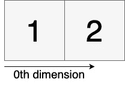
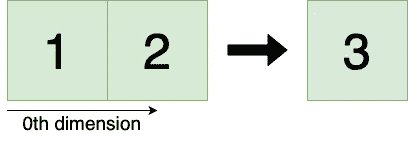
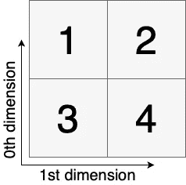
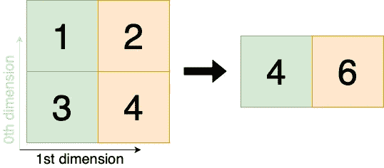
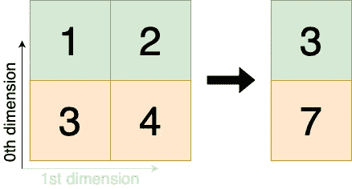
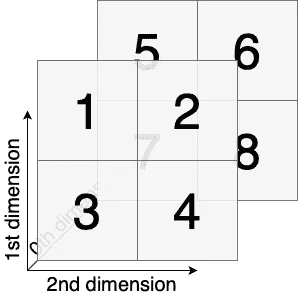
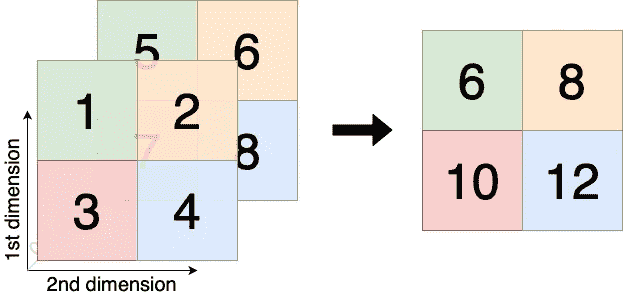
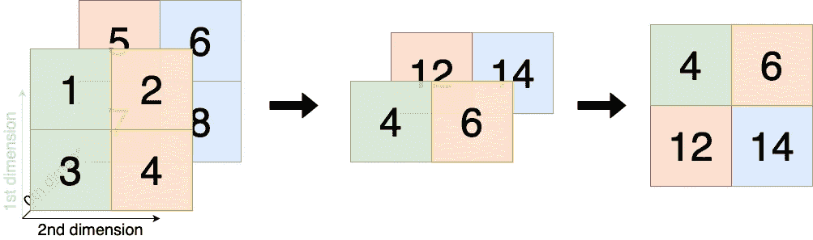
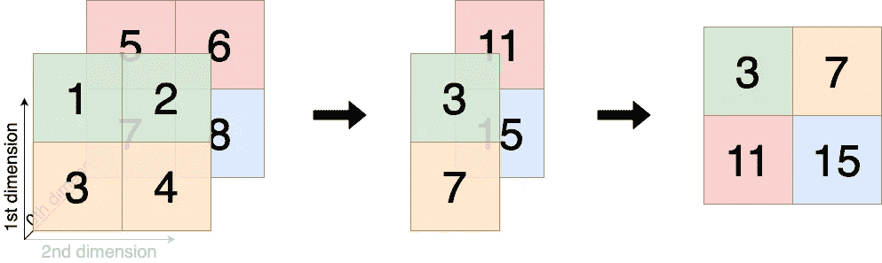

# 多维数组聚合的可视化指南

> 原文：<https://towardsdatascience.com/a-visual-guide-to-multidimensional-numpy-array-aggregation-97a8960b3c59?source=collection_archive---------18----------------------->

## 思考轴编号的直观方式

如果您刚刚学习使用 NumPy 中的聚合函数，如 sum、mean 或 median，理解轴参数的作用可能会很困难。在接下来的文章中，我提供了一个直观的轴编号指南，这样你就可以确保你的代码按照预期工作。

聚集一维数组很简单，因为只需要考虑一个轴。然而，对于 2 维或更多维，我们必须考虑我们希望聚合数组的方向。在本指南中，我们将使用 numpy.sum()函数讨论一维、二维和三维问题。*(注意:其他聚合函数如 mean、median、amin、amax 使用相同的逻辑。)*

# 维度缩减和轴编号

我们可以将沿单个轴的聚合视为将数组的维度减少一个。如果我们聚集一个一维数组，我们得到一个单点。如果我们聚集一个二维数组，我们得到一个一维数组，以此类推。如果我们有多个维度，我们必须决定要消除哪个维度(或轴)。在 NumPy 中，这可以通过在函数调用中指定 axis 参数来实现。

**让我强调一下:当您设置参数时，您选择了您想要消除的维度。**

关于轴编号，我们必须知道的是**索引总是从最高尺寸开始。**每增加一个维度，新维度的索引为 0，其他所有索引都增加 1。我们将在下面的示例中详细了解这一点。NumPy 中 axis 参数的默认值是 *None，*在这种情况下，数组被展平，然后被聚合。

*提示:如果你不确定你有多少个维度，但你想选择最低的，你可以使用负索引。例如，axis=-1 将消除最低的维度。*

# 聚集一维数组

```
>>> a = numpy.array([1,2])
```



```
>>> numpy.sum(a, axis=0)
3
```

在这个简单的例子中，只有一个维度可以用来聚集数组。这个维度是第 0 个维度，即第 0 个轴。*(不需要指定轴参数，因为展平的二维数组本身就是。)*



# 聚集二维数组

```
>>> b = numpy.array([[1,2],[3,4]])
```



在本例中，我们在前面的数组中添加了第二个一维数组，创建了一个二维数组。**请注意，添加的维度是最高的，因此将具有索引 0，而先前的将具有索引 1。**

在这里，我们可以选择是消除第 0 维并沿其垂直轴折叠数组，还是消除第一维并沿其水平轴折叠数组。让我们两个都看:

```
>>> numpy.sum(b, axis=0)
array([4,6])
```

当*轴=0* 时，我们希望消除第 0 维。我们通过沿其纵轴折叠阵列来实现这一点。



```
>>> numpy.sum(b, axis=1)
array([3,7])
```

按照同样的逻辑，这里我们消除了第一维，并沿其水平轴折叠数组。



# 聚集三维数组

```
c = numpy.array([[[1,2],[3,4]],[[5,6],[7,8]]])
```



在这个三维示例中，我们只需将一个二维数组添加到前面的数组中，创建一个 shape(2，2，2)的三维数组。**这个添加的维度将是最高的，因此它的索引为 0，而所有其他的索引都增加 1。**因为我们有三个维度，所以聚合数组时有三个选项需要考虑。

```
>>> numpy.sum(c, axis=0)
array([[6,8],[10,12]])
```

使用*轴=0* ，我们指定希望删除最高维度(我们刚刚添加的维度)。我们可以通过折叠三维阵列的两个“层”来实现这一点。



```
>>> numpy.sum(c, axis=1)
array([[4,6],[12,14]])
```

随着*轴=1* 我们希望消除第一维。我们通过沿垂直轴折叠两个二维数组(层)来实现这一点。



这样，我们将形状(2，2，2)的数组简化为形状(2，1，2)的数组。请注意，NumPy 将完全消除大小为 1 的维度，并输出一个较低维度的 shape(2，2)数组，如我的图表的第三阶段所示，除非您设置 *keepdims=True。*

```
>>> numpy.sum(c, axis=2)
array([[3,7],[11,15]])
```

由于*轴=2* ，我们希望消除第二维。我们通过沿水平轴折叠两个二维数组(层)来实现这一点。



与前面的例子类似，我们得到了 shape(2，2，1)的数组，但是 NumPy 默认会输出 shape(2，2)的低维数组。

# 需要记住的要点

1.  您可以将聚合视为降低数组的维度
2.  当您选择一个轴时，您实际上设置了您希望消除的尺寸
3.  索引总是从最高的维度开始

# 参考

SciPy 社区， [NumPy v1.20 手册](https://numpy.org/doc/stable/reference/generated/numpy.sum.html)

*(所有图片均由作者创作并拥有。)*