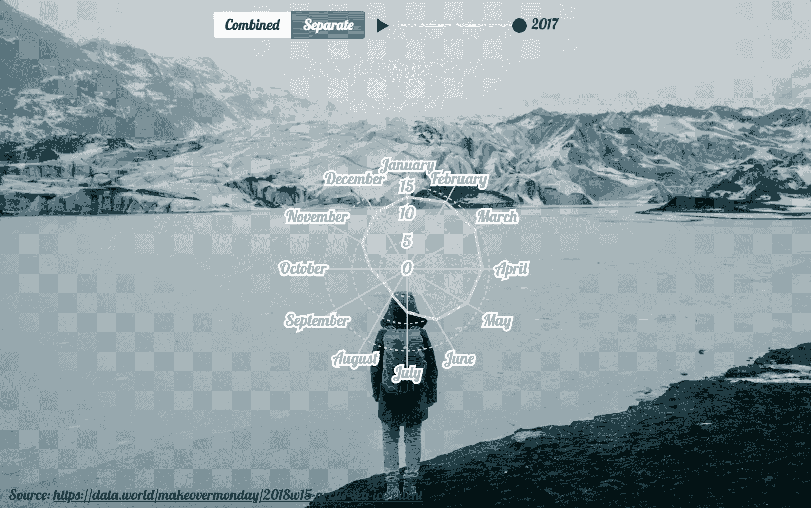
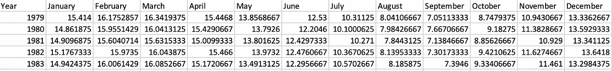
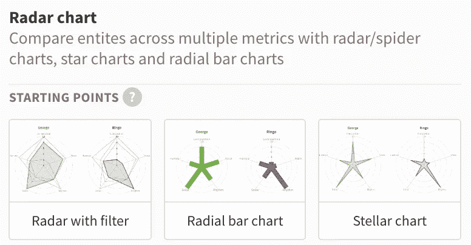
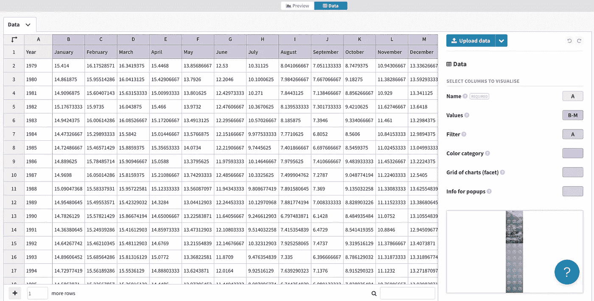
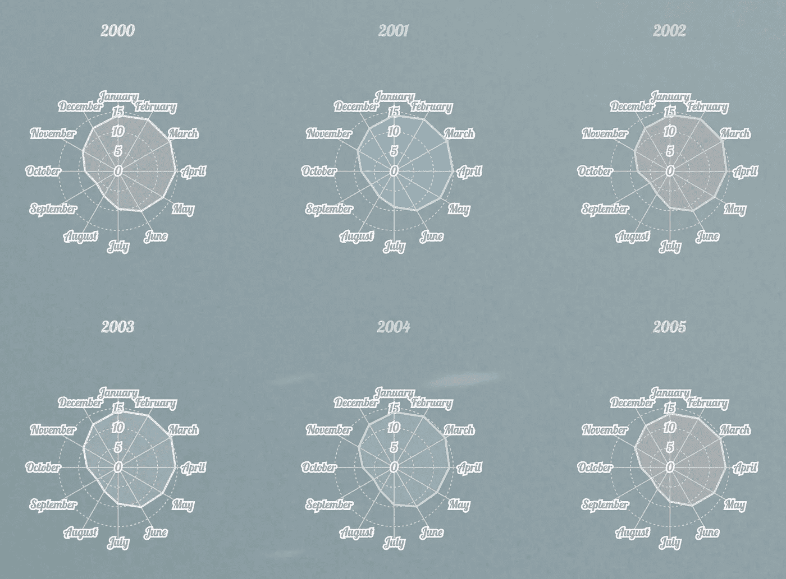
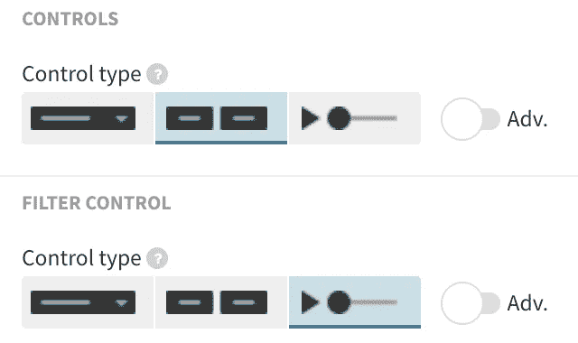
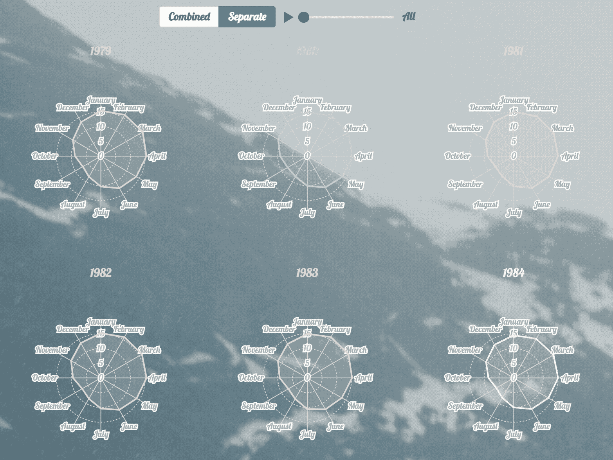
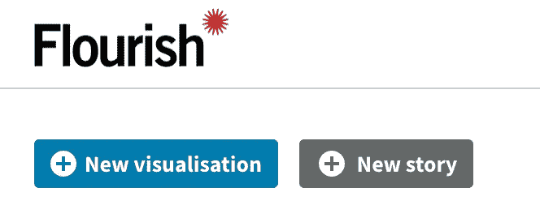
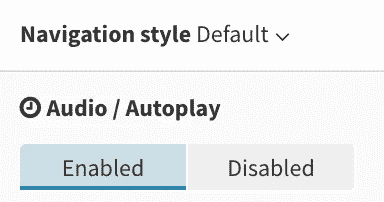

# 想象北极海冰面积的减少

> 原文：<https://towardsdatascience.com/a-visualization-of-decrease-in-arctic-sea-ice-extent-over-past-40-years-fb377bdf94a1?source=collection_archive---------27----------------------->

## 过去 40 年的动画数据故事


[Eva Blue](https://unsplash.com/@evablue?utm_source=medium&utm_medium=referral) 在 [Unsplash](https://unsplash.com?utm_source=medium&utm_medium=referral) 上的照片

嗨！

这篇文章主要是为了展示我的 Udacity 可视化纳米级顶点项目。在这篇文章中，我将向你展示如何制作一个动态雷达图与[蓬勃发展](https://flourish.studio/)和创建演示幻灯片与音频&自动播放功能！



[背景照片来源](https://images.pexels.com/photos/5111044/pexels-photo-5111044.jpeg)

# 数据集和清理

根据 Udacity 计划的要求，我只能从 [***改头换面星期一网站***](https://www.makeovermonday.co.uk/data/) 中选择一个数据集。经过仔细搜索，我决定从事 [***北极海冰范围数据集***](https://data.world/makeovermonday/2018w15-arctic-sea-ice-extent) 的工作，因为我一直对这个美丽的冰的世界感兴趣。我很想知道在过去的几十年里，冰层减少的速度有多快。

数据来源于 [***国家雪&冰数据中心***](https://nsidc.org/arcticseaicenews/sea-ice-tools/) 。并且在改头换面星期一网站上与大家分享。

数据集非常简单，有 12，751 行和 2 列。一列是 yyyy-mm-dd 格式的日期，另一列是以百万平方公里为单位的冰范围的数值。

与网站上的原始可视化相比，我想改进它，使其对读者更具吸引力，并确保人们能够感受到几十年来的变化。

为了使数据集更容易可视化，我编写了一些 python 代码来将数据集处理成以下格式:



已清理的数据集(作者提供的图像)

本质上，清理代码如下所示:

```
import pandas as pd
import calendar #convert month number to month namedf = pd.read_csv('data.csv') #replace with your dataset namedf.Date = pd.to_datetime(df.Date) #Date column to datetime data typedf['month'] = df.Date.dt.month #create new column of month number
df['year'] = df.Date.dt.year #create new column of year df = df.drop('Date',1) #convert month number to month name
df['month'] = df['month'].apply(lambda x: calendar.month_name[x])#group by year and month to calculate monthly average for each year
df = df.groupby(['year','month']).mean().reset_index()#pivot the dataframe to make each month as a new column and year as index
df = df.pivot('year', columns='month')
df.head()
```

完成以上步骤后，您可能会发现数据集列有点乱。我手动删除多余的列和行，只保留年份和月份名称的列。

# 蓬勃发展的数据可视化

在 fluorescent 上进行数据可视化的真正好处是，您可以将可视化制作成动画，并上传一个音频文件，该文件将随演示文稿一起自动播放。

riche 提供了如此多的可视化格式和示例，对于这个项目，我选择了带过滤器的雷达。



选择可视化类型(按作者排序的图像)

一旦你点击进去，你会在顶部看到一个按钮，允许你在**预览**和**数据**之间切换。要上传我们刚刚清理的数据集，需要先点击**数据**选项。然后，您可能需要根据数据集列更改**名称**、**值**和**过滤器**的值。

最终，**数据**页面对我来说看起来如下:



资料页(图片由作者提供)

现在，如果我们点击返回**预览**，您可能会看到每年的雷达图。在右边，有许多选项供我们添加背景图像，调整颜色，字体等。



预览页面(图片由作者提供)

为了查看每年的雷达图变化，而不是在一个页面上查看所有变化，您可以将右侧栏上的**控件**下的**过滤器控件**更改为滑块类型。



过滤器控件(图片由作者提供)

默认情况下，可视化可能从“全部”开始，一旦您将滑块滑动到右侧，它应该会开始每年查看一次，雷达图也会相应地改变。



[背景照片来源](https://images.pexels.com/photos/5111044/pexels-photo-5111044.jpeg)

# 蓬勃发展的数据故事

最后，我们可以将您之前的可视化变成数据故事！

您可以通过点击**新故事**在主页上创建一个新故事:



繁荣主页(图片由作者提供)

实际上，一旦进入故事页面，您可以从现有的可视化效果中添加一个新的幻灯片，或者选择一个基本的静态幻灯片。对于基本幻灯片，您可以通过替换图像 URL 链接来上传自己的背景图像。

最后，如果您感兴趣，您可以将 mp3 格式的音频记录上传到数据故事。您可能需要练习几次，以确保您的音频演示完全符合幻灯片自动播放的速度。



点击启用音频上传(图片由作者提供)

# 局限性和偏见

关于这个项目中现有的限制和偏见，我想指出以下几点:

*   数据收集偏差:一个月中只有某些天被记录在数据集中，所以每个月的平均值可能不够准确。
*   数据处理偏差:虽然在我选择的年份中没有缺失值，但如果没有适当的处理，仍然可能存在一些异常值。
*   数据洞察偏差:目前我们定性地看待变化，并了解过去 40 年的下降，但理想情况下，我们应该给出定量计算，并公布更准确的估计结果。

# 结论

总之，我对北极海冰面积减少的速度感到惊讶。我只在纪录片中看到过北冰洋是什么样子，但看到这个可视化后，我觉得历史就在眼前。据我所知，许多冰山已经在地球上存在了数千年。然而，有人提出，在本世纪中叶之前，我们可能会在夏天看到一个几乎没有冰的北极。

最后，这里是 [**链接**](https://public.flourish.studio/story/1054094/) 到我的顶点演示与蓬勃发展。

非常感谢你的阅读！

# 数据引用

[***按年份组织的海冰范围和面积***](https://masie_web.apps.nsidc.org/pub//DATASETS/NOAA/G02135/seaice_analysis/Sea_Ice_Index_Monthly_Data_by_Year_G02135_v3.0.xlsx) *美国科罗拉多大学博尔德分校国家冰雪数据中心提供*

费特尔、f . k .诺尔斯、W. N .迈耶、m .萨瓦和 A. K .温德纳格尔。2017，每日更新。海冰指数，第三版。按年份组织的海冰范围和面积。美国科罗拉多州博尔德。NSIDC:国家冰雪数据中心。土井:[*https://doi.org/10.7265/N5K072F8*](https://doi.org/10.7265/N5K072F8)