# 马尔可夫转换动态回归模型的蠕虫视角

> 原文：<https://towardsdatascience.com/a-worms-eye-view-of-the-markov-switching-dynamic-regression-model-2fb706ba69f3?source=collection_archive---------10----------------------->

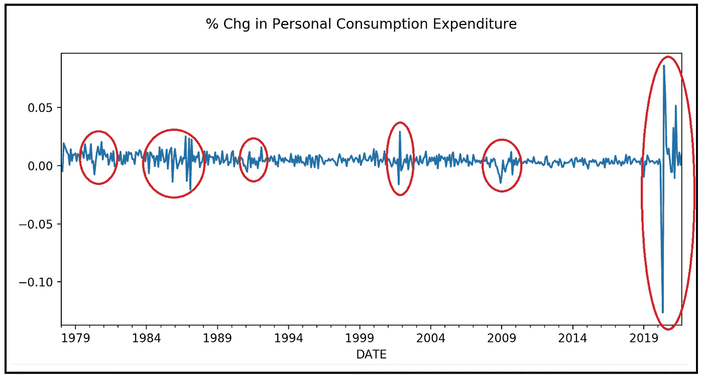

个人消费支出高波动区域(数据来源[美国弗雷德](https://fred.stlouisfed.org/series/PCE)在[公共领域](https://fred.stlouisfed.org/searchresults/?st=personal%20consumption%20expenditures&t=public%20domain%3A%20citation%20requested&ob=sr&od=desc&types=gen;cc)许可下)(图片由作者提供)

## 详细解释了 MSDR 模型，并提供了 Python 教程来帮助您使用真实世界的数据集在 MSDR 上运行

**马尔可夫切换动态回归**模型是一种**隐马尔可夫模型**，可以用来表示这样的现象，其中一部分现象是直接观察到的，而其余部分是“隐藏的”。使用**马尔可夫模型**对隐藏部分建模，而使用合适的**时间序列回归模型**对可见部分建模，使得时间序列回归模型的均值和方差根据隐藏马尔可夫模型所处的状态而变化。

本文的前半部分详细解释了 MSDR 模型是如何工作的，后半部分是一个快速教程**,讲述如何在真实世界数据集**上使用 **Python** 和 **statsmodels** 和构建和训练 MSDR 模型。****

如果您不熟悉马尔可夫过程，请阅读以下文章:

</a-beginners-guide-to-discrete-time-markov-chains-d5be17cf0e12>  

关于**隐马尔可夫模型**的详细处理，包括 MSDR 模型，请查看以下内容:

</a-math-lovers-guide-to-hidden-markov-models-ad718df9fde8>  

# MSDR 模型的一般说明

我们将查看 MSDR 模型的一般说明，该模型由时间索引因变量 ***y*** 、回归变量矩阵 ***X*** 、拟合系数向量****β_ cap***和残差 ***ε*** *组成。**

粗体变量表示向量或矩阵。带有“上限”的变量是指该变量的拟合值，即在数据集上训练模型得到的值。

## 因变量 *y*

设 ***y*** 为“ *n* ”时间索引观测值的*【n×1】*向量 *y_t:*

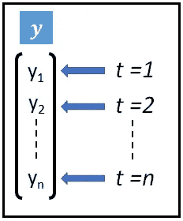

因变量 **y** (图片作者提供)

## 回归变量矩阵 X

设 ***X*** 为回归变量的*【n X(m+1)】*矩阵。第一列是截距。***x****_ t*就是这个矩阵的一行。

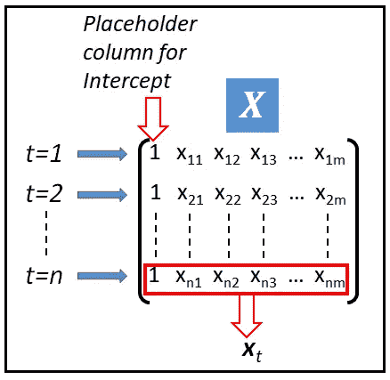

回归变量矩阵 **X** (图片来自作者)

## 拟合回归系数 ***β_cap***

设 ***β_cap*** 为回归系数的 *[(m+1) X 1]* 向量。**β*上的“cap”表示它是模型训练产生的系数的拟合值。*

**

*拟合回归系数β_cap 的向量(图片由作者提供)*

*我们现在考虑包含附加误差分量的时间序列模型的以下一般规范:*

*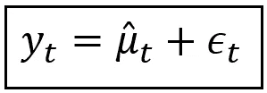*

*y_t 表示为平均值和误差项之和(图片由作者提供)*

*在上面的模型中，观测值 *y_t* 是预测值 *μ_cap_t* 和残差 *ε_t* 之和。我们进一步假设 *ε_t* 是一个[同态分布](/heteroscedasticity-is-nothing-to-be-afraid-of-730dd3f7ca1f)和 *N(0，σ )* 分布随机变量。*

**μ_cap_t* 是某个回归函数 *η(。)*这样说:*

**μ_ cap _ t =η(****x****_ t，****β_ cap****)**

*   **η(。)=0* 得出 [**白噪声模型**](/the-white-noise-model-1388dbd0a7d)**:***y _ t =ε_ t .**
*   **η(。)=y_bar=(y_1+y2+…+y_n)/n* 得出[**均值模型**](/the-complete-guide-to-r-squared-adjusted-r-squared-and-pseudo-r-squared-4136650fc06c):***y _ t = y _ bar。****
*   ****η(。)=****x****_ t****β_ cap***产量 [**线性模型**](/the-complete-guide-to-r-squared-adjusted-r-squared-and-pseudo-r-squared-4136650fc06c):y _ t =***x****_ t****β_ cap****+ε_ t****
*   ****η(。)= exp(****x****_ t****β_ cap****)*产生了</poisson-regression-models-for-time-series-data-sets-54114e68c46d>**泊松模型或 [**非线性**](/a-guide-to-building-nonlinear-least-squares-nls-regression-models-310b97a7baeb) 泊松模型。*****

*****诸如此类。*****

## *****马尔可夫模型中的混合*****

*****让我们介绍一下 [k 状态马尔可夫过程](/a-beginners-guide-to-discrete-time-markov-chains-d5be17cf0e12)对上述指定回归模型的影响，如下:*****

*****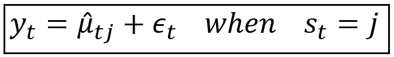*****

*****用预测均值 *μ_cap_t_j 和残差* ε_t 之和表示的观测值 y_t(图片由作者提供)*****

*****其中，如前所述，预测平均值是***x****_ t*和 *β_cap* 的函数:*****

******μ_ cap _ t _ j =η(****x****_ t，****β_ cap****_ j)******

*****但是这一次，注意回归系数向量被称为***β_ cap****_ j*对应于*第 j 个*马尔可夫状态。*****

*****一般来说，如果马尔可夫模型在' *k'* 状态*【1，2，…，j，…，k】*上运算，回归系数是大小为 *[(m+1) X k]* 的矩阵，如下所示:*****

*****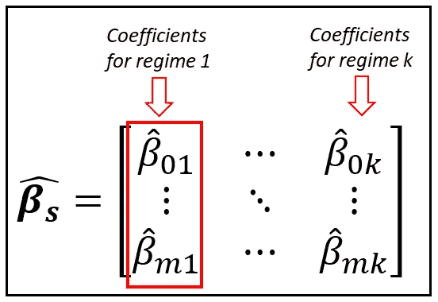*****

*****大小为[k x (m+1)]的系数矩阵(图片由作者提供)*****

*****这里的直觉是，取决于[1，2，…，k 中的哪个马尔可夫状态或“状态” *j* *当前有效，回归模型系数将**切换**到适当的状态特定的*向量****β_ cap****_ j*从 ***β_cap_s*** 因此得名‘马尔可夫**切换**动态回归模型’。******

******k*-状态马尔可夫过程本身由以下状态转移矩阵 ***P*** 支配:*****

*****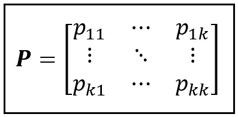*****

*****马尔可夫过程的状态转移矩阵 **P** (图片由作者提供)*****

*****并且在时间步 *t* 具有以下状态概率分布 ***π_*** *t* :*****

*****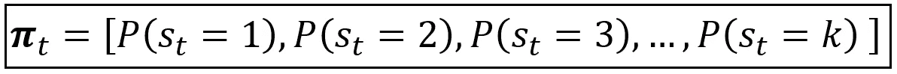*****

*****k 状态马尔可夫过程的状态概率分布向量(图片由作者提供)*****

*****并且已知/假设在 *t=0* 时 ***π_0*** 的某个值，我们计算***π_****t*如下:*****

*****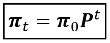*****

*****给定 t=0 时的概率分布和转移矩阵 **P** (图片由作者提供)，马尔可夫过程在 t 时的状态概率分布公式*****

## *****具有线性连接函数的 MSDR 模型*****

*****现在假设我们为预测平均值假设一个**线性链接函数**:*****

******η(。)=****x****_ t****β_ cap _ s***从而产生 [**线性模型**](/the-complete-guide-to-r-squared-adjusted-r-squared-and-pseudo-r-squared-4136650fc06c) 为可见过程:*****

******y _ t =****x****_ t***β_ cap _ s***+ε_ t******

*****回想一下***X****_ t*是一个大小为*【1x(m+1)】的矩阵，而* ***β_cap_s*** 是一个大小为 *[(m+1) X k]，*的矩阵，因此， ***x********

******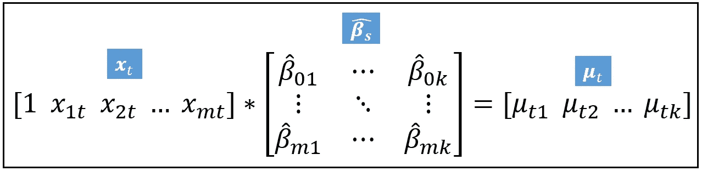******

******(图片由作者提供)******

******因此，对于每个时间步，上述计算返回平均值的 *k* 个可能预测，对应于基础马尔可夫过程的 *k* 个状态。我们需要一种方法将它们整合成一个单一的预测。我们通过计算 *μ_cap_t_j* 的期望值来实现:******

******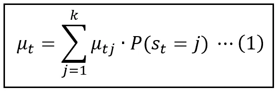******

******预测平均值的期望值(图片由作者提供)******

******马尔可夫模型在时间 *t* 处于状态 *j* 的概率由马尔可夫变量 *s_t* 的状态概率分布的*第 j 个*元素给出。我们之前看到，它是以下向量:******

************

******k 状态马尔可夫过程的状态概率分布向量(图片由作者提供)******

# ******训练和评估******

******MSDR 模型的训练包括估计系数矩阵***【β_ cap _ s】***、转移矩阵 ***P*** 和因变量***【y】***的方差 *σ* ，估计过程通常是最大似然估计(MLE)或期望最大化。******

******我们将说明 MLE，它找到了将使观察整个训练数据集*y 的联合概率密度最大化的***P*******β_ cap _ s***和σ的值。换句话说，我们希望最大化以下产品:********

******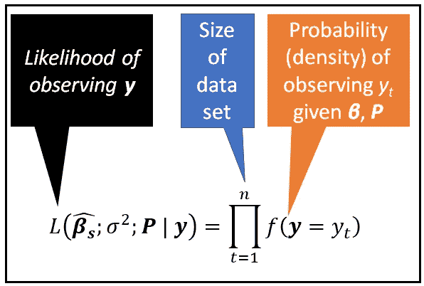******

******观察数据集的可能性(图片由作者提供)******

******在上面的乘积中，概率密度*f(****y****= y _ t)*的形式取决于我们对***【y****假设了什么样的模型。*******

******如果我们假设一个像前面看到的线性模型，概率密度*f(****y****= y _ t)*由下面的等式给出:******

******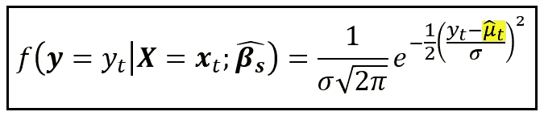******

******k 状态隐马尔可夫模型影响下的正态分布 **y** (图片由作者提供)******

******其中， *μ_cap_t* 是使用等式(1)计算的所有可能状态的预测平均值的期望值。在给定回归变量值***x****_ t*和状态特定系数矩阵 ***β_cap_s.*** 的情况下，L.H.S .上的概率被读取为在时间 *t* 观察 *y_t* 的条件概率密度******

******还有一种计算概率密度的方法。让我们将 *f( )* 的公式改写如下:******

******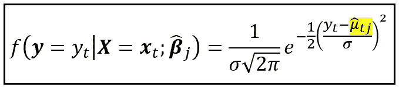******

********y** 的概率密度取决于 **X** 以及在时间 t 处于状态 j 的隐马尔可夫过程(图片由作者提供)******

******其中，*μ_ cap _ TJ =****x****_ t****β_ cap****_ j .*即回归变量的线性组合**和与状态 *j:*********

******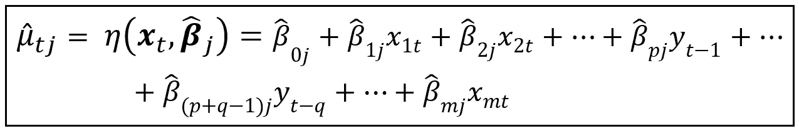******

******正态分布 y_t 的条件均值，表示为回归变量 **x** _t、y_t 的滞后版本和马尔可夫状态相关拟合系数 ***β_cap*** *_* j 的线性组合(图片由作者提供)******

******对于一个 *k-* 状态马尔可夫过程，我们将得到 *k* 这样的概率密度值，对于每个时间步 *t* ，对于*【1，2，3，…，k】*中的每个状态 *j* 都有一个。******

******和以前一样，对于每个时间步，我们希望将这些 *k* 概率密度合并成一个密度。这一次，我们求助于 [**全概率定律**](https://en.wikipedia.org/wiki/Law_of_total_probability) ，该定律指出，如果事件 A 可以与事件 A1，或事件 A2，或事件 A3 等等共同发生，那么 A 的无条件概率可以表示如下:******

******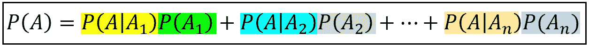******

******全概率定律(图片由作者提供)******

******利用这个定律，我们得到在时间 *t* 观察到 *y_t* 的概率密度如下:******

******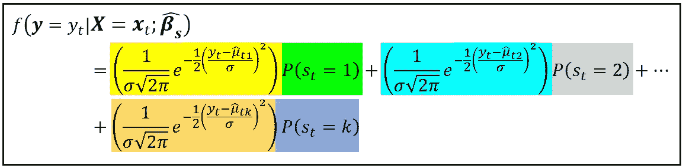******

******k 状态马尔可夫模型影响下的 ***y*** 的概率密度(图片由作者提供)******

******注意，在 k 项的每一项中，我们都使用相应的条件均值 *μ_cap_tj。*而且我们知道 *P(s_t=1)，P(s_t=2)，…等等。*是马尔可夫过程在时间 *t.* 的状态概率******

******现在我们已经有了 f(***y****= y _ t)*的公式，让我们回到似然方程:******

************

******观察数据集的可能性(图片由作者提供)******

******最大化这个乘积的**自然对数通常是迅速的，因为它的好处是将乘积转换成在微积分中更容易处理的求和(我们很快就会知道为什么)。因此，我们最大化下面的 ***日志***-可能性:********

****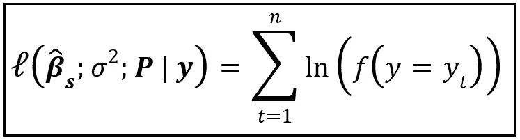****

****观察数据集的对数似然性(图片由作者提供)****

****对数似然的最大化通过使用以下程序来完成:****

1.  ****取对数似然 w . r . t .*中的每个转移*概率 p_ij* 和系数矩阵 ***中的每个状态特定系数*β_ cap _ q _ j*β_ cap _ s****其中 *q in [0，1，…，m]* 和马尔可夫状态******
2.  ****将每个偏导数设为零，****
3.  ****使用诸如[牛顿-拉夫森](https://en.wikipedia.org/wiki/Newton%27s_method)、[内尔德-米德](https://en.wikipedia.org/wiki/Nelder%E2%80%93Mead_method)或[鲍威尔的*中的*(k+(m+1)* k*系数以及方差σ的某种优化算法来求解与 *k* 马尔可夫转移概率、 *(m+1)*k* 相对应的 *(k +(m+1)*k +1)* 方程(实际上比那个数少得多)*](https://en.wikipedia.org/wiki/Powell%27s_method)****

# ***使用 Python 和 Statsmodels 构建 MSDR 模型的教程***

***在本教程中，我们将使用 MSDR 模型来调查美国个人消费支出和密歇根大学发布的消费者情绪指数之间的可能联系。正如我们将很快看到的，MSDR 模型的隐马尔可夫部分将帮助我们解释个人消费支出数据中的一些可变性，否则用消费者情绪数据进行直接回归可能无法完成。***

***让我们从检查两个数据集开始:个人消费支出和消费者情绪指数。两个数据集都可以从这里下载。使用 [Pandas](https://pandas.pydata.org/) ，我们将两个数据集加载到一个数据帧中:***

```
***import** pandas **as** pd
**import** numpy **as** np
**from** matplotlib **import** pyplot **as** plt
**import** statsmodels.api **as** sm ***#Load the PCE and UMCSENT datasets*** df = pd.**read_csv**(**filepath_or_buffer**=**'**UMCSENT_PCE.csv**'**, **header**=0, **index_col**=0, **infer_datetime_format**=True, **parse_dates**=[**'**DATE**'**])***#Set the index frequency to 'Month-Start'*** df = df.**asfreq**(**'**MS**'**)*
```

***让我们绘制两个时间序列:***

```
*fig = plt.**figure**()
fig.**suptitle**('% Chg in Personal Consumption Expenditure')
df['PCE_CHG'].**plot**()
plt.**show**()fig = plt.**figure**()
fig.**suptitle**('% Chg in U. Michigan Consumer Sentiment Index')
df['UMCSENT_CHG'].**plot**()
plt.**show**()*
```

***我们得到下面的图:***

***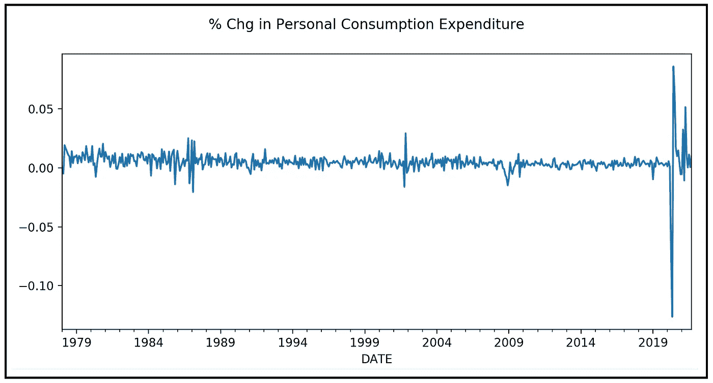***

***个人消费支出的百分比变化(数据来源[美国弗雷德](https://fred.stlouisfed.org/series/PCE)在[公共领域](https://fred.stlouisfed.org/searchresults/?st=personal%20consumption%20expenditures&t=public%20domain%3A%20citation%20requested&ob=sr&od=desc&types=gen;cc)许可下)(图片由作者提供)***

***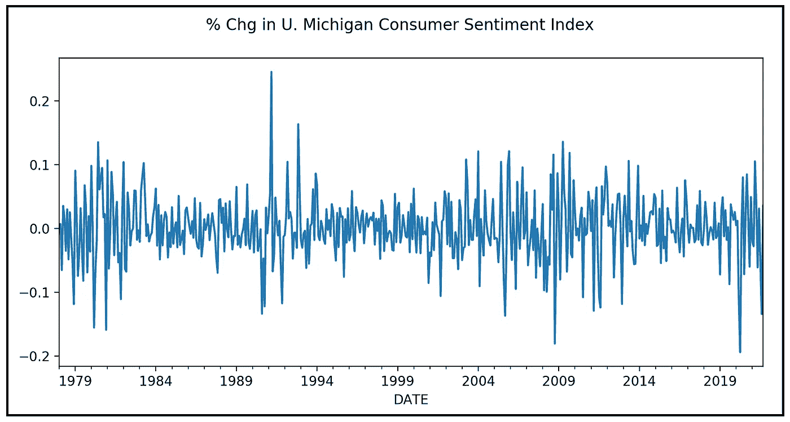***

***消费者情绪指数的百分比变化(数据来源:[密歇根大学](https://data.sca.isr.umich.edu/data-archive/mine.php)在公共领域许可下)(图片由作者提供)***

## ***回归目标和回归策略***

***我们的回归目标是使用美国密歇根消费者情绪指数的方差来解释个人消费支出的方差。***

***因此，我们的回归模型的变量如下:***

*****因变量*****y***= PCE _ CHG(个人消费支出的 M-o-M %变化)***

*****回归变量*****X***= UMCSENT _ CHG(消费者情绪指数的 M-o-M %变化)，加上回归的截距。***

***下面是我们的 ***y*** 和 ***X*** 矩阵:***

***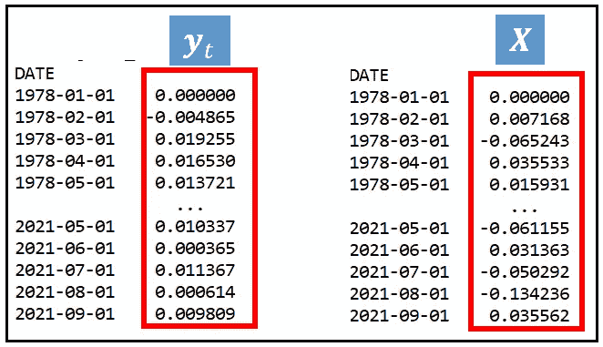***

*****y** 和 **X** 矩阵(图片由作者提供)***

***回归的截距由 statsmodels 添加。***

***在这两个图表中，我们都可以看到高波动性区域(即方差)，如 PCE 图表下方的红圈所示:***

******

***个人消费支出高波动区域(图片由作者提供)***

***我们将使用一个 2 态马尔可夫转换动态回归模型来尝试对高低方差区域之间的这些方差“转换”进行建模:***

***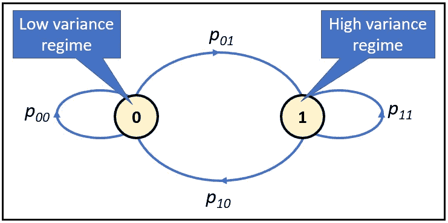***

***在高低方差状态之间切换的双态 MSDR 模型(图片由作者提供)***

***注意，这次我们对马尔可夫状态使用基于 0 的索引，因为这是 statsmodels 使用的。***

***状态转移矩阵是:***

***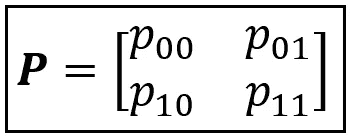***

***状态转移矩阵(图片由作者提供)***

***我们的 MSDR 模型的等式如下:***

***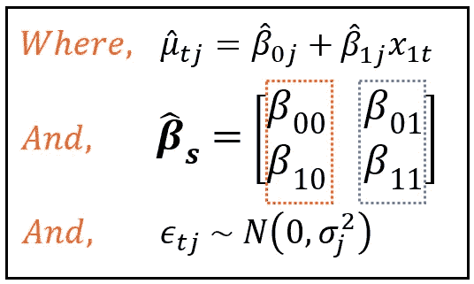***

***具有状态依赖均值和方差的 2 状态 MSDR 模型的方程(图片由作者提供)***

***请注意，我们还引入了一个**特定于州的方差**。我们说，模型的残差正态分布在一个零均值和一个方差周围，该方差根据基础马尔可夫过程所处的状态在两个值之间切换。***

***statsmodels 支持方差切换 MSDR 模型。***

***让我们构建并训练两状态 MSDR 模型:***

```
*msdr_model = sm.**tsa**.**MarkovRegression**(**endog**=df[**'**PCE_CHG**'**], **k_regimes**=2, **trend**=**'**c**'**, **exog**=df[**'**UMCSENT_CHG**'**], **switching_variance**=True)msdr_model_results = msdr_model.**fit**(**iter**=1000)*
```

****trend='c'* 告诉 statsmodels 给 ***X*** 矩阵添加一个截距。***

***让我们打印模型培训总结:***

```
***print**(msdr_model_results.**summary**())*
```

***我们得到以下输出:***

***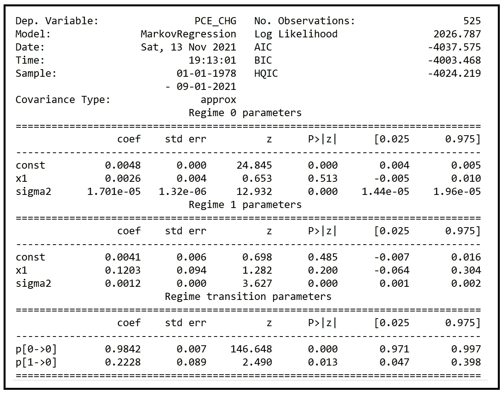***

***MSDR 模特培训总结(图片由作者提供)***

***上述结果中的变量名可以解释为:
*β_ 0 = const
β_ 1 = x1
σ= sigma 2
p[0->0]= p _ 00，因此，p _ 01 = 1—p _ 00
p[1->0]= p _ 10，因此，p _ 11–1-p _ 10****

***通过查看结果中的拟合系数值，我们可以写出特定于制度的模型方程如下:***

*****对于体制=0(低方差体制):** *PCE _ CHG = 0.0048+0.0026 * UMC sent+ε_ t，
其中ε_t ~ N(0，1.701e-05)****

*****对于政权=1(高方差政权):** *PCE _ CHG = 0.0041+0.1203 * UMCSENT+ε_ t，
其中ε_t ~ N(0，0.0012)****

***马尔可夫状态转移图和矩阵 ***P*** 如下:***

***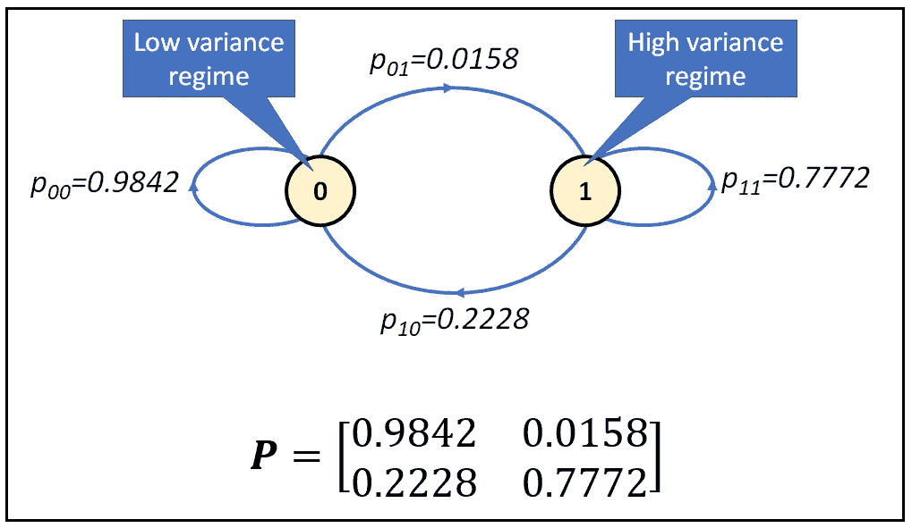***

***拟合 2 态马尔可夫模型的状态转移图和转移矩阵 P(图片由作者提供)***

***我们看到，当个人消费支出处于低方差状态时，不到 2%的时间倾向于切换到高方差状态，而如果消费支出处于高方差状态，则倾向于以大约 20%的概率切换回低方差状态。***

***训练结果中暴露出的一个有些令人不安的事实是，在状态 0 中，UMCSENT ( *β_10)* 的系数在 *95%* 置信水平 *(p 值=0.513 > 0.05)* 下不具有统计显著性，在状态 *1* 中， *β_01* 和 *β_11* 在 95%置信水平下不具有统计显著性***

***让我们画出每个时间步*t*的马尔可夫状态概率***π_****t*在我们的例子中，时间步是一个月。除了图表***π_****t*之外，我们还将绘制 PCE %变化图，我们还将绘制根据基于 GDP 的衰退指标数据集(来源于[美国 FRED](https://fred.stlouisfed.org/series/JHDUSRGDPBR) 在[公共领域](https://fred.stlouisfed.org/searchresults?st=recession&t=public%20domain%3A%20citation%20requested&ob=sr&od=desc&types=gen;cc)许可下)推断的美国衰退**日期。*****

```
*df_r = pd.read_csv(**'JHDUSRGDPBR.csv'**, header=0, index_col=0, infer_datetime_format=**True**, parse_dates=[**'DATE'**])

figure, axes = plt.**subplots**(3)
ax = axes[0]
ax.**plot**(df.**index**, df[**'**PCE_CHG**'**])
ax.**set**(**title**='% Chg in Personal Consumption Expenditure')

ax = axes[1]
ax.**plot**(df.**index**, msdr_model_results.**smoothed_marginal_probabilities**[0])
ax.**set**(**title**=**'**Smoothed probability of regime 0')

ax = axes[2]
ax.**plot**(df.**index**, msdr_model_results.**smoothed_marginal_probabilities**[1])
ax.**plot**(df_r.**index**, df_r[**'**JHDUSRGDPBR**'**])
ax.**set**(**title**='Smoothed probability of regime 1 super-imposed on GDP based recession indicator (Orange)')

plt.**show**()*
```

***我们得到如下的情节:***

***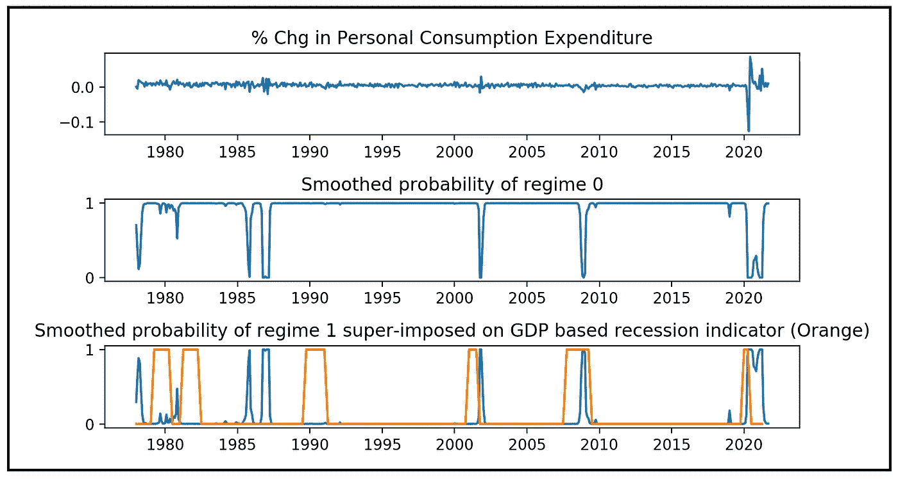***

***马尔可夫状态概率叠加了基于 GDP 的衰退指标(图片由作者提供)***

***我们看到往往当马尔可夫状态模型处于高方差状态时，美国经济处于衰退状态。***

***下面是完整的源代码:***

# ***参考文献和版权***

## ***数据集***

***美国经济分析局，个人消费支出[PCE]，从圣路易斯美联储银行检索；[https://fred.stlouisfed.org/series/PCE](https://fred.stlouisfed.org/series/PCE)，2021 年 11 月 11 日。在[公共许可证](https://fred.stlouisfed.org/tags/series?t=public%20domain%3A%20citation%20requested)下可用。***

***密歇根大学，调查研究中心，消费者调查。[消费者情绪指数](https://data.sca.isr.umich.edu/data-archive/mine.php)。在公共许可下可用。***

***Hamilton，James，根据基于 GDP 的衰退指标[JHDUSRGDPBR]推断的美国衰退日期，从圣路易斯美联储银行的 FRED 处检索；[https://fred.stlouisfed.org/series/JHDUSRGDPBR](https://fred.stlouisfed.org/series/JHDUSRGDPBR)，2021 年 11 月 12 日。***

## ***书***

***詹姆斯·d·汉密尔顿， [*时间序列分析*](https://press.princeton.edu/books/hardcover/9780691042893/time-series-analysis) ，普林斯顿大学出版社，2020 年。ISBN: 0691218633***

## ***形象***

***所有图片的版权 [Sachin Date](https://www.linkedin.com/in/sachindate/) 归 [CC-BY-NC-SA](https://creativecommons.org/licenses/by-nc-sa/4.0/) 所有，除非图片下面提到了不同的来源和版权。***

# ***相关阅读***

***</a-beginners-guide-to-discrete-time-markov-chains-d5be17cf0e12>  </a-math-lovers-guide-to-hidden-markov-models-ad718df9fde8>  

*感谢阅读！如果您喜欢这篇文章，请* [***关注我***](https://timeseriesreasoning.medium.com) *获取关于回归和时间序列分析的提示、操作方法和编程建议。****