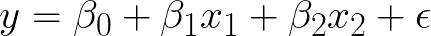
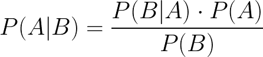
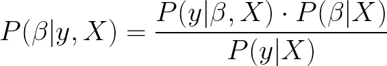
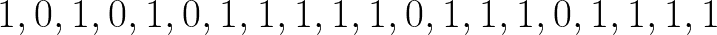
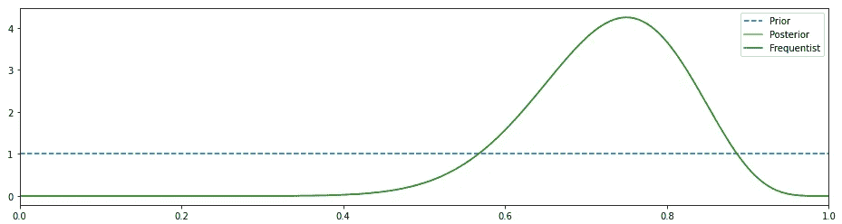
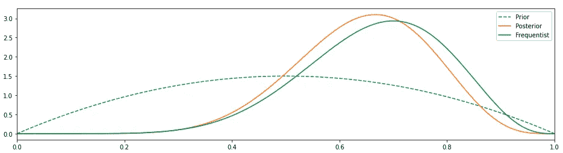
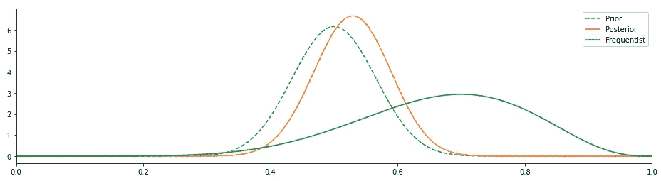

# 贝叶斯统计的零数学介绍

> 原文：<https://towardsdatascience.com/a-zero-maths-introduction-to-bayesian-statistics-4ad3aa1f09df?source=collection_archive---------21----------------------->

## 解码统计世界的十字军东征——贝叶斯与频率主义

这个不需要多介绍了。数以千计的文章，论文已经写了，一些战争已经打了贝叶斯与频率主义。根据我的经验，大多数人从通常的线性回归开始，并逐步建立更复杂的模型，只有少数人能够涉足贝叶斯的神圣池，这种机会的缺乏以及主题的简洁在理解上造成了漏洞，至少对我来说是这样的。

我不想被太多的数学方程所困扰，我想对贝叶斯统计的内容、原因和位置有一个直观的理解。这是我的一点小小的尝试。

[粘土银行](https://unsplash.com/@claybanks?utm_source=medium&utm_medium=referral)在 [Unsplash](https://unsplash.com?utm_source=medium&utm_medium=referral) 拍摄的照片

# 为贝叶斯过程建立直觉

让我们为贝叶斯分析建立一个直觉。我相信你可能曾经被卷入频繁主义和贝叶斯主义的争论中。有很多文献可以解释这两种统计推断方法之间的区别。

简而言之， ***频数主义*** 是从数据中学习的常用方法，用 p 值来衡量变量的显著性。频率主义方法是关于点估计的。如果我的线性方程是:

y 是响应变量，x₁、x₂是因变量。β₁和β₂是需要估计的系数。β₀是截距项；如果 x₁改变 1 个单位，那么 y 将受到β₁单位的影响，例如，如果 x₁是 1，β₁是 2，那么 y 将受到 2 个单位的影响。常见的线性材料。这里需要注意的是，回归方程基于最小化误差平方和(最佳拟合线)来估计各种β的值，这最好地解释了手头的数据，并且估计值是奇点，即β₀、β₁和β₂各有一个值，依此类推。β的估计值被称为β的**最大似然估计值**，因为它是给定输入 x 和输出 y 时最有可能的值。

***贝叶斯*** 与频率主义方法的不同之处在于，除了数据之外，它还考虑了数据的先验知识。这就是这两个群体之间的分歧所在。频繁主义者将数据视为福音，而贝叶斯主义者则认为总有一些我们知道的关于系统的东西，为什么不用它来估计参数。

数据和先验知识一起被用来估计所谓的后验概率，它不是一个单一的值，而是一个分布。贝叶斯方法估计模型参数的后验分布，而不是像 frequentist 方法那样的单一最佳值。

我们为模型参数选择的先验不是单一值，而是分布，它们可以是正态分布、柯西分布、二项式分布、贝塔分布或根据我们的猜测认为合适的任何其他分布。

我希望你知道贝叶斯定理的术语和脚本

*(如果你已经理解了贝叶斯定理，请随意跳过这一节)*

虽然这是不言自明的，但让我用一个非常基本的例子来解释一下。

P(A|B)是指给定 B 已经发生的概率。例如，从一副 52 张牌中随机抽出一张牌，**假设我们抽出一张红心牌**，它是国王的概率是多少？

A =卡为王，B =卡来自红心组曲。

P(A=国王|B =红心)

P(A) = P(King) = 4/52 = 1/13

P(B) = P(红心)= 13/52 = 1/4

P(B|A) = P(红心|国王)=得到红心牌的概率，假设它是国王= 1/4(一组 52 张国王中有 4 张国王，您只能从这 4 张国王中选择一张红心国王)

综合起来，P(A|B) = (1/4)。(1/13) / (1/4) = **1/13** ，所以如果是红心，有 13 分之一的机会拿到国王。

我选择这个简单的例子是因为它并不真的需要贝叶斯法则来解决，所以即使是初学者也可以直观地思考它；如果是红心牌，拿到国王的概率是 13 分之一。

# **贝叶斯方法如何包含先验信息？**

P(A)是我们的近似值或我们拥有的数据。在上面的例子中，P(A)是不考虑套房的情况下获得国王的概率。我们知道得到一个国王的概率是 1/4，所以我们没有从头开始，而是给系统提供一个 0.25 的值。

*顺便说一句，托马斯·贝叶斯没有提出上面的方程式，是拉普拉斯提出的。贝氏写了一篇关于他的思想实验的论文“* [*一篇关于解决机会主义中一个问题的论文*](https://en.wikipedia.org/wiki/An_Essay_towards_solving_a_Problem_in_the_Doctrine_of_Chances) *”。贝氏去世后，他的朋友理查德·普莱斯发现了这份报纸，在他编辑了几版后，这份报纸在伦敦皇家学会被阅读。*

**对于贝叶斯推断:**

P(β|y，X)称为模型参数β的后验分布，给定数据 X 和 y，其中 X 为输入，y 为输出。

P(y|β，X)是数据的似然性，乘以参数 P(β|X)的*先验概率*,再除以 P(y | X ), P(y | X)被称为归一化常数。需要此归一化参数来使 P(β|y，X)中的值之和等于 1。

简而言之，我们使用关于模型参数和数据的先验信息来估计后验。

> 如果你已经走了这么远，给自己一点鼓励吧！:)

资料来源:Giphy.com

*许多贝叶斯学派的思想家将谜底归功于艾伦·图灵。是的，他的确建立了概率模型，但是波兰数学家帮助了他。早在战争之前，波兰数学家已经用数学方法解决了这个谜，而英国人还在试图用语言来解决它。万岁***！**

# *通过一个例子说明关键时刻*

*让我们用一些简单的例子来建立我们的直觉，看看我们是否能理解我们在上面学到的东西。*

*让我们掷硬币 20 次，1 是正面，0 是反面。以下是掷硬币的结果:*

**

*这个数据平均值是 0.75；换句话说，有 75%的机会是正面即 1，而不是反面即 0*

*顺便说一下，任何正常情况下只有两个结果 0 或 1 的过程被称为**伯努利过程**。*

*采用频率主义者的方法，看起来硬币是有偏差的，即如果我们再扔一次，那么根据频率主义者的估计，硬币更有可能(75%的情况下)正面朝上，即 1。*

*尽管如此，大多数硬币是没有偏向的，得到 1 或 0 的概率应该是 50%。根据中心极限定理，如果我们投掷硬币无限次，那么正面和反面的概率都是 0.5。现实生活与定理大相径庭，没有人会把一枚硬币扔无限次；我们必须根据现有的数据做出决定。*

*这就是贝叶斯方法有用的地方。这给了我们包含先验(我们最初的信念)的自由，这就是我们将对抛硬币数据所做的。*如果我们没有关于先验的任何信息，那么我们可以使用完全无信息的均匀分布——在实践中，均匀分布的结果将与频率主义方法相同，因为我们告诉我们的模型每种可能性都是同等可能的。**

> **非贝叶斯(频率主义者)=具有统一先验的贝叶斯**

**

*不提供信息的先验给出了与频繁主义者方法相同的结果(图片由作者提供)*

*在上图中，后验结果和频率主义结果一致，峰值在 0.75 左右(就像频率主义方法一样)。先验是一条直线，因为我们假设是均匀分布。在这种情况下，绿色分布实际上是一种可能性。*

*我相信我们可以做得更好。让我们改变我们的先验知识，也许是一个 beta 分布，然后观察结果。*

**

*之前改为测试版，我们看到它比 frequentist 做得更好*

*这似乎更好。我们的先验已经改变，因此后验概率向左移动，它不在 0.5 附近，但它至少与频率主义者的 0.75 不一致。*

*我们可以通过调整先前发行版的几个参数来进一步改进它，使它变得更加自以为是。*

**

*与 frequentist 相比，固执己见的先验使贝叶斯方法的结果模拟了真实世界(图片由作者提供)*

*这看起来好多了，后验概率已经改变了，因为我们已经改变了先验概率，这也更加符合这样一个事实:一个无偏的硬币有 50%的时间是正面，其余时间是反面。*

> **我们现有的关于硬币的知识对结果产生了重大影响，这是有道理的。这与频率主义者的方法截然相反，在频率主义者的方法中，我们假设我们对硬币一无所知，这 20 个观察结果就是福音。**

# *结论*

*所以你可以看到，通过贝叶斯，尽管数据匮乏，当我们在模型中包含我们最初的信念时，我们还是能够得出大致正确的结论。贝叶斯规则是贝叶斯统计的直觉(这是一个显而易见的说法)的背后，它为频率主义提供了一个替代方案。*

1.  *贝叶斯方法结合了先验信息，当我们的数据有限时，这是一个可靠的工具。*

*2.这种方法似乎很直观——估计您的解决方案是什么，并在收集更多数据时改进这种估计。*

> **请理解，这并不意味着贝叶斯是解决所有数据科学问题的最佳方法；这只是其中的一种方法，学习贝叶斯和频率主义的方法比在这些思想流派之间进行战斗更有成效。**

*权力越大，责任越大。对一切都要半信半疑。虽然贝叶斯方法有明显的优势，但它更容易产生高度偏倚的结果。人们可以选择一个先验来改变整个结果。例如，在制药业，选择“正确的”药物比投资数百万美元研发更安全有效的药物要容易和便宜得多。当数十亿美元岌岌可危时，在掠夺性期刊上发表平庸的研究并把它们作为你的先验更容易。*

***延伸阅读:***

*约翰逊(2002 年)。涌现:蚂蚁、大脑、城市和软件的互联生活。西蒙和舒斯特。*

*快乐阅读&保持好奇！*

*资料来源:Giphy*