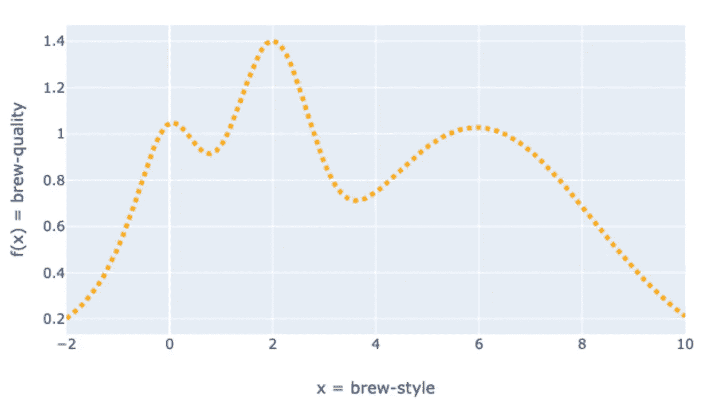
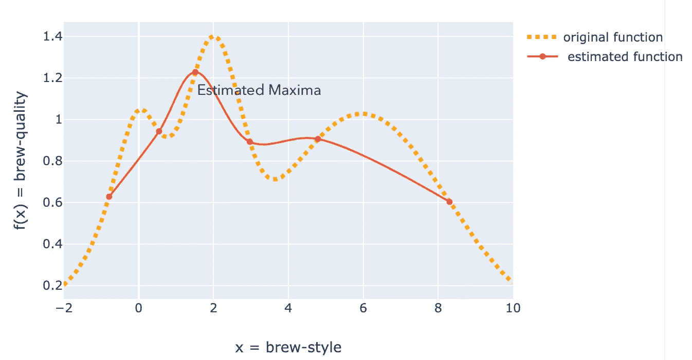
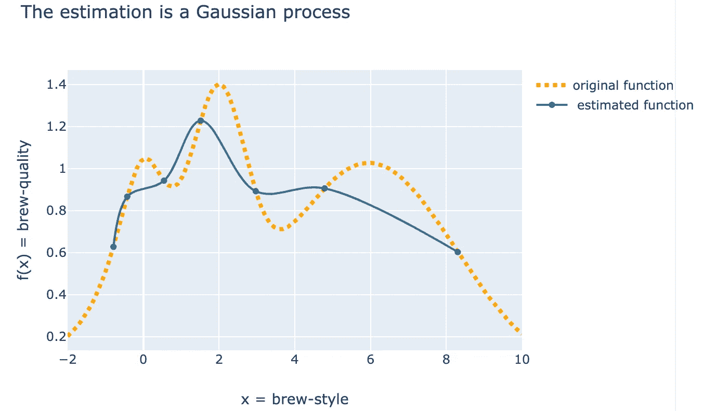
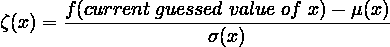
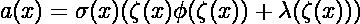
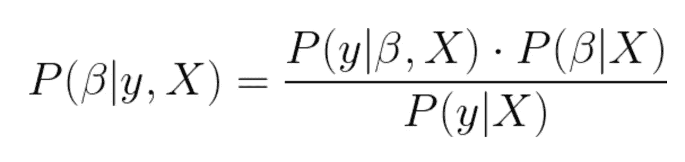

# 对贝叶斯优化的零数学理解

> 原文：<https://towardsdatascience.com/a-zero-maths-understanding-of-bayesian-optimization-e064a957a124?source=collection_archive---------14----------------------->

## 为机器学习的贝叶斯优化建立简单的直觉

我送给你一台复杂的假想咖啡机，让你通过调节机器上的数千个转盘来为自己调制最好的咖啡。你是一个聪明的家伙，很快意识到这是一个优化问题。你有两个选择:

1.  无数次地改变转盘的设置，冲泡不同类型的咖啡，品尝所有的咖啡，找到你最好的咖啡，然后死于过量摄入咖啡因。
2.  尝试通过量化所涉及的各种因素来找到函数**brew-quality = f(brew-styles)**，并通过计算函数的导数，使用梯度下降法来找到全局最大值。

资料来源:联合国人类住区规划署

这里有两点需要注意:

1.  我们真的不知道这个函数是什么，它是一个黑盒。我们通过调节转盘来煮咖啡，我们得到咖啡作为输出，机器内部发生了什么，我们真的不知道。我们仅有的信息是在机器的特定设置下咖啡的味道如何。
2.  即使我们知道**的酿造质量**功能是什么，评估它也是昂贵的，因为考虑到胃容量和健康危害，我们不能有几千杯咖啡。

那么，我们该怎么办？

有一个框架可以解决这个问题，那就是贝叶斯优化。

> 当函数是一个黑盒，因此梯度下降不是一个选项和/或函数是昂贵的评估时，它是适用的。这两个标准在这里都得到满足。

# 贝叶斯优化

让我们假设酿造质量的黑盒函数是:

原始功能，对用户隐藏。这是一个黑盒函数(图片由作者提供)

该函数是一个黑盒，我们只能对不同的输入(brew 风格)进行评估。

***假设我们想在只对 15 杯咖啡*** 进行采样后找到最佳的冲泡方式，我们要做的是冲泡几杯咖啡< 15，在这种情况下，我们冲泡了 6)并有一个如下红色所示的估算函数。

第一次迭代中的估计函数(图片由作者提供)

现在，我们将使用这个估计函数来确定下一步在哪里求值。

> 这个由估计函数对原函数的估计是一个*高斯过程(暂时不需要了解)。*另一方面，估计函数被称为*替代函数(只是命名)*

第二次迭代中的估计函数(图片由作者提供)

借助新生成的数据创建新的估计函数。

从新估计的函数中估计新的评估点(第三次迭代)。继续重复这个过程，直到你完成了所有的评估(在我们的例子中是 15 次)。并希望在 15 次迭代结束时，估计的函数是原函数的良好逼近。

如果估计的函数足够好，那么这种方法将会有效并节省你很多时间。

这种方法比评估每一杯*咖啡的冲泡质量*更直观，更能模拟现实生活。它本质上是贝叶斯理论(下面讨论)。比方说，对于一杯 100 毫升的特定风格的饮料，你可以以 1 毫升的增量将牛奶量从 15 毫升调节到 50 毫升。如果你已经知道加了 20 毫升牛奶的咖啡太淡了，不适合你的口味，那么你为什么还要评价一杯加了 20 到 50 毫升牛奶的咖啡呢？

另一方面，*随机搜索*可能会评估许多从 20 到 50 毫升牛奶含量的杯子，从而浪费评估。

请注意，我们的目标不是确定 orange 函数，而是确定采集函数的值，这将有助于以最少的计算次数来确定代理。

> *写报告的零数学部分到此结束。我将继续讲述更多的细节，并尽可能远离复杂的方程。*

# 关于高斯过程的一个注记

如上所述，从替代物对原始函数的估计是一种高斯过程。让我们试着理解它的意思。

我们使用估计函数(蓝线)来确定评估点(接下来要品尝什么类型的咖啡)，从而改进估计函数(尽可能接近橙色虚线函数)。

现在，基于蓝线，我们如何推断出更多关于橙线的信息？

我们想要两样东西:

1.  我们希望在产量高的点进行评估(记住，我们是在最大限度地提高酿造质量，因此高价值是受欢迎的)。这是 ***剥削***
2.  我们应该探索我们了解较少的曲线区域，例如，我们不太了解 2 和 3 之间或 5 和 10 之间的情况，因此新的评估点应该来自那里。这是 ***探索*** 。

这种新点的估计是通过称为*采集功能*的功能完成的。该功能负责平衡勘探和开发之间的权衡，并让我们知道我们在实现这种平衡方面做得如何。

(以下等式在 Quora 的一篇文章中讨论过)

*常见的获取函数包括期望改善和最大改善概率*。

这个获取函数并不大，评估它要便宜得多，因此优化它比做其他事情要容易得多。

让我们定义两个值，

*μ(x)* =任意输入 x 的函数估计值(蓝线)

*∑(x)*=不同 x 值的标准偏差(标准偏差 w.r.t 蓝线)

让我们定义一个函数，ζ(x)

在这个ζ函数的基础上，我们可以定义一个(x)获取函数。

> *a(x)内部发生的事情超出了这篇简单文章的范围，但 a(x)本质上所做的是试图在低μ(x)和高σ(x)之间取得平衡。μ(x)表示开采，σ(x)表示勘探。*

这个 [pyData](https://www.youtube.com/watch?v=jtRPxRnOXnk&t=1057s) 演讲对于理解高斯过程非常有用。

[这篇关于 TDS 的文章](/an-intuitive-guide-to-gaussian-processes-ec2f0b45c71d)也讨论了这个问题。

# 贝叶斯优化的贝叶斯是什么？

(以下部分摘自我在[贝叶斯统计](https://medium.com/me/stats/post/4ad3aa1f09df)上的旧帖子)

***贝叶斯*** 方法考虑系统的先验知识。贝叶斯主义者认为，我们对这个系统总是有所了解，所以，为什么不用它来对这个系统做出更好的猜测呢。

数据(在这种情况下是函数评估)与*先验*知识一起被用来估计所谓的*后验*，它不是一个单一的值，而是一个分布。

贝叶斯定理的通俗说法是:

P(β|y，X)称为需要评估的值的后验分布，β，给定数据 X 和 y，其中 X 为输入，y 为输出。

P(y|β，X)是数据的似然性，它乘以参数 P(β|X)的*先验概率*，再除以 P(y | X ), P(y | X)被称为归一化常数。需要此归一化参数来使 P(β|y，X)中的值之和等于 1。

简而言之，我们正在使用我们关于替代函数的先验信息来估计后验概率。

在贝叶斯优化的情况下:

1.  我们在代理函数上放置一个先验(由试图捕捉我们对函数行为的信念的高斯过程定义)。
2.  函数评估被视为数据并用于更新先验以获得目标函数的后验分布。

# 结论

BO 是直观的，因为它模拟了现实生活，我们有我们的先验信念，我们用它们来估计输出，估计成为新的先验，我们得到更新的后验。当我们处理昂贵的计算和问题空间太大的时候，使用 BO 比梯度下降和它的变种要好得多。

在机器学习中，BO 用于超参数优化，例如，可以在 BO 的帮助下调整随机森林中的树木数量、深度、树叶等。有许多语言的许多库可用于进一步探索概念，如 hyperopt、botorch、bayes-optim 等，并且可以亲眼目睹强大的功能。

> 我们试图借助一个更接近日常生活的场景来介绍一个困难而简洁的数学过程。
> 
> 好吧，不完全是！这种假设的咖啡机并不存在，但尽管如此，你有工具在数学方法的帮助下找到最好的咖啡。

# 来源:

[https://static . SigOpt . com/773979031 a2 d 61595 B9 BDA 23 bb 81 a 192341 F11 a 4/pdf/SigOpt _ Bayesian _ Optimization _ primer . pdf](https://static.sigopt.com/773979031a2d61595b9bda23bb81a192341f11a4/pdf/SigOpt_Bayesian_Optimization_Primer.pdf)

创建图表的 github:【https://github.com/Prashantmdgl9/Bayesian_Optimization 