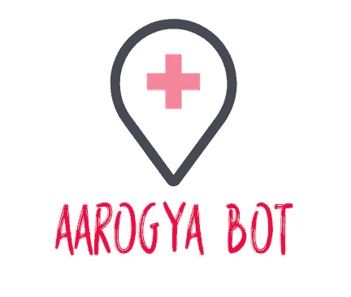
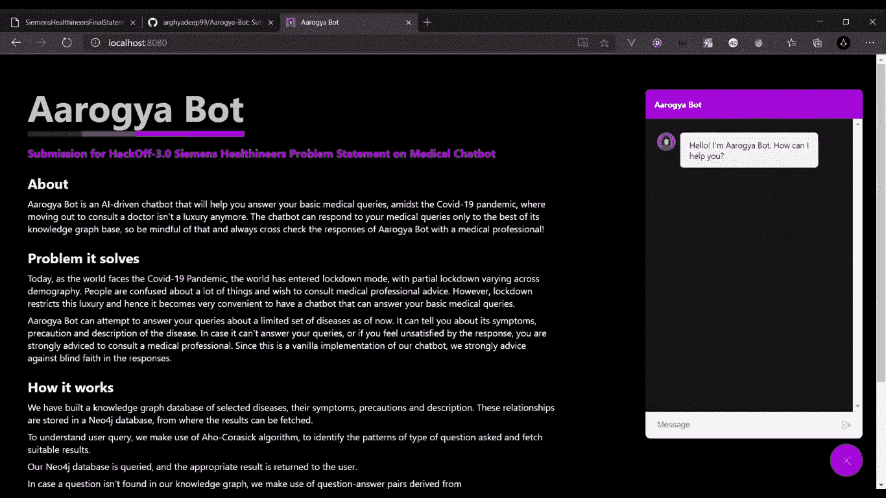
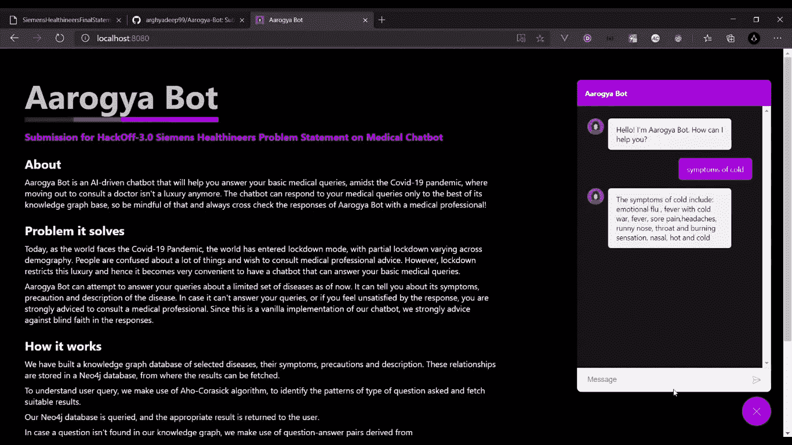
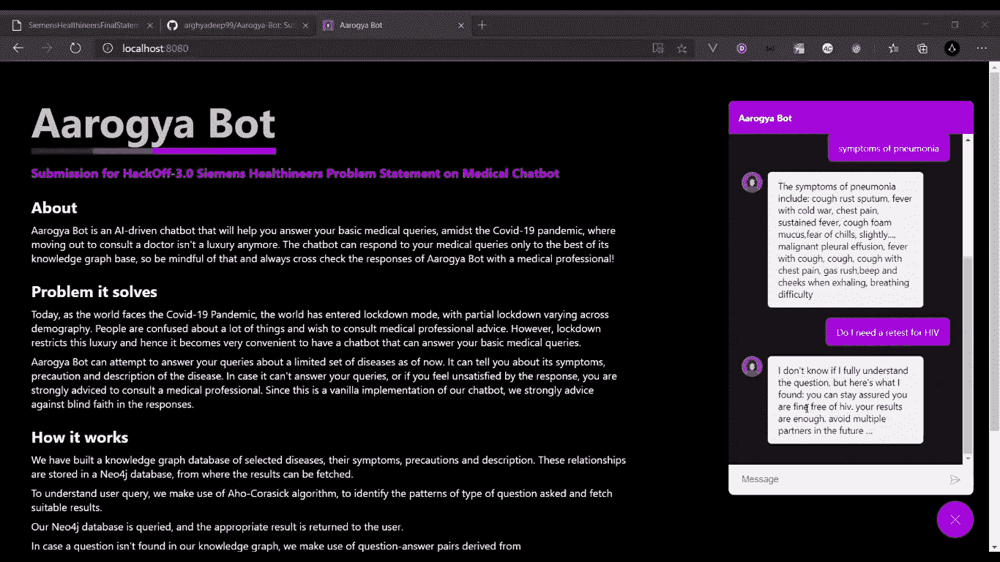
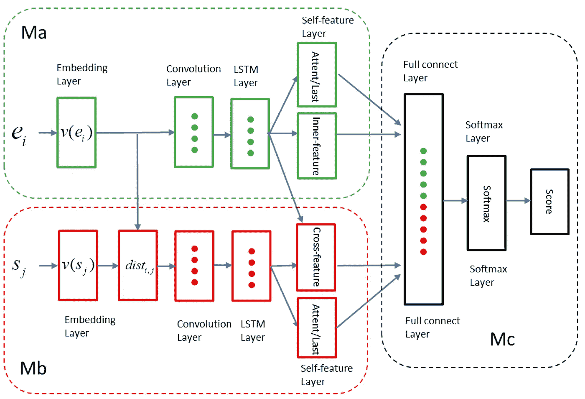

# Aarogya-Bot:人工智能驱动的聊天机器人，回答你的医疗问题

> 原文：<https://towardsdatascience.com/aarogya-bot-the-ai-driven-chatbot-to-answer-your-medical-queries-4a76daf80fc4?source=collection_archive---------19----------------------->

Aarogya-Bot 徽标

**Aarogya-Bot** 是我们在 HackOff-3.0 中打造的聊天机器人，在 2020 年 12 月的“**西门子健康人挑战赛”**赛道中获得第一名。我们在这次黑客马拉松中谈论我们远程工作的经历，以及我们如何努力适应新的“临时”常态。由于西门子协议对源代码可用性的限制，我们不能开放源代码。

# 什么是 Aarogya-Bot？

Aarogya Bot 是一个 NLP 驱动的聊天机器人，它将帮助你回答你的基本医疗问题，在新冠肺炎疫情，外出咨询医生不再是一种奢侈。聊天机器人只能根据它的知识图谱库来回答你的医疗问题，所以请记住这一点，并经常与医疗专业人员交叉检查 Aarogya 机器人的回答！我们的 Aarogya 机器人建立在以下技术基础之上:

1.  Python3
2.  克拉斯
3.  sklearn
4.  Neo4j
5.  瓶
6.  vue . j

正如你所看到的，各种各样的技术被用于构建这个普通版本的聊天机器人。截至目前，我们的聊天机器人运行在本地主机上。

# Aarogya-Bot 解决什么问题？

今天，当世界面临新冠肺炎疫情时，世界进入了封锁模式，部分封锁因人口而异。人们对很多事情感到困惑，希望咨询医学专业人士的意见。然而，封锁限制了这种奢侈，因此拥有一个可以回答基本医疗问题的聊天机器人变得非常方便。

尽管出现了不同的解决方案，如在线医生咨询、与医生的实时聊天等。，他们还是需要医生坐在屏幕前的时间投入，然后远程诊断一个病人。因此，需要利用 NLP 的能力来帮助回答常见的医疗问题，因为它们构成了患者问题的大部分。这也将有助于节省医生的时间，并允许他们以更好的护理诊断严重的病人。

因此，我们试图建造一个 Aarogya-Bot。到目前为止，它可以尝试回答你关于有限的一组疾病的问题。它可以告诉你它的症状，预防措施和对疾病的描述。如果它不能回答你的问题，或者你对它的回答不满意，强烈建议你去咨询医学专家。由于这是我们聊天机器人的一个普通实现，我们强烈建议不要盲目相信回复。

打个招呼。敬阿洛吉亚机器人

# Aarogya-Bot 是如何工作的？

这是我们第一次以团队形式构建聊天机器人。我个人曾开发过集成了 Messenger 和 Telegram 的简单聊天机器人，但它们大多是基于实用程序的，缺少“人工智能”组件。在这里，我们想完全从零开始构建一些东西，从整个后端模型到聊天机器人的前端。因此，眼前的问题相当棘手。因此，我们遵循一个系统的方法，这就是 Aarogya-Bot 的工作方式:

*   我们建立了一个知识图表数据库，包括选定的疾病、症状、注意事项和描述。这些关系然后被存储在 Neo4j 数据库中，从那里可以获取结果。
*   为了理解用户的查询，我们使用 Aho-Corasick 算法来识别问题类型的模式并获取合适的结果。
*   当我们的算法理解用户问题的类别时，查询我们的 Neo4j 数据库，并将适当的结果返回给用户。
*   如果在我们的知识图中没有找到问题，我们利用从[https://questiondoctors.com](https://questiondoctors.com/)得到的问答对，并使用问题相似度来获得最可能匹配用户查询的问题，并返回对应于该问题的答案。
*   对于问题相似性，我们最初训练了一个**双向 LSTM +注意力**模型，但我们在试图将其用作预测函数时遇到了问题。因此，我们继续使用**暹罗 LSTM** 来预测最有可能的问题。使用的数据集是 Quora-Question-Similarity，托管在 [Kaggle](https://www.kaggle.com/c/quora-question-pairs/data) 上。
*   通过问题相似性方法获取的结果并不总是最合适的，因为一个完全不相关的问题仍然可能与我们数据集中的一些查询相匹配，基于相似性得分。

# 建造 Aarogya-Bot 时面临的挑战

由于疫情仍然没有消失，封锁仍然存在，这是我们团队必须远程处理的另一个黑客马拉松。因此，我们的第一个挑战是记下聊天机器人的重要组件，确定构建这些组件的技术，然后最终给每个成员分配职责。

我们遇到的第一个障碍是找到一个知识数据库，可以作为我们聊天机器人开始学习的基础。获得精致的知识库是非常困难的，但是由于一些开源创作者的贡献，我们获得了一些知识库。我们建立在他们的想法上，并搜集了一些网站来获得问答配对和疾病信息、预防措施、症状等。一旦这些都准备好了，所有需要做的就是为我们的聊天机器人在 neo4j 数据库中存储关系。

通过知识库图回答问题

下一个障碍是使用**双向 LSTM +注意力**模式。在训练了整个模型之后，我们努力将其与基于终端的预测器集成，并意识到在将聊天机器人的端点暴露给该模型时存在多个问题，因为数据在馈送到模型之前需要进行大量处理。因此，在网上做了一些调查后，我们又去了 T2 的暹罗 LSTM。

阿罗吉亚机器人利用暹罗 LSTM

这一次，我们能够非常容易地实现我们的预测器功能，这对我们来说是一个很大的解脱，因为这个组件使我们能够回答知识图中不存在的问题，而是从我们收集的问答对中访问类似的问题。

暹罗 LSTM 建筑。来源: [MDPI](https://www.mdpi.com/2073-8994/10/12/682/htm)

最后一个障碍，你们可能都很熟悉，就是后端和前端的集成。哦，天哪，这难道不是每个软件工程师的噩梦吗？我们使用 Vue.js 作为前端，使用 Flask 托管聊天机器人来管理我们模型的 REST APIs。我们需要它动态地工作，并相应地设计聊天机器人的用户界面，以便它保持用户参与。“打字…”表情符号的使用确实给我们的聊天机器人增加了“人性化”的感觉。一旦完成，我们的聊天机器人就可以投入测试和使用了。

# 最终产品(或者是？)

我们的最终产品在黑客马拉松的时间框架内勉强完成。我仍然记得我的智能手表的心率超过 120 次，因为我和我的团队一直在等待我们的一名成员发送我们必须提交的演示视频链接，以验证我们的提交。我记得在截止日期前 30 秒提交了链接。“您的回复已提交”消息帮助我将心跳速率降至正常。感谢 **HackOff 3.0 的极其友好和善解人意的组织者，**感谢他们在整个黑客马拉松中的持续支持。该项目的演示如下:

虽然我们赢得了这个赛道的黑客马拉松，但我们仍然相信我们的聊天机器人还有很多工作要做，以提高其性能。我们为项目确定的一些潜在未来范围是:

*   改进我们的暹罗 LSTM 模型，以表现更好。
*   尝试其他算法，如 XGBoost 等。在 Kaggle 上的 Quora 挑战赛中表现不错。
*   到目前为止，我们还没有关于问题相似性的好的医学数据集。因此，我们期待在这一领域做出贡献，改进我们的模型。
*   以更好的方式处理非医疗查询或垃圾邮件查询，即提供更好的意图识别和处理。
*   与 RASA 集成以获得更好的 NLU，并取代当前使用的 Aho-Corasick 算法。
*   我们的聊天机器人的在线部署，具有实时响应和低响应时间，因为当前的暹罗 LSTM 在相对较小的问答对语料库上运行相当慢。

# 关于开发商

我们是**队随机**。我们忙着做决定。随着每个时代的到来，我们做出下一个决定。毕竟这个世界上的任何事情都是随机的！您可以通过我们会员的个人资料联系他们:

1.  Arghyadeep Das: [GitHub](https://www.github.com/arghyadeep99) ， [LinkedIn](https://www.linkedin.com/in/arghyadeep-das/)
2.  Nachiket Bhuta: [GitHub](https://www.github.com/nachiketbhuta) ， [LinkedIn](https://www.linkedin.com/in/nachiket-bhuta-3061ba144/)
3.  尼兰什·马图尔: [GitHub](https://www.github.com/neelansh15) ， [LinkedIn](https://www.linkedin.com/in/neelansh-mathur/)
4.  杰耶什·尼夫: [GitHub](https://www.github.com/Techno-Disaster) ， [LinkedIn](https://www.linkedin.com/in/techno-disaster/)

编码快乐！😄