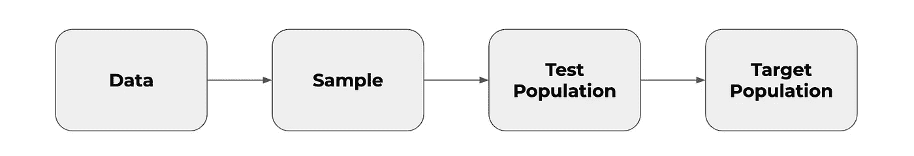

# AB 测试:当外部效度扰乱了你的结果

> 原文：<https://towardsdatascience.com/ab-testing-when-external-validity-messes-with-your-results-888197b6bc7b?source=collection_archive---------15----------------------->

## 适当的统计设置只是成功的一半

(图片来自[pixabay.com](https://pixabay.com/photos/joker-heath-ledger-batman-comics-1225028/))

在进行 AB 测试时，etflix 必须考虑周一和周五用户的不同偏好。谷歌，在线实验的最大倡导者之一，检查观察到的结果是否只是一个短期现象。AirBnb 非常清楚 AB 测试的结果可能会随着假期的变化而变化。

这些公司控制的偏见的关键词是*外部有效性*。AB 测试可以有一个完美的统计设计，如果结果不是外部有效的，仍然会导致错误的结论。让我们更仔细地看看这个在线实验的巨大且经常被遗忘的误差源。

# 当测试结果和现实有偏差时

终于！你的一项 AB 测试显示了非常积极的，有意义的结果。整个团队都很兴奋，迫不及待地想看到生产中新的设计变化。但是几个星期后，总体指标还是一样的，变化似乎没有任何影响。怎么会这样呢？

有了像 Optimizely 和 Co .这样的现代 AB 测试工具，在进行 AB 测试时有一个适当的统计设计是很简单的。此外，有无数的文章和书籍向分析师、数据科学家和任何对该主题感兴趣的人介绍在线实验背后的机制。

> 如果 B 测试结果不能代表对你网站未来访问者的真实影响，那么它们就是无用的。

从业者学会思考问题，比如设置适当的重要性水平，决定是进行单边还是双边测试，或者只是如何使用 Optimizely 这样的工具来自动完成所有这些工作。不幸的是，如果结果不是外在有效的，所有这些都是徒劳的。这是一个非常相关的话题，我自己在进行 AB 测试时几乎没有遇到过。

# 外部有效性的无数面孔

当进行一项实验(或一般的定量研究)时，我们通常从样本中检查数据，以了解我们的测试人群。关于测试人群的学习然后被*概括*，这意味着我们为整个人群得出结论。

归纳推理的过程(图片由作者提供，基于 Spiegelhalter)

外部效度处理的是由于实验中的人群和从测试中学到的知识所应用的人群之间的差异而产生的偏差。或者用更简单的话来说:实验中的用户可能不能代表你的整个用户群，所以一个特定的变化可能会对这部分人产生积极的影响，但不会对其余的人产生积极的影响。

因此，当考虑外部有效性时，人们不得不问的问题是:*实验中观察到的结果可以推广到整个用户群吗？*

(图片来自 pixabay.com 的

让我们仔细看看一些可能对在线实验结果的普遍性产生负面影响的因素，以及如何处理它们。

## 新奇和学习因素

网站的重大改变会让用户(尤其是回头客)感到困惑，并影响关键绩效指标，这被称为**新奇效应**。例如，如果引入了一个新按钮，用户可能倾向于点击它来看看会发生什么。另一方面，第一次访问网站的新用户可能不太感兴趣，因为他们从未见过没有这个按钮的网站。随着时间的推移，所有用户都会习惯新的组件，相关的指标会在较低的点上趋于平稳。这种效应的影响可以通过在实验中只包括新用户来减轻。

在谷歌 2015 年的一项研究中，用户学习是另一个非常有趣的因素。在实验中，该团队增加了显示给用户的广告数量，以增加每个用户的收入。在实验进行的过程中，谷歌的工程师们观察到，鉴于用户更有可能点击其中一个广告，关键指标有了显著提高。但是在这种实验的通常持续时间之后很久，该团队可以观察到这些收入增加只是短期效应，随后是收入的实际减少。原因是用户习惯于忽略广告，导致广告盲的增加。

## 时间相关因素

结果可能会有所不同，取决于一周中的某一天、当月或其他**季节性影响**如假期。一些行业比其他行业更容易受到这些影响。例如，航空业可能会发现，在假期开始前，试图在网站上预订机票的私人客户比例高于商业客户。

在建立 AB 测试时考虑这些影响通常意味着延长测试的持续时间，以获取更广泛的用户群。从事电子商务的一个很好的经验法则是至少运行一整周的 AB 测试，以说明一周中不同天之间的差异。对于航空公司或旅行社等更容易受到季节性影响的企业来说，重新考虑 AB 测试的时间也是一个不错的选择。

另一个非常有趣的时间相关效应是**行动时间**。一些用户可能会立即使用新的功能或设计，而另一些用户则有点犹豫。结果是，我们首先看到对更冲动的用户的影响。当一个实验只运行一小段时间时，我们可能只根据对这个特殊群体的观察来做决定。更长的运行时间也有助于减轻这种影响。

(图片来自 pixabay.com 的

## 用户相关因素

在一个实验中，用户的类型可能会大大偏离你的正常用户群，这取决于除季节性以外的外部影响。想象一下，你的营销团队开展了一场新的**活动**，为你的网站吸引了大量新用户。或者一个竞争对手也这样做，导致你的网站这个时间的新用户比例发生了显著的变化。你的实验运行的时间越长，就越有可能干扰这样的事件，导致潜在的有偏见的结果。

> un 竞争对手的营销活动等可预测的事件会使你的实验结果无效。

**严重的用户偏见**是一种在游戏或社交网络平台上特别容易观察到的现象。它描述了这样一个事实:在一个特定的实验中，频繁使用的用户比不频繁使用的用户更容易被淘汰。这种不平衡会使整体治疗效果偏向那些重度使用者的偏好。根据您对这个特定测试的目标，这可能会产生深远的影响。

我不想遗漏的另一个与人口相关的影响在于实验(平台)设置本身。用户可能会同时接触到**多个实验**，这些实验可能会相互影响。假设一个用户在您的测试 A 和另一个测试 B 中被分类。测试 A 显示正面结果，而与测试 B 相关的指标没有变化，因此只实施了测试 A。在这一点上，可能发生的情况是，从实验 A 引入的改变不再交付测量的效果，因为它只在与 b 结合时起作用。

# 在实践中处理外部有效性

进行 AB 测试时，有一个统计上完美的设置是必要的。但是正如你所看到的，如果这些测试的结果来自一个不具代表性的样本，那么它们是没有用的，因为它们是不可概括的。

可能威胁 AB 测试可推广性的因素很多，而且到目前为止还不完整。那么在进行 AB 测试结果时，我们该如何处理外部效度呢？

广泛的共识是，更长的测试持续时间将减轻几乎所有这些威胁的影响。当然，测试时间的延长会带来新的挑战。长时间运行测试会增加机会成本，并且像 cookie 搅动这样的事情可能会成为一个问题。进一步的措施是在一段时间后重新运行测试，并确保在您的实验中包括不同的流量来源。

在我看来，风险必须逐案评估。总的来说，我强烈主张不要进行少于 7 天的 AB 测试。但是有时候，这样做可能是好的。在其他情况下，季节性效应导致的错误决策的风险可能太高，因此需要更长的时间窗口。最终，人们必须权衡一个错误决策的影响(例如，关于一个新特性的发布)和在测试进行时对结果的可推广性的威胁。

## 参考

对本文有帮助并提供更详细概述的论文和文章:

*   统计的艺术:如何从数据中学习
*   [*着眼长远:对用户和业务都有好处*](https://static.googleusercontent.com/media/research.google.com/en//pubs/archive/43887.pdf) 霍恩霍尔德等人。
*   [*值得信赖的在线对照实验:Kohavi 等人解释的五种令人困惑的结果*](https://notes.stephenholiday.com/Five-Puzzling-Outcomes.pdf) 。
*   [*在线 A/B 考试的可信度分析:陷阱、挑战与解决方案*](https://alexdeng.github.io/public/files/wsdm2017-rup.pdf)Alex Deng 等人。
*   [*格奥尔吉·格奥尔杰夫在线 AB 测试*](https://www.abtestingstats.com/) 中的统计方法
*   [论 A/B 测试中的大用户偏差](https://www.researchgate.net/publication/337014105_On_Heavy-user_Bias_in_AB_Testing) 王等。
*   [网飞](https://www.researchgate.net/publication/337014105_On_Heavy-user_Bias_in_AB_Testing)和 [AirBnb](https://medium.com/airbnb-engineering/selection-bias-in-online-experimentation-c3d67795cceb) 的例子