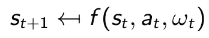
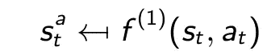
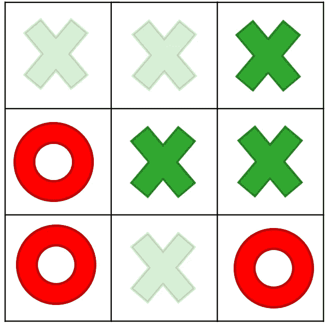
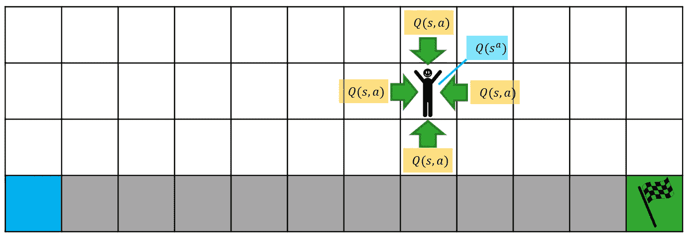

# 关于后决策状态

> 原文：<https://towardsdatascience.com/about-post-decision-states-again-5725e5c15d90?source=collection_archive---------34----------------------->

## [思想和理论](https://towardsdatascience.com/tagged/thoughts-and-theory)

## 论强化学习中状态-动作对和决策后状态的(不那么)细微差别。

照片由[雷·轩尼诗](https://unsplash.com/@rayhennessy?utm_source=medium&utm_medium=referral)在 [Unsplash](https://unsplash.com?utm_source=medium&utm_medium=referral) 上拍摄

我之前关于后决策状态的文章没有得到太多关注，所以我决定再写一篇(我猜是关于狐狸和陷阱的)。

在上一篇文章中，我为强化学习中状态-动作对和决策后状态之间的相似性做了一个案例。简而言之，决策后状态是状态和行动的结合(例如，在添加标记后的*，但是在*之前的*)，这是世界再次开始运动之前的一种中间状态。*

然而，在关注相似之处的同时，我也掩盖了这两个概念之间的一些重要差异。留下他们未提及的感觉未完成。这篇文章着重于区分后决策状态和状态-行为对，给出了一个更完整的观点。

# 什么是决策后状态？

当然，我不能从我离开的地方跳回去，所以让我们总结一下后决策状态的概念(详细描述见 Powell [1])。正如介绍中所说，这是采取行动后的问题状态，但在新的随机信息到来之前(这将引导我们进入下一个预决策状态)。通常，根据当前状态和可行的行动，您可能会达到决策后状态`S'⊆S` 的子集。通过分解从一个状态到另一个状态的转换函数，可以更好地理解这个概念。

通常，我们有一个转移函数`f`，它将当前状态`s_t`、选择的动作`a_t`和外部信息`ω_t`引导到下一个状态`s_t+1`:

从一种状态到另一种状态的转换

这个转移函数包含一个**确定性成分和一个随机成分**，我们可以明确区分。首先，我们可以确定性地从预决策状态`s_t`前进到后决策状态`s_t^a`:

从状态-动作对到决策后状态的确定性转换

第二，我们可以从随机过程中采样`ω_t`，并从决策后状态移动到下一个决策前状态`s_t+1`:

从决策后状态到下一个决策前状态的随机转换

除了计算 Q 值`Q(s_t,a_t)`，我们还可以计算决策后状态的 Q 值`Q(s_t^a)`，提供一个更清晰的视角。此外，我们通常基于决策后的状态来设计功能:再订购后的库存水平、移动后的网格位置等。简单地说:决策后状态包含了我们拥有的最新信息。

# 井字游戏

在井字游戏中——上一篇文章中使用的例子——状态-动作对和决策后状态实际上是相同的。只有最新的主板配置才是最重要的，而不是为了达到这个目标而采取的措施。决策后状态实际上是状态-动作对的串联:

查看给定井字游戏状态下的可用操作。绿色玩家可以采取三个动作或者(等价地)达到三个决策后状态。[图片由作者提供]

实际上，状态-动作对和决策后状态在这里是等价的。你最后采取的行动并不重要，重要的是棋盘的当前状态。在当前状态下，您要么采取 3 个允许动作中的 1 个(即，3 个状态-动作对)，要么评估可能达到的 3 个决策后状态。

接下来的两个例子说明了概念并不总是如此相似。

# 悬崖漫步

为了显示状态-动作对不同的情况，考虑[悬崖行走问题](/walking-off-the-cliff-with-off-policy-reinforcement-learning-7fdbcdfe31ff)。在 SARSA 或 Q-learning 中，你可以用`Q(s,a)`值填充一个查找表，用`s`表示网格上的位置，用`a`表示可行的移动(*左、右、下、上*)。相比之下，决策后状态将只是网格位置。

状态-动作对和决策后状态的 Q 值之间的比较。对于每四个状态-动作对，我们只需要存储一个决策后状态的值。[图片由作者提供]

请注意，在处理状态-动作对时，我们有 48*4=192 个 Q 值，但只有 48 个决策后值。到底有什么区别？

让我们仔细看看突出显示的单幅图块。它可以从四个相邻的图块到达，每个图块都有自己的状态-动作对。然而，对于剩余的轨迹，你如何在给定的瓷砖上着陆实际上并不重要——重要的是到达目标的剩余步骤数。

决策后状态巧妙地抓住了这一现象。不考虑前面的图块，我们只需要一个**单个后决策值**来预测剩余的步数。让四个不同的`Q(s,a)`值指向单个图块实际上是一个非常低效的解决方案。观察到——为了达到相同的精度——我们需要比决策后实现多四倍的观察值。

只有四个动作，我们或许可以承受打击，但如果我们有 1000 个动作呢？对于大多数 RL 问题来说，将计算工作量减少 1000 倍将是非常有益的。决策后状态是这里首选的建模选择。

# 多臂土匪

在 RL 教科书的例子中，[多臂匪徒](/a-minimal-working-example-for-discrete-policy-gradients-in-tensorflow-2-0-d6a0d6b1a6d7)有点古怪，因为它本质上是一个*无状态*问题。我们有 *n* 台老虎机，拉一下杠杆，我们又回到了同一套老虎机。如果没有问题状态，我们如何计算决策后状态？

由[卡尔·劳](https://unsplash.com/@carltraw?utm_source=medium&utm_medium=referral)在 [Unsplash](https://unsplash.com?utm_source=medium&utm_medium=referral) 上拍摄的照片

实际上，我现在不想讨论这个哲学问题。更有趣的是，没有直接奖励。只有在拉动杠杆后*我们才能观察到**随机回报**，这意味着它被嵌入到外生变量`ω`中。我们如何将它纳入决策后状态？*

恐怕严格来说我们不能。如果后决策状态必须在状态空间的子集中`S'⊆S`并且`S`不存在——或者，充其量，它保持一个单一的、不变的状态——我们不能导出任何(有意义的)后决策状态。相比之下，国家-行动对出现在`(s,a) ∈ S × A`中，这是我们*可以*处理的事情。

在这种情况下，状态-动作对优于决策后状态。即使我们有实际的状态要处理，我们也必须记住区分奖励所采取的行动；我们不能简单地把所有的观察堆到一个单一的决策后状态。

正如您所看到的，选择最佳的建模方法并不总是微不足道的！

# 外卖食品

*   在许多情况下，决策后状态和状态-动作对可以很容易地互换，但建模的含义可能是实质性的。
*   如果如何达到给定状态并不重要，那么使用决策后状态。
*   如果奖励是随机的，并且在选择行动时是未知的，那么使用状态-行动对。

对更多背景感兴趣？查看我之前关于后决策状态的文章:

 [## 什么是后决策状态？他们想从我们这里得到什么？

towardsdatascience.com](/what-are-post-decision-states-and-what-do-they-want-from-us-9e02105b7f40) 

## 参考

[1]鲍威尔，W. B. (2007)。*近似动态规划:解决维数灾难*。约翰·威利&的儿子们。