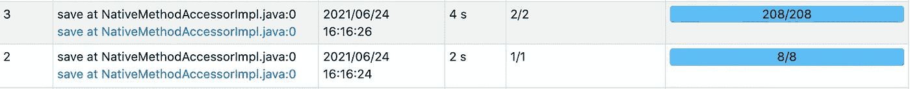
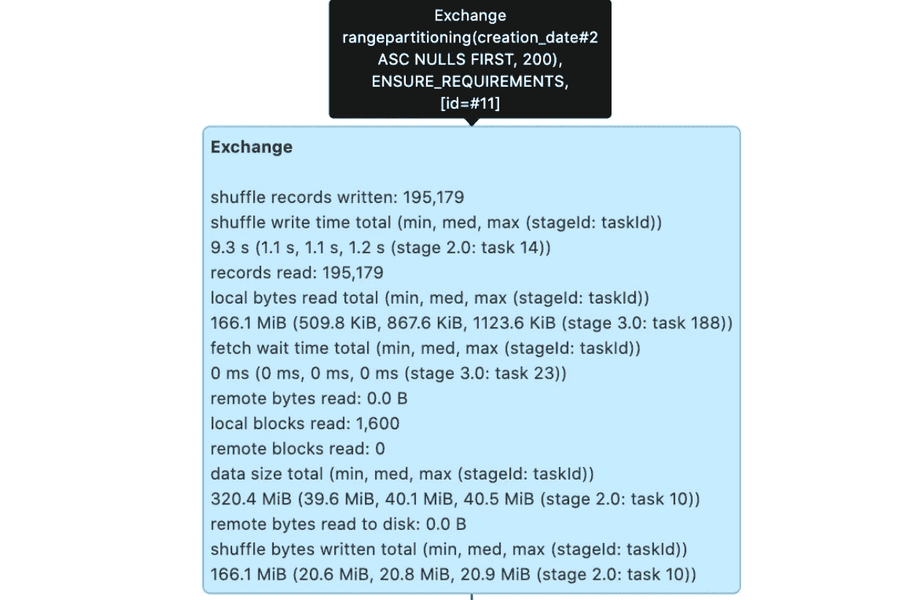
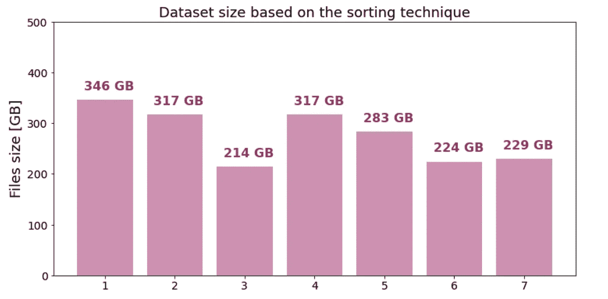

# 关于 Spark 3.x 中的排序

> 原文：<https://towardsdatascience.com/about-sort-in-spark-3-x-f3699cc31008?source=collection_archive---------11----------------------->

## 深入探究 Spark SQL 中的数据排序。


由[iorni.com](https://unsplash.com/@iorni?utm_source=unsplash&utm_medium=referral&utm_content=creditCopyText)在 Unsplash 上拍摄的照片

排序数据是许多应用程序、ETL 过程或各种数据分析中需要的非常重要的转换。Spark 提供了几个函数来根据用户的特定用例对数据进行排序。在本文中，我们将描述这些函数，并进一步了解 sort 是如何工作的，以及它的结果是什么。我们还将运行一个简单的实验，看看排序对文件系统中已创建文件大小的影响。

# 对整个数据帧进行排序

对于整个数据帧的排序，有两个等价的函数 *orderBy()* 和 *sort()* 。它们之间真的没有什么区别，所以你会用哪一个真的是你个人喜好的问题。关于这些函数，需要了解的重要一点是，它们会导致混乱，因为数据需要在集群上重新组织才能达到所需的顺序。

此外，这些排序函数是转换，所以它们是懒惰的，不直接触发作业。然而，当您运行一个作业时——通过调用诸如 *write* 之类的动作——您会注意到 Spark 运行了由排序引起的另一个作业。

从 3.0 版本开始，发现它变得更加困难，因为启用了自适应查询执行(AQE)功能，并且它为每个阶段运行不同的作业，因此现在一个操作触发更多作业是很常见的事情。但是无论 AQE 是否启用，排序都将触发一个额外的作业，因为 Spark 需要估计排序列中数据的分布，以确定如何在分区之间创建边界。让我们看一个特殊的例子:

```
(
    df.orderBy('creation_date')
    .write
    .mode('overwrite')
    .format('noop')
    .save()
)
```

运行上述查询后，如果我们检查 Spark UI，我们将看到为该查询生成了两个作业。第一个作业(id 为 2)负责估计 *creation_date* 列中的分布，并试图将其分成 200 个区间。这个数字 200 是由内部配置设置*spark . SQL . shuffle . partitions*给出的，可以更改为不同的数字。这也是下一个作业(id 为 3)有 208 个任务的原因，因为它分两个阶段运行，其中第一个阶段有 8 个任务，第二个阶段在重新分区后有 200 个任务:



作者图片

关于数据排序的信息也可以从查询计划中推断出来。它由*排序*操作符表示，如果您在 Spark UI 的 SQL 选项卡中查看图形表示，您将会看到以下操作符:


作者图片

将鼠标悬停在它上面时，您还会看到一个较小的黑色矩形，其中包含一些附加信息，告诉您哪些列用于排序。布尔信息 *true/false* 表示这种排序是全局的还是局部的。在这里，因为我们正在对整个数据帧进行排序，所以它说 *true* 表示全局排序。

如上所述，全局排序需要对数据进行重新分区，因此整个数据集将被打乱，这由位于*排序*之前的*交换*操作符表示:



作者图片

关于分区的信息在黑色矩形中，它表示*range partitioning(creation _ date，200)。**range partitioning*是一种不同于 *hashpartitioning* 的分区类型，当您想要实现 *hashpartitioning* 时，也可以通过调用 *repartitionByRange()* 来实现这种分配，repartitionByRange() 是 *repartition(col)* 的对应物。

这两种排序函数都可以与下列列转换结合使用:

*   [asc_nulls_first(列名)](https://spark.apache.org/docs/latest/api/python/reference/api/pyspark.sql.functions.asc_nulls_first.html#pyspark.sql.functions.asc_nulls_first)
*   [ASC _ nulls _ last(col _ name)](https://spark.apache.org/docs/latest/api/python/reference/api/pyspark.sql.functions.asc_nulls_last.html#pyspark.sql.functions.asc_nulls_last)
*   desc(列名)
*   [desc_nulls_first(列名)](https://spark.apache.org/docs/latest/api/python/reference/api/pyspark.sql.functions.desc_nulls_first.html#pyspark.sql.functions.desc_nulls_first)
*   [desc _ 空值 _ 姓氏(列名)](https://spark.apache.org/docs/latest/api/python/reference/api/pyspark.sql.functions.desc_nulls_last.html#pyspark.sql.functions.desc_nulls_last)

这些函数只是用来定义空值应该放在哪里，以及应该使用升序还是降序。然后，我们可以将它称为排序函数的参数，如下所示:

```
df.orderBy(desc('creation_date'))
```

# 分类分区

如果您不关心所有数据的全局排序，而是只需要对 Spark 集群上的每个分区进行排序，那么您可以使用*sortwithinspartitions()*，这也是一个数据帧转换，但与 *orderBy()* 不同，它不会导致洗牌。该函数不会对数据进行重新分区，它将保持当前的分区，并且只会对这些分区进行排序:

```
# each partition will be sorted by creation_date column
df.sortWithinPartitions('creation_date')
```

# 分类桶

创建分桶表时，有一个函数 *bucketBy* 可以用来对桶进行排序:

```
(
  df
  .write
  .bucketBy(n, field1, field2, ...)
  .**sortBy**(field1, field2, ...)
  .option('path', output_path)
  .saveAsTable(table_name)
)
```

关于分桶和这个特定函数的更多细节，请查看我最近的文章[*Spark SQL*](/best-practices-for-bucketing-in-spark-sql-ea9f23f7dd53)中的分桶最佳实践。

# 对每个数据帧行上的数组进行排序

另一个排序用例是 Spark 复杂数据类型的数组。数组包含有顺序的元素，Spark 提供了改变顺序的函数:

*   [数组 _ 排序](https://spark.apache.org/docs/latest/api/python/reference/api/pyspark.sql.functions.array_sort.html#pyspark.sql.functions.array_sort)
*   [sort_array](https://spark.apache.org/docs/latest/api/python/reference/api/pyspark.sql.functions.sort_array.html#pyspark.sql.functions.sort_array)

这两个函数都按升序对数组进行排序，它们在处理空值的方式上有所不同。另外， *sort_array* 可以接受另一个参数 *asc=False* ，通过这个参数可以对数组进行降序排序。对数组进行排序的一种更灵活的方式是 SQL 函数 [array_sort](https://spark.apache.org/docs/latest/api/sql/index.html#array_sort) ，它可以将一个比较器作为附加参数。更多细节，请见我的另一篇[文章](/did-you-know-this-in-spark-sql-a7398bfcc41e)，在那里我也描述了它并提供了一个特殊的例子。

# 与排序相关的 Spark 优化

排序是一个非常昂贵的操作，因此一个好的优化是避免它，如果它不是必要的。Spark optimizer 有一个规则*消除排序*，它就是这样做的。想象一个如下的例子:

```
(
  df
  .orderBy('created_date')
  .select('id', 'message', 'interaction_count')
  .filter(col('interaction_count') > 100)
  .orderBy('interaction_count')
)
```

在这里，我们可以看到，第一次按 *created_date* 排序对最终输出没有影响，并且是多余的，因此规则 *EliminateSorts* 将删除它。只要 select 或 filter 中的表达式是确定性的，就可以这样做。在*消除排序*规则中，不确定性表达式被跳过。例如，如果在 select 函数中使用 *rand()* ，两个*排序*都将保留在查询计划中并被执行。

# 排序对数据压缩的影响

将数据保存到外部存储系统时，对数据进行排序也会产生影响。根据选择的文件格式，它将影响保存数据的最终压缩。让我们来看一个简单的基准测试，其中这一点非常明显。我们将获取一个数据集并多次保存，每次都使用不同的排序技术，最后检查所创建文件的大小。我们将使用的数据集表示社交网络上一年内发布的消息，它具有以下列和结构:

*   *profile_id* —社交网络上的个人资料/页面的标识符
*   *created_time* —一个在个人资料上发布消息的时间戳
*   *创建 _ 月份* —从*创建 _ 时间*时间戳导出的月份
*   许多其他具有复杂层次结构的字段对分析并不重要

数据集有 301 204 753 条记录，并且在 *profile_id* 列中包含许多重复项，因为每个配置文件可以发布许多消息。数据集中配置文件的不同计数是 410 836。在下面的 7 个查询中，我们将测试所有三个排序函数并检查最终大小。对于所有查询，我们将 shuffle 分区设置为 2000，考虑到数据集的容量，这似乎是合理的。在前六种情况下，我们将以 parquet 文件格式保存数据，在最后一种情况下，我们将使用 orc 来查看它与最后一种情况下的 parquet 相比如何。

1.  作为参考，我们将首先应用无排序，然后随机分配数据:

```
(
  df.repartition(n)
  .write
  .format('parquet')
  .mode('overwrite')
  .option('path', output_path_1)
  .save()
)
```

2.接下来，我们将对 *created_time* 列应用全局排序，因此所有发布的消息将根据它们发布的时间进行排序:

```
(
  df.orderBy('created_time')
  .write
  .format('parquet')
  .mode('overwrite')
  .option('path', output_path_2)
  .save()
)
```

3.现在，我们将尝试首先按 *profile_id* 列排序，然后按 *created_time* 排序:

```
(
  df.orderBy('profile_id', 'created_time')
  .write
  .format('parquet')
  .mode('overwrite')
  .option('path', output_path_3)
  .save()
)
```

4.在下一个测试中，我们还将应用按月分区，因为数据非常大，并且在实践中，您可能希望在文件系统中对其进行分区，以便可以使用分区过滤器更快地检索数据。请注意，我们将按两列进行重新分区: *created_time* ，然后是给定时间间隔内的一个随机值，通过这个值我们可以控制创建文件的数量。然后，每个创建的 Spark 分区按照*创建月*、*概要 id、*和*创建时间*进行排序:

```
(
  df.repartition('created_month', (rand() * 200).cast('int'))
  .sortWithinPartitions(
      'created_month', 'profile_id', 'created_time'
  )
  .write
  .partitionBy('created_month')
  .format('parquet')
  .mode('overwrite')
  .option('path', output_path_4)
  .save()
)
```

5.作为先前技术的替代方法，我们现在将按范围重新分区，这样我们可以避免分布的随机性:

```
(
  df.repartitionByRange('created_time')
  .sortWithinPartitions(
       'created_month', 'profile_id', 'created_time'
   )
  .write
  .partitionBy('created_month')
  .format('parquet')
  .mode('overwrite')
  .option('path', output_path_5)
  .save()
)
```

6.接下来，我们还将测试存储桶，并根据 *profile_id* 列将数据集分成 200 个存储桶。实际上，如果您想要将 *profile_id* 列上的表与其他一些表(例如，包含每个概要文件的一些附加信息)连接起来，这可能会很有用。

使用 *sortBy* 函数，每个存储桶将按照 *profile_id* 进行排序。我们还希望保留按月进行的分区，并且在每个文件系统分区中，我们希望每个存储桶创建一个文件，以达到合理的文件数量。为此，我们通过列 *created_month* 以及由 bucketing 函数生成的表达式对数据进行重新分区，您可以在下面看到该函数的定义。这个 bucketing 函数模仿了 Spark 的内部行为，关于它的更多细节请参见我最近的关于 bucketing 的文章。

```
(
  df.repartition('created_month', bucketing('profile_id', 200))
  .write
  .partitionBy('created_month')
  .bucketBy(200, 'profile_id')
  .sortBy('profile_id', 'created_time')
  .format('parquet')
  .mode('overwrite')
  .option('path', output_path_6)
  .saveAsTable('test_table')
)from pyspark.sql.functions import hash, whendef bucketing(col, buckets):
  _mod = hash(col) % buckets
  return when(_mod < 0, (_mod + buckets) % buckets).otherwise(_mod)
```

7.最后，我们将测试最后一个查询的 orc 文件格式。所以这里我们运行相同的查询，但是使用*。格式(' orc')* 。

对于所有的查询，我们使用 Spark 3.0.1 和 Databricks runtime 7.3。现在，让我们在下图中查看每个已创建数据集的最终大小:



# 分类文件的其他好处

除了更好的压缩之外，以 parquet 等文件格式排序的数据对于在排序列上使用过滤器的查询也是有益的，因为 Spark 将能够应用数据跳过技术。关于 parquet 中数据跳过的更多细节，请参见我的另一篇文章[。](/notes-about-saving-data-with-spark-3-0-86ba85ca2b71)

# 结论

在本文中，我们讨论了 Spark SQL 中可用的不同排序技术。我们已经看到了局部排序和全局排序的区别。我们还提到，全局排序通常是一种开销很大的操作，因为它需要对数据进行重新分区，导致数据混乱，还需要一项额外的工作来估计数据的分布。

我们还检查了排序对文件系统中创建的文件大小的影响。大小的差异可能非常大，在我们的示例中，从没有排序的 346 GB 到对两个特定列进行全局排序的 214 GB 不等。这里，字段的不同组合可能会导致更好的压缩。在实践中，全局排序可能不是最有用的设置，因为通常希望对大型表进行分区，甚至可能为了高效的连接而分桶。在这里，我们可以看到，与仅使用分区相比，分区和分桶一起使用导致了更小的大小。这很可能是因为在 *profile_id* 列上的分桶将具有相同配置文件的记录放在一起，从而提高了压缩。在上一个示例中，我们还看到，orc 数据集的大小略大于相应的拼花数据源的大小，但差异很小，两个数据集在大小上是相当的。