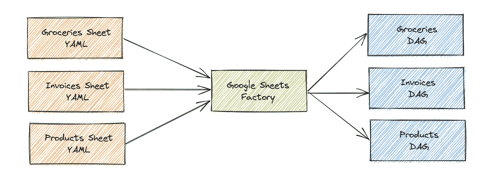

# 使用气流 DAG 工厂提取数据加载

> 原文：<https://towardsdatascience.com/abstracting-data-loading-with-airflow-dag-factories-12b6689f0aaa?source=collection_archive---------9----------------------->

## 创建一个抽象层，提高用 Airflow 加载 Google Sheets 数据的可伸缩性和可用性

这个话题并不新鲜。我看过不少关于为气流 Dag 生成不同层次抽象的文章。例如，[这篇文章](/how-to-build-a-dag-factory-on-airflow-9a19ab84084c)解释了如何以编程方式生成 Dag，[这个库](https://github.com/ajbosco/dag-factory)允许您使用 YAML 生成 Dag。然而，这两种抽象仍然需要数据从业者来处理。我在寻找一种抽象，它将消除创建气流 Dag 的复杂性和技术性，并允许作者专注于数据源特定的配置。要做到这一点，DAG 工厂需要做很多假设，并且非常固执己见，所以我正是这么做的。

这篇文章将向你展示我如何生成气流工厂来处理不同的数据源，允许我使用显式 YAML 文件创建 Dag。我的目标是创建一个抽象，使涉众能够生成气流 Dag 来提取他们的数据并将其加载到我们的数据仓库中。

# 我们来谈谈 Google Sheets

我将向您展示的概念适用于任何数据源，如果您实现了它，无论数据源是什么，您都将获得好处。然而，这方面的一个小例子是 Google Sheets。不管你喜不喜欢，大多数业务要么在 Excel 上运行，要么在 Google Sheets 上运行(或者两者都运行！)不久之后，您将会遇到利益相关者，他们会请求将数据从 Google Sheets 文件加载到您的数据仓库中。现在，这不是一篇关于数据哲学的博文，我也无意讨论 Excels 和 Google Sheets 这个(非常敏感的)话题。但是，我要说的是，如果您选择允许您的利益相关者将 Google Sheets 加载到您的数据仓库，您很快就会看到许多请求:更改列名、列类型、添加列、删除列、更改表名等等。想象一个理想的世界，在这个世界中，你的利益相关者拥有自己创建管道的权力。在这个世界中，作为数据从业者，您将从所有这些请求中解脱出来，不再成为利益相关者的瓶颈。与此同时，权力越大，责任越大，当你的利益相关者获得管理他们自己的 Google Sheets 管道的权力时，他们就成为了这些数据的所有者。如果改变一个列破坏了摄取，你不再对此负责(某种程度上)，这是他们的责任，他们有能力修复它。我知道你在想什么，是的，这实际上是一把双刃剑。创建自己的 Google Sheets 管道的能力可能意味着您的数据仓库变成了一个黑洞，充满了结构、含义和/或命名约定都很差的无尽 Google Sheets 数据。再说一遍，我不是在这里争论赞成或反对。如果你实现了这一点，我相信你会对推向生产的东西保持高度的治理。你的批判性思维最终会让你自由。

你不同意让股东加载他们的 Google Sheets 文件吗？好吧。从具体的用例中抽象一点，把 DAG 工厂看作是帮助你的团队更有效率、更干爽和避免错误的一种方式。**所以不管它是从事务 API 加载 Google Sheets 还是其他一些数据都没关系；你的团队可能会受益于使用气流 DAG 工厂。**

说完这些，我们可以探索如何使用 Airflow DAG 工厂加载 Google Sheets 数据。还有一点很重要，那就是这绝对不是从 Google Sheets 文件加载数据的唯一方式。例如，Gitlab 实现了他们自己的工具，他们称之为 [SheetLoad](https://gitlab.com/gitlab-data/analytics/tree/master/extract/sheetload) (说真的，很棒的名字)，还有类似 [Fivetran](https://fivetran.com/docs/files/google-sheets) 和 [Stitch](https://www.stitchdata.com/docs/integrations/saas/google-sheets) 的工具。然而，如果你的团队已经在使用气流或者你想要额外的定制，这篇文章将会很有帮助。

我跑题了。关于这一点的真正要点是，它不是关于谷歌表；是关于易用性。这很重要，即使只有你的团队在使用这个工具。例如，我宁愿为从 Salesforce 加载数据编写 YAML 文件，也不愿为每个对象编写 Python 脚本。本质上我只是在倡导好用和干爽(不要重复自己)。

# DAG 工厂到底是什么？

所以在这一点上，你可能会想，DAG 工厂到底是什么？更一般地说，DAG 工厂是以编程方式生成气流 DAG 的脚本。但是，在这种情况下，我再加一个条件。工厂从 YAML 配置文件以编程方式生成 Dag。

作者图片

更具体地说，在我们的`/dags`目录中，我希望有一个`/dags/gsheets`目录来保存所有的 YAML 文件。所以我们会有类似`/dags/gsheets/invoices.yaml`和`/dags/gsheets/products.yaml`的东西，目标是让 Airflow 为那些配置文件创建相应的 Dag。使用这种结构，YAML 配置文件和气流 Dag 之间应该有 1:1 的关系。但是，没有什么可以阻止您拥有一个生成许多 Dag 的 YAML 配置文件。

# 配置文件看起来像什么？

考虑到易用性是我们的主要目标之一，这是一个关键问题。配置文件最终成为分析师和其他利益相关者交互的界面。在这种情况下，配置文件相当于 web 应用程序中的前端。所以我们需要确保它有一个好的“UX”。从这个意义上来说，简单是至关重要的，任何你可以隐藏的复杂都是非常受欢迎的。

下面是一个配置文件的样子:

这是我们能得到的最简单的配置文件吗？肯定不是！如果我们做一些假设，我们可以简化得更多。例如，这些配置文件的创建者是否需要决定数据将存储在数据仓库中的什么位置，比如模式名、表和数据库？当然，这完全取决于您的用例。

然而，让我们开门见山，解决这个问题。那本地图词典是什么？

这是我们处理列的重命名和类型转换的一种方法。当我们查看 DAG 工厂时，这一点会变得更加明显，但是它的本质是我们可以从 Google Sheets 中显式地定义我们想要加载的列，并将它们重命名为 SQL 兼容的(例如，将它们重命名为 snake_case)。例如，如果在我们的 Google Sheet 文件中有一个名为`Product Name`的列，那么在我们的数据仓库中有一个同名的列会很烦人，这可能会导致各种各样的问题。我们希望将该列的名称改为类似于`product_name`的名称。使用这个映射器，我们可以这样做:

# 让我们建一座工厂

所以这一切都从一个古老的时尚`/dags/gsheets_factory.py`剧本开始。该文件将从`/dags/gsheets`导入所有配置文件，为每个文件创建一个气流 DAG。

我们就是这样开始的。我们从拿到所有 YAML 的文件开始:

现在我们可以迭代它们并使用它们来创建 Dag:

我们在这里所做的就是迭代这些文件并用 [PyYAML](https://pyyaml.org/wiki/PyYAMLDocumentation) 打开它们，这将返回我们之前讨论过的 YAML 文件的字典版本。我们将配置字典存储在`config`中。最后，我们将配置字典传递给一个名为`create_gsheets_dag`的函数，并将该函数返回的 DAG 添加到气流全局范围。

正如我说过的，`create_ghseets_dag`返回一个气流 DAG，所以这实际上是魔术发生的地方。让我们来看看吧。

下面是整个函数:

但是让我们分解一下，了解一下每个部分在做什么。

第一部分简单地定义 DAG 的属性，例如 ID、计划间隔等。注意，所有这些都来自于`config`，它是我们之前讨论过的 YAML 配置文件的字典表示。

对于这个任务，我们将使用 Airflow 的 [PythonOperator](https://airflow.apache.org/docs/apache-airflow/stable/howto/operator/python.html) 。这个操作符将一个 Python 函数作为参数(`python_callable`)并执行它。所以我们首先需要定义这个函数。在我们的例子中，我们称之为`_sync_data`。

这个函数做的第一件事是从 Google Sheets 获取数据

下一步是清理我们得到的数据:

我们正在调用一个我们写的`clean_data`的助手函数，但是这个函数的细节不是超级相关或者令人兴奋的；它只是获取映射器字典并重命名列。

之后，我们准备将数据插入到我们的数据仓库中。在我们的例子中，我们使用雪花，我们已经有了一个函数`load_df`，它获取一个熊猫数据帧并将其写入雪花。这是基于具有类似功能的[雪花 Python 库](https://docs.snowflake.com/en/user-guide/python-connector.html)。但是，这一部分可以适用于您正在处理的任何目的地:

如前所述，我们使用 PythonOperator 向 DAG 添加一个任务，它将执行我们刚刚定义的函数(`_sync_data`)。

# 结论

希望我成功地展示了我们如何通过引入抽象层次来极大地改进我们创建气流 Dag 的方式。不管你是从 Google Sheets、Hubspot 还是 Salesforce 加载数据；这些概念仍然适用。