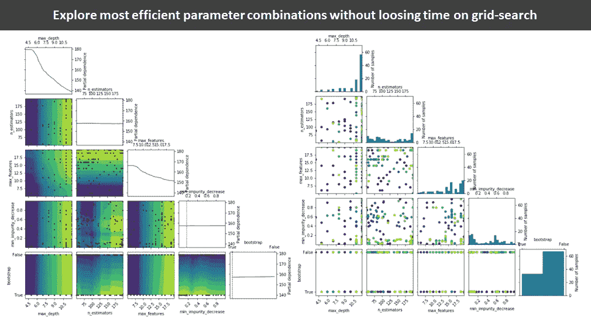

# 使用 scikit-optimize 加速超参数优化

> 原文：<https://towardsdatascience.com/accelerate-your-hyperparameter-optimization-with-scikit-optimize-e72426e60bf1?source=collection_archive---------14----------------------->

## 训练另一个模型，为您的模型找到最佳超参数，避免繁琐的网格搜索



作者照片

尽管是创建模型的最后阶段之一，超参数优化(“HPO”)可以使好的模型(概括得很好)或难看的过度拟合(在训练数据中表现很好，但在验证集上表现差得多)之间产生很大差异。

对于流行的基于树的模型，如 Random Forest、XGBoost 或 CatBoost，尤其如此。通常，基本模型会严重过度拟合您的数据。另一方面，试图通过在 RandomForest 中设置一些超参数(如“max_depth”或“max_features ”)来手动增加偏差通常会导致严重的欠拟合。可能的超参数的搜索空间有如此多的维度和值，以至于您需要一种方便的方法来找到最佳点。

# 1.介绍

最简单的方法是网格搜索——基本上是一种强力方法，使用一组定义的参数和范围的所有可能组合来重新训练模型。这种方法的巨大缺点是，您将花费大部分时间探索效果不佳的参数组合，只有一小部分接近最佳点。

如果我们可以有另一个模型，它评估超参数的每次迭代的结果，并试图将它们向一个方向移动，从而提高基本模型的性能，会怎么样？幸运的是，scikit-optimize (SKOPT)正是这样做的。

在本文中，我将演示如何使用 scikit 启动 HPO，使用 RandomForest 和 XGBoost 优化，并使用 25 万德国租金的样本数据来预测租金价格。数据是 [**Kaggle**](https://www.kaggle.com/corrieaar/apartment-rental-offers-in-germany) 数据集的转换版本，它和用于文章的代码可以在 [**GitHub 上找到。**](https://github.com/Jan-Majewski/Medium_articles/tree/master/05_HOPT)

# 2.SKOPT 入门

SKOPT 通过创建另一个模型，使您的超参数优化变得更加容易，该模型试图通过改变其超参数来最小化您的初始模型损失。我们将首先为一个简单的 RandomForestRegressor 模型设置 HPO。

首先，你需要准备三样东西:

*   **搜索空间**

```
search_space = [
         skopt.space.Integer(4, 12, name='max_depth'),
         skopt.space.Integer(50, 200, name='n_estimators'),
         skopt.space.Integer(5, 20, name='max_features'),
         skopt.space.Real(0.0, 1.0, name='min_impurity_decrease'),
         skopt.space.Categorical(categories = [True, False],name="bootstrap")
         ]
```

搜索空间定义了您想要在搜索中探索的超参数以及探索边界。大多数参数要么是整型，要么是实型(浮点型)，要么是分类型。您可以使用 skopt.space 类为每个参数定义搜索空间。

*   **超参数优化参数**

```
HPO_params = {
              'n_calls':100,
              'n_random_starts':20,
              'base_estimator':'ET',
              'acq_func':'EI',
             }
```

我知道这有点令人困惑——为什么我们需要另一组参数来寻找最佳超参数？HPO 参数定义了我们将用来寻找最佳参数的过程的一些基本属性。

*   *n_calls* 定义您想要进行多少次参数迭代
*   *n_random_starts* 定义在开始寻找最佳点之前，模型将进行随机迭代的次数，以获得搜索空间的更广泛探索。在这种情况下，我们让我们的模型在开始寻找最佳区域之前，随机搜索搜索空间 20 次迭代
*   *base_estimator* 选择用于优化初始模型超参数的模型，“ET”代表额外应力回归量
*   *acq_func* 定义了最小化的函数，“EI”意味着我们期望损失度量的减少作为改进
*   **设定我们的模型试图最小化的目标**

```
[@skopt](http://twitter.com/skopt).utils.use_named_args(search_space)
def objective(**params):
    return (evaluator.evaluate_params(model, params))
```

我们的 HPO 模型使用目标函数来衡量每次迭代在提高基础模型性能方面的有效性。它将每次迭代中选择的超参数组合作为其输入，并输出我们的基本模型性能(隐藏在 evaluator 类中)。

我们使用@skopt.utils.used_named_args 包装器来转换我们的目标函数，以便它接受列表参数(默认由优化器传递),同时保留特性名称。

# 3.设置评估员类别

需要解释的最后一部分是 evaluator 类的 evaluate_params 函数。为了更好的可读性，我创建了一个类来将所有与模型训练和评估相关的代码从 HPO 中分离出来

```
evaluator = Params_Evaluate(X_train, X_val, y_train, y_val)
evaluator.select_model(model = RandomForestRegressor(n_jobs=4))
```

我们从训练和验证数据开始，选择我们想要评估的模型，然后我们搜索最佳参数集，以最小化我们的验证集上的 RMSE。我还在每次迭代后添加了一个 print 语句，这使得跟踪进度更加容易。

# **4。执行超参数优化**

现在，我们已经做好了一切准备，可以用最后一行代码开始搜索最佳超参数了:

```
results = skopt.forest_minimize(objective,search_space,**HPO_params)
```

为了得到结果，我们使用 skopt.forest_minimize 函数，它使用了我们已经准备好的 3 个参数——目标、搜索空间和 HPO 参数。

对于在 *HPO 参数中定义的迭代次数，*在*搜索空间中选择一组参数，*将它们提供给*目标*函数，该函数使用我们的 evaluator.evaluate_params 函数来检查这些参数在我们的模型中的表现。由于我在 evaluate_params 函数中添加了 print 语句，我们可以跟踪每次迭代之间的进度。


# 5.评估结果

得到结果可能需要一段时间，因为我们正在训练我们的模型 100 次，但一旦他们准备好了，就开始有趣了。我们可以使用 SKOPT 来可视化我们的超参数搜索。

我们可以从评估收敛结果开始，看看我们的模型在每次迭代中的最佳性能是如何提高的

```
skopt.plots.plot_convergence(results)
```


我们还可以看到我们的搜索空间的哪些区域被更精确地评估了——这意味着它们给出了更好的结果，并且可能接近最优

```
skopt.plots.plot_evaluations(results)
```


每个特征的搜索区域和频率

查看图表，我们可以看到搜索主要集中在 max_depth 和 max_features 最大值附近，这表明我们可以扩大搜索范围以获得更好的结果。

Plot_objective 函数允许我们评估与我们的目标相关的超参数之间的相关性

```
skopt.plots.plot_objective(results)
```


搜索区域和最佳结果

该图证实了对 max_depth 和 max_features 参数的高度依赖性，因为所有最佳结果(浅绿色)都集中在它们的顶部边界周围。

基于对上述结果的评估，我们可能应该修改我们的 search_space 以获得更好的结果，但是为了这个练习，我对当前的结果很满意。

我们可以通过调用 results.x 来获得最佳参数——不幸的是，它们是作为一个没有 param_name 的列表给出的，我创建了一个 helper 函数来将其转换成一个更易于阅读的字典。

```
best_params = to_named_params(results, search_space)
best_params{'max_depth': 12,
 'n_estimators': 137,
 'max_features': 20,
 'min_impurity_decrease': 0.03287287860139721,
 'bootstrap': False}
```

将具有最佳参数的模型与初始模型(具有 n_estimators=100，max_depth=5，max_features=20 的 RandomForestRegressor)进行比较，我们可以看到 R2 得分显著增加:

*   基本型号为 0.80
*   0.87，适用于带有调谐超参数的模型

# 6.为 XGBoost 重组工具

为新型号重新装备需要 3 个简单的步骤:

*   在评估器类中选择新模型

```
evaluator.select_model(model =  XGBRegressor())
```

*   重新定义搜索空间

```
search_space_xgb= [
         skopt.space.Integer(4, 5, name='max_depth'),
         skopt.space.Real(0.0, 1.0, name='eta'),
         skopt.space.Real(0.0, 1.0, name='subsample'),
         skopt.space.Categorical(categories = ["gbtree", "dart"],name="booster")
         ]
```

*   重组目标函数，使包装器使用更新的 search_space 名称

```
[@skopt](http://twitter.com/skopt).utils.use_named_args(search_space_xgb)
def objective(**params):
    return  evaluator.evaluate_params(params)
```

现在，我们准备在同一个数据集上对 XGBoost 模型进行超参数优化

```
 results=skopt.forest_minimize(objective, search_space_xgb,**HPO_params)
```

# 7.摘要

SKOPT 是我最喜欢的超参数优化工具，它结合了易用性和可视化来分析结果。

该库也是非常通用的，因为我们可以自由地设置我们的目标函数，我们可以使用它来评估任何模型和任何超参数集。

我希望我的技巧可以帮助你尝试 SKOPT，这样你就不需要在这些乏味的网格搜索上浪费时间，而是利用另一个模型来找到适合你的超参数最佳点。