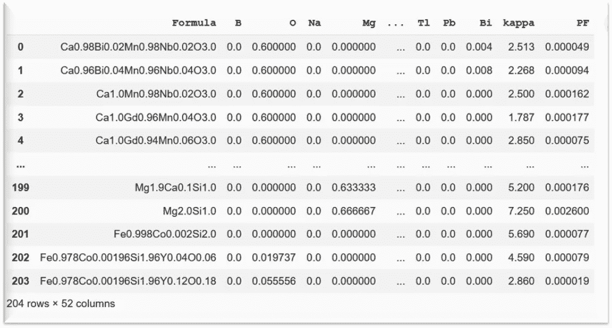
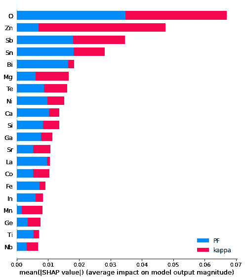
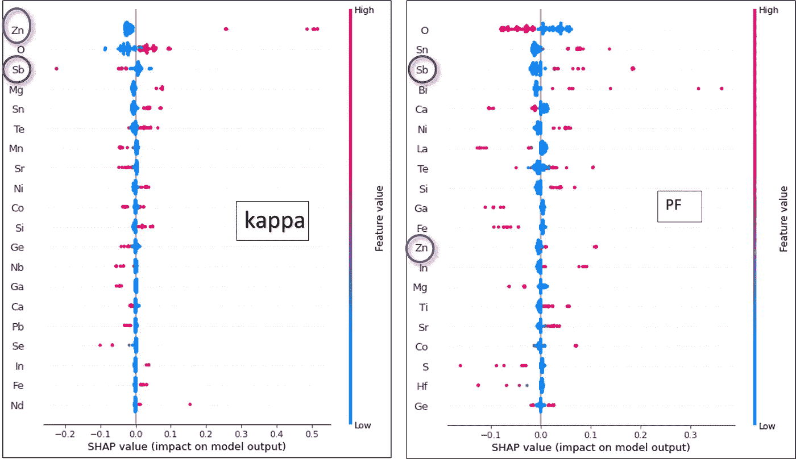

# 基于多目标回归神经网络和 Shapley 值的加速材料设计

> 原文：<https://towardsdatascience.com/accelerated-materials-design-using-multi-target-regression-neural-network-and-shapley-values-e3172027bf57?source=collection_archive---------30----------------------->

## 多目标回归分析在材料发现中的意义


照片由 [Robert Bye](https://unsplash.com/@robertbye?utm_source=unsplash&utm_medium=referral&utm_content=creditCopyText) 在 [Unsplash](https://unsplash.com/?utm_source=unsplash&utm_medium=referral&utm_content=creditCopyText) 上拍摄

**简介**

本文是我上一篇文章 [**Shapley 值辅助材料设计配方**](/shapley-value-aided-recipe-for-materials-design-d122fb851cef) 的延伸，这篇文章解释了 Shapley 值在提取特征重要性方面的用法，以及它们对单个目标变量的影响，从而为材料设计绘制蓝图。然而，为了创新和制造新材料，我们需要考虑决定性能的几种性质的协同效应。


丹尼尔·罗梅罗在 [Unsplash](https://unsplash.com/?utm_source=unsplash&utm_medium=referral&utm_content=creditCopyText) 上的照片

例如，用于智能手机和平板电脑的康宁大猩猩玻璃，拥有硬度、亮度和耐刮擦性等属性的适当平衡。有无数这样的例子表明材料具有特定应用领域的综合性能。因此，有必要建立具有多个紧密结合的目标的预测模型。

**案例研究**

让我用一个人工神经网络(ANN)来说明上述观点，该网络被建模来预测两个相互依赖的目标的重要性程度。在这里，我将使用前两篇文章中使用的相同数据集，包括 204 种热电材料、它们的元素组成以及它们的两个重要属性——热导率(kappa)和与电导率相关的功率因数(PF)。kappa 和 PF 的正确组合决定了性能。这些材料导热性差，但同时又是良好的电导体，根据物理定律，这非常具有挑战性。它们可用于发电和制冷。这些热电材料的一个值得注意的应用是它用作火星漫游车的电源，*、【好奇号】、【毅力号】*。

问题是我们如何找到具有最佳属性集的最佳产品。答案在于建立一个稳健的回归模型，该模型可以连接所有必要的参数，并确定最重要的特征组合。这里我们讨论建立这样一个模型的过程。

**建立双输出的人工神经网络回归模型**

**使用 Matminer 和 Pymatgen 等 python 库对材料数据进行**预处理后，在我的帖子“[使用 Matminer 和 Pymatgen](/uncovering-the-potential-of-materials-data-using-matminer-and-pymatgen-83126fadde1c) **发掘材料数据的潜力”中有所描述，**细化后的数据集如下所示:



为深度学习清理数据集

这个干净的数据集包含 49 个预测值或 X 和 2 个目标值或 y。预测值都是材料成分的单个元素。而‘kappa’和‘PF’是两个目标(y)。

***识别 X 和 y***

```
X = ds_RT.iloc[:, 1: 50]
y = ds_RT.iloc[:,50:]
```

现在让我们将数据分成训练集和测试集。

***拆分数据***

```
from sklearn.model_selection import train_test_splitX_train, X_test, y_train, y_test = train_test_split(X, y, test_size = 0.2, random_state = 0)
```

***缩放数据***

一般来说，描述符或预测符(X)因其值的范围较宽而被缩放。然而，在这种情况下，所有的预测因子都是元素周期表的元素，它们的数据代表从 0 到 1 的元素分数。

相反，由于这些目标变量的范围分布很广，因此需要应用 Sklearn 的 MinMaxScaler 函数对 y 进行缩放。

```
from sklearn.preprocessing import MinMaxScaler
sc = MinMaxScaler()
y_train = sc.fit_transform(y_train)
y_test = sc.transform(y_test)
```

是时候构建 ANN 层了。

***序贯层和优化安模型***

我安排了三个密集或完全连接的层，第一层具有 49 的输入维度，表示预测器的数量，最后一层具有用于 2 个目标的 2 个输出神经元。下面的代码片段显示了图层及其属性。

```
from keras.models import Sequential
from keras.layers import Dense
model = Sequential()model.add(Dense(25, input_dim=49, kernel_initializer='he_uniform', activation='relu'))model.add(Dense(25, kernel_initializer='he_uniform', activation='relu'))model.add(Dense(2))
```

基于随机梯度下降的自适应矩估计算法 ADAM 用于模型优化，损失函数用平均绝对误差估计。在编译模型之后，拟合训练数据集，并相应地计算损失函数。

```
model.compile(loss ='mae', optimizer = 'adam')
model.summary()
history = model.fit(X_train, y_train, verbose = 'auto',epochs = 400)from sklearn.metrics import mean_absolute_error
mae = mean_absolute_error
mae(y_test, y_pred)
```

***分析预测因素对目标变量的影响程度***

让我们借助 Shapley 值深入研究预测因素对这些目标变量的影响。这种影响分析对于每个数据集理解和解释任何机器学习模型都是至关重要的，否则这些模型是无法理解的。

随着几个 XAI ( **E** 可解释的 **A** 人工 **I** 智能)算法的出现，我们可以更精确地测量超参数的调整，从而产生更有意义的预测。

现在让我们看看 Shapley 值在这个热电数据集示例中的作用。让这些数据接受深度学习算法并计算预测器对目标的贡献(以 Shapley 值的形式)的整体思想是提取它们之间的有用相关性。当参数之间的相互关系变得越来越复杂时，这些相关性非常重要。

在安装了 SHAP(*【SHapley Additive exPlanations】*)包之后，KernelExplainer 函数在这种情况下用于计算特征/预测因子的贡献。我正在分享同样的代码片段。

```
pip install shap
import shapexplainer = shap.KernelExplainer(model = model, data = X_train,link = 'identity' )
shap_values = explainer.shap_values(X_train)
```

***根据训练数据*** 绘制并解释 Shap 值

```
class_names = y.columns
shap.summary_plot(shap_values, feature_names = X_train.columns)
```

kappa 和 PF 这两个目标变量分别用红色和蓝色进行颜色编码。形状图在 X 轴上具有特征，在 Y 轴上具有绝对形状值或贡献。从这个柱状图中，我们可以立即了解每个特征对单个目标变量的贡献程度。



显示两个目标贡献的条形图

让我通过考虑一些元素/特征来解释，例如 Zn(锌)和 Sb(锑)，以及它们对 kappa 和 PF 的贡献。我们可以很快估算出，对于 Zn 来说，kappa(红色条)的贡献要比 PF(蓝色条)大得多。另一方面，Sb 对 kappa 和 PF 的影响几乎相等。现在，由于该汇总图仅显示绝对 Shap 值，它并未捕捉目标上特征的影响方向(正相关或负相关)。

***解释特征与特定目标之间的相关性***

为了理清 kappa 和 PF 与特征之间的关系，我绘制了汇总图，每次选取一个目标。



Shapley 汇总图显示了元素对 kappa 和 PF 的影响

这些图揭示了相关性的**符号:正、负或零**。*红色表示高影响，而“蓝色”表示低影响。*以锌和锑为例，可推断出以下内容:

- *锌与 kappa 的正相关大于与 PF 的正相关。*

- *Sb 与 PF 呈高度正相关，与 kappa 呈高度负相关。*

在本研究中，材料的类别要求特征分别与 PF 和 kappa 的正相关和负相关共存。例如，Sb 就展示了这样一个理想的组合。预先知道特征对目标的影响方向，确实有助于为所需应用的任何类型的材料提出设计想法。

你可以在这里 得到**整码** [**。**](https://github.com/Bjoyita/SHAP_MaterialsDesign/blob/main/ANN_PF_kappa_multitarget_GH.ipynb)

**参考**到**数据可用性**:[https://www.nature.com/articles/s41524-021-00564-y.](https://www.nature.com/articles/s41524-021-00564-y)

**关键要点**

-建立能够同时处理多个目标的机器学习和深度学习模型，是释放有价值的信息以实现创新和发展的一步。它们有助于理解目标和预测者之间的相互依赖关系。

-一起考虑所有目标变量的好处是*节省时间*和*与一次拟合一个目标相比，计算成本更低*。

-使用 XAIs 的多目标拟合和分析为调整影响目标变量的预测因子的超参数提供了更好的清晰度。

- *拟合多个响应*在*回归和分类*算法中都是可能的。当回答是数字时，进行多目标回归，而在分类目标变量的情况下，进行多标签或多类分类。

最后，应该鼓励训练机器为特定目的回收和重用具有多个目标的数据，因为它揭示了最终输出之间相互关系的本质。这增强了任何机器学习模型的预测和可靠性，从而在现实世界的应用中实现更富有成效的部署。

快乐阅读！