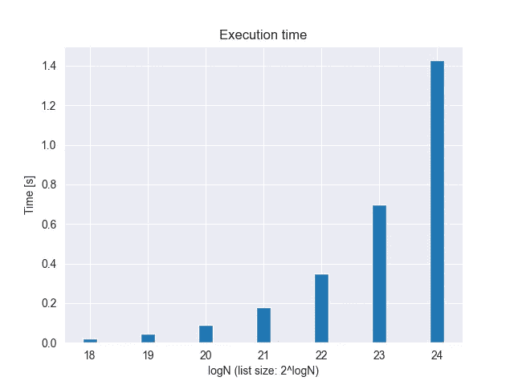
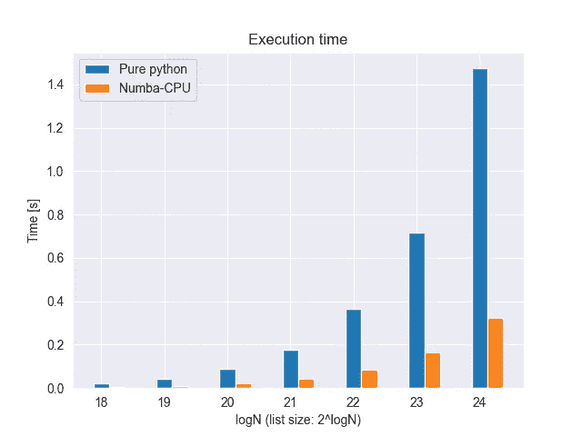
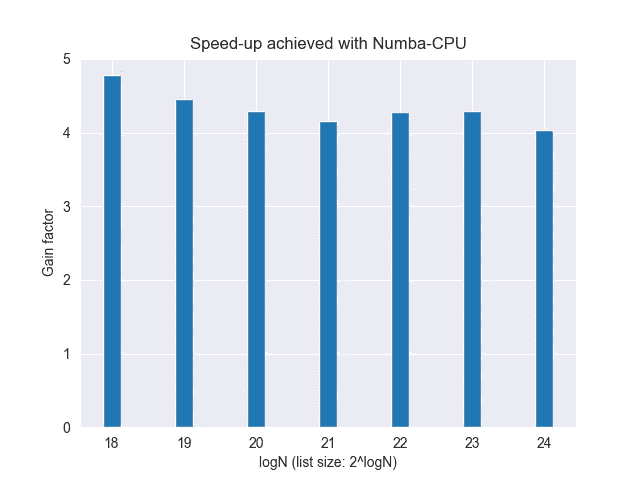
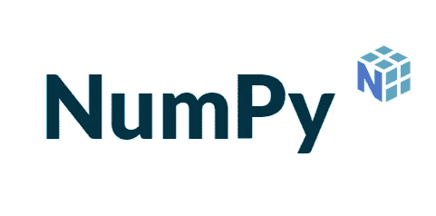
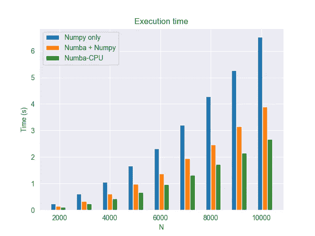
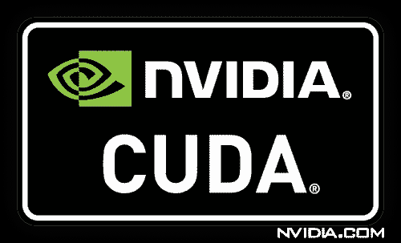
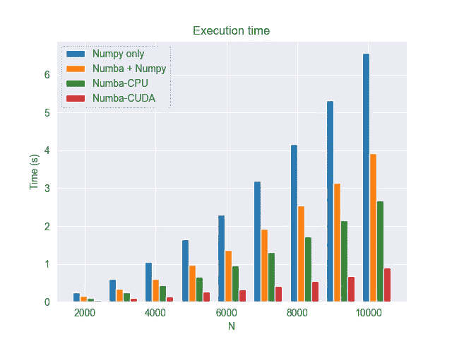

# 针对通用和科学计算开销大的任务的加速 Python

> 原文：<https://towardsdatascience.com/accelerated-python-for-general-purpose-and-scientific-computationally-expensive-tasks-55ac46f7f52b?source=collection_archive---------19----------------------->

## [理解大数据](https://towardsdatascience.com/tagged/making-sense-of-big-data)

## 借助强大的 Numba CPU/CUDA 目标编译，快速学习如何以最小的努力提高代码的性能。


由 [NASA](https://unsplash.com/@nasa?utm_source=unsplash&utm_medium=referral&utm_content=creditCopyText) 在 [Unsplash](https://unsplash.com/s/photos/rocket?utm_source=unsplash&utm_medium=referral&utm_content=creditCopyText) 上拍摄的照片

**大家都喜欢 Python** 。Python 是一种解释型高级通用编程语言。它是动态类型的，并提供垃圾收集。Python 支持多种范式，包括过程化、面向对象和函数式编程。

此外， [Guido Van Rossum](https://en.wikipedia.org/wiki/Guido_van_Rossum) 创造的语言带有简单易学的语法，并通过设计鼓励**代码可读性**，从而允许程序员编写干净的代码，即使对于大型生产级项目也是如此。

所有这些漂亮的特性，一方面使 Python 如此吸引人，另一方面，不可避免地增加了执行速度的负担，这并不是它的强项。在本文中，我们将讨论如何使用 **Numba 和 CUDA，不费吹灰之力或以最小的努力提高代码的**性能。****

为此，我们准备了**两种算法**，我们将比较和测试使用和不使用 Numba 的不同实现。

我们不是故意考虑[**Cython**](https://cython.org/)**的:虽然它提供了——至少在理论上——与静态编译语言相当的性能，但 cy thon 实际上是 Python 的扩展，对它的翻译需要相当大的努力来重写代码，遵循类似于 c 的静态类型语法**

**注意:下面显示的所有代码在这里都有:[https://github . com/Andrea-ci/misc-stuff/tree/master/numba-test](https://github.com/andrea-ci/misc-stuff/tree/master/numba-test)。**

# **列表操作**

**我们要测试的第一个算法在列表上工作，列表是 Python 最常见的内置对象之一。一个函数接收一个字符列表，这些字符是从前五个字符(即 A、B、C、D 和 E)中随机选择的，并为每个元素分配一个与字符在字母表中的位置相对应的整数。新的整数列表是函数的输出。**

```
def translate_list_01(char_list):
    """Working on a list.
    Pure Python implementation.""" num_list = []
    for word in char_list: if word == 'A':
            num = 1
        elif word == 'B':
            num = 2
        elif word == 'C':
            num = 3
        elif word == 'D':
            num = 4
        else:
            num = 5 num_list.append(num) return num_list
```

**让我们看看这个简单函数对于不同大小的列表的执行时间，用 2 的幂来表示。**

****

**简单实现的执行时间**

# **输入数字**

****

**Numba 标志**

**我们现在引入 Numba，这是一个在 Python 代码上实现实时编译的库。来自 Numba 的[官方主页:](https://numba.readthedocs.io/en/stable/user/5minguide.html)**

> **Numba 是一个针对 Python 的实时编译器，最适合使用 NumPy 数组和函数以及循环的代码。使用 Numba 最常见的方式是通过它的 decoratorss 集合，这些 decorator 可以应用到您的函数中来指示 Numba 编译它们。当一个 Numba 修饰的函数被调用时，它被编译成“实时”执行的机器代码，你的全部或部分代码随后可以以本机代码的速度运行！**

**Numba 的目标是针对 CPU 或 CUDA 内核进行编译，以实现大规模并行化(稍后将详细介绍)。**

**因此，第二个实现在我们的函数上添加了 JIT 编译。**

```
[@jit](http://twitter.com/jit)(nopython=True)
def translate_list_02(char_list):
    """Working on a list.
    CPU-acceleration with Numba.""" num_list = []
    for word in char_list: if word == 'A':
            num = 1
        elif word == 'B':
            num = 2
        elif word == 'C':
            num = 3
        elif word == 'D':
            num = 4
        else:
            num = 5 num_list.append(num) return num_list
```

**实际上，为了从 JIT 编译中获益，我们需要的唯一改变是添加 Numba `jit`装饰器。`nopython=True`选项确保修饰函数将完全在没有 Python 解释器参与的情况下运行。这是从 Numba 获得最佳性能的推荐方法。**

**无需任何重新编码，编译后的代码会立即快 4 到 5 倍。**

****

**执行时间的比较**

****

**Numba 并不支持所有的 Python 构造，所以在某些情况下，可能需要重新组织代码和/或在`object mode`中编译，这是当`nopython=True`未设置时`jit`装饰器的一种备用模式。使用这种模式，Numba 将识别它可以编译的部分，并在解释器模式下运行其余的代码，这对性能没有好处。**

**你可以在这里找到 Numba 编译器支持的 python 特性。**

# **科学计算**

**Python 还被广泛用于科学和数字任务，这要归功于一个强大的社区积极开发和支持的大量库。毕竟 Python 是机器学习的语言，仅举一例。**

**毫无疑问，Python 科学生态系统的基础是 [Numpy](https://numpy.org/) 。**

****

**Numpy 标志**

**Numpy 附带了一个丰富的工具集，其中的函数是为高效的矢量化而编译的，以便为需要在数组和矩阵上快速迭代的代码提供优化。其他高级语言也采用相同的方法，一个著名的例子是 Matlab。**

**Numba 方面，[声称是 Numpy-friend](https://numba.pydata.org/numba-doc/dev/reference/numpysupported.html) :**

> **Numba 的一个目标是与 NumPy 无缝集成。**

**然而，使用 Numba，我们在已经编译好的工具上增加了一个编译层。乍一看，这似乎**有点令人困惑**。**

**为了更好地关注这个方面，我们要测试的第二个算法是在 **Numpy 2D 数组**上进行的一系列元素操作:加法、减法、对数、指数、最小值、最大值、乘法和除法。**

**该算法的第一个实现仅使用 Numpy。**

```
def computing_01(A, B, a, b):
    """Numpy operations with no acceleration.""" # Scalar multiplication and addition of matrices.
    Y = a * A + b * B
    # Scalar multiplication and subtraction of matrices.
    Y -= a * A - b * B
    # Element-wise logarithm.
    Y += np.log(A) + np.log(B)
    # Element-wise exponential.
    Y -= np.exp(A) - np.exp(B)
    # Element-wise minimum and maximum.
    Y += (np.maximum(A, B) - np.minimum(A, B)) / 2
    # Element-wise multiplication and division.
    Y -= np.multiply(A, B) - np.divide(A, B) return Y
```

**第二个实现在上面添加了 Numba 编译。**

```
[@jit](http://twitter.com/jit)(nopython=True)
def computing_02(A, B, a, b):
    """Numpy operations with Numba acceleration.""" # Scalar multiplication and addition of matrices.
    Y = a * A + b * B
    # Scalar multiplication and subtraction of matrices.
    Y -= a * A - b * B
    # Element-wise logarithm.
    Y += np.log(A) + np.log(B)
    # Element-wise exponential.
    Y -= np.exp(A) - np.exp(B)
    # Element-wise minimum and maximum.
    Y += (np.maximum(A, B) - np.minimum(A, B)) / 2
    # Element-wise multiplication and division.
    Y -= np.multiply(A, B) - np.divide(A, B) return Y
```

**最后，第三实现避免了 Numpy 函数的任何使用，并且矩阵上的迭代是显式的。换句话说，**我们完全依赖 Numba** 来消耗循环的*。***

```
[@jit](http://twitter.com/jit)(nopython=True)
def computing_03(A, B, a, b):
    """Numba acceleration, without Numpy.""" # Matrix size.
    N = A.shape[0] # Init temporary matrices.
    Y = np.empty((N,N)) for ii in range(N):
        for jj in range(N): # Scalar multiplication and addition of matrices.
            Y[ii, jj] = a * A[ii, jj] + b * B[ii, jj]
            # Scalar multiplication and subtraction of matrices.
            Y[ii, jj] -= a * A[ii, jj] - b * B[ii, jj]
            # Element-wise logarithm.
            Y[ii, jj] += math.log(A[ii, jj]) + math.log(B[ii, jj])
            # Element-wise exponential.
            Y[ii, jj] += math.exp(A[ii, jj]) - math.exp(B[ii, jj])
            # Element-wise minimum and maximum.
            Y[ii, jj] += (max(A[ii, jj], B[ii, jj]) - min(A[ii, jj], B[ii, jj])) / 2
            # Element-wise multiplication and division.
            Y[ii, jj] -= A[ii, jj] * B[ii, jj] - A[ii, jj] / B[ii, jj] return Y
```

**我们最终可以针对不同的 *N* 值测量这些实现的性能。 *N* 是 *A、B* 和 *Y* 方阵的顺序。**

****

**执行时间的比较**

**我们在这里注意到两件主要的事情。第一个是用 Numba 编译，我们得到了额外的优化，只针对 Numpy。所以尽管引入了开销，Numba 编译**仍然是有益的**。**

**第二，令人惊讶的是，或者也许不那么令人惊讶的是，当我们让 Numba 做所有的迭代工作时，它的表现比 Numpy 好得多。**

**在这种情况下，Numba 的编译似乎比 Numpy 的矢量化更有效。**

# **输入 CUDA**

****

**哈梅内伊索尔蒂斯，CC BY-SA 4.0，通过维基共享**

**最后我们打出最后一张牌: **CUDA** 。CUDA(计算统一设备架构)是由 Nvidia 创建的并行计算平台。它提供了一个应用程序编程接口，允许软件使用图形处理单元(GPU)进行通用处理。**

**Numba 也支持 CUDA 编程。来自 [Numba 文档](https://numba.pydata.org/numba-doc/dev/cuda/overview.html):**

> **Numba 通过按照 CUDA 执行模型将 Python 代码的有限子集编译成 CUDA 内核和设备功能来支持 CUDA 编程。用 Numba 编写的内核似乎可以直接访问 NumPy 数组。NumPy 数组在 CPU 和 GPU 之间自动传输。**

**由于 Numba-CUDA 支持的指令集进一步受到限制，所以在这里翻译代码需要稍微多做一些工作。**

**为了生成多维数组，CUDA 的一般方法是让每个 **GPU 线程处理数组**的单个元素，从而实现真正的并行计算。Numba 前端管理主机(CPU)和设备(GPU)之间的**同步**。**

**这是我们算法的 CUDA 实现。我们可以注意到在这个例子中使用了不同的装饰器。此外，为 CUDA 编译的函数不返回任何对象，因此处理结果作为输入参数包含在内。最后，在这个实现中没有使用 Numpy 方法。**

```
[@cuda](http://twitter.com/cuda).jit
def computing_04(Y, A, B, a, b, N, size):
    """Operations accelerated with Cuda.""" # Thread id in a 1D block
    tx = cuda.threadIdx.x
    # Block id in a 1D grid
    ty = cuda.blockIdx.x
    # Block width, i.e. number of threads per block
    bw = cuda.blockDim.x
    # Compute flattened index inside the array
    pos = tx + ty * bw if pos < size: ii = int(math.floor( pos / N ))
        jj = int(math.floor( (pos - ii * N) / N )) # Scalar multiplication and addition of matrices.
        Y[ii, jj] = a * A[ii, jj] + b * B[ii, jj]
        # Scalar multiplication and subtraction of matrices.
        Y[ii, jj] -= a * A[ii, jj] - b * B[ii, jj]
        # Element-wise logarithm.
        Y[ii, jj] += math.log(A[ii, jj]) + math.log(B[ii, jj])
        # Element-wise exponential.
        Y[ii, jj] += math.exp(A[ii, jj]) - math.exp(B[ii, jj])
        # Element-wise minimum and maximum.
        Y[ii, jj] += (max(A[ii, jj], B[ii, jj]) - min(A[ii, jj], B[ii, jj])) / 2
        # Element-wise multiplication and division.
        Y[ii, jj] -= A[ii, jj] * B[ii, jj] - A[ii, jj] / B[ii, jj]
```

**CPU 和 CUDA 实现之间的区别是不言自明的！**

****

**CUDA 增加了执行时间的比较**

# **结论**

**Numba 是一个很棒的工具，它可以**显著提升 Python 代码的**性能，只需很少或者不需要重新编码。**

**在矢量化数值运算的情况下，我们也可以从 CUDA 并行化中受益。在这种情况下，重新编码的成本肯定会更高，但是**的性能提升是显著的**。**

**用于测试代码的机器是一台 Windows 机器，配备了 Intel i7–10700k CPU、32 GB RAM 和 Nvidia GeForce 3060Ti。**