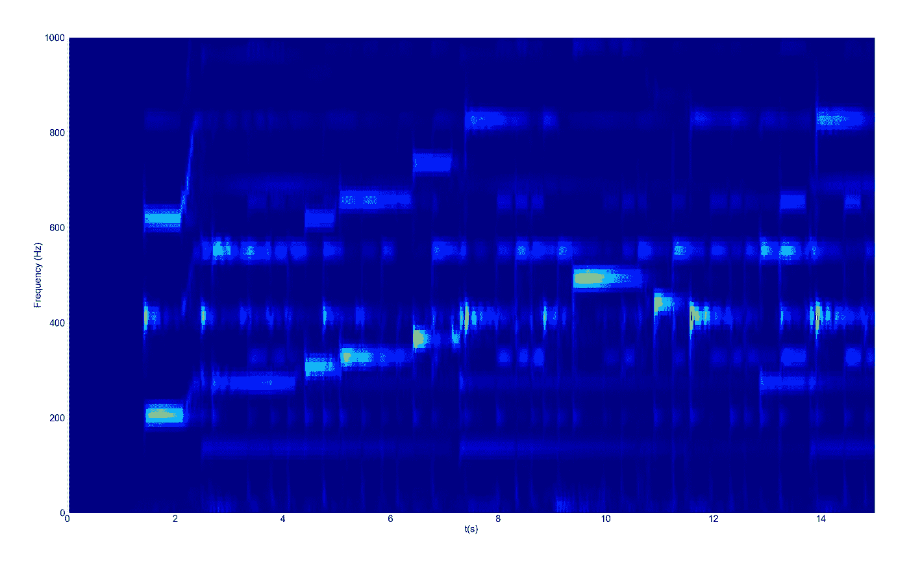

# GPU 支持加速信号处理

> 原文：<https://towardsdatascience.com/accelerated-signal-processing-with-gpu-support-767b79af7f41?source=collection_archive---------17----------------------->

## 借助 GPU 支持的生态系统，加速您的信号处理任务。

在 [Unsplash](https://unsplash.com?utm_source=medium&utm_medium=referral) 上由[娜娜杜瓦](https://unsplash.com/@nanadua11?utm_source=medium&utm_medium=referral)拍摄的照片

# **简介**

信号处理是应用于各种领域的一系列重要技术的一部分，无论是科学研究还是商业应用，从大型天体物理现象的分析到语音识别应用的开发。它涉及不同的任务，例如滤波或把原始数据变换到频域。

目前有各种各样的代码框架可用于通用编程语言，它们可用于实现这些任务，但仍然很难将像 *C++* 这样的编程语言的代码执行速度与像 *Python* 这样的高级语言的开发难度结合起来。对于科学计算，后者被大量使用，拥有完整的 *API* 源代码和库，如 *Numpy* 和 *SciPy* 。尽管比其他低级解决方案慢，特别是在密集数据计算的情况下，这些环境正由 GPU 等加速硬件支持。更具体地说，通过来自 [*CUDA*](https://developer.nvidia.com/cuda-downloads) 函数的后端支持，从而优化科学任务的时间消耗。

在本文中，我们将介绍一些 GPU 支持的框架的功能，这些框架可用于两种特定的信号处理技术(短时傅立叶变换和功率谱密度)，并与基于 CPU 推理的库进行比较。

## 五金器具

*   CPU: AMD 锐龙 7 2700X
*   GPU:英伟达 GTX 1060 6GB。

# 短时傅立叶变换算法

短时傅立叶变换( *STFT* )是一种高度用于分析非平稳信号(时变频率)的数学技术。其功能的基础是在某个信号内等长的不同段中计算连续的傅立叶变换( *FFT* )。时频 *STFT* ，*X【f，n】*，可以用等式 1 来简要描述。

等式 1 — STFT。

其中 *w[m]* 为窗函数， *v* 为频率指数， *n* 为时间段， *H* 为不同窗中心之间的距离(*跳长* ), *x[m+nH]* 表示带有 *nH* 段重叠数据的输入信号， *N* 为每段的长度。关于如何在计算上应用 *STFT* 的更详细描述可以在[本文](https://www.researchgate.net/publication/346243843_Area-Efficient_Short-Time_Fourier_Transform_Processor_for_Time-Frequency_Analysis_of_Non-Stationary_Signals)中看到。

为这项工作选择的窗口函数是余弦窗口的一个特例，定义在等式。2，were *α* 是一个非负有理数。

等式 2 —广义余弦窗函数。

对于 *α* = 25/46(或大约 0.54)，我们有已知的*汉明*窗口函数，定义在等式中。3.

等式 3——汉明窗函数。

图 1 示出了所描述的过程的一般图示，其中连续的 *FFT* 在具有特定窗函数 *w[m]的原始信号 *x[m]* 中被计算。*

图 1—STFT 插图(“作者图片”)。

有了这个关于 *STFT、*的数学背景的简短修正，我们现在可以前进到性能分析。

# scipy vs tensor flow vs RAPIDS Cu signal

为了计算 *STFT* ，我们可以使用两个有 GPU 支持的*API*([*tensor flow*](https://www.tensorflow.org/api_docs/python/tf/signal/stft)和[*RAPIDS Cu signal*](https://docs.rapids.ai/api/cusignal/stable/api.html))内置函数，并比较它们与 [*SciPy*](https://docs.scipy.org/doc/scipy/reference/generated/scipy.signal.stft.html) 实现的性能。

用于此项工作的库

出于这种比较的目的，我们将使用来自一个 *wav* 文件的一个片段，采样率为 48 *kHz* ，这是一个个人尝试，涵盖了 Heitor Villa-洛沃斯古典吉他作品“*前奏№1* ”。你可以通过这个[链接](https://soundcloud.com/user-121644687/tiagomartins-h-villa-lobos-prelude-no-1)来听一听。

导入 wavfile

图 2 —信号数据。

选择的 *STFT* 段长度为 8192，窗口半重叠。为了测量每个*内置方法的执行时间，使用了 [*timeit*](https://docs.python.org/3/library/timeit.html) 模块。也可以使用其他运行时方法，如 [*时间*](https://docs.python.org/3/library/time.html) 和 [*cProfile*](https://docs.python.org/3/library/profile.html) 。*

*计算 STFT 运行时间*

*利用获得的每个 *API* 的运行时值，我们现在可以绘制一个柱状图来评估结果。*

*绘制 STFT 运行时*

**

*图 3 — STFT 运行时结果。*

*利用*张量流*和 *cuSignal* ，SciPy 实现可以分别被加速几乎 10 倍和 75 倍。 *cuSignal* 的最佳性能可以部分解释为对 *CUDA* 阵列计算加速库的额外后端支持。*

*为了表示的目的，我们也可以用时间*对频率*表示法来表示 *STFT* 计算的结果，或者换句话说，用频谱图来表示(图 4)。*

**

*图 4 —信号频谱图(“作者提供的图像”)。*

*为了提高时间分辨率*δt*，可以减小 *FFT* 的窗口大小，但是要记住这样做会有降低频率分辨率*δf*的缺点，如下面的不确定关系所述。*

**

*时间与频率的不确定关系。*

**

*图 5 —具有更高*δt 的信号频谱图(*“图片由作者提供”)。*

*现在让我们转到本研究中涉及的第二种信号处理技术。*

# *使用韦尔奇方法的功率谱密度*

*功率谱密度( *PSD* )将功率分布描述为特定信号的不同频率分量的函数，考虑傅立叶变换的实部。估计功率谱有许多选择。具体来说，这项工作将集中在 [*韦尔奇的方法*](https://www.osti.gov/servlets/purl/5688766/) 上，它可以分为以下几个步骤:*

*   *将信号分成 *K* 段；*
*   *对于每个片段 *K* 计算离散傅立叶变换(*DFT*)；*
*   *使用计算出的 *DFT* 获得周期图值，定义见等式。4，其中 *M* 为每段长度*k*；*

**

*等式 4——周期图。*

*   *平均 *K* 段的所有周期图值，给出所需的 PSD(等式。5).*

**

*等式 5 —韦尔奇方法功率谱密度。*

# *Scipy vs RAPIDS cuSignal*

*在这种情况下， *PSD* 的计算仅考虑到 *SciPy* 和 *cuSignal API* ，使用先前定义的相同 *FFT* 参数。*

*用韦尔奇方法计算功率谱密度*

*同样，我们使用柱状图分析两种方法的性能。*

*绘制 PSD 运行时*

**

*图 7 — PSD 运行时结果。*

*结果再次表明 *cuSignal* 具有优化处理任务的潜力。使用 *cuSignal* 的 *PSD* 的运行时计算可以增加 50 倍。所得到的光谱可以在图 8 中看到。*

**

*图 8 — PSD 图(“作者提供的图像”)。*

# ***总结与未来工作***

*正如预期的那样，结果证明了这些具有 GPU 支持的*API*在信号处理方面的潜力，无论是采集后分析还是实时应用，尽管对于高采集速率信号，后者仍然优先采用低级代码处理。根据每个用户拥有的硬件和软件，显示的结果可能略有不同，但这足以提供一个大致的视角。*

*作为未来的工作，将这些高级实现与 *C* 和 *C++* 函数进行比较会很有趣，以便提取关于所呈现的*API*的容量的所有信息。此外，作为对读者的一个建议，可以用更高的采样频率信号(> 100 *MHz* )和不同的 *FFT* 参数替换所使用的 *wav* 文件，执行新的基准测试。*

*关于这项工作，请随时提出建议。*

# ***参考文献***

***【1】**Hohyub Jeon，Yongchul Jung，Seongjoo Lee 和郑允浩，“ [*面积有效的短时傅里叶变换处理器，用于非平稳信号的时频分析*](https://www.researchgate.net/publication/346243843_Area-Efficient_Short-Time_Fourier_Transform_Processor_for_Time-Frequency_Analysis_of_Non-Stationary_Signals) ”，应用科学，2020；*

***【2】**m . Solomon， [*采用韦尔奇方法的 PSD 计算*](https://www.osti.gov/biblio/5688766-psd-computations-using-welch-method-power-spectral-density-psd) *，*美国能源部，1991。*