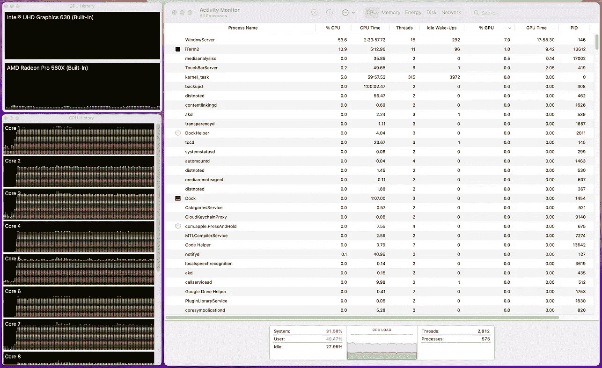
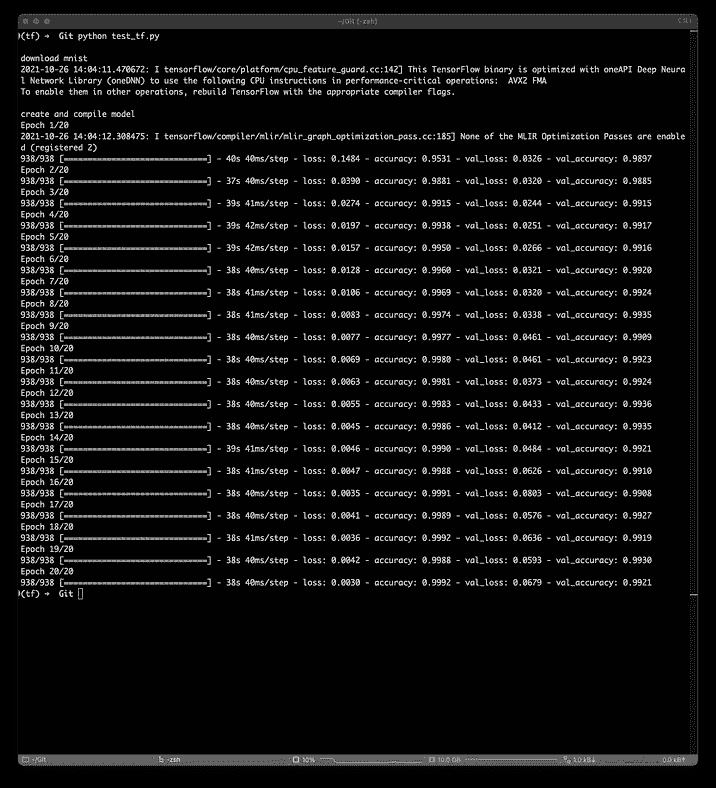
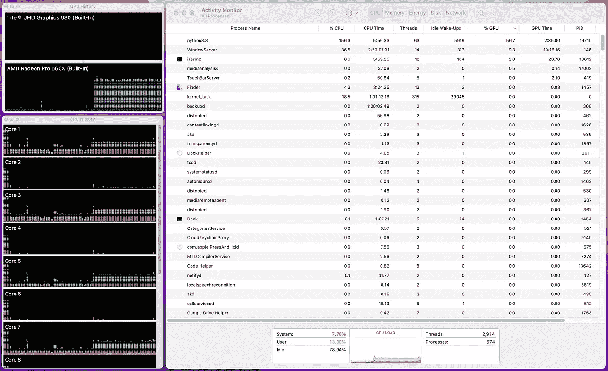
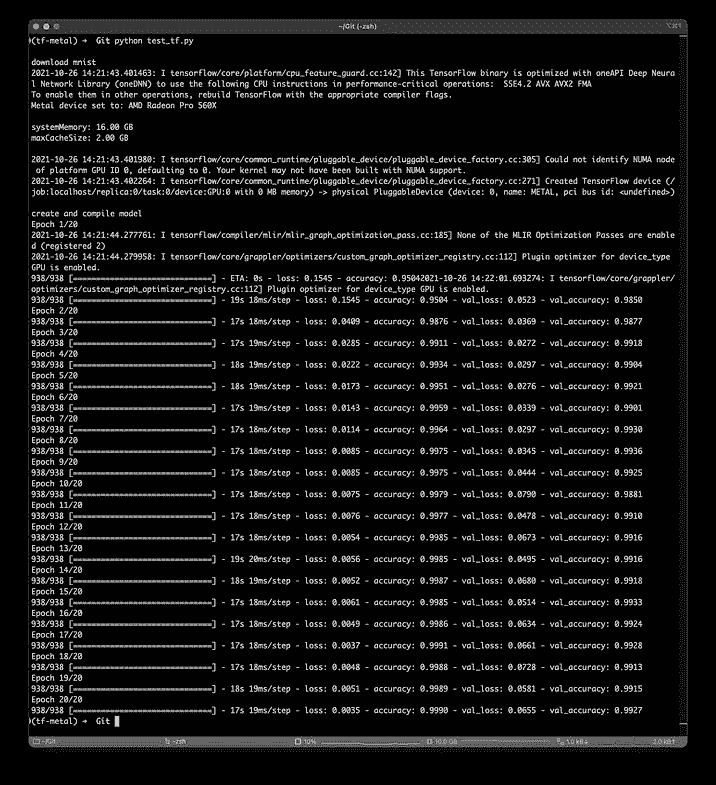

# 英特尔 Mac GPUs 上的加速张量流模型训练

> 原文：<https://towardsdatascience.com/accelerated-tensorflow-model-training-on-intel-mac-gpus-aa6ee691f894?source=collection_archive---------4----------------------->

## 如何通过 TensorFlow PluggableDevice 在 MacBook Pro dGPU 上训练 TensorFlow 模型的迷你指南


照片由[尼古拉·塔拉先科](https://unsplash.com/@beautyoftechnology?utm_source=medium&utm_medium=referral)在 [Unsplash](https://unsplash.com?utm_source=medium&utm_medium=referral) 拍摄

TensorFlow 在 2021 年年中推出了 [PluggableDevice](https://blog.tensorflow.org/2021/06/pluggabledevice-device-plugins-for-TensorFlow.html) ，这使得硬件制造商能够将其加速器(例如 GPU、TPU、npu)无缝集成到 TensorFlow 生态系统中。这使得用户可以在非 CUDA 设备上享受加速培训，只需对代码进行最少的修改。更重要的是，硬件制造商不再需要派生和实现自己版本的 TensorFlow(例如 [AMD ROCm port](https://github.com/ROCmSoftwarePlatform/tensorflow-upstream) )，可以纯粹专注于 TensorFlow 和设备级操作之间的通信层。随着最近 [macOS Monterey](https://www.apple.com/uk/macos/monterey/) 的公开发布，苹果为 PluggableDevice 架构添加了[金属支持](https://developer.apple.com/metal/tensorflow-plugin/)，因此，现在可以在 MacBook Pros 和 iMacs 上轻松地使用专用 GPU (dGPU)训练 TensorFlow 模型。

在本迷你指南中，我将介绍如何安装`tensorflow-metal`以在英特尔 MacBook Pro 和 iMac 上启用 dGPU 培训。此外，我在配备 AMD 镭龙 Pro 560X 的 MacBook Pro 上训练了一个简单的 CNN 图像分类器，以展示加速后的性能。

## **创建开发环境**

我个人更喜欢 [miniconda](https://docs.conda.io/en/latest/miniconda.html) ，但是其他环境管理器比如 [anaconda](https://www.anaconda.com/products/individual) 和 [virtualenv](https://virtualenv.pypa.io/en/latest/) 也应该以类似的方式工作。

我们首先用 Python 3.8 创建一个名为`tf-metal`的新`conda`环境

```
conda create -n tf-metal python=3.8
```

然后我们激活环境

```
conda activate tf-metal
```

## 安装金属启动张量流

我们必须安装以下 pip 包:`[tensorflow-macos](https://pypi.org/project/tensorflow-macos/)`和`[tensorflow-metal](https://pypi.org/project/tensorflow-metal)`。通常，你可以简单地做`pip install tensorflow-macos tensorflow-metal`,然后就万事大吉了。但是，您可能会收到以下错误，因为这两个包都是针对 macOS 11 SDK 之后的版本构建的:

```
ERROR: Could not find a version that satisfies the requirement tensorflow-macos (from versions: none)
ERROR: No matching distribution found for tensorflow-macos
```

为了绕过版本兼容性问题，我们需要使用下面的标志`SYSTEM_VERSION_COMPAT=0`和`pip install`:

```
SYSTEM_VERSION_COMPAT=0 pip install tensorflow-macos tensorflow-metal
```

现在应该已经安装了这两个软件包:

```
(tf-metal) ➜  ~ pip list
Package                 Version
----------------------- ---------
absl-py                 0.15.0
astunparse              1.6.3
cachetools              4.2.4
certifi                 2021.10.8
charset-normalizer      2.0.7
clang                   5.0
flatbuffers             1.12
gast                    0.4.0
google-auth             2.3.1
google-auth-oauthlib    0.4.6
google-pasta            0.2.0
grpcio                  1.41.1
h5py                    3.1.0
idna                    3.3
keras                   2.6.0
Keras-Preprocessing     1.1.2
Markdown                3.3.4
numpy                   1.19.5
oauthlib                3.1.1
opt-einsum              3.3.0
pip                     21.2.4
protobuf                3.19.0
pyasn1                  0.4.8
pyasn1-modules          0.2.8
requests                2.26.0
requests-oauthlib       1.3.0
rsa                     4.7.2
setuptools              58.0.4
six                     1.15.0
tensorboard             2.7.0
tensorboard-data-server 0.6.1
tensorboard-plugin-wit  1.8.0
tensorflow-estimator    2.6.0
tensorflow-macos        2.6.0
tensorflow-metal        0.2.0
termcolor               1.1.0
typing-extensions       3.7.4.3
urllib3                 1.26.7
Werkzeug                2.0.2
wheel                   0.37.0
wrapt                   1.12.1
```

## 在 TensorFlow 中检查物理设备

我们可以使用`tf.config.list_physical_devices()`来检查所有可用的物理设备:

```
>>> import tensorflow as tf
>>>
>>> tf.config.list_physical_devices()
[PhysicalDevice(name='/physical_device:CPU:0', device_type='CPU'), PhysicalDevice(name='/physical_device:GPU:0', device_type='GPU')]
```

我们可以看到，在我配备 AMD 镭龙 Pro 560X dGPU 的 2018 MacBook Pro 的情况下，有两个物理设备:一个`CPU`和一个`GPU`。

类似于在 TensorFlow 中使用本地设备或 CUDA 设备，我们可以使用`with tf.device()`语法声明一个变量或定义在特定设备上运行的操作:

```
>>> with tf.device('/GPU'):
...     a = tf.random.normal(shape=(2,), dtype=tf.float32)
...     b = tf.nn.relu(a)
...
2021-10-26 12:51:24.844280: I tensorflow/core/platform/cpu_feature_guard.cc:142] This TensorFlow binary is optimized with oneAPI Deep Neural Network Library (oneDNN) to use the following CPU instructions in performance-critical operations:  SSE4.2 AVX AVX2 FMA
To enable them in other operations, rebuild TensorFlow with the appropriate compiler flags.
Metal device set to: AMD Radeon Pro 560XsystemMemory: 16.00 GB
maxCacheSize: 2.00 GB2021-10-26 12:51:24.845013: I tensorflow/core/common_runtime/pluggable_device/pluggable_device_factory.cc:305] Could not identify NUMA node of platform GPU ID 0, defaulting to 0\. Your kernel may not have been built with NUMA support.
2021-10-26 12:51:24.845519: I tensorflow/core/common_runtime/pluggable_device/pluggable_device_factory.cc:271] Created TensorFlow device (/job:localhost/replica:0/task:0/device:GPU:0 with 0 MB memory) -> physical PluggableDevice (device: 0, name: METAL, pci bus id: <undefined>)
>>>
>>> a
<tf.Tensor: shape=(2,), dtype=float32, numpy=array([-1.6457689, -0.2130392], dtype=float32)>
>>> b
<tf.Tensor: shape=(2,), dtype=float32, numpy=array([0., 0.], dtype=float32)>
```

您可以在初始化期间看到金属装置`AMD Radeon Pro 560X`被设置的打印输出。

## 训练 CNN 分类器

为了演示使用`tensorflow-metal`对普通`tensorflow`(即在`CPU`上)的训练性能，我编写了一个脚本，使用`RMSProp`在`MNIST`上训练一个简单的 CNN 模型 50 个时期。请注意，我使用 [TensorFlow 数据集](https://www.tensorflow.org/datasets)来下载`MNIST`，所以如果您想运行完全相同的代码，请使用`pip install tensorflow_datasets`。

以下是用`tensorflow` (CPU)和`tensorflow-metal` (GPU)训练的 CNN 模型的训练结果和活动监视器截图。



活动监视器截图和 CNN 在 CPU 上的训练表现[图片由作者提供]



活动监视器截图和 CNN 在 GPU 上的训练表现[图片由作者提供]

我们可以看到在`tensorflow`和`tensorflow-metal`上的训练达到了相似的训练和验证精度。此外，CNN 模型在 CPU 上平均耗时 40 毫秒/步，而在 GPU 上平均耗时 19 毫秒/步，加速约 52%。从活动监视器截图中，我们也可以看到 AMD 镭龙 Pro 560X dGPU 确实正在被 python3.8 使用，GPU 使用率约为 56%。

由于 TensorFlow PluggableDevice 架构，硬件开发人员现在可以支持非 CUDA 加速器与 TensorFlow 一起工作，而无需分叉或移植现有的 TensorFlow 代码库。根据我们有限的实验，`tensorflow-metal`似乎在采用 dGPU 的英特尔 MAC 电脑上运行得相对良好且无缝。尽管如此，Metal 插件仍处于早期开发阶段，还有一些已知的错误(如 [Adam optimizer 目前](https://developer.apple.com/forums/thread/691917)不工作)阻止 ML 开发者切换到`tensorflow-metal`工作流。希望随着越来越多的硬件制造商开始将他们的产品与 PluggableDevice API 集成，我们将在 AI 硬件加速器中看到更好的支持和更多的选择。

## 关于 TensorFlow 可插拔设备和 Apple Metal 的其他参考资料

*   tensor flow-[pluggable Device:tensor flow 的设备插件](https://blog.tensorflow.org/2021/06/pluggabledevice-device-plugins-for-TensorFlow.html)
*   TensorFlow - [GPU 设备插件](https://www.tensorflow.org/install/gpu_plugins)
*   苹果- [Tensorflow 插件- Metal -苹果开发者](https://developer.apple.com/metal/tensorflow-plugin/)