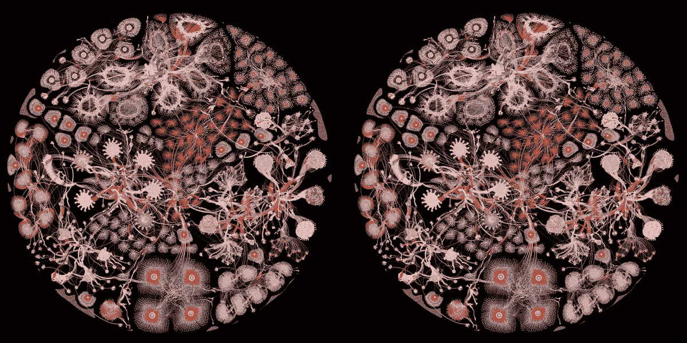
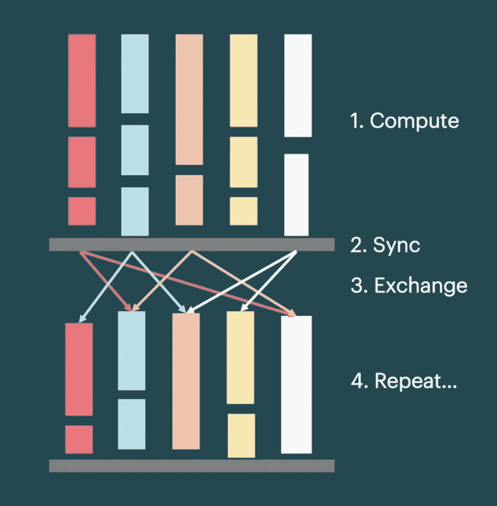
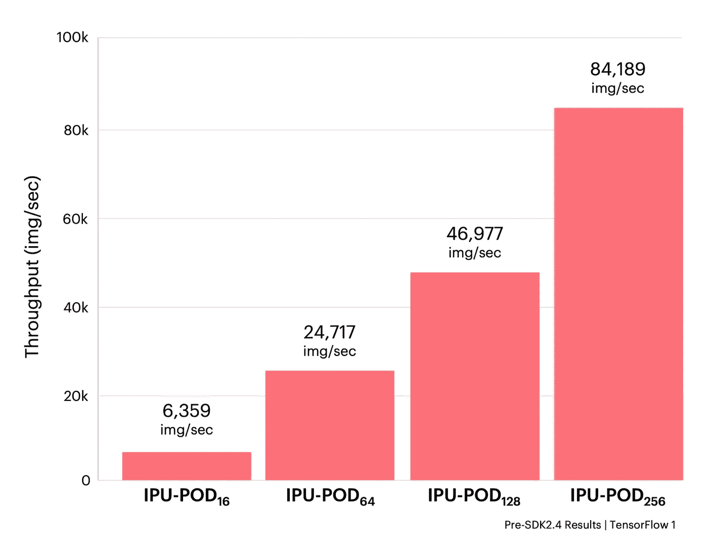
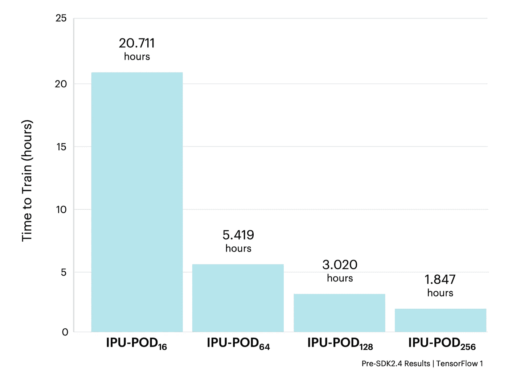

# 加速计算机视觉:我们如何将 EfficientNet 扩展到 IPU-波德超级计算系统

> 原文：<https://towardsdatascience.com/accelerating-computer-vision-how-we-scaled-efficientnet-to-ipu-pod-supercomputing-systems-e4e6b506b671?source=collection_archive---------27----------------------->

## 更快的大规模图像处理

图片作者。

Graphcore 研究展示了我们如何在 Graphcore 最新的超大规模 [IPU-POD128 和 IPU-POD256 系统](https://www.graphcore.ai/posts/the-next-big-thing-introducing-ipu-pod128-and-ipu-pod256)上加速训练创新的计算机视觉模型 EfficientNet-B4，在不到两个小时内达到收敛。

# 为什么选择 EfficientNet？

[EfficientNet 系列模型](https://arxiv.org/abs/1905.11946) [1]展示了计算机视觉的最新发展水平，以相对较少的参数和失败实现了高任务性能。然而，它在实践中的采用受到以下事实的限制:传统的处理器架构不能利用使 EfficientNet 如此高效的许多属性。

例如，与标准卷积运算相比，EfficientNets 中的深度方向或[组](https://arxiv.org/abs/2106.03640)卷积具有很高的表达能力和计算效率，但算术强度较低(计算与数据移动的比率)。由于内存和处理器内核之间的大量数据传输，这些类型的操作在 GPU 上的性能很差。由于 IPU 以内存为中心的架构，整个模型及其激活都可以保留在芯片上，从而缓解了这种昂贵的数据移动。

此外，IPU 的 MIMD(多指令、多数据)范式支持模型和训练过程的多维度上的细粒度并行性。这有助于实现高吞吐量，同时使用小卷积并并行处理非常少的数据样本。相比之下，具有 SIMD(单指令，多数据)架构的 GPU 在利用并行性的方式上受到限制，迫使用户在他们的机器学习算法的设计和硬件上该算法可达到的吞吐量之间进行权衡。

IPU 硬件上的这种加速为更多的创新者和人工智能从业者带来了机会，他们可以从 EfficientNet models 的高效率中受益。

Graphcore 在 GitHub 上的例子提供了广泛的流行模型，任何人都可以在 IPU 上直接使用，包括 EfficientNet 模型家族。在这个练习中，我们考虑 EfficientNet-B4，它通常用于人工智能领域来测试 EfficientNet 性能。

# 优化吞吐量

## 分发模型

有许多方法可以在一组 IPU 上分发模型，包括数据并行复制和[管道模型并行](https://docs.graphcore.ai/projects/tf-model-parallelism/en/latest/pipelining.html#pipelining)。给定 EfficientNet-B4 的大小和 IPU-pod 的规模，数据和模型并行性的某种组合可以获得最佳结果。Poplar 软件堆栈使得在框架级别尝试不同的分布式设置变得容易，加快了我们对配置各种类型并行性的最佳方式的搜索。

GitHub 示例中 EfficientNet-B4 的默认配置通过四个 IPU 来传输模型。拥有多级管道意味着需要花费更多时间来填充和排空管道，从而降低了 IPU 的整体利用率。这也意味着需要更加注意平衡 IPU 之间的工作量。如果我们能够将流水线阶段的数量减少到两个，这些挑战是可以解决的。这也使我们能够将副本数量增加一倍。

为了使 EfficientNet-B4 仅适用于两个 IPU，我们采用了三种技术:

*   使用 16 位浮点运算和主权重
*   减少本地批量大小
*   使用 Graphcore Research 的“让 EfficientNet 更高效”[博客](/how-we-made-efficientnet-more-efficient-61e1bf3f84b3)和[论文](https://arxiv.org/abs/2106.03640)【2】中探索的 G16 版本的 EfficientNet

IPU 本身支持 16 位和 32 位浮点数表示，允许用户灵活调整应用中各种张量的表示。在某些情况下，可能有必要存储 FP32 主重量，其中在整个训练过程中以完全精确的方式存储模型参数的副本。我们发现，对于 EfficientNet，当使用 FP16 主权重并在权重更新中采用随机舍入时，性能仍然可以保持不变。

由于存储激活所需的内存随批量大小而增加，因此考虑如何在不影响培训的情况下减少激活开销非常重要。激活重新计算是一种我们可以在需要的时候重新计算激活的方法。这提供了计算和内存之间的简单权衡。这种方法在 Poplar 中可用，并且可以通过管道 API 在框架级别轻松访问。使用 EfficientNet-B4，我们可以使用激活重新计算来适应本地批处理大小 3。与四级管道设置相比，这种配置允许并行处理更多的样本，因为我们有两倍多的副本来分发小批量。对于这项工作，我们使用组规范，一个批次独立的标准化方法。由于该模型没有任何批间依赖性，因此我们可以拥有任何适合内存的本地批大小，并简单地累积梯度以实现我们想要的任何全局批大小，从而允许我们在不影响模型的训练动态的情况下在内存中调整我们的激活。

通过将卷积组的大小从 1 增加到 16(并随后降低扩展比以补偿触发器和参数的增加)，我们降低了 EfficientNet 中 MBConv 模块的内存开销。这在 Graphcore Research 的“[让 EfficientNet 更高效](https://arxiv.org/abs/2106.03640)”论文中有更详细的探讨，并在我们的[博客](/how-we-made-efficientnet-more-efficient-61e1bf3f84b3)中有总结。除了节省内存之外，该模型的这种变体还有增加 ImageNet 验证准确性的额外好处。

这三种技术允许我们仅在两个 IPU 上拟合模型，而不必将任何优化器状态卸载到流存储器，从而允许以高吞吐量进行训练。

## 数据输入输出

当在像 IPU-POD 这样强大的人工智能加速器系统上训练机器学习模型时，一个常见的瓶颈是从主机向模型提供足够的数据来处理。PopRun 是一个命令行实用程序，它通过在多个程序实例上以分布式方式启动应用程序来帮助缓解这一瓶颈。每个实例的 I/O 由其对应的主机服务器管理，这允许我们将模型扩展到各种 IPU-POD 系统，而不受我们向模型提供数据的速度的限制。

虽然 ImageNet 数据集最初以 INT-8 表示，但作为预处理的一部分，它通常在主机上被转换为更高精度的浮点数据类型。一旦数据位于 IPU 上，通过应用这种转换，通信开销就会降低，因为输入数据可以以较低的精度流式传输到 IPU。这有助于提高向模型提供数据的速率，从而进一步提高吞吐量。

IPU 内部和之间的数据移动是在[批量同步并行](https://share.vidyard.com/watch/9aDEUsLyYpJjRbGJyt94zd) (BSP)执行方案下实现的。有了 BSP，*瓦片* (IPU 处理器内核)在本地计算和与其他瓦片的数据交换之间交替，中间有一个同步步骤。

批量同步并行(BSP)执行方案。图片作者。

这种执行方案使 Poplar 能够高效地并行处理数十万个图块。对于 I/O 受限的应用，跨越所有瓦片的天真 BSP 范例会抑制性能。Poplar 通过允许一部分瓦片以异步方式专用于流数据，而剩余的计算瓦片在 BSP 范式下执行来解决这一问题。重叠 I/O 缓解了性能瓶颈，同时仍然允许高度可伸缩的执行方案。我们发现，将每个 IPU 1472 个切片中的 32 个分配给 I/O 重叠，并预取多达三批数据，结合上述方法，可以在所有系统规模下实现令人印象深刻的吞吐量。

# 调整批量大小

要跨大型系统(如 IPU-波德 128 和 IPU-波德 256)进行训练，使用大的全局批量是有益的。这使我们能够并行处理多个副本上的数据样本，同时确保每个副本都有足够的工作来保持效率。此外，为了分摊减少副本之间的梯度的成本，我们在副本之间通信和更新权重之前，在多个前向和后向通道上本地累积梯度，这被称为梯度累积(GA)。因此，全局批量大小是本地批量大小、副本数量和梯度累积计数的乘积。

我们的基线来自“让 EfficientNet 更高效”，使用的全球批量为 768。给定我们的本地批次大小为 3，这将在 IPU-POD256 上每次训练迭代仅产生两个本地批次，未充分利用流水线设置，并且必须应对频繁的高成本重量更新。然而，简单地增加全局批量大小会导致泛化性能下降。这种现象在许多机器学习应用中很常见，[特别是在计算机视觉中](https://arxiv.org/abs/1804.07612) [3]。因此，我们寻求一个足够大的全球批量，以维持所有 IPU-POD 系统的高通量，但又足够小，以获得良好的统计效率。

众所周知，[优化器对大批量训练的鲁棒性有很大影响](https://arxiv.org/abs/1811.03600) [4]。最初的 EfficientNet 论文使用了 RMSProp 优化器，在我们的研究中，当增加批量时，它很难保持统计效率。[王帕尼奇等人](https://arxiv.org/abs/2011.00071)。[5]进行了类似的观察，并建议使用[分层自适应速率缩放](https://arxiv.org/abs/1708.03888) (LARS) [6]，这是一种已知的优化器，可以很好地训练大批量的视觉模型。LARS 在逐层的基础上缩放学习率，以确保权重和权重更新之间的相似幅度。除了 LARS，我们还采用了多项式衰减学习率计划，通常与优化器结合使用。

通过对批量大小、学习速率、预热时期的数量、动量系数和重量衰减进行超参数扫描，我们发现，与我们最初的 EfficientNet-B4 实施相比，我们可以实现 6144 的全局批量大小，而不会有任何性能损失。在此批量下，所有考虑的 IPU 容器都可以保持高梯度累积计数。

图片作者。

# 绩效结果

借助灵活的超参数配置，我们现在能够在一系列 IPU-POD 系统上以高吞吐量训练 EfficientNet-B4。根据最初的效率网论文，我们训练了 350 个纪元。虽然“让 EfficientNet 更高效”展示了 EfficientNet 系列模型在以其原始分辨率进行微调之前，可以在较低的图像分辨率下进行预调整，但我们保持了原始分辨率，以便与其他实施保持一致。

图片作者。

图片作者。

所有的实验都使用相同的基本机器学习超参数配置，通过根据 IPU 荚的大小缩放复制品的数量和梯度累积计数。结果都收敛了，验证准确率为 82.54±0.13%。

上述结果显示了 EfficientNet 在基于 IPU 的系统上的训练速度，并与领先的 GPU 硬件上的结果进行了对比。能够快速训练模型对于创新者快速迭代和测试新想法至关重要——我们可以在不到两个小时的时间内训练 EfficientNet-B4，将创新速度从几天加快到几小时。

这种加速表明，当不受传统处理器架构的限制时，许多计算机视觉应用可以更快地进行大规模训练。像 EfficientNet 这样的下一代计算机视觉模型，当与 Graphcore 的 IPU-POD 系统等新型硬件一起使用时，可以帮助加速大量与视觉相关的用例，从 CT 扫描分析和视频升级到故障诊断和保险索赔验证。

这些配置现在[可以在 Graphcore 的 GitHub 示例上](https://github.com/graphcore/examples/tree/master/vision/cnns/tensorflow1/training)试用。

# 谢谢你

感谢 [Dominic Masters](https://medium.com/@dominic.masters.gc) 和 Carlo Luschi，他们也为这项研究做出了贡献，感谢我们在 Graphcore 的其他同事的支持和见解。

# 参考

[1] M. Tan，Q. V. Le， [EfficientNet:重新思考卷积神经网络的模型缩放](https://arxiv.org/abs/1905.11946)，arXiv 2019

[2] D. Masters，A. Labatie，Z. Eaton-Rosen，C. Luschi，[使效率网更有效率:探索独立于批处理的标准化、组卷积和降低分辨率训练](https://arxiv.org/abs/2106.03640)，arXiv 2021

[3] D. Masters，C. Luschi，[重温深度神经网络的小批量训练](https://arxiv.org/abs/1804.07612)，arXiv 2018

[4] C. J. Shallue，J. Lee，J. Antognini，J. Sohl-Dickstein，R. Frostig，G. E. Dahl，[测量数据并行性对神经网络训练的影响](https://arxiv.org/abs/1811.03600)，arXiv 2018

[5] A. Wongpanich，H. Pham，J. Demmel，M. Tan，Q. Le，Y. You，S. Kumar，[超级计算机规模的训练效率网络:一小时内 83%的 ImageNet Top-1 准确性](https://arxiv.org/abs/2011.00071)，arXiv 2020

[6] Y. You，I. Gitman，B. Ginsburg，[卷积网络的大批量训练](https://arxiv.org/abs/1708.03888)，arXiv 2017