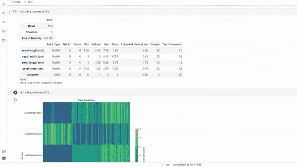
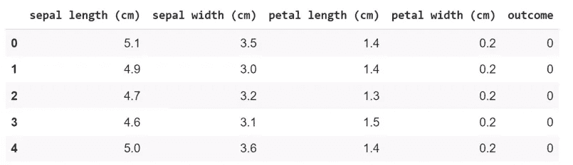
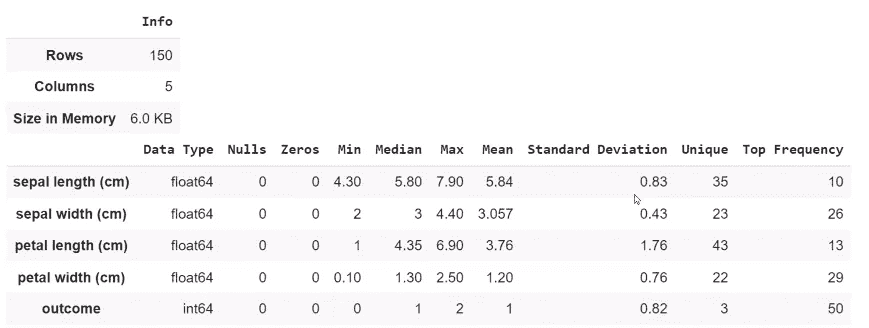
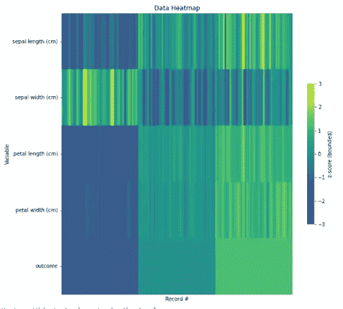
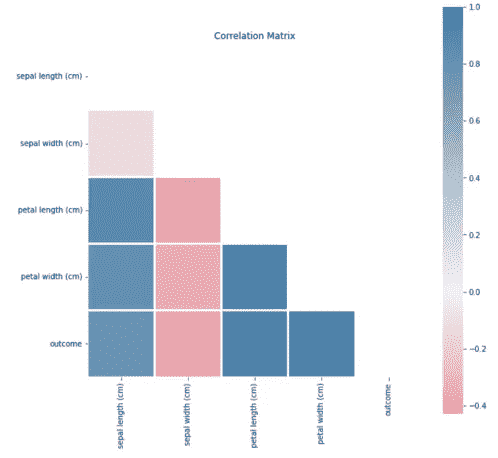
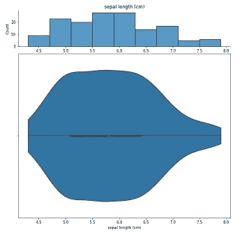
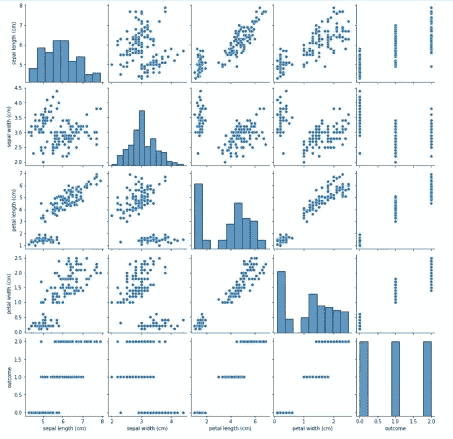
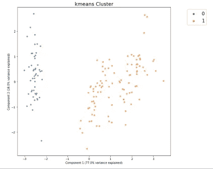
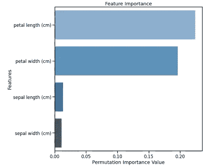

# 加速数据探索

> 原文：<https://towardsdatascience.com/accelerating-data-exploration-e0047fbd08b6?source=collection_archive---------17----------------------->

## 使用数据描述进行探索性数据分析



数据描述(来源:作者)

探索性数据分析是更好地理解数据集和基础数据的重要初始步骤之一。它帮助我们理解数据是什么，数据集的不同特征是什么，理解不同数据点之间的关联，等等。

事先对数据的探索让我们在创建机器学习或深度学习模型时拥有优势。它不仅有助于理解数据相关性，还有助于分析数据集中的统计属性和任何隐藏模式。

EDA 通常会耗费大量的时间和精力，因为我们需要创建不同的条形图和图表来可视化和分析数据。如果我告诉你，你可以用少得多的时间和精力完成 EDA，那会怎么样？是的，这是可能的，我们可以用单行代码创建不同的图。

Data Describe 是一个开源的 python 库，可用于通过创建不同的可视化来轻松理解和分析数据集。

在本文中，我们将使用数据描述来轻松地执行 EDA。

让我们开始吧…

# 安装所需的库

我们将从使用 pip 安装数据描述开始。下面给出的命令可以做到这一点。

```
!pip install data_describe
```

# 导入所需的库

在这一步中，我们将导入所需的库和函数来创建机器学习模型和仪表板。我们将在本文中使用 IRIS 数据集，因此我们将从 sklearn 导入它。数据集的链接如下所示:

<https://scikit-learn.org/stable/datasets/toy_dataset.html#iris-plants-dataset>  

```
import pandas as pd
from sklearn.datasets import load_iris
dat = load_iris()
df = pd.DataFrame(dat['data'], columns=dat['feature_names'])
df['outcome'] = dat['target']
df.head()
```



数据集(来源:作者)

# 探索性数据分析

现在，我们将从数据探索开始。我们将从分析统计摘要开始，然后创建不同的图形和图表。

**a .统计汇总**

```
dd.data_summary(df)
```



统计摘要(来源:作者)

在这里，我们可以分析显示数据集的中位数、众数、四分位数等的统计摘要。

**b .热图**

```
dd.data_heatmap(df)
```



c.**相关矩阵**

```
dd.correlation_matrix(df)
```



相关性(来源:作者)

相关矩阵有助于理解数据点之间的相关性。

d.**分布图**

分布图显示了数据集的分布，这可以帮助我们理解数据集的偏斜度。我们将使用 ipywidget python 库来绘制所有数据点的分布图。

```
from IPython.display import displayfor col in df.columns:
     display(dd.distribution(df,        
                         plot_all=True).plot_distribution(col))
```



分布图(来源:作者)

e.**散点图**

```
dd.scatter_plots(df, plot_mode='matrix')
```



散点图(来源:作者)

f.**聚类图**

聚类图有助于可视化目标变量的聚类。

```
dd.cluster(df)
```



集群(来源:作者)

g.**特征重要性**

这是最重要的图之一，有助于我们识别数据集中最重要的要素。我们将使用特征重要性的 RanbdomForest 分类器。



特征重要性(来源:作者)

这些是我们可以使用数据描述创建的一些绘图和图表，用于分析和可视化数据集。继续尝试不同的数据集，轻松创建不同的图。如果您发现任何困难，请在回复部分告诉我。

本文是与 [Piyush Ingale](https://medium.com/u/40808d551f5a?source=post_page-----e0047fbd08b6--------------------------------) 合作完成的。

# 在你走之前

***感谢*** *的阅读！如果你想与我取得联系，请随时联系我在 hmix13@gmail.com 或我的* [***LinkedIn 简介***](http://www.linkedin.com/in/himanshusharmads) *。可以查看我的*[***Github***](https://github.com/hmix13)**简介针对不同的数据科学项目和包教程。还有，随意探索* [***我的简介***](https://medium.com/@hmix13) *，阅读我写过的与数据科学相关的不同文章。**