# 使用 WBGAPI 探索数据世界

> 原文：<https://towardsdatascience.com/access-a-world-of-data-with-wbgapi-61849354f769?source=collection_archive---------16----------------------->

## 世界银行有大量的数据。下面介绍如何用 Python 获取。


华盛顿的世界银行——闪亮事物的影像(CC BY 2.0)

世界银行收集了大量关于我们生活的世界和国家的信息。这些数据可以从 API 免费访问，或者从 WBGAPI Python 库访问可能更容易一些。

浏览信息是很有可能的，但是信息太多了，所以在你开始编程之前对你要找的东西有一个合理的概念可能是个好主意。

我们将快速浏览一下有哪些信息可用，我们如何访问这些信息，以及我们可以通过 **WBGAPI** 图书馆获取并分析这些信息。但是首先我们需要安装 WBGAPI。

```
pip install wbgapi
```

虽然如果你是康达人…你知道该怎么做。

然后在我们开始编程之前，我们需要导入我们将使用的库: *wbgapi* ，当然，我们还需要 *pandas* 和 *matplotlib* 用于后面的内容。

```
import pandas as pd
import matplotlib.pyplot as plt
import wbgapi as wb
```

使用 Python 的帮助工具是一个很好的起点。您可以从 Python 命令行或 Jupyter 笔记本中完成这项工作。

```
help(wb)
```

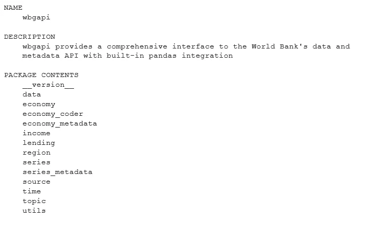

`*help(wb)*`的结果——作者的形象

来自 *help* 的完整输出要比这个长得多，但这向我们展示了一些我们可以访问的信息。我们将使用其中的一些，从*源*开始。

## 来源

世界银行保存着数以万计的关于世界经济不同方面的指标，它们存储在许多数据库中。通过运行以下命令，我们可以看到可以访问的源代码:

```
wb.source.info()
```

正如我们将看到的，WBGAPI 库的许多内容都有一个`info()`方法。下图只是最初几个可用的数据库。

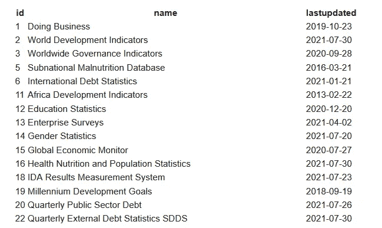

世界银行数据来源——作者图片

## 经济

一个经济体是世界银行存储数据的国家或地区。我们再次使用`info()`方法得到一个列表。

```
wb.economy.info()
```

这就是结果:

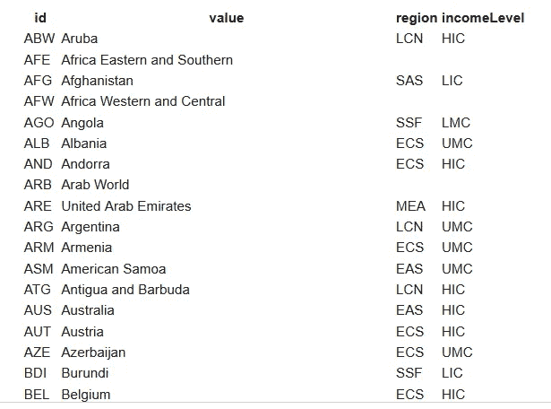

前几个经济体—作者图片

这是最初的几个经济体，正如你所看到的，它们中的大部分都是独立的国家。第一列是地区的国家代码，然后是名称，接下来是地区代码，上表的最后一列将经济分类为:

*   LIC——低收入国家
*   HIC —高收入国家
*   LMC——中低收入国家
*   HMC——中高收入国家

## 地区

区域代码可以这样找到:

```
wb.region.info()
```

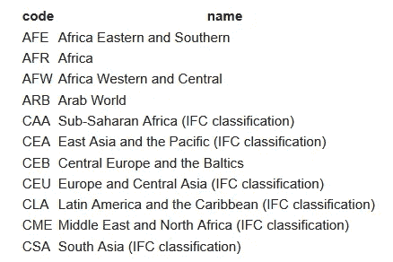

区域—按作者分类的图像

你可以看到代码和他们的名字一起出现在经济表中。

## 系列

现在我们来看实际数据。系列包含各种主题的数据，从人口，经济因素，如各经济体的年龄范围和性别的就业，健康数据等等。下面是列表中的前几个。

```
wb.series.info()
```

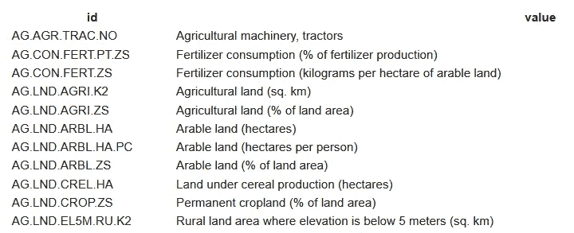

前几个系列—作者图片

有如此多的数据可供访问，以至于浏览上面生成的列表会非常乏味。为了使事情变得简单一点，我们可以通过设置一个查询来过滤我们得到的信息。下面的代码将返回包含字符串“population”的所有序列。

```
wb.series.info(q='population')
```

他们来了。

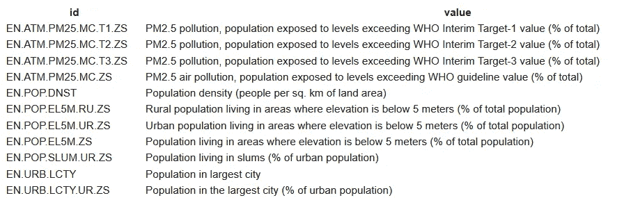

人口指标-按作者分类的图像

如果我们有兴趣了解一个国家或地区的 GDP:

```
wb.series.info(q='gdp')
```

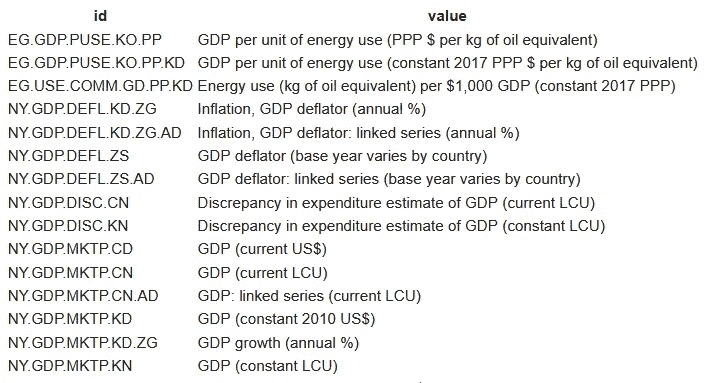

GDP 指标-作者图片

有不少 GDP 相关的项目。

## 获取数据

这很好，但我们实际上还没有得到任何真实的数据。让我们开始吧。

我们需要使用库的*数据*组件来获取我们的数据，当然，我们需要指定我们想要的数据。

在下面的代码中，我们以熊猫数据帧的形式获取数据。第一个参数是一个字符串，它是我们在上面看到的序列之一(您在图像中看不到它，因为它在列表的后面)— NY。GDP.PCAP.CD 是一个国家的人均 GDP。第二个参数是国家列表。这可能是单个国家的实际 Python 列表(我们将在后面看到)，或者在本例中是由`wb.region.members()`函数生成的列表。这将一个地区作为参数，并返回该地区的国家列表。EMU 是欧洲的欧元区。

```
gdppercap=wb.data.DataFrame('NY.GDP.PCAP.CD',
                               wb.region.members('EMU'))
```

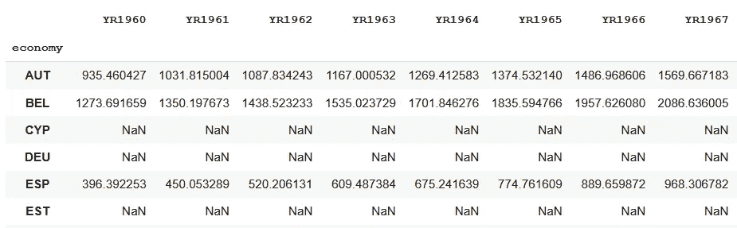

欧洲货币联盟的人均 GDP 作者图片

当然，上图只是数据框的一部分。

在下面的代码中，我使用了数据框架来描绘从 1960 年到 2020 年，欧洲货币联盟成员国的人均 GDP 是如何增长的。为了便于阅读，我突出显示了排名前五的国家，其余的用灰色标出。

卢森堡似乎做得特别好，在遭受 2008 年金融危机重创后，爱尔兰似乎也恢复得不错。

```
g5=gdppercap.sort_values(by=['YR2020'],ascending=False)[:5]
ax=gdppercap.T.plot(color='lightgray', legend=False)
g5.T.plot(ax=ax, figsize=(15,5))
```

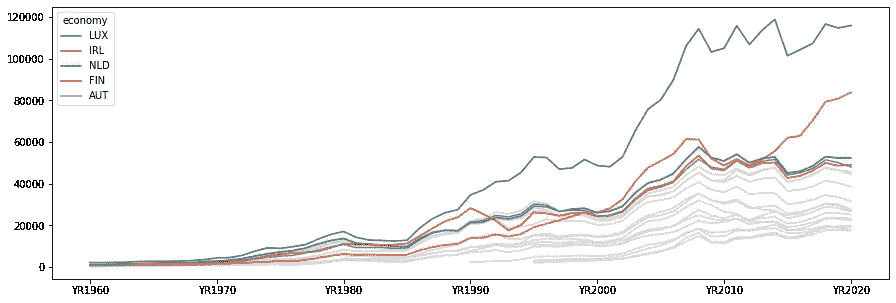

人均国内生产总值的增长—作者图片

因此，您可以看到，一旦我们确定了想要访问的数据，获取和使用它就非常简单了。

这是另一个例子。

## 可再生能源

我们都应该关注气候状况和化石燃料的使用，因为它们增加了温室气体的排放。因此，让我们看看不同国家采用替代能源发电的速度有多快。

首先，我们寻找合适的指标。

```
wb.series.info(q='renewable electricity output')
```

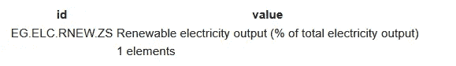

可再生电力指示器—图片由作者提供

因此，我们感兴趣的指标是 EG.ELC.RNEW.ZS。我们将使用它以及一些我们将放入 Python 列表的国家。`['DEU','FRA','ESP','GBR','USA']`代表德国、法国、西班牙、英国和美国。而这次我们增加了一个额外的参数`time`。

我们使用 Python 的 range 函数来指定时间，该函数将返回一个整数列表(在本例中为年),从第一个参数开始，在第二个参数之前结束一个参数，使用第三个参数作为一个步长。

```
ren=wb.data.DataFrame('EG.ELC.RNEW.ZS',
                      ['DEU','FRA','ESP','GBR','USA'],
                      time=range(2000,2016,5))
```

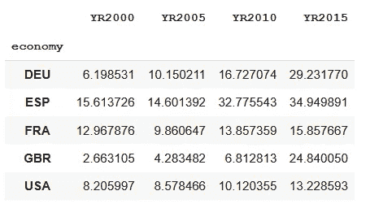

可再生电力的使用——作者图片

从这个数据图表中我们可以看到我们选择的国家做得有多好。

```
ren.plot.bar()
```

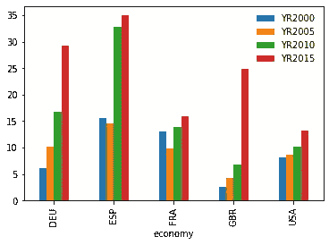

可再生电力的使用——作者图片

好消息是我们所有的国家都在进步。英国起步较低，但已有显著改善，德国也是如此，尽管西班牙领先。但是法国和美国呢？你们动作快点！

一个线形图也显示了每个国家的相对进展(我把数据框调换了，所以时间在 X 轴上)。

```
wb.data.DataFrame('EG.ELC.RNEW.ZS',
       ['DEU','FRA','ESP','GBR','USA'],
       time=range(2000,2016,5)).T.plot()
```

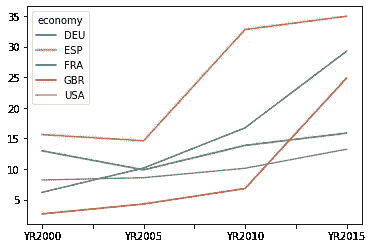

## 但是还有更多

总是有更多，不是吗？

你可以探索世界银行在他们的[开放数据网站](https://data.worldbank.org/)上保存的数据，要了解更多关于 WBGAPI 库的信息，你可以在 [Pypi](https://pypi.org/project/wbgapi/) 上查找，或者在这里查看最新版本[的博客公告。](https://blogs.worldbank.org/opendata/introducing-wbgapi-new-python-package-accessing-world-bank-data)

我希望这个小小的品尝者已经吊起了你的胃口，你会探索更多。一如既往，感谢您的阅读，如果您想不断更新新文章，请考虑注册 Medium alerts(下面应该有链接)或订阅我偶尔的免费简讯[这里](https://technofile.substack.com)。

如果你对用熊猫制作图形和图表感兴趣(就像上面的那些),下载我的书《用熊猫[绘图》怎么样。](https://alanjones2.github.io/ajbooks/)