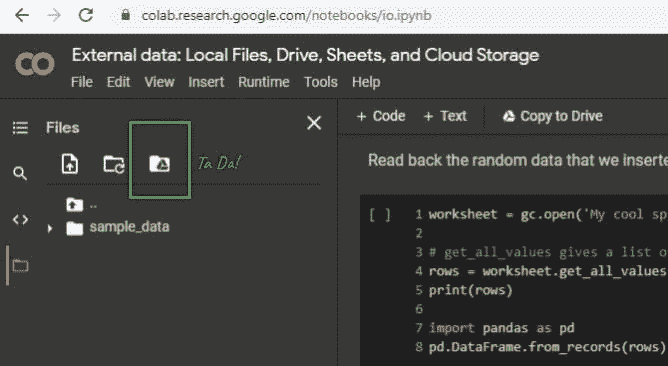
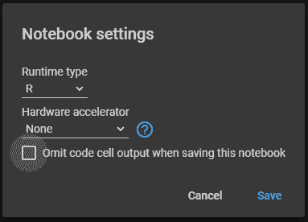
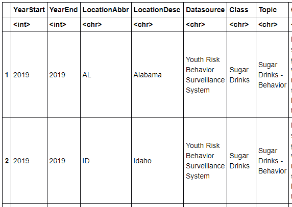

# 使用运行 R 内核的 Google Colab 访问 Google Drive

> 原文：<https://towardsdatascience.com/access-google-drive-using-google-colab-running-an-r-kernel-3736db7835?source=collection_archive---------15----------------------->

## [实践教程](https://towardsdatascience.com/tagged/hands-on-tutorials)，云计算

## 从 Google Drive 文件或直接从 web URLs 导入数据

本文描述了将 Google 协同实验室与 R 内核结合使用的一步一步的方法。

作为一名工程师和生物统计学家，我主要用 python 和 r 编写代码。在过去的六个月里，我决定，对于小型项目，通过 Google Drive 和 Google Colaboratory 与他人共享代码是最快的。对于小型的非正式项目来说，访问共享云存储的便利性是无与伦比的。避免共享服务器访问、工作目录更新和 Git 混乱等问题可以节省时间，特别是当合作者对数据科学和编程语言的熟悉程度/流畅性不同时。

这种方法建立在之前的一篇媒体文章的基础上，在这里附上。它作为一个灵感和最初的指南；然而，对我来说，它抛出了错误，这似乎是 Colab 版本控制工件。在解决了一些小问题后，我能够通过 R 内核从 Google 协作笔记本文件成功访问我的 Google Drive 文件存储。完整的源代码被上传到 [Github](https://github.com/katewall/medium_tutorials/blob/main/210630_Medium_ColabwithR.ipynb) 。

请记住，可以使用 *rmagic* 函数在单个单元中运行 R。因此，R 内核并不是在 Colab 中使用 R 的唯一方式。但是，如果您希望笔记本适合以后的本地使用，或者确保其他人可以复制您的 R 代码，您可能希望将整个内核更改为 R，但仍然使用基于浏览器的云实例。

为什么要在 Colab 中使用 R:

1.  许多专门的统计包都是用 R 而不是 python 构建的。
2.  r 有简单的语法来获得漂亮的视觉效果。
3.  对于许多数据科学角色，你需要既懂 R 又懂 python。

在 Colab 中运行 R 时会出现什么问题:

1.  挂载你的驱动器只能在 python 运行时下工作。
2.  安装驱动器是使用 Google Colab 的关键驱动因素之一。
3.  安装的驱动器提供了无尽的功能，试图弄清楚这一点让我发疯。

使用默认设置和默认 python 内核，在 Colab 中挂载 Google Drive 没有问题。很简单。点击阅读几种方法[。或者单程](https://colab.research.google.com/notebooks/io.ipynb)[这里](/downloading-datasets-into-google-drive-via-google-colab-bcb1b30b0166)。或者只需点击我在下面截图中显示的按钮。



Google Colab 中最棒的功能。图片作者。

但是，在您更改内核后，该功能将停止工作。因此，你可能会发现自己需要遵循我提出的三步计划来维护对你的 Google Drive 文件的访问。请注意，这需要一些欺骗和几分钟的运行时间。运行安装程序块会稍微慢一些，但是值得等待。幸运的是，他们只有三个人。

# 步骤 0。

打开浏览器，进入[https://colab.to/r](https://colab.to/r)。你会看到通过运行时>改变运行时类型，R 内核已经被选中。



如何检查你的运行时设置？图片作者。

# 步骤一.初始化

安装 [Httpuv](https://cran.r-project.org/web/packages/httpuv/httpuv.pdf) 库。它允许 R 代码与 HTTP 和 WebSocket 客户端交互，以服务来自 R 进程的 web 流量。

```
install.packages(“googledrive”) *#only need to install occasionally* install.packages(“httpuv”) 
library(“googledrive”) 
library(“httpuv”)
```

另外，更改本地路径。这在偶尔更新时会改变，所以这一行可能会过时。

```
**if** (file.exists("/usr/local/lib/python3.7/dist-packages/google/colab/_ipython.py")) { *#may update python version  
                                       #occasionally*
  install.packages("R.utils")
  library("R.utils")
  library("httr")
  my_check <- function() {**return**(TRUE)}
  reassignInPackage("is_interactive", pkgName = "httr", my_check) 
  options(rlang_interactive=TRUE)
}
```

单独运行这个程序块。不要与前面的块合并，因为，虽然看起来没问题，但是合并两个块会抛出你不相信的错误。

```
drive_auth(use_oob = TRUE, cache = FALSE)
```

现在，您已经初始化了 Google Drive 和 Google Colab 会话之间的连接。现在你有两个选择。

> 如果您想从一个 web URL 直接下载一个文件到本地 Google Colab 会话，那么请转到第二步。
> 
> 如果您想从您的 Google Drive 文件夹下载一个文件到本地 Colab 会话，请转到步骤 III。

# 第二步。从 Web 直接下载到 Colab 会话的方法

首先检查本地会话的工作目录。

```
getwd()
>>>'/content'
```

工作目录是内容文件夹。

接下来，下载文件，并解压缩文件。这个特殊的例子是[美国疾病预防控制中心](https://www.cdc.gov/healthyyouth/data/yrbs/index.htm)关于健康相关行为的公共数据集，这些行为是导致美国青年和成年人死亡和残疾的主要原因。解压缩会产生一个警告消息，但是如果您检查文件目录列表，您下载的解压缩文件将会出现。

```
download.file('https://data.cdc.gov/api/views/vba9-s8jp/rows.csv?
           accessType=DOWNLOAD','/content/dnld_direct_from_web.csv')unzip(zipfile="/content/downloaded.zip", exdir=".")
>>>Warning message in unzip(zipfile = "/content/downloaded.zip", >>>exdir = "."):
>>>“error 1 in extracting from zip file”
```

既然它是本地的，您可以使用典型的 R import 函数读入 csv 或其他文件类型。

```
library(readr) 
a <- read.csv(‘/content/dnld_direct_from_web.csv’) 
head(a)
```



产生 R 数据帧。图片作者。

# 第三步。方法从您的 Google Drive 下载到 Colab 会话

这使用了 googledrive 包。您可以使用 drive_get 函数获取该文件。接下来，您必须使用 drive_download 函数显式下载该文件。

```
x <- drive_get("~/Folder1/Folder2/Nutrition__Physical_Activity__
              and_Obesity_-_Youth_Risk_Behavior_
              Surveillance_System.csv")
drive_download(x)
z <- read.csv("/content/Nutrition__Physical_Activity__and_Obesity_-
              _Youth_Risk_Behavior_Surveillance_System.csv")
head(z)
```

类似地，这个文件现在已经到达您的文件目录。既然它是本地的，您可以使用典型的 R import 函数读入 csv 或其他文件类型。


再次得到 R 数据帧！图片作者。

哒哒！我希望这篇教程能让你免去我所招致的头痛。请让我知道你是否找到了这个功能的更好的实现！源代码上传到 [Github](https://github.com/katewall/medium_tutorials/blob/main/210630_Medium_ColabwithR.ipynb) 。