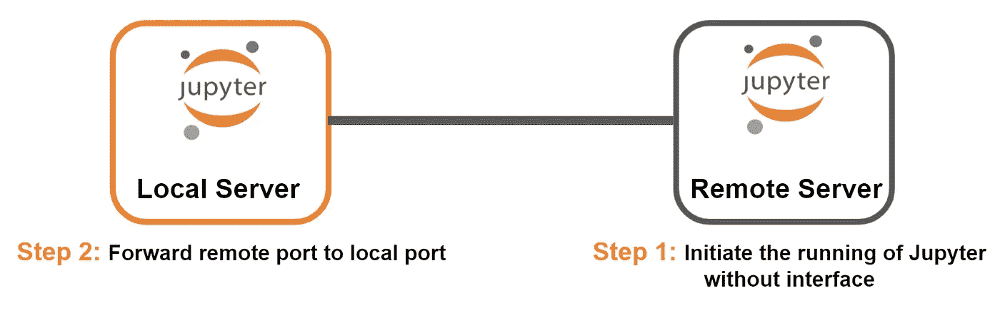

# 通过 SSH 使用 JupyterLab 轻松访问远程代码

> 原文：<https://towardsdatascience.com/access-remote-code-in-a-breeze-with-jupyterlab-via-ssh-8c6a9ffaaa8c?source=collection_archive---------10----------------------->

## 使用 SSH 在本地系统中运行远程 Jupyter Lab


作者照片

在我们的日常开发工作中，我们需要访问远程系统来

*   在共享的工作场所与同事共同发展
*   在强大的机器上训练深度学习模型
*   在生产中部署一些脚本

远程服务器可能指的是公共云、组织的私有数据中心、个人工作站或其他。


作者照片

这些远程服务器有一个共同的属性—它位于一个固定的位置，通常具有顶级的安全性和良好的冷却系统。基本上，由于服务器位于远程，用户需要通过 SSH 或其他基于 UI 的远程桌面应用程序来访问服务器。

基于 UI 的远程桌面应用程序，如 Anydesk、Teamviewer，可能不是首选，原因如下

*   长期使用这些应用程序可能不是免费的
*   需要让应用程序始终在后台运行
*   远程服务器是无头的
*   图形界面的引入增加了网络延迟

因此，大多数人选择 SSH 作为访问远程系统的安全方法。SSH 只在终端上工作，有时很难只用 vim/vi 编辑配置或代码。


作者照片。

这就是将基于 web 的 IDE — JupyterLab 转发到本地系统的便利之处。

## 内容:

*   工作流程演练
*   在后台运行 JupyterLab
*   以 root 用户身份运行 JupyterLab
*   但是我用的是 Jupyter 笔记本

## 工作流程演练


作者照片

要允许 JupyterLab 与远程系统同步运行，有两个主要步骤

1.  无界面启动 JupyterLab 运行。
2.  将远程端口转发到本地端口

**步骤 1:在没有界面的情况下启动 JupyterLab 的运行**


作者照片

Ssh 以

```
ssh <remote-user>@<remote-host>
```

安装 JupyterLab 后，运行以下命令

```
jupyter lab --no-browser --port <port-number>
```


作者照片

## 步骤 2:将远程端口转发到本地端口



作者照片

要转发端口，请打开另一个终端并运行以下命令

```
ssh -N -L localhost:<local-port>:localhost:<remote-port> <remote-user>@<remote-host>
```

*   **-N:** 用于端口转发。这抑制了远程命令的执行。
*   **-L:** 将远程端口绑定到本地端口。


作者照片

继续在浏览器中打开[http://localhost:<local-port>/](http://localhost:8887/)。


作者照片

从步骤 1 的终端窗口复制，输入令牌密钥。


作者照片

**有三个要点需要记笔记:**

*   在当前的设置中，远程系统中运行 JupyterLab 的终端必须保持打开。或者，检查**在后台运行 JupyterLab，**允许终端在不终止进程的情况下关闭。
*   同样，转发端口的终端必须在整个操作过程中保持打开。
*   端口转发终端不会生成任何输出消息来提示操作成功(由于使用了标志-N)。

## 在后台运行 JupyterLab

有一个在后台运行 JupyterLab 的选项，允许终端在不终止 JupyterLab 进程的情况下关闭。

只需在命令末尾添加一个&符号。

```
jupyter lab --no-browser --port <port-number> &
```


作者照片

要终止该进程，请使用以下命令来标识该进程

```
ps -ef | grep python | sort
```


作者照片

用…扼杀进程

```
kill -9 <process-id>
```

## 以 root 用户身份运行 JupyterLab

不建议以 root 用户身份运行 JupyterLab。


作者照片

但是，解决方法是添加一个标志，明确允许在 root 用户模式下运行。

```
jupyter lab --no-browser --port <port-number> --allow-root
```


作者照片

## 但是我用的是 Jupyter 笔记本

仍然有大量的社区选择 Jupyter Notebook 作为他们的首选 IDE。不要害怕。本文中介绍的所有命令也与 Jupyter Notebook 兼容。

只需将 JupyterLab 的命令交换到 Jupyter Notebook 中。

示例:

```
jupyter notebook --no-browser --port <port-number>
```

JupyterLab 包的安装也允许运行 Jupyter 笔记本！


作者照片

下次见！