# 从 Garmin 可穿戴设备访问和清理数据以进行分析

> 原文：<https://towardsdatascience.com/accessing-and-cleaning-data-from-garmin-wearables-for-analysis-56c22b83d932?source=collection_archive---------9----------------------->

## 一个友好的如何为匆忙的人们提取 Garmin 菲尼克斯数据的指南

当我开始做一个项目来分析我的 Garmin 菲尼克斯数据时，不清楚如何访问这个惊人的数据集，需要一些技术知识。

Garmin 的文档也很难理解和过时，导致我不得不通过代码回购和旧的互联网论坛挖掘…

# **这是我开始这个项目时希望存在的 Garmin 数据指南🚀**

希望这篇文章能把我花了不少时间的东西变成简单易懂的东西。

*文中所有图片，除非特别注明，均为作者所有*

# 步骤 0:有哪些数据可用？


照片由 [Zan](https://unsplash.com/@zanilic?utm_source=medium&utm_medium=referral) 在 [Unsplash](https://unsplash.com?utm_source=medium&utm_medium=referral)

虽然有很多因素影响可用的数据，从[您使用的 Garmin 型号](https://developer.garmin.com/connect-iq/reference-guides/devices-reference/#devicereference)到[您是否一直佩戴胸部心率监测器](https://www8.garmin.com/manuals/webhelp/fenix66s6xpro/EN-US/GUID-6F1082A9-D190-420E-A31D-C4474A015322.html)，但以下是我能够从没有胸带的 Garmin 菲尼克斯中提取的特征:

**一般健身数据:**

*   醒来时间
*   步伐
*   周期
*   上升/下降
*   心率
*   活动类型和时间(中度和剧烈)
*   总移动时间
*   行走步长，平均速度
*   燃烧的卡路里，燃烧的总脂肪卡路里
*   训练压力分数
*   最高和平均温度
*   应力水平
*   速度和强度
*   静息代谢率，静息心率
*   **游泳**:泳池长度、泳姿长度和距离、游泳节奏、首圈指数
*   **跑步**:最大跑步步频、最大一般步频、总步数

**特定运动事件数据:**

*   时间
*   旅行距离
*   位置(经度/纬度)
*   海拔和温度
*   心率
*   节奏(和分数节奏)
*   速度和功率
*   左右平衡

# 步骤 1:获取数据转储

虽然您也可以通过 Garmin 的名为“ [Garmin Connect IQ](https://developer.garmin.com/connect-iq/overview/) 的 SDK 来访问这些数据，但我将通过手动方式来访问这些数据。它实际上容易得多，尤其是对于个人使用，但是 Garmin 有过时的文档，所以它看起来很复杂…

首先，进入你的 Garmin 账户数据管理([https://www.garmin.com/en-US/account/datamanagement/](https://www.garmin.com/en-US/account/datamanagement/))并登录:

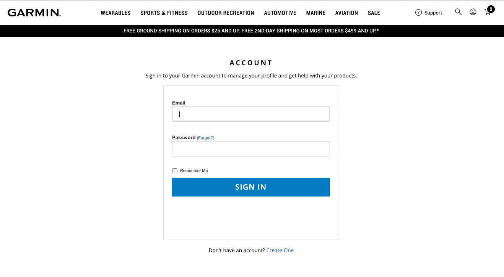

来自网站的截图

然后转到“导出您的数据”并点击`Request Data Export`。

然后，您将收到一条消息，说明:

```
Your request has successfully submitted.You can request a copy of all personal data, including your profile, order history, information from Garmin Connect and other applications, subscriptions, registered devices and more.We will send a link to download your export file to [yourAccountEmail@email.com]Files typically take about 48 hours to prepare but, depending on the number of requests being processed and the amount of data associated with your profile, could take up to 30 days.
```

恭喜你。你很快就会得到你的数据。虽然信息说最多 30 天，但我在 30 分钟内就收到了。*(为什么他们需要 30 天来处理一个数据请求？我是从我的账户里申请的，所以不存在任何许可/安全问题…他们有人手动给我发送数据吗…？)*

最终你会收到一个. zip 文件。打开它以显示文件夹结构:

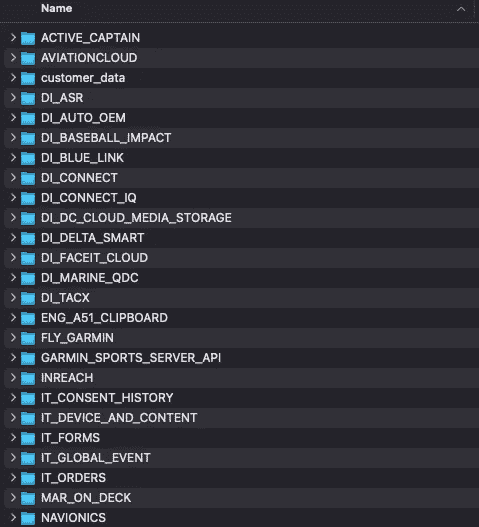

对我来说，这些文件夹大部分是空的，因为我没有使用它们。在那些不为空的数据库中，几乎所有的数据库都包含一个包含客户数据或聚合练习数据的 JSON 文件。

我们唯一关心的是 DI _ CONNECT > DI-CONNECT-Fitness-Uploaded-Files:

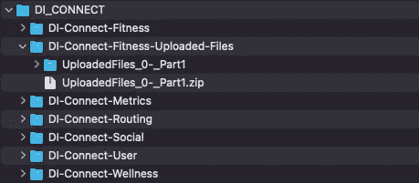

点击。zip 文件放在这个嵌套的文件夹中，**你将创建一个充满。适合文件类型**

# 步骤 2:转换成可用的文件类型

这是最棘手的部分，因为我们需要将这些从`.fit`转换成。CSV 使用命令行。`.fit`是 Garmin 使用的一种特殊文件类型，您的任何数据分析工具(Excel、Atom、Jupyter)都无法使用。

我们将依赖 Garmin 的 FIT SDK 的 FIT CSV 工具([https://developer.garmin.com/fit/fitcsvtool/](https://developer.garmin.com/fit/fitcsvtool/))。这是免费的，但需要设置。

首先，打开命令行终端。如果您不熟悉 CLI，它应该是这样的:

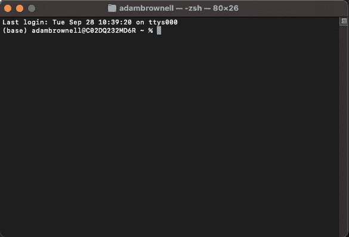

接下来我们需要检查我们是否安装了 JAVA。检查的一个简单方法是在我们的终端中键入`java -version`。如果我们得到一个号码返回，它被安装。如果我们收到错误信息，我们需要安装它

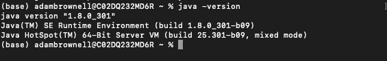

安装 JAVA 时的成功消息

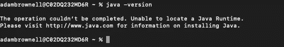

未安装 JAVA 时的错误消息响应

**安装 Java:** 根据你运行的是 MacOS/Windows/Linux，你需要下载不同的文件。正如终端消息所说，前往[https://www.java.com/en/download/](https://www.java.com/en/download/)下载 java 包。这将提示一个安装程序窗口，您可以沿着[这里的](https://www.java.com/en/download/help/mac_install.html)进行操作。下载成功后，关闭并重新打开你的终端，并通过同样的`java -version`测试验证 java 是否已安装。

一旦我们知道已经下载了 Java，继续下载 FIT SDK([https://developer.garmin.com/fit/download/](https://developer.garmin.com/fit/download/))并解压。活力

这将为您提供一个包含以下内容的文件夹:

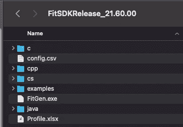

现在，我们可以将我们的`.fit`文件转换成。战斗支援车🚀完成这项工作的 jar 文件位于一个名为`FitCSVTool.jar`的 java 文件夹中

在命令行中键入以下内容，将`<file>`替换为`.fit`文件的文件路径:

```
java -jar FitCSVTool.jar <file>
```

如果你得到像`Unable to access jarfile FitCSVTool`或`(No such file or directory)`这样的错误，你需要找出正确的文件路径。在 Mac 上，直接将文件拖放到终端就像*一样简单。*在 windows 中，您需要从文件属性中复制/粘贴文件路径。

如果成功，将在与原始`.fit`文件相同的目录下创建一个. csv 文件。

这可能是转换过程的结束，但是为每个文件输入上面的命令是一件痛苦的事情。我有超过 8000 个`.fit`文件，你可能有更多。幸运的是，我们可以自动化这一点。

对于这一步，Windows 和 Mac 指南将会有所不同。如文件中所述:

> FIT SDK 包括多个 Windows 批处理文件，为 FitCSVTool 提供拖放界面。**这些批处理文件与 OSX** 不兼容；但是，使用 Automator 应用程序也可以实现相同的功能。

对于苹果电脑，我们可以创建一个如上述文件概述的自动机；打开 Automator 并…

*   从窗口中选择“应用程序”,然后点按“选取”
*   给它一个名字
*   在“资源库”文件夹中找到“过滤器 Finder 项目”,并将其拖到右侧屏幕。输入"。适合“包含”字段
*   在 Library 文件夹中找到“Run Shell Script”并拖动到右侧屏幕。用下面的代码片段填充，用上面使用的工具的路径替换`path/to/fit/sdk/java/FitCSVTool.jar`(记住你可以拖放！):

```
FitCSVToolJar=path/to/fit/sdk/java/FitCSVTool.jar
while read inputfile
do
outputfile=${inputfile/.fit/}
java -jar $FitCSVToolJar -b "$inputfile" "$outputfile"_raw
java -jar $FitCSVToolJar -b "$inputfile" "$outputfile"_definitions --data none
java -jar $FitCSVToolJar -b "$inputfile" "$outputfile"_records --defn none --data record
done
```

完成所有这些后，您的 Automator 应用程序应该如下所示:

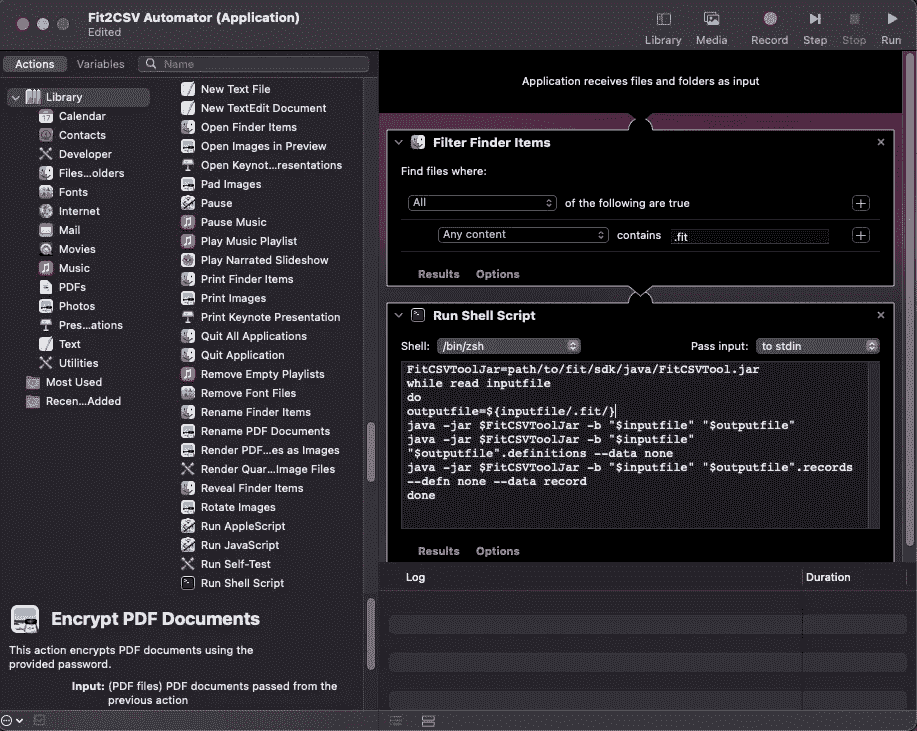

*   将此保存到桌面

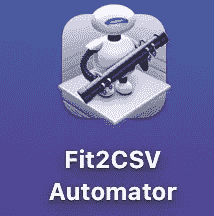

*   高亮显示并*拖动所有的* `*.fit*` *文件*到应用程序桌面图标上，如图所示

这将开始自动转换您拥有的所有成千上万的文档。对我来说，这让我的 MacBook 风扇非常吵，花了大约半个小时。

虽然我没有 Windows 机器来测试这一点，但我相信 Windows 会通过将所有的`.fit` 文件拖到 FitSDK 文件夹中的一个`.bat`文件上来实现类似的拖放系统:

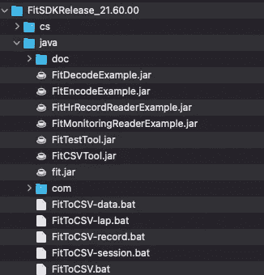

全部 5 个。FitSDK 文件夹中的 bat 文件。只需拖拽！

如 Windows 文档中所述:

```
An easier way to use FitCSVTool is to use one of the five batch files included in the SDK. These files are located in the same folder as FitCSVTool.jar. Drag-n-drop a FIT file onto any of the batch files and the output .csv files will be created in the same folder as the source FIT file.
```

由于之前从`.fit`转换到`.csv`的步骤，我们现在每个`.fit`文件有几个`.csv`文件:

*   概述数据中存在哪些字段的文件
*   一个`_records_data`文件，包含锻炼程序的距离、速度的汇总数据
*   一个`_records`文件，包含每时每刻锻炼程序的位置、速度和距离
*   一个包含所有内容的`_raw` 文件，包括压力水平、心率和其他指标。(正如下一节所见，这些极其混乱)

🎉恭喜你，你有 CSV 格式的数据了！🎉


为你骄傲！扎克·杜兰特在 [Unsplash](https://unsplash.com?utm_source=medium&utm_medium=referral) 上的照片

# 第三步:清洁

这一步及以后的一切都是我推荐的数据清理，但是可选的。你也可能有和我不一样的数据，所以这些清理过程可能不适合你。

也就是说，我很有信心下面的步骤将帮助任何人分析他们的 Garmin 数据。

## 删除定义表

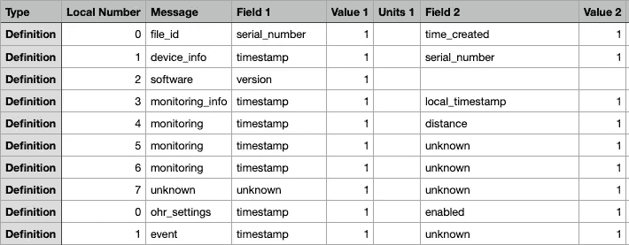

定义文件的屏幕截图

查看定义文件，它们似乎不包含任何有用的内容。从抽查来看，所有的值列似乎都是 1。我假设这对`.fit`文件很重要，但对我们的目的来说并不重要。

要移除定义文件，请通过运行以下命令在终端中导航到 csv 文件的位置:

```
cd path/to/csv/files
```

然后运行:

```
rm *definitions*
```

*这也可以很容易地通过从我们的 automator 中删除* `java -jar $FitCSVToolJar -b "$inputfile" "$outputfile".definitions --data none` *来实现，但是要确保任何想要该文件的人都可以使用它*

## 创建一个大型 CSV

我们仍然有一个问题，需要解析成千上万个 CSV 来查看我们的数据。您可以将所有 CSV 与以下内容结合使用:

```
cat *.csv >garmin_combined.csv
```

或者如果您计划生成与我下面的数据模式相同的数据模式:

```
cat *_records.csv >combined_records_full.csv
cat *_raw.csv >combined_raw_full.csv
```

这创建了两个不同的组合 CSV 供我们使用。

## 创建可用的列

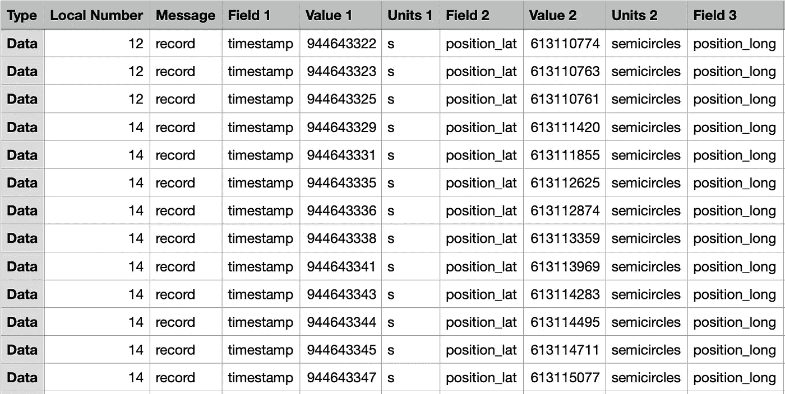

来自记录文件的屏幕截图

😃**好消息**:从我们的`.fit`转换生成的`_records`文件看起来不错。

🙁**坏消息**:`_raw`数据文件**如此凌乱不堪。**空字段、特殊字符、表示不同意思的列值…天啊。

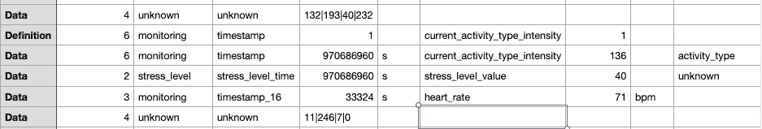

从一个原始数据文件截图…这将需要一些工作

我强烈建议按时间戳进行旋转，这样列才有意义。通过这种方式，您可以在记录时**快速轻松地检查任何感兴趣的指标，这可能是该数据最常见的用途。**

通过时间戳聚合，我们还可以在不丢失任何数据的情况下极大地减小文件大小。双赢！

我用 Python 编写了一个更简洁的函数来创建这些列。我已经把它上传到一个 [Github Repo](https://github.com/adam1brownell/garmin_data) 文件`clean_garmin.py`中，或者把下面的内容复制粘贴到你自己的`clean_garmin.py`文件中:

**安装 Python:** 你需要在电脑上安装 Python 来运行上述功能。去[https://www.python.org/downloads/](https://www.python.org/downloads/)安装 Python。然后进入终端，用`python --version`确认下载成功。

一旦保存了上面的代码块，就可以在终端中运行了:

```
python clean_garmin.py -i combined_records_full.csv -o combined_records_clean.csvpython clean_garmin.py -i combined_raw_full.csv -o combined_raw_clean.csv
```

注意:这需要很长时间，尤其是原始文件。我的电脑花了 10 分钟录制，花了大约 2.5 小时录制 raw。其原因是，有时数据条目上的时间戳是本地的而不是全局的，这意味着它引用最近的全局时间戳。因此，每次我们进行这种转换时，代码都需要找到最近的全局时间戳，并将本地时间戳转换为全局时间戳…但这需要 O(n)时间💀

…我们的数据看起来好多了🙌

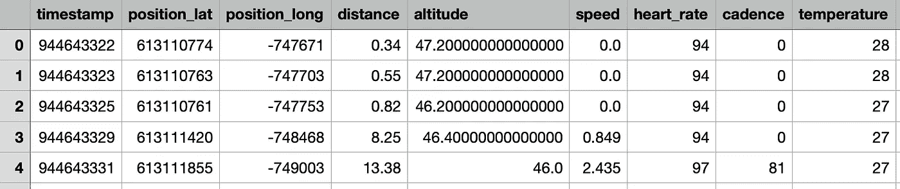

转换的记录文件。尼斯（法国城市名）

如果我的清理功能对您的数据失败，或者如果您有更好的数据清理实现，请留下评论，以便我们可以合作！

## 清理回购

我们的文件夹里还有成千上万的文件，这让我很紧张。继续删除所有未聚合的 CSV，包括:

```
rm *_raw.csv*
rm *_records.csv*
rm *_records_data.csv*
```

# 第四步:掉进兔子洞

现在我们已经有了一个干净的、可用的 Garmin 数据 CSV，我们可以开始分析这个漂亮的数据集并从中获得见解。

这是数据科学/分析的有趣部分，希望我们所经历的一切都是值得的！

由于这篇文章已经相当长了，我将写一篇后续文章，介绍一些分析 Garmin 数据的方法，以得出关于我们运动和健身习惯的有趣见解。

如果以上任何步骤对你不起作用，请留下评论，这样我可以试着帮助调试并把解决方案添加到文章中。我的希望是，没有人必须再次通过论坛寻找答案，在这里得到所有的答案。

希望您喜欢，并祝您在分析之旅中好运！