# 在熊猫的多索引数据框架中访问数据

> 原文：<https://towardsdatascience.com/accessing-data-in-a-multiindex-dataframe-in-pandas-569e8767201d?source=collection_archive---------0----------------------->

## 熊猫帮助你开始数据分析的提示和技巧


安娜斯塔西娅·切平斯卡在 [Unsplash](https://unsplash.com/s/photos/table-row?utm_source=unsplash&utm_medium=referral&utm_content=creditCopyText) 上拍摄的照片

一个 **MultiIndex** (也称为层次索引)数据帧允许您将多个列作为一个行标识符，将多个行作为一个标题标识符。使用 **MultiIndex** ，您可以进行一些复杂的数据分析，尤其是处理更高维度的数据。访问数据是处理多索引数据框架的第一步。

在本文中，您将了解如何访问多索引数据框架中的数据。这篇文章的结构如下:

1.  通过一级索引选择数据
2.  通过多级索引选择数据
3.  使用切片选择数据区域
4.  使用`slice(None)`选择所有内容
5.  使用横截面`xs()`
6.  使用`IndexSlice`

为了进行演示，我们创建了一个虚拟数据集，并将使用*前 2 列作为行标识符*和*前 2 行作为标题标识符*来加载它。

```
df = pd.read_csv('dataset.csv',
    **index_col=[0,1],**
    **header=[0,1]**
).sort_index()
```

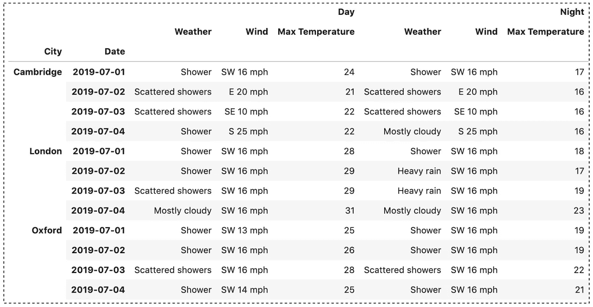

昼夜天气数据(作者制作)

请查看[笔记本](https://github.com/BindiChen/machine-learning/blob/master/data-analysis/031-pandas-multiIndex/multiindex-selection.ipynb)获取源代码。

# 1.通过一级索引选择数据

当选择数据帧上的数据时，Pandas `loc`是最受欢迎的数据之一。在上一篇文章中，我们已经介绍了`[loc](/how-to-use-loc-and-iloc-for-selecting-data-in-pandas-bd09cb4c3d79)`[和](/how-to-use-loc-and-iloc-for-selecting-data-in-pandas-bd09cb4c3d79) `[iloc](/how-to-use-loc-and-iloc-for-selecting-data-in-pandas-bd09cb4c3d79)` [用于在通用(单索引)数据框架](/how-to-use-loc-and-iloc-for-selecting-data-in-pandas-bd09cb4c3d79)中选择数据。访问**多索引**数据帧中的数据的方式与访问单索引数据帧的方式相似。

我们可以将第一级标签传递给`loc`来选择数据

```
# Retrieve London's Day weather
df.loc['London', 'Day']
```

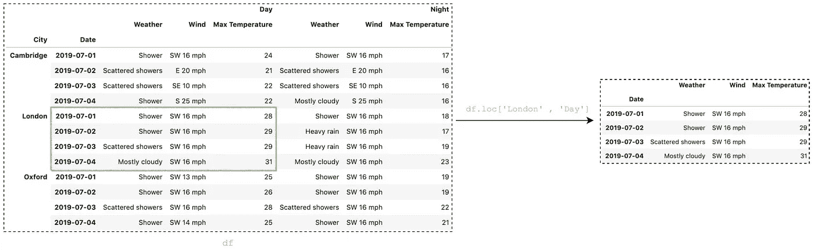

作者图片

我们也可以使用`:`返回所有数据。

```
# To get all rows - all Day weather
df.loc[:, 'Day']
```

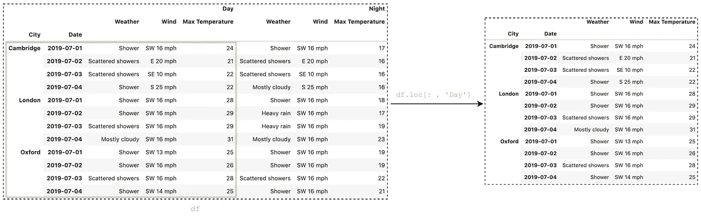

作者图片

并获取所有列

```
# To get all columns
df.loc['London' , :]
```

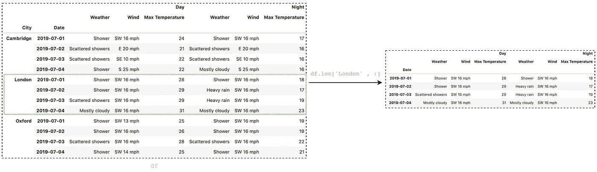

作者图片

以上工作如我们所料。然而，你可能会惊讶地发现`df.loc['London', '2019-07-02']`也很管用

```
# This also works
>>> **df.loc['London' , '2019-07-02']**Day    Weather                Shower
       Wind                SW 16 mph
       Max Temperature            29
Night  Weather            Heavy rain
       Wind                SW 16 mph
       Max Temperature            17
Name: (London, 2019-07-02), dtype: object
```

这个结果通常会导致歧义。事实上，上述所有语句都是从多索引数据帧中检索数据的简写符号。对于多索引数据帧，建议使用元组来避免歧义。

以下是使用元组的等效语句

```
# Equivalent to **df.loc['London', 'Day']**
df.loc[**('London', )** , **('Day', )**]# Equivalent to **df.loc[:, 'Day']**
df.loc[:, **('Day',)**]# Equivalent to **df.loc['London' , :]**
df.loc[('London', ) , :]# Equivalent to **df.loc['London' , '2019-07-02']**
df.loc[**('London' , '2019-07-02')**]
```

# 2.通过多级索引选择数据

如果你想阅读 2019-07-01 的**伦敦**日**天气，你可以简单地做:**

```
>>> df.**loc['London', 'Day']**.**loc['2019-07-01']**Weather               Shower
Wind               SW 16 mph
Max Temperature           28
Name: 2019-07-01, dtype: object
```

注意，`loc['London', 'Day']`返回一个数据帧，并调用`loc['2019-07-01']`再次提取数据。这当然有效，但是有一种更有效的方法使用元组。

```
>>> df.loc[**('London', '2019-07-01')**, '**Day**']Weather               Shower
Wind               SW 16 mph
Max Temperature           28
Name: (London, 2019-07-01), dtype: object
```

多索引键采用元组的形式。在这种情况下，`('London', '2019-07-01')`选择行标签，`'Day'`选择列。

我们还可以传递标签列表来选择多行或多列:

```
# Select multiple rows
df.loc[ 
    ('London' , **['2019-07-01','2019-07-02']** ) ,
    'Day'
]# Select multiple columns
df.loc[ 
    'London' ,
    ('Day', **['Weather', 'Wind']**)
]
```

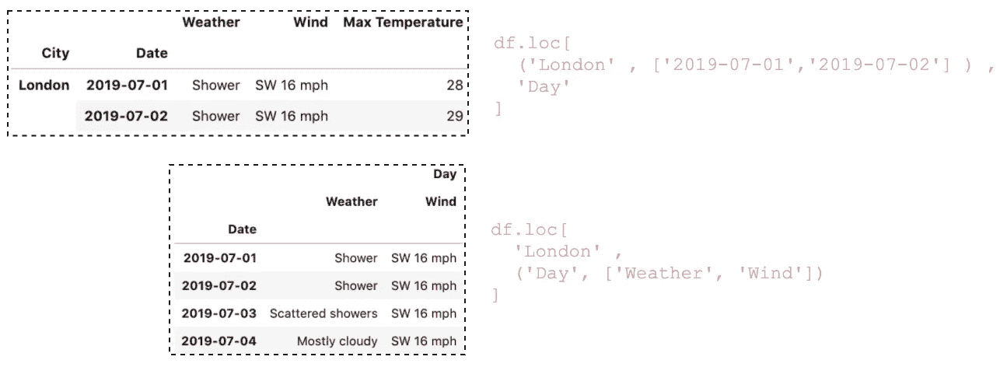

作者图片

# 3.通过切片选择数据范围

Slice(写为`start:stop:step`)是一种强大的技术，允许选择一定范围的数据。当我们想要选择两个项目之间的所有内容时，这非常有用。

对多索引数据帧中的一级索引进行切片与对单索引数据帧进行切片的方式相似。举个例子，

```
df.loc[
    **'Cambridge':'Oxford'**,
    'Day'
]
```

然而，当分割多层索引时，我们将会得到一个语法错误，如下所示:

```
# We are getting a SyntaxError
df.loc[
    ('London', **'2019-07-01': '2019-07-03'**),
    'Day'
]
```


对多级索引进行切片的正确方法是使用元组:

```
df.loc[
    **('London','2019-07-01'):('London','2019-07-03')**,
    'Day'
]
```

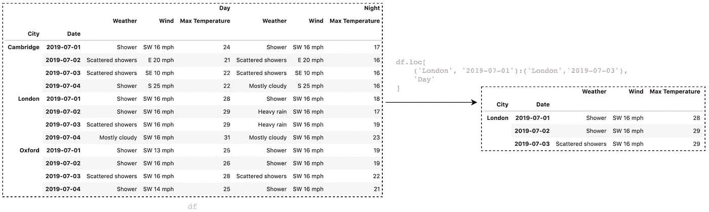

作者图片

较低级别的索引不必相同。例如，我们可以选择从`('Cambridge', '2019-07-01')`到`('London', '2019-07-02')`的数据范围

```
df.loc[
    **('Cambridge', '2019-07-01'):('London','2019-07-02')**,
    'Day'
]
```

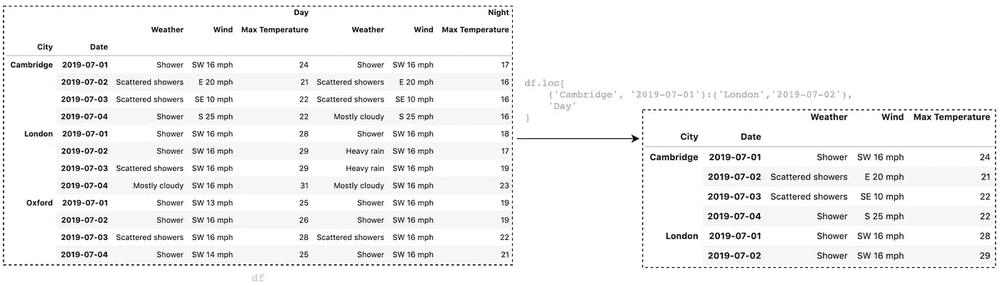

作者图片

# 4.使用`slice(None)`选择所有内容

当通过一级索引检索数据时，我们可以使用`:`来选择所有内容。然而，当使用多级索引时，我们会遇到语法错误。

```
# Getting **SyntaxError**
df.loc[ 
    **('London', :)**,
    'Day'
]# Getting **SyntaxError**
df.loc[ 
    **(: , '2019-07-04')**,
    'Day'
]
```

选择特定索引级别上所有内容的正确方法是使用`slice(None)`

```
df.loc[ 
    ('London', **slice(None)**),
    'Day'
]df.loc[
    (**slice(None)** , '2019-07-04'), 
    'Day'
]
```


作者图片

# 5.使用横截面`xs()`

DataFrame 的`xs()`方法可以接受一个`level`参数，使得在多索引的特定级别选择数据更加容易。

```
df.xs('2019-07-04', **level='Date'**)
```

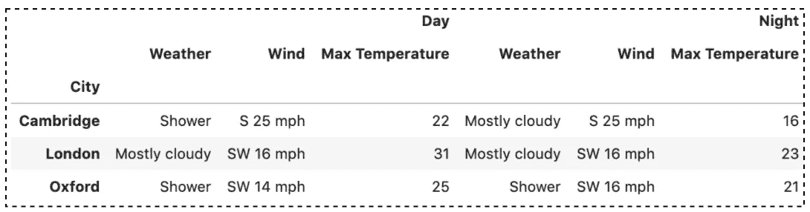

df.xs 的结果(' 2019–07–04 '，level='Date ')(图片由作者提供)

`xs()`也允许使用多个键进行选择

```
df.xs(('London', '2019-07-04'), **level=['City','Date']**)
```

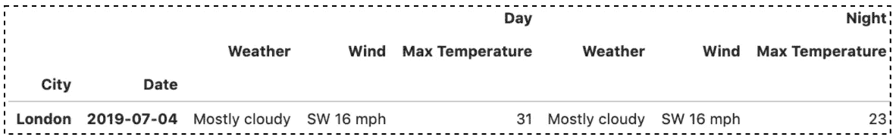

df.xs 的结果(('伦敦'，' 2019–07–04 ')，level=['城市'，'日期'])(图片由作者提供)

您还可以通过提供`axis`参数来选择带有`xs()`的列。

```
df.xs('Wind', level=1, **axis=1**)
```

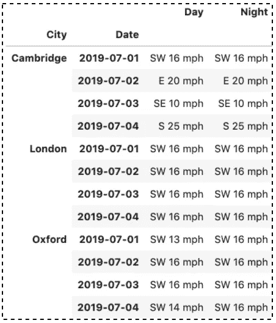

df.xs 的结果('风'，级别=1，**轴=1** )

请注意，所选的列标签`'Wind'`不包括在结果中。为了保持被选中的级别，我们可以通过`drop_level=False`

```
df.xs('Wind', level=1, axis=1, **drop_level=False**)
```

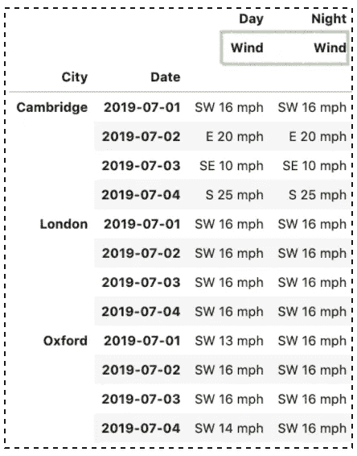

df.xs 的结果(' Wind '，level=1，axis=1， **drop_level=False** )

# 6.使用`IndexSlice`

您可以使用 Pandas `IndexSlice`来简化更自然的语法。

例如，用`:`代替`slice(None)`

```
from pandas **import IndexSlice as idx**df.loc[ 
    **idx[: , '2019-07-04'],** 
    'Day'
]# Instead of **slice(None)**
# df.loc[ 
#    **(slice(None) , '2019-07-04')**, 
#    'Day'
# ]
```

对行和列都使用`IndexSlice`

```
rows = idx[: , '2019-07-01']
cols = idx['Day' , ['Max Temperature','Weather']]df.loc[rows, cols]
```

使用`xs()`和`IndexSlice`选择数据范围

```
rows= (
    **idx['2019-07-02':'2019-07-04']**, 
    'London'
)df.xs(
    rows , 
    level = ['Date','City']
)
```

# 结论

使用 **MultiIndex** ，您可以进行一些复杂的数据分析，尤其是处理更高维度的数据。使用**多索引**数据框架时，访问数据是第一步。我希望这篇教程对你访问多索引数据框架有用。我建议你查看一下[文档](https://pandas.pydata.org/pandas-docs/stable/user_guide/advanced.html)来了解你可以做的其他事情。

感谢阅读。请查看[笔记本](https://github.com/BindiChen/machine-learning/blob/master/data-analysis/031-pandas-multiIndex/multiindex-selection.ipynb)获取源代码，如果您对机器学习的实用方面感兴趣，请继续关注。

## 你可能会对我的其他一些熊猫文章感兴趣:

*   [Pandas cut()函数，用于将数值数据转换为分类数据](/all-pandas-cut-you-should-know-for-transforming-numerical-data-into-categorical-data-1370cf7f4c4f)
*   [使用熊猫方法链接提高代码可读性](https://medium.com/@bindiatwork/using-pandas-method-chaining-to-improve-code-readability-d8517c5626ac)
*   [如何对熊猫数据帧进行自定义排序](/how-to-do-a-custom-sort-on-pandas-dataframe-ac18e7ea5320)
*   [为了数据分析你应该知道的所有熊猫移位()](/all-the-pandas-shift-you-should-know-for-data-analysis-791c1692b5e)
*   [何时使用 Pandas transform()函数](/when-to-use-pandas-transform-function-df8861aa0dcf)
*   [你应该知道的熊猫串联()招数](/pandas-concat-tricks-you-should-know-to-speed-up-your-data-analysis-cd3d4fdfe6dd)
*   [熊猫的应用()和变换()的区别](https://medium.com/@bindiatwork/difference-between-apply-and-transform-in-pandas-242e5cf32705)
*   [所有的熊猫合并()你应该知道](/all-the-pandas-merge-you-should-know-for-combining-datasets-526b9ecaf184)
*   [在 Pandas 数据框架中处理日期时间](/working-with-datetime-in-pandas-dataframe-663f7af6c587)
*   [熊猫阅读 _csv()你应该知道的招数](https://medium.com/@bindiatwork/all-the-pandas-read-csv-you-should-know-to-speed-up-your-data-analysis-1e16fe1039f3)
*   [用 Pandas read_csv()解析日期列应该知道的 4 个技巧](/4-tricks-you-should-know-to-parse-date-columns-with-pandas-read-csv-27355bb2ad0e)

更多教程可以在我的 [Github](https://github.com/BindiChen/machine-learning) 上找到